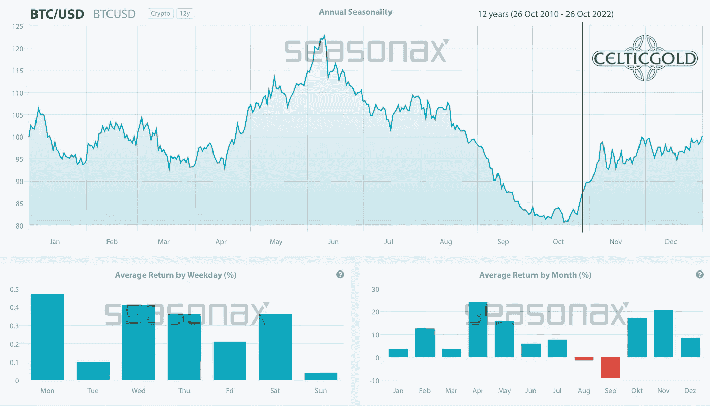

# 2022 年 10 月 31 日，比特币——复苏的机会

> 原文：<https://medium.com/coinmonks/october-31st-2022-bitcoin-some-chance-for-a-recovery-5eed722be5ea?source=collection_archive---------37----------------------->

比特币和整个加密领域已经处于熊市近一年了。抛售是残酷的，任何复苏都是短暂的。然而，最近几个月，回调速度已经放缓，比特币继续在 18，000 至 20，000 美元附近找到支撑。比特币——某种复苏的机会。

# 回顾

自 2022 年 6 月中旬跌至 17，600 美元以来，比特币价格仅缓慢回升。尽管 8 月份价格小幅反弹至 25，200 美元左右，但最近几个月价格主要在 18，500 美元至 20，000 美元之间横向波动。

如果你想报告至少一些积极的事情，那么很可能是这样的事实:与股票和债券市场以及黄金价格相比，比特币(BTC)在过去四个月中没有创下新低。相反，自 6 月中旬以来，它一直能够保持在 18，200 美元以上。

*Ethereum/Bitcoin-Ratio, weekly chart as of October 31st, 2022\. Source:* [*Tradingview*](https://www.tradingview.com/?aff_id=1321)

自 6 月份崩盘以来，以太坊(ETH)的发展明显好于比特币，这一事实也是有趣和积极的。尽管以太坊网络受到了过多的批评，比特币仍然是唯一一个配得上“去中心化”称号的东西，但市场似乎知道得更多。尽管如此，就市值而言，以太坊仍然远远落后于比特币。

然而，以太坊/比特币的比率表明，以太坊与比特币不同，它不是作为货币和价值储存手段设计的，而是用于复杂的智能合约和去中心化应用，它继续修补比特币的突破。事实上，由于技术进步，以太坊现在更好地代表了“区块链”创新。尽管最近几个月由于价格疲软，人们对加密货币的兴趣有所减弱，但 Chainanalysis 的全球指数显示，大型长期加密投资者一直持有他们的头寸。

# 美元比特币的技术分析

**比特币周线图——仍在一个明确定义的下降通道内**

*Bitcoin in USD, weekly chart as of October 31st, 2022\. Source:* [*Tradingview*](https://www.tradingview.com/?aff_id=1321)

从大的方面来看，比特币目前的交易价格刚好低于其大型压倒性上升通道的中期趋势线。尽管经过了 11 个月的调整，这一趋势通道仍然完好无损，只有在价格低于 6000 美元时才会被抛弃。

然而，自 2021 年 11 月以来，价格行为也一直在一个明确定义的下降通道中发生。在这里，比特币目前的交易价格也刚好高于趋势中线。下降通道内的复苏目前有空间到达 27，500 美元左右。

总的来说，周线图上的趋势仍然指向下方，但过去几个月艰难的横盘阶段最初可能会随着逆势复苏或反弹而得到解决。超卖的随机振荡指标是理想的选择。与此同时，我们最好不要高估任何复苏动向。最好是等待加密冬天结束的证据，因为低于 18，000 美元仍有另一次价格下滑约 30-50%的风险。

**比特币日线图——有些复苏的机会**

*Bitcoin in USD, daily chart as of October 31st, 2022\. Source:* [*Tradingview*](https://www.tradingview.com/?aff_id=1321)

在日线图上，18，000 到 20，000 美元之间的广阔支撑区域已经持续了几周。比特币多头目前正试图向上突破。周三第一次尝试失败，但布林线上方(20，987 美元)已经向上弯曲。这逐渐创造了更多的上升空间。

复苏的第一个目标将是快速下跌的 200 天移动平均线(24，569 美元)，实际上已经过期了。此外，在 25，000 到 26，000 美元附近朝着下降通道的上边缘反弹似乎是可能的。然而，随机指标已经再次到达超买区。从这个方面来说，看起来更像是公牛直接晋级的一个艰难挑战。因此，在另一轮反弹尝试之前，可能会回调至 20，000 美元左右的关键支撑位。

**总之，图表上显示了一个稍大的复苏机会。然而，远高于 25，000 美元的价格目前看来相当不现实。然而，如果美元实际上修正得更多一点，比特币和加密行业将得到提振。**

# 情绪比特币——自今年年初以来，恐惧一直是常态

*Crypto Fear & Greed Index, as of October 28th, 2022\. Source:* [*Lookintobitcoin*](https://www.lookintobitcoin.com/charts/bitcoin-fear-and-greed-index/)

加密恐惧和贪婪指数目前位于 31，继续衡量加密领域的高度恐惧。自年初价格暴跌以来，这已成为常态。

*Crypto Fear & Greed Index long term, as of October 28th, 2022\. Source:* [*Lookintobitcoin*](https://www.lookintobitcoin.com/charts/bitcoin-fear-and-greed-index/)

然而，从大的方面来看，受挫的情绪也提供了一个反向投资的机会。

# 季节性比特币——第四季度表现强劲

*Seasonality for bitcoin, as of October 28th, 2022\. Source:* [*Seasonax*](https://app.seasonax.com/assets/btc-usd-cc?h=eJyrVkpUsjI2MtBRKipWslIyMjA0NDAxMlMC8lPBfCMjKL9SySo6VkcpV8nKUEcpBUwmlylZGdQCAP58Dzw%3D)

从统计数据来看，比特币在过去 12 年的第四季度表现强劲。当然，季节性统计数据不能保证未来的价格走势。

**尽管如此，从季节性角度来看，年底复苏的可能性明显更高。**

# 健全的货币:比特币与黄金

*Bitcoin/Gold-Ratio, weekly chart as of October 31st, 2022\. Source: Trading view*

按照目前一个比特币大约 20500 美元，一盎司黄金大约 1640 美元的价格，你必须为一个比特币支付 12.5 盎司的黄金。换句话说，一盎司黄金目前价值 0.08 比特币。就像比特币价格一样，比特币/黄金比率已经横向运行了整整四个半月。有利于比特币的复苏尚未成功。因此，总体趋势是进一步向南，比特币/黄金比率必须升至 14 以上，至少才能明显和可持续地打破下降趋势。

**总之，比特币/黄金比率仍处于下降趋势，并继续以横盘整理巩固价格的最后一次主要下滑。**

# 宏观更新——国会选举前后的喘息

*US Treasury 10-year bond, monthly chart as of October 31st, 2022\. Source:* [*Tradingview*](https://www.tradingview.com/?aff_id=1321)

过去四周，10 年期美国国债收益率进一步上升，达到 4.33%，最后几个交易日回落至 3.97%。

*US Dollar Index as of October 27th, 2022\. Source:* [*Sentimenttrader*](http://www.sentimentrader.com/)

自今年年初以来，美元似乎也首次走软，首次跌破 50 天移动平均线。期货市场的格局和市场情绪实际上都预示着美元将出现回调。

*Federal Reserve Bank Operating Profit or Loss, as of October 28th, 2022\. ©* [*ZeroHedge*](https://twitter.com/zerohedge/status/1585801322208661505?s%3D52%26t%3DAH1hyRbepaS_uAE9G8vttQ)

与此同时，大幅提高的利率让美国中央银行损失惨重，因为美联储每天要向美国和外国银行支付超过 5 亿美元的利息。美联储的运营损失上周上升到创纪录的 63 亿美元！

总体而言，金融市场的两大压力因素(利率上升和强势美元)最近有所平静。股票市场的重大复苏迹象立即出现，但迄今为止，这种情况对其他市场部门来说并不太具有可持续性。比特币也能够在短时间内飙升至 21，000 美元。尽管如此，形势依然紧张，美元的回调(实际上早该如此)仍未得到证实。

**然而，在 11 月 8 日美国国会选举前后，所有行业的复苏都将姗姗来迟。它甚至可能演变成年末反弹。由于整体形势脆弱，美联储至少可以在本周的 FOMC 声明中稍微缓和一下语气，从而进一步推动反弹。然而，现在断言金融市场的熊市已经结束还为时过早。**

# 结论:比特币——复苏的机会

**在 20，500 美元的价位，比特币目前的交易价格比其历史高点低了约 70%。过去 11 个月的特点是残酷的衰退，到目前为止还没有趋势改变的迹象。相反，鉴于惨淡的宏观形势，加密部门的调整可能会明显更长，特别是在时间方面。然而，在年底前的两个月，至少有机会(小幅)回升至 25，000 美元左右。因此，预计在 2023 年之前不会对 18，000 美元左右的支撑进行新的攻击。**

*分析主办，2022 年 10 月 28 日首发，作者*[*www . Celtic gold . eu*](https://celticgold.de/blog/gold-und-bitcoin-analysen-von-florian-grummes-32/bitcoin-erholungschance-194)*。翻译成英文，2022 年 10 月 31 日部分更新。*

*随时加入我们的* [*我们的免费电报频道*](https://www.midastouch-consulting.com/services/newsletter-telegram) *获取每日实时数据和一个伟大的社区。如果您喜欢定期了解我们的黄金模型、贵金属、商品和加密货币，您还可以订阅我们的* [*免费简讯*](http://bit.ly/1EUdt2K) *。*

## 披露:

*本文及其内容仅供参考，不包含投资建议或推荐。每一次投资和交易都有风险，读者在做决定时应该进行自己的研究。此处表达的观点、想法和意见仅属于作者个人。它们不一定反映或代表 Midas Touch Consulting 的观点和意见。*

> 交易新手？尝试[加密交易机器人](/coinmonks/crypto-trading-bot-c2ffce8acb2a)或[复制交易](/coinmonks/top-10-crypto-copy-trading-platforms-for-beginners-d0c37c7d698c)