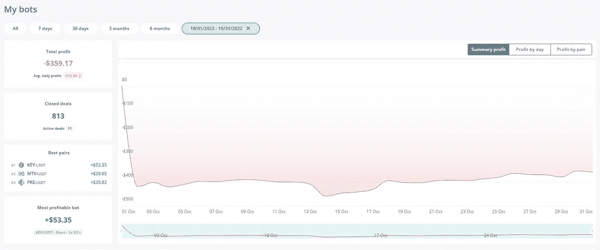
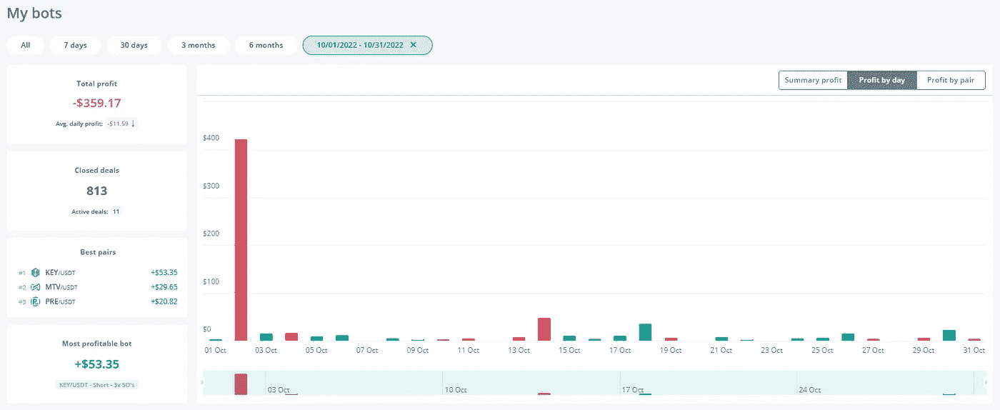
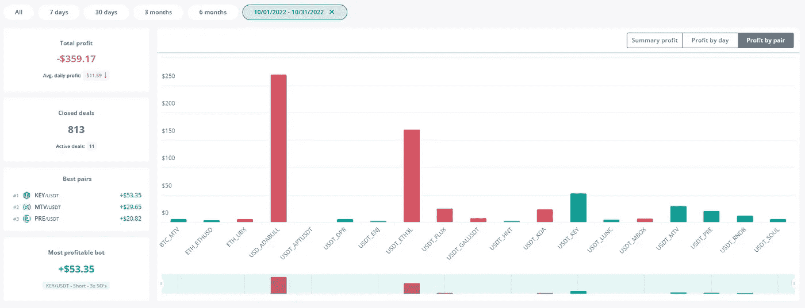
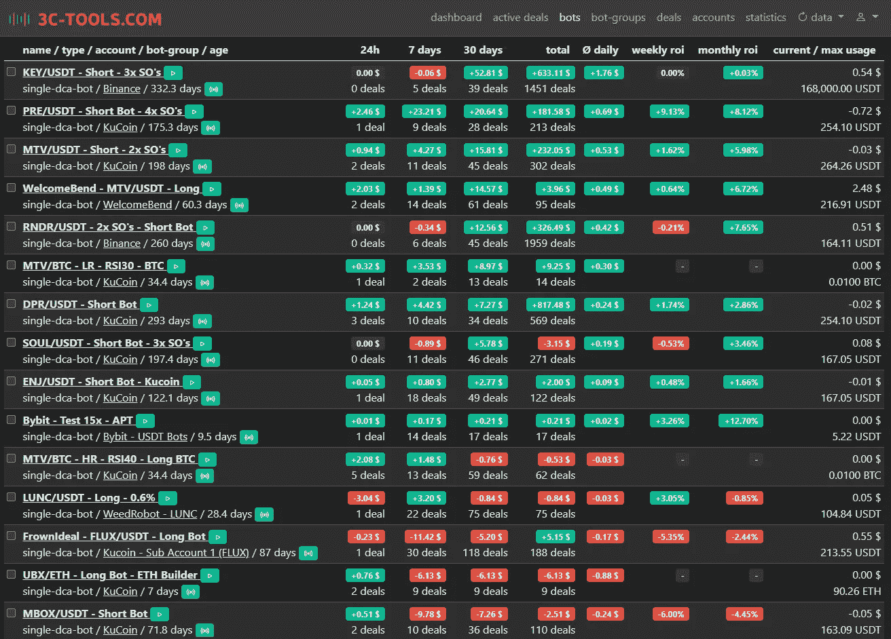
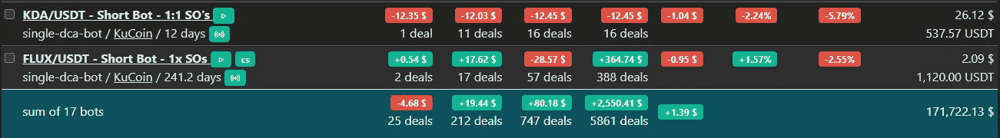
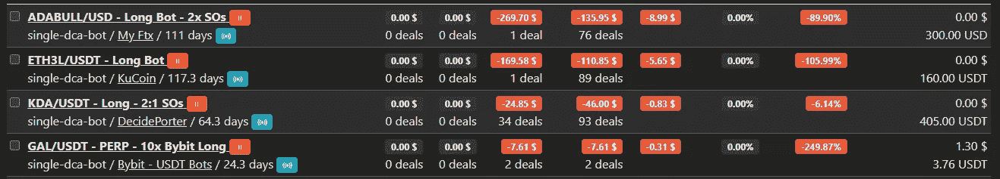

# 10 月:从机器人、矿工和其他项目获得 345 美元的被动收入！

> 原文：<https://medium.com/coinmonks/october-345-in-passive-income-from-bots-miners-other-projects-6476f6647814?source=collection_archive---------0----------------------->

又一个月过去了。万圣节现在已经过去了，我们很快就要到 2022 年底了！

我们已经设法在这个月推出了一个 Discord 服务器，每个人都可以免费加入，谈论被动收入的想法。你可以在这里找到链接[。](https://bit.ly/3MndXov)

在我们开始更新之前，你已经看到这是我记录每月收入更新以来最糟糕的一个月，令人沮丧，但仍然是盈利的。从中吸取了很多教训，这让我们重新关注如何在这个月的下一次更新中进行改进！！

那么，让我们进入被动收入更新。和往常一样，我会在下面留下前几个月的链接。

[4 月](/coinmonks/how-much-passive-income-have-i-made-with-my-crypto-miners-dca-bots-in-the-last-30-days-bcfb4c46a25a)——被动收入 705 美元

[5 月](/coinmonks/may-1-400-in-passive-income-from-bots-miners-a-couple-of-new-projects-3c824d798f7b)——1400 美元的被动收入

[6 月](/coinmonks/june-1-099-in-passive-income-from-bots-miners-stepn-feaa4cf9a276)——被动收入 1099 美元

[7 月](https://realisticcrypto.medium.com/july-417-in-passive-income-from-bots-miners-stepn-cb16e5e785df)——417 美元的被动收入

[8 月](https://realisticcrypto.medium.com/august-1-078-in-passive-income-from-bots-miners-stepn-2ab5779f8ea0)——被动收入 1078 美元

[9 月](https://realisticcrypto.medium.com/august-1-130-in-passive-income-from-bots-miners-other-projects-6a2826fd53bc)——被动收入 1，130 美元

1.  **M2 职业矿工**

我有两个这样的矿工。这些矿工每人给我赚了 5280 MXC，按目前的价格计算，总共相当于 607 美元。如果我把这些放在 ATH，这个月就会涨到 1410.15 美元！

自从我在 2 月底和 5 月初购买了这些矿工，我已经开采了 6000 美元投资中的 3545 美元，并支付了大约 7 美元的电费！

对于你们当中有眼力的人来说，你可能会注意到，与上次更新相比，价格只增加了大约 20 美元，而不是 607 美元。在过去的 30 天里，MXC 的价格下跌了 17%,这降低了前几个月开采的 MXC 的总价值！

如果我等待并在 MXC 到达之前的 ATH 时卖出，我将总共积累 8，259.53 美元，这将在大约 7 个月内收回初始投资并为我带来超过 30%的利润。

完整评论&优惠 50 美元[此处](https://realisticcrypto.medium.com/my-highest-paying-2-electric-per-month-plug-play-crypto-miner-makes-me-around-12-per-day-per-375ccc604988)

**2。氦矿工**

我有 2 个 Sensecap M1 氦矿工设置了 5.8dbi 无线天线。我有一个山猫 300 采矿机，我在八月安装的。

第一个赢得了 2.94 HNT，第二个赢得了 2.29 HNT，第三个赢得了 2.04 HNT，总计约 28.50 美元。

如果我等待 HNT 到达之前的 ATH 时卖出，这个月的总额将是 399 美元。

在投资方面，我在 miners & antennas 上花了大约 1700 美元，到目前为止，我总共赚了 44.3 HNT——今天的价格是 173.65 美元，或者以前的 ATH 是 2431.18 美元。

**3。Stepn**

在这方面没什么可更新的。我九月份只出去过两次，产生了 70.5 英镑的消费税。按目前的价格，这个月是 1.69 美元。

**4。DCA 机器人**

这个月我总共损失了 359.62 美元，来自 3 个商业机器人，账户规模约为 6640 美元，相当于大约 5%的损失。

在很大程度上，这是意料之中的，因为有几个机器人我在 3L &公牛 3x 杠杆令牌上持有了太长时间的交易。

同样不成立的是，市场缺乏波动性，其他机器人无法弥补损失。过去几天，我们已经开始看到波动性回归，因此我们应该会在 11 月份看到改善。

这个月，我还会在下面附上显示每个机器人利润明细的截图。

Paused Bots

请注意，上面截图中当前/最大使用量一栏中的金额并不准确，因为这些金额并不是所有情况下的 USDT 金额。

这是一个相对糟糕的月份，但与此同时，在完成实验性的 3 倍杠杆交易后，其他机器人仍获得了利润，尽管是小额利润。

我还创造了几个新的机器人。一个是 KDA/USDT 短机器人。这就卖出了 KDA，然后以更低的价格买回，从而增加了以同样的美元价值买入的 KDA 的数量。

我还创建了一个 MTV/BTC 长机器人——旨在积累 BTC——和一个 ETH/UBX 长机器人，旨在积累 ETH。这些仍在优化，但希望我们能看到他们在整个 11 月表现良好。

更多关于我对 DCA 机器人进行回溯测试和查找设置的方法和技术的信息可以在[这里](https://bit.ly/3czwJM8)找到。

我的策略继续是积累和复合加密！

**5。SCPrime**

这是一个我非常看好的长期项目。一篇深入的文章可以在这里找到虽然，这有点过时了——我将在接下来的几周内对此进行更新。

这个月我赚了 45.5 便士，约合 9.37 美元。

在投资成本方面，我建立了自己的存储提供商，花费了我 1，000 美元(16TB)+450 美元的许可成本，因此我以大约 1，450 美元的价格购买了 SCPrime，回报为 185.71SCP，按今天的价格计算为 38.28 美元，按历史最高价格计算为 644.41 美元。

**6。Hyfix.ai/Geodnet**

这将是第二个月我有这个矿工设置。这个月，矿工已经做了 961 个 GEOD，价值 50.17 美元。

大约一周前，我已经将矿工转移到一个新的位置，因为我在获得良好信号方面遇到了问题，这影响了我的奖励。这是一个临时的解决方案，直到我可以将它正确地安装在室外，可以 360 度观看天空，但现在这使我回到了每 24 小时 48 GEOD 左右，所以下个月我们应该会看到大约 1440 GEOD / $78

**7。庞氏节点**

[雪崩链上的蒸汽节点](https://bit.ly/3Qok7VD)

这是在远离庞氏节点世界的过程中，它将节点过渡到 NFTs。它计划建立自己的生态系统，并且已经建立了自己的 DEX，未来还会有更多。VPND 节点将用于挖掘 VAPE，这将是本机 VaporDex 令牌，因此该项目将有许多令人兴奋的内容。

价格在过去 30 天内上涨了 290.5%，一旦完成过渡，我将报告 NFT +收益的价值。

今年年初，我最初向 VaporNodes 投资了大约 700 美元。我获得了大约 150 美元的利润，剩下大约 550 美元来收回我的投资。

无论哪种方式，我都会继续增加这个项目的回报，直到我可以使用 NFTs 来挖掘 VAPE。

[滴](https://bit.ly/3wYd67a)在 BNB 链条上

几个月前，我最初投资了 120 美元。我不时地(不是每天)复利。我目前每天挣大约 0.128 美元，按目前的价格计算是 0.63 美元。

就这两个项目而言，我没有要求任何每日回报，我只是继续复合。

**8。预研节点奖励**

关于该项目的更多信息可以在[这里](https://realisticcrypto.medium.com/do-you-want-a-good-search-engine-that-pays-you-in-crypto-to-use-it-a545f11df840)找到。

早在 6 月份，我就使用 2，000 PRE 设置了一个节点(这可以回收，它不像其他 DRIP/STRONG 类型的节点那样会浪费初始投资)。

上个月，我赚了 129 英镑，相当于 7.51 美元

就初始投资而言，我以每台 0.1 美元的价格购买了 2，000 台 PRE，因此总投资为 200 美元，外加 22 美元来托管一整年的节点。

**总计**

M2 专业版——607 美元

氦气——28.50 美元

stepn——1.69 美元

DCA 机器人——359.62 美元

黄金——9.37 美元

hy fix/geod net——50.17 美元

庞氏节点——0 美元(全部复利)

预搜索节点奖励——7.51 美元

**总计:344.62 美元**

**总结**

价格横向波动和低波动性在本月对 DCA 机器人没有帮助。

**附属链接**

更多优惠还可以在这里找到:[https://linktr.ee/RealisticCrypto](https://linktr.ee/RealisticCrypto)

还有，如果你想请我喝杯咖啡或者啤酒:) :

BTC—BC 1 qaxaq 2 q 9 js 89 gyzhr 0202 sxt 6 hgchprqjga 5 px

基于 ETH、BNB、AVAX、SOL 和 FTM 的令牌—0 x3b 7b 843d 8125 Fe 7 EBA 541 e 1d 751 a4 a 73 f 0 cfad 4c

**免责声明**

这不是财务建议，我不是财务顾问或会计或税务专家。这是我对帮助过我的软件工具的体验，以及我使用它们的经历。

我在本指南中使用了推荐链接。使用这些工具有助于以后的文章，所以如果你觉得这篇文章有用，并且想看看我提到的工具，请使用它们。我还会叫出你在哪里打折——双赢对吧？

> 交易新手？试试[密码交易机器人](/coinmonks/crypto-trading-bot-c2ffce8acb2a)或[复制交易](/coinmonks/top-10-crypto-copy-trading-platforms-for-beginners-d0c37c7d698c)