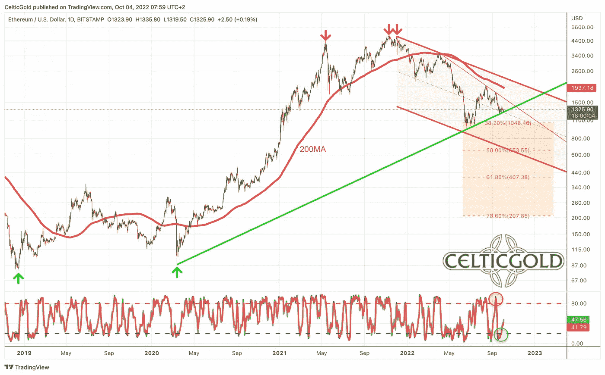
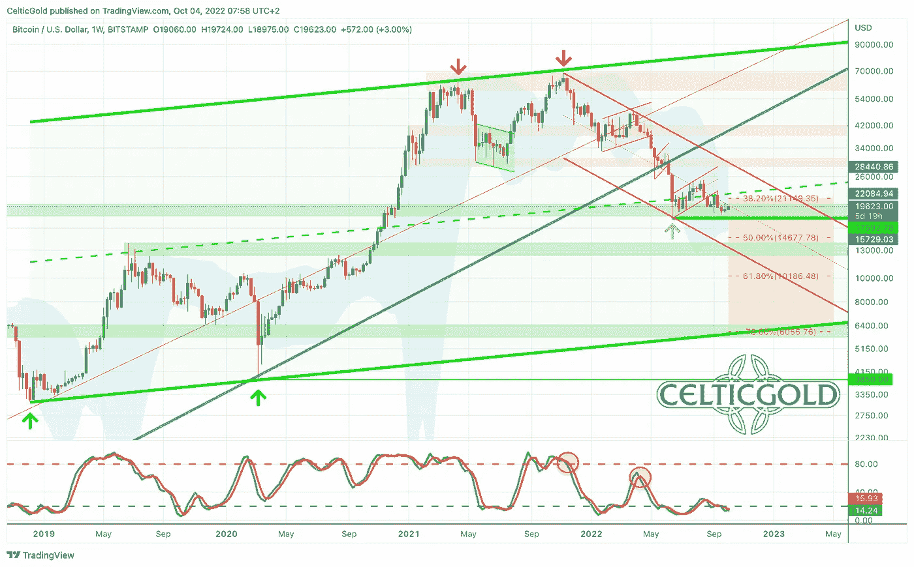
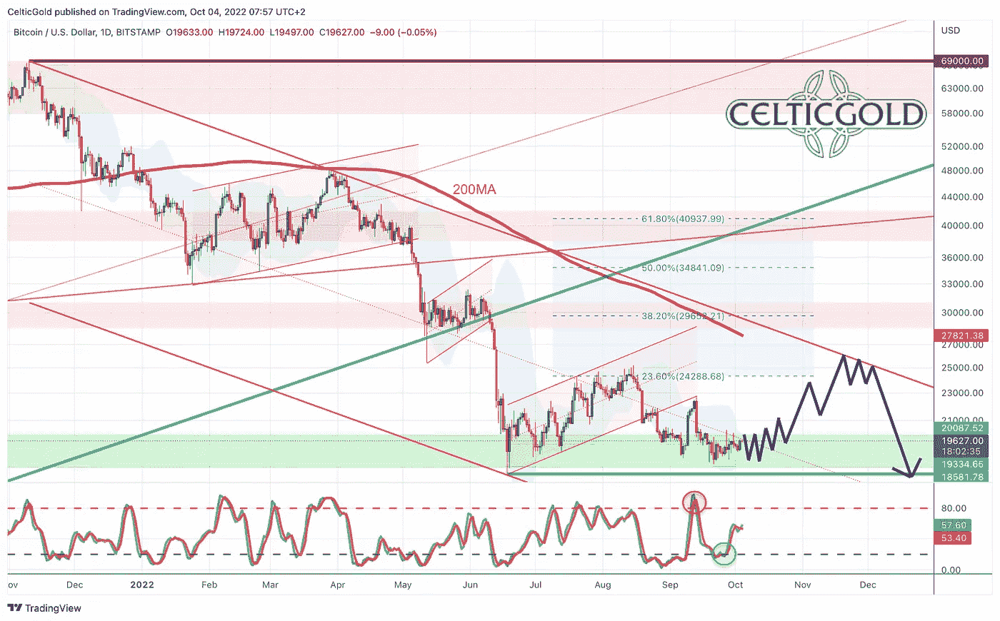
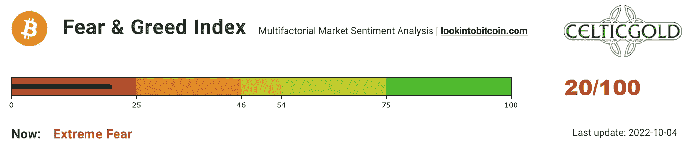
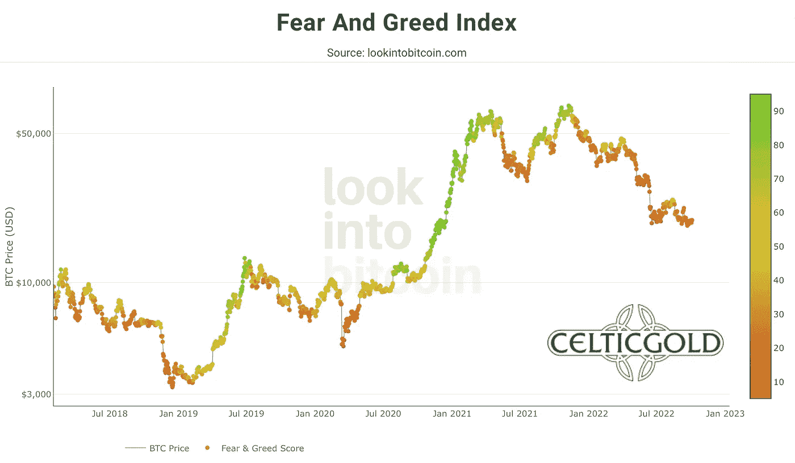
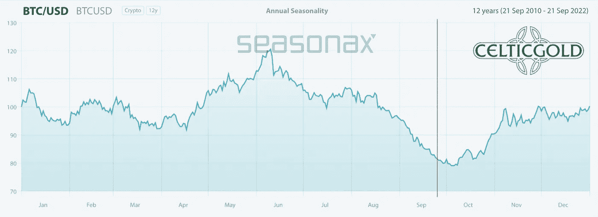
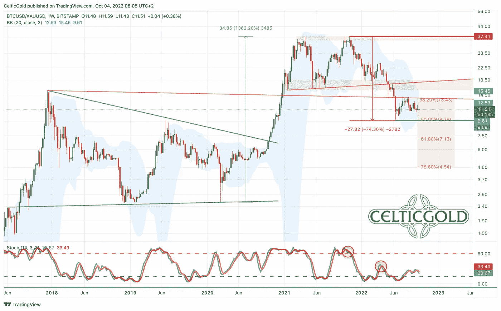
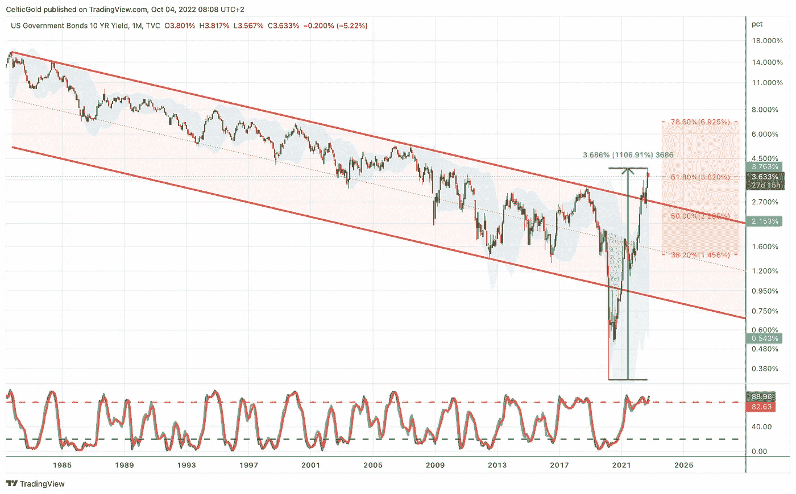
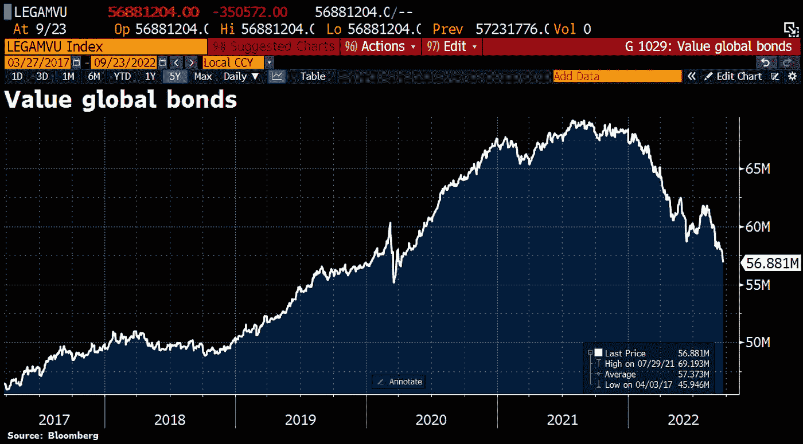
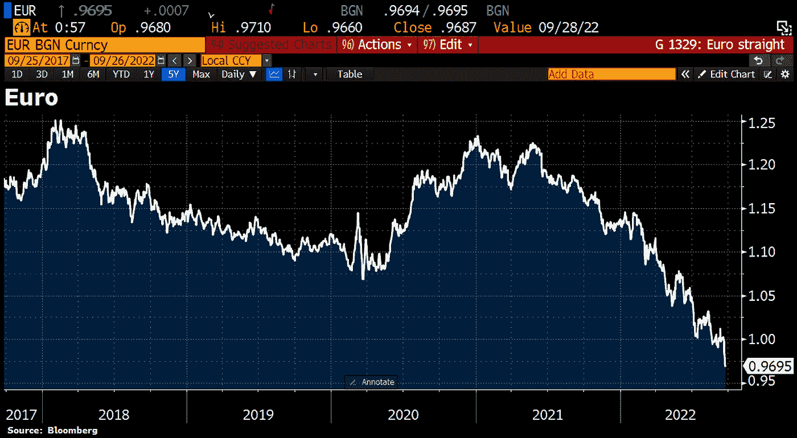

# 2022 年 10 月 4 日，比特币——在一场史诗般的流动性危机中

> 原文：<https://medium.com/coinmonks/october-4th-2022-bitcoin-in-the-midst-of-an-epic-liquidity-crisis-c618b82d15f9?source=collection_archive---------11----------------------->

虽然股市像 2001 年一样在缺口中下跌，但 VIX 波动指数仍然表现得像牛市一样。然而，大宗商品价格一直在下跌，就像通货紧缩一样，但美国国债收益率仍在 15 年高点附近交易，表明通胀率将达到 20%。最重要的是，极度悲观的情绪正迅速转变为极度乐观，但通常反映出自满情绪，就好像什么都没发生一样。似乎什么都不说得通。比特币——在一场史诗般的流动性危机中。

## 回顾

直到 8 月中旬，在夏季熊市反弹的预期背景下，所有金融市场都能够愉快地复苏。然而，过去七周几乎所有行业都出现了强劲的回调和新低。在这个过程中，比特币(BTC 兑美元)也几乎完全没有达到我们的第一个复苏目标(25，000 美元)，8 月 15 日为 25，212 美元，随后回到 18，157 美元，跌幅超过 26%。

*Ethereum in USD, daily chart as of October 4th, 2022\. Source:* [*Tradingview*](https://www.tradingview.com/?aff_id=1321)

当然，以太坊(ETH-USD)也难逃这种抛售压力。尽管第二大加密货币最初能够在期待已久的“合并”事件之前取得显著收益，并在事前明显优于比特币，但日益恶化的流动性危机最终导致价格再次下跌。尽管如此，9 月 21 日的最后低点 1220 美元仍然明显高于 6 月 18 日的低点 881 美元！

## 有史以来最重大的科学 IT 技术成就

从根本上说，以太坊合并是最大的开源软件项目之一，因此可能是有史以来最重要的科学 IT 技术成就。在这个过程中，以太坊区块链的共识机制从一个非常耗能的“工作证明(PoW)”变成了一个几乎不耗能的“利益证明(PoS)”这永远地改变了以太坊产生的方式以及在以太坊网络上交易被验证的方式。这里的主要承诺是巨大的环境效益。根据以太坊创造者 Vitalik Buterin 的推文，Merge 将使全球能耗降低 0.2%！

乐观主义者现在预计，正因为如此，不仅会有更多的机构投资者参与进来，更重要的是，以太坊网络将会构建出更多好的协议和 dapps，为以太坊生态系统提供去中心化的安全性和真正的价值。

另一方面，悲观主义者认为，合并不会对高得离谱的交易费(天然气)产生任何影响。此外，由于引入了赌注机制，SEC(美国证券交易委员会)可能很快会将以太坊视为受监管的证券。在这种情况下，99%的美国人将不再能够合法地在交易所交易以太坊。

因此，在一个深度加密的冬天中，这种情况继续发展，不仅仅是在流动性和图表方面。相反，SEC 方面的监管威胁(以太坊)和即将到来的 Mt. Gox 补偿支付(比特币)就像一把达摩克利斯之剑悬在比特币和以太坊以及整个加密行业的价格之上。

## 美元比特币的技术分析

**比特币周线图——明确的下跌通道**

*Bitcoin in USD, weekly chart as of October 4th, 2022\. Source:* [*Tradingview*](https://www.tradingview.com/?aff_id=1321)

在明确定义的下降通道内，比特币价格在过去的十个半月里一直在走低。所有的中间恢复都毫无进展，甚至在最小的阻力下都失败了。自 2021 年 11 月创下历史新高以来，比特币再也没能达到周线图上的布林带上轨(29788 美元)。目前，价格在大约 18，000 美元至 20，000 美元的支撑区域内盘整。从这里看，自 6 月中旬以来，价格成功企稳，但“三个月的横盘折磨”是对这一价格走势的更好描述。向下突破似乎只是时间问题。

从更大的角度来看，大上升通道的下边缘目前位于 6000 美元左右，这将代表比特币并非完全不现实的“最坏情况”。到目前为止，比特币的回报仅略高于之前上涨趋势的 38.2%回撤(从 3125 美元到 69000 美元)。如果 18，000 美元左右的支撑位未能守住，下一个回撤将在 14，677 美元(50%)和 10，186 美元(61.8%)处。然而，从周线来看，价格可能会停留在大约 16，000 美元至 28，000 美元之间的紧缩布林线内。

**总体而言，周线图上的趋势显然仍是下行。然而，考虑到超卖的情况，需要考虑急剧和不平稳的复苏(空头挤压)。然而，加密的冬天还没有结束的迹象，尽管出现了中期复苏和逆势反弹，比特币仍有可能在中期内创出新低。**

**比特币日线图——明显疲软**

*Bitcoin in USD, daily chart as of October 4th, 2022\. Source:* [*Tradingview*](https://www.tradingview.com/?aff_id=1321)

日线图更好地描绘了比特币的明显弱点。基本上从 2021 年 11 月中旬开始就在不断的走下坡路。当然，更大的情况是严重超卖，但对整个向下运动的反应足以恢复到仲夏 25，000 美元附近的 23.6%回撤。不会比这更弱了。200 天移动平均线(27，821 美元)也在快速下跌，代表着可能出现空头挤压的“最佳情况”。

在非常短的时间内，比特币价格很可能会继续小幅承压，但会横向波动。布林线在最近几周已经收窄了很多，如果比特币只是在 18，500 美元和 20，000 美元之间波动一段时间，这并不奇怪。然而，在未来两到三个月的时间里，无论形状如何，反弹或年末反弹都应该会成功，因为情况实在是太超卖了。

**综上，日图中性至看跌。几周以来，价格一直在横向或小幅南移，但没有太大意义。只要美元保持强势，比特币就很难上演任何可持续的反弹。然而，一旦美元得到必要的喘息，整个加密行业将开始复苏。**

**在 2018 年的加密冬天，比特币在短短几个月内从 3200 美元飙升至 13800 美元。因此，如果比特币很快恢复了 50%,却在接下来的几个月里把所有的收益都拿了回来，不要感到惊讶。**

## 情绪比特币——在史诗般的流动性危机中

*Crypto Fear & Greed Index, as of October 4th, 2022\. Source:* [*Lookintobitcoin*](https://www.lookintobitcoin.com/charts/bitcoin-fear-and-greed-index/)

在夏季显著复苏后，加密的恐惧和贪婪指数又回到了恐慌模式。从更高的层面来看，恐惧继续在加密领域根深蒂固，尽管恐惧和恐慌持续了很长时间，但没有迹象表明这种情况会立即结束。

*Crypto Fear & Greed Index long term, as of October 4th, 2022\. Source:* [*Lookintobitcoin*](https://www.lookintobitcoin.com/charts/bitcoin-fear-and-greed-index/)

从更大的角度来看，被打压的人气为长期投资者和持有者提供了一个反向操作的机会。尽管如此，这种头寸仍需要很长时间才能明显进入正区间，至少在年底之前，强劲的反弹/复苏应该会成功。

**总体而言，恐惧情绪继续提供反向买入信号。**

## 季节性比特币——即将看涨

*Seasonality for bitcoin, as of September 25th, 2022\. Source:* [*Seasonax*](https://app.seasonax.com/assets/btc-usd-cc?h=eJyrVkpUsjI2MtBRKipWslIyMjA0NDAxMlMC8lPBfCMjKL9SySo6VkcpV8nKUEcpBUwmlylZGdQCAP58Dzw%3D)

这种不良的季节性模式在最近几周得到了明确的证实。然而，从统计数据来看，从 10 月初或 10 月中旬开始，趋势变化即将出现。因此，一个重大的复苏举措至少可以让加密行业在某种程度上以和解的方式结束这痛苦的一年。然而，在那之前，接下来的一至四周仍然会很艰难。但是，随着 11 月 2 日的下一次美联储利率决定和 11 月 8 日的“中期选举”，有两件事即将发生，至少可以提供暂时的稳定，也可能是股市年末反弹的开始。

总的来说，季节性因素仍然需要耐心。从 10 月中旬开始，从统计角度来看，形势明显好转，鉴于低迷的情绪和超卖的情况，复苏的可能性相对较高。

## 健全的货币:比特币与黄金

*Bitcoin/Gold-Ratio, weekly chart as of October 4th, 2022\. Source:* [*Tradingview*](https://www.tradingview.com/?aff_id=1321)

按照目前一个比特币大约 19500 美元，一盎司黄金大约 1700 美元的价格，你必须为一个比特币支付大约 11.5 盎司的黄金。换句话说，一金衡盎司黄金目前的价格约为 0.087 比特币。因此，**比特币/黄金比率**在过去六周内一直横向波动。

尽管在仲夏，比特币出现了短暂的上涨，但最终该比率在 9.5 至 13.5 之间巩固了此前三个半月的抛售。考虑到超卖的情况，再加上周线图上活跃的随机买入信号，未来几周的反弹机会并没有那么大。

然而，总体趋势仍然指向南方，**比特币/黄金比率**迄今为止只完成了前一波上涨的 38.2%和 50%的回撤。因此，61.8%的回撤点(7.13)将是下一个。低于 9.6 的比率值将激活下行的下一个修正目标。一般来说，只要市场仍处于空头的掌控之中，金价应该会比比特币的价格更坚挺。

**音钱分配**

一般来说，只有在平衡这两种资产类别的配置时，买卖比特币和黄金才有意义！一个人总资产的至少 10%到最多 25%应该投资于贵金属实物，而加密货币，尤其是比特币，应该至少持有 1%，但最多不超过 25%。5%.如果你对加密货币和比特币非常熟悉，你当然可以在个人基础上为比特币分配高得多的百分比。对于主要投资于股票和房地产的普通投资者来说，在仍然具有高度投机性和高度波动性的比特币中最多投资 5%是一个很好的指导方针！

> 总的来说，你想拥有黄金和比特币，因为对立面是互补的。在我们阴阳、身与心、上与下、暖与冷的二元世界里，我们被必然的对立吸引所束缚。在这个意义上，你可以把黄金和比特币视为这样一对力量。由于黄金的实物稀缺性和比特币的数字稀缺性，你有了一个互补的硬资产单位，它将在 21 世纪成为真正的避风港。你想两者都拥有！”— [**弗洛里安·格鲁姆斯**](https://www.midastouch-consulting.com/about)

**总之，比特币/黄金比率处于明显的下降趋势。暂时的复苏或反趋势正在缓慢但肯定地变得更有可能。尽管如此，这一比率暂时还可以再降一层。技术上，该比率目前正以无意义或盘整的方式横向移动。**

## 宏观更新——流动性危机加剧

*10-year U.S. government bonds, monthly chart as of October 4th, 2022\. Source:* [*Tradingview*](https://www.tradingview.com/?aff_id=1321)

几个月来，金融市场的压力一直在稳步增加。主要驱动力是债券市场。在这里，10 年期美国国债的名义收益率在短短两年半的时间里从 0.33%增长了 10 倍多，达到了 3.83%！

*U.S. real interest rates, as of September 25th, 2022\. ©*[*Holger Zschaepitz*](https://twitter.com/Schuldensuehner/status/1574007993955401737)

美国 10 年期实际利率一直升至 1.31%，为 2011 年以来的最高水平。

*Global bond market, as of September 25th, 2022\. ©*[*Holger Zschaepitz*](https://twitter.com/Schuldensuehner/status/1574060420410777601)

因此，全球债券市场长达 40 年的牛市或泡沫已经结束！自 2021 年年中历史高点以来，总亏损约 122 亿美元！这日益导致美元的流动性紧缩。

*Euro against the U.S. Dollar since 2017, as of September 26th, 2022\. ©*[*Holger Zschaepitz*](https://twitter.com/Schuldensuehner/status/1574172001559887872)

从大的方面来看，自 2008 年以来，美元对几乎所有其他法定货币都在升值。当时，欧元兑美元汇率最高时约为 1.60 美元。目前，欧元兑美元汇率仅为 0.98。短短 14 年间损失了近 40%。

美元流动性危机对股票、大宗商品、房地产和加密市场的影响是巨大的。一切都是熊市。尽管有非常悲观的情绪以及明显超卖的情况，但没有基本面或技术面的趋势反转信号。因此，最终的底部还看不到。相反，在上两次危机(2000 年互联网泡沫和 2008 年金融危机)中，央行行长早在股市见顶之前就已经结束了加息周期。

110 年历史上最大的政治错误？

现在，非民主选举的央行行长们刚刚开始(欧洲央行)或继续(美联储)加息，而市场已经在近 11 个月前见顶。因此，随着各国央行有史以来第一次在熊市中继续加息，市场可能会跌至比大多数人想象的低得多的水平。由稀缺(封锁)和 50 年的印钞狂欢(1971 年金本位制的终结)导致的高通胀现在要用一把大锤来控制了。出问题(实体经济)的风险非常高，我们不得不假设美联储目前正在犯其 110 年历史上最大的政治错误之一，这可能导致严重的衰退甚至持续多年的萧条。

与此同时，随着抵押贷款利率升至 2008 年以来的最高水平，消费者受到了彻底挤压，而通胀显然超过了工资增长，储蓄率达到了历史低点，劳动力市场正在恶化，整体消费者情绪非常低迷。

在最好的情况下，市场可以在 10 月中下旬稳定下来，然后在 11 月或 12 月开始年终反弹。在这个过程中，一切都应该上升，而超买的美元将得到纠正。尽管如此，大量美元和瑞士法郎的流动性仍然是主流，因为只要各国央行不改变方针，现金就是王道。交易量低的行业(如小盘股、低价股、次级股和勘探矿业股)应该避开。然而，实物贵金属应该逐渐积累。比特币也将受益于 10 月中旬或下旬开始的复苏。然而，加密的冬天并没有结束，可能会在 2023 年回归。

## 结论:比特币——在一场史诗般的流动性危机中

如果像现在这样，美元流动性枯竭，市场、经济和生活方式也会随之枯竭。毕竟，所有的市场危机基本上都只是流动性危机。在这种情况下，希望市场将处于 V 型趋势反转的边缘似乎不仅天真，而且疏忽。当然，一切皆有可能，但即使央行行长们明天就能扭转局面，这种趋势逆转通常也需要数月时间才能在市场上持续显现。

**然而，直到现在，美元还没有确认反转。只要美元保持强势并呈上升趋势，流动性危机就会持续，所有资产类别都会面临压力。对于比特币来说，18000 美元附近的支撑岌岌可危。如果空头能够占上风，价格可能会进一步向 14，000 美元和 10，000 美元修正。我们的最坏情况仍然是中期 6000 美元。然而，我们怀疑所有市场都将出现大幅反弹。它可能已经开始或将在 10 月中旬和月底之间开始。这将把最后的抛售推迟到明年的比特币。**

*分析主办，2022 年 9 月 29 日首发，作者*[*www . Celtic gold . eu*](https://celticgold.de/blog/gold-und-bitcoin-analysen-von-florian-grummes-32/bitcoin-mitten-in-der-liquiditatskrise-190)*。翻译成英文，2022 年 10 月 4 日部分更新。*

*随时加入我们的* [*我们的免费电报频道*](https://www.midastouch-consulting.com/services/newsletter-telegram) *获取每日实时数据和一个伟大的社区。如果您喜欢定期了解我们的黄金模型、贵金属、商品和加密货币，您还可以订阅我们的* [*免费简讯*](http://bit.ly/1EUdt2K) *。*

*披露*:

*本文及内容仅供参考，不包含投资建议或推荐。每一次投资和交易都有风险，读者在做决定时应该进行自己的研究。此处表达的观点、想法、看法，均为作者个人观点。它们不一定反映或代表 Midas Touch Consulting 的观点和意见。*

> 交易新手？试试[加密交易机器人](/coinmonks/crypto-trading-bot-c2ffce8acb2a)或者[复制交易](/coinmonks/top-10-crypto-copy-trading-platforms-for-beginners-d0c37c7d698c)