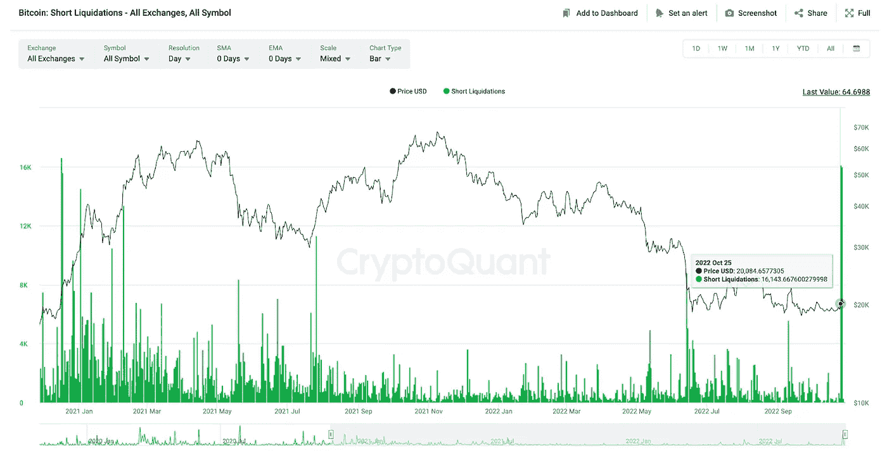
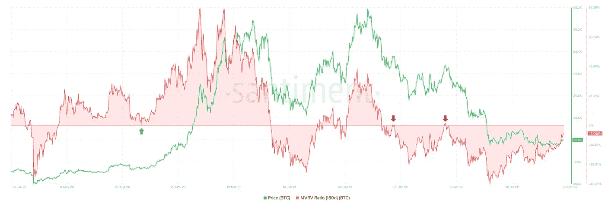
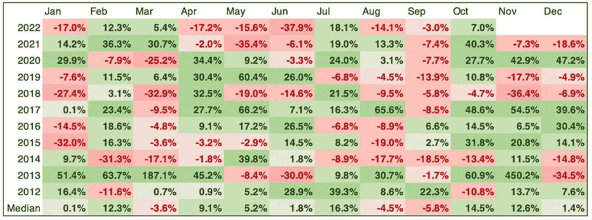
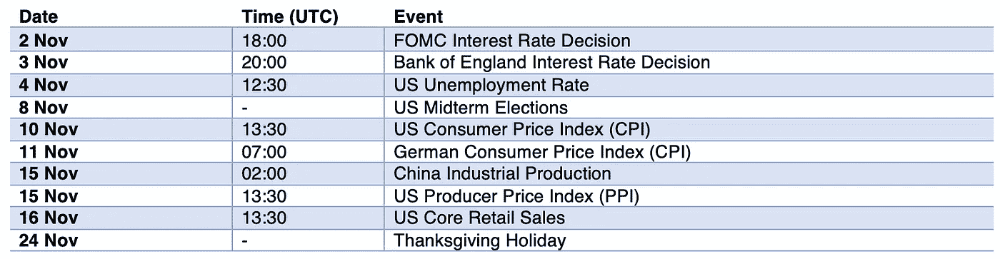
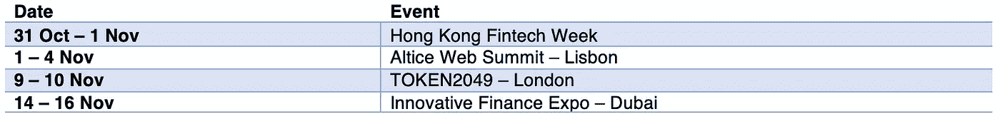

# 十月概览

> 原文：<https://medium.com/coinmonks/october-overview-2d13c3142f95?source=collection_archive---------12----------------------->

## 您对数字资产世界的每月简报

> 文章作者[肯 C.](https://www.linkedin.com/in/ken-chan-ba63a886/) 和[六位 CP](https://www.linkedin.com/in/sixte-c-a72b47173/)

**市场更新**

**JKL 集团孵化 LENA-web 3 流动性协议**

**监管机构
-**-*几易其稿，云母法终于被欧盟议会投票通过*

**金融机构
-** *即使在熊市期间，华尔街也在涌入 crypto*

**密码项目
-** *芒果市场怎么了？*

**采矿**

**公司**

**加密预览&比特币日历
-**-*宏观经济事件
-加密事件*

## **市场更新**

随着主要央行倾向于相对温和的立场，市场整体情绪似乎正在改善。加拿大银行出乎市场意料地加息 50 个基点，幅度低于预期。欧洲央行(ECB)如预期宣布加息 75 个基点，但改变了指引，从上月表示“在未来几次会议上”将加息，改为仅表示“预计将进一步加息”。

比特币的价格连续两天上涨，总涨幅为 7.5%，然后稳定在 2 万美元以上。空头头寸纷纷平仓，进一步推动了上涨势头。CryptoQuant 记录了 10 月 25 日和 10 月 26 日两天清算的超过 1.5 万份 BTC 空头合约。类似规模的短暂挤压上一次出现在 2020 年 12 月 16 日至 17 日，当时 BTC 股市在两天内上涨了 25%。

最重要的是，人们预期美联储可能会在 12 月放缓加息 50 个基点。9 月份核心 PCE 指数同比增长 6.2%，符合预期，这增强了投资者的乐观情绪。美国股指继续反弹，而美元货币指数(DXY)在前期高点 114 附近盘整数周后表现疲软，并短暂跌至 110 下方，较 10 月份的高点有 3.6%的回撤。

由于我们可能在短期内进入潜在反弹，180 天的 MVRV 比率可能是一个值得考虑的有趣的连锁指标。这是衡量过去 180 天内购买的所有比特币的平均收益率的指标，目前为-6.1%。在目前的熊市中，我们注意到零附近的值成为比特币的重大阻力——如下图所示，水平线在零的前两次触碰很快就出现在价格下跌趋势的持续之前。如果 180 天 MVRV 比率再次接近零，观察比特币的价格走势，看看该比率是否会超过零，将是一件有趣的事情。

Source: CryptoQuant

Source: Santiment

## **JKL 集团孵化 LENA-web 3 流动性协议**

你知道 JKL 资本经营一个风险基金吗？

JKL 的风险投资部门专注于支持早期项目，为 Web3 颠覆性的数字时代提供动力。我们的投入不仅限于金融投资。我们担当顾问的角色，为我们的孵化项目精心挑选最有潜力的人——今天我们很高兴向你们介绍其中一个项目。

**LENA——最新的 Web3 流动性提供商**

LENA 协议促进了所有 NFT 集合的分散和无许可的借贷，同时还提供了用于赌注奖励、借贷等的加密流动性池。我们选择在内部培养 LENA，因为我们坚信释放 NFT 中的流动性(想想蓝筹股、土地、GameFi、SoFi、艺术等等！)将是密码领域下一轮升级的巨大催化剂！

以下是该项目的一些亮点:

1- LENA 背后有两个数字资产投资的老手，JKL 集团( [https://www.jkl.group](https://www.jkl.group/) )和 Satori Research([https://Satori Research . io](https://satoriresearch.io/))。由于我们在 APAC 地区的网络以及在场外交易、资产管理和风险投资方面的专业知识，我们可以一起为这个项目带来最高的价值。

2- LENA 的顾问是加密行业的资深专家，您会发现:

*   Polygon 的 DeFi 负责人哈姆扎·汗；
*   YIELD App 首席执行官兼创始人蒂姆·弗罗斯特(Tim Frost)；
*   安迪·安，YAS 数字公司和实验室集团的首席执行官和联合创始人。

3-该平台即将完成，下周将进行公开测试！作为风险投资者，我们明白交付产品的重要性，而不是在未来推销一个想法。

## **监管机构**

**几易其稿，MiCA 法终于被欧盟议会投票通过**

MiCA 的故事始于 2017 年的 ICO 热潮。初步草案的重点是发行者和钱包提供商。然而，监管机构无法跟上加密生态系统的步伐，该法案经历了多次修改。最终，官员们决定将主要精力放在稳定的收入、洗钱和消费者保护上，而放弃了 DeFi 和 NFT 市场。6 月，欧盟议会发布了关于非法加密交易的最终条款，引发了加密领域的激烈辩论。10 月 5 日，欧盟理事会批准了该文本。最后，10 日，MiCA 以 28 比 1 的票数被欧盟议会通过。

加密社区的批准率可能没有欧盟议会高，但大多数人认为在欧洲层面实现监管统一是有益的。加密资产公司将被允许在 27 个国家经营，只需一张执照。虽然由于区块链科技试图转型的行业范围广泛，监管差距仍将存在，但既然基本规则已经设定，市场将会扩大。欧洲集中了 35%的加密交易，构成了世界上最大的加密市场。不应该轻视 MiCA，因为它为全球所有其他监管机构指明了道路。

以下是该法案的几个要点:

关于加密货币是商品还是证券的讨论。本文将数字资产分为四类:加密资产、实用令牌、资产参考令牌和电子货币令牌(e-money)。他们都有自己的一套规则。

呼吁所有 stablecoin 提供商将每天的交易量限制在 2 亿€。仅供参考，USDT 24 小时交易量目前为 460 亿美元。

呼吁欧洲银行管理局(EBA)记录所有不遵守 MiCA 新规定的加密服务提供商。

新法律将于 2024 年生效，让企业有时间适应新的规则。与此同时，世界各地的监管机构在设计自己的框架时，肯定会密切关注加密货币监管之旅中最大的里程碑。

**阅读更多**

> 麦克吉尼斯说，欧盟将加密放在国际货币基金组织会议的首要位置([阅读更多](https://www.bloomberg.com/news/articles/2022-10-05/eu-puts-crypto-at-top-of-list-for-imf-meetings-mcguinness-says)
> 
> 中东和北非是增长最快的加密市场([阅读更多](https://cointelegraph.com/news/middle-east-and-north-africa-are-fastest-growing-crypto-markets-data))
> 
> 在委员会投票中，立法者压倒性地支持欧盟的 MiCA 加密法
> 
> 经合组织向 G20 提交新的加密资产透明度框架([阅读更多信息](https://www.oecd.org/tax/exchange-of-tax-information/oecd-presents-new-transparency-framework-for-crypto-assets-to-g20.htm))
> 
> 葡萄牙计划对加密收益征收 28%的税(目前为 0%)([阅读更多](https://decrypt.co/111599/portugal-plans-to-impose-28-tax-on-crypto-gains))
> 
> 巴西里约热内卢将接受财产税的加密支付([阅读更多](https://cointelegraph.com/news/brazil-s-rio-de-janeiro-will-accept-crypto-payments-for-property-taxes))
> 
> 比特币基地获得新加坡数字支付令牌许可证([阅读更多](https://www.coindesk.com/business/2022/10/11/coinbase-gets-singapore-digital-payment-token-license/))
> 
> 主席贝南说，在 CFTC 的监管下，比特币的价格可能会翻一番
> 
> FASB 决定采用公允价值会计来衡量加密资产

## 金融机构

**即使在熊市期间，华尔街也在涌入 crypto**

比特币从 ATH 下跌了 72%，自 4 月份以来只出现了一根绿色的月蜡烛线，美联储的货币政策也没有缓解的迹象。然而，机构对 TradFi 的采用正在强劲增长。

世界上最大的托管银行，目前监管着 46.7 万亿美元的资产，首次涉足加密领域。238 年前由 Alexander Hamilton 创建，旨在促进航运业的发展，BNY 梅隆银行现在将保护其客户的分散式点对点在线加密货币。银行的发展就像加密货币领域一样。熊市曾经是 BTC 的反弹时期，现在，华尔街在下行周期中平静地安顿下来，为下一轮牛市做准备。

一项调查显示，91%的机构客户有兴趣投资令牌化产品，75%的机构客户已经在其投资组合中持有加密产品，或者正在积极考虑投资，BNY 的加密市场随之渗透。当前熊市的特征是不断增长的机构采纳。他们希望建立强大的基础设施，以利用对他们来说似乎不可避免的东西:下一轮牛市。他们的目标是构建机构级解决方案，以降低通常与加密相关的风险。

世界第二大证券交易所的运营商纳斯达克也从 9 月底开始向其客户提供加密保管服务。他们甚至考虑一旦监管漏洞被填补，就推出一个加密交易所。

今年 3 月，全球最大的资产管理公司贝莱德(BlackRock)首席执行官拉里·芬克暗示，由于客户需求旺盛，该公司将探索提供加密服务。正如承诺的那样，在 8 月份，即使 BTC 的价格接近其 3 月份价值的一半，贝莱德也宣布与比特币基地合作，为他们的客户提供加密交易、托管、大宗经纪和报告功能。对于这样一个管理着 8.5 万亿美元的备受尊敬的机构来说，进入加密市场，这极大地证明了 BTC 作为顶级投资工具的合法性。加密生态系统与我们在历次熊市中看到的通常的“比特币泡沫”叙事相去甚远。

最后，前几个月华尔街打下的最后一个里程碑是存管信托结算公司(DTCC)的工作。这家从事美国绝大多数股票交易结算的 post trade 金融服务公司创建了自己的区块链，每天处理约 10 万笔交易。越来越明显的是，TradFi 看到了分布式账本技术应用的价值。

**阅读更多**

> SWIFT 表示，事实证明它可以成为全球 CBDCs 的发展方向([阅读更多信息](https://www.coindesk.com/business/2022/10/05/swift-says-its-proved-it-can-be-the-way-forward-for-global-cbdcs/)
> 
> FTX 与 Visa 合作在 40 个国家推出加密借记卡。([阅读更多](https://www.cnbc.com/2022/10/07/visa-partners-with-ftx-in-a-bet-that-shoppers-still-want-to-spend-cryptocurrencies-in-a-bear-market.html))
> 
> 美国历史最悠久的银行 BNY 梅隆银行开始提供加密保管服务([阅读更多信息](https://www.coindesk.com/business/2022/10/11/bny-mellon-to-begin-crypto-custody-service-report/)
> 
> 摩根大通(J.P. Morgan)和 Visa 桥接其私人区块链网络，以简化全球支付([阅读更多](https://www.forbes.com/sites/emilymason/2022/10/11/jp-morgan-and-visa-bridge-their-private-blockchain-networks-to-streamline-global-payments/))
> 
> 4.5T 资产管理公司富达向客户提供 ETH 托管和交易服务([阅读更多信息](https://cointelegraph.com/news/4-5t-asset-manager-fidelity-offers-eth-custody-and-trading-to-clients))
> 
> 与 2021 年第三季度相比，Silvergate Capital 的加密至菲亚特转移减少了 500 亿美元([阅读更多信息](https://cointelegraph.com/news/silvergate-capital-s-crypto-to-fiat-transfers-decrease-by-50b-compared-to-q3-2021))

## 加密项目

**芒果市场怎么了？**

芒果市场(MNGO)是一个建立在索拉纳(SOL)区块链之上的分散式交易平台。凭借 1.06 亿美元的总价值锁定(TVL)，芒果在 10 月初的所有索拉纳 DApps 中排名第六。然而，在 10 月 16 日，芒果遭受了一次重大的攻击，造成了大约 1 . 14 亿美元的损失。

对该漏洞的分析显示，攻击者从 1000 万美元开始，平均分成两部分，发送到两个 Solana 钱包，我们将它们标记为钱包 A 和钱包 b。另外大约 300 万美元的金额被保留用于交易主要 Solana 指数(包括 Jupiter、Raydium 和 Serum)上的现货 MNGO 令牌。

钱包 A 首先获得了 500 万美元的资金，并在芒果平台上下单，以 0.0382 美元的价格做空 4.83 亿份永久合约。后来订单被等额出资的钱包 B 撮合，去长了。攻击者随后开始操纵 MNGO 现货价格，交易价格高达 0.91 美元，这给账户 B 留下了 4.23 亿美元的未实现利润。因为该平台允许利用高度非流动性的 MNGO 令牌作为抵押，并允许以未实现的利润为抵押借款，账户 B 能够通过包括 USDC、MNGO、SOL 和 BTC 在内的几个令牌提取 1.16 亿美元。这实际上耗尽了平台的所有流动性。

与此同时，wallet B 的空头头寸也随着 MNGO 价格迅速跌至 0.02 美元。尽管如此，芒果平台现在缺少偿还这个头寸的资金。

令人惊讶的是，该漏洞还演变成了一种 DAO 治理攻击。或许是出于对法律后果的担忧，黑客提出归还价值约 6700 万美元的代币，并将剩余的 4700 万美元作为 bug 赏金。由于获得了大量 MNGO 代币，黑客能够提高自己的投票权。这项提议最终以压倒多数获得通过。

FTX 创始人兼首席执行官萨姆·班克曼-弗里德是索拉纳生态系统的大力支持者，他在推特上发表了自己的观点。他分析了 oracle 和 risk engine 这两个分散交易和借贷平台的主要组成部分在 Mango 漏洞利用中的作用。虽然甲骨文确实准确地报告了 MNGO 的“当前价格”，但它远远超过了“公平价格”。除此之外，风险管理规则定义不清，剥削者能够人为地夸大其借贷能力。

Sam Bankman-Fried 强调了 FTX 控制风险的一些措施。首先，交易所的先知并不直接使用原始价格数据。相反，价格馈送是有界限的，因此它们在五分钟内的移动不能超过 20%，理由是价格的突然飙升可能是由于坏数据或临时波动。第二，随着头寸规模的增加，FTX 要求更高的保证金，特别是对于非流动性代币的大额头寸。例如，如果交易者想要建立 5 亿 MNGO 永久合约的头寸，他或她需要有充足的资金。最后，即使像 MNGO 这样的非流动性代币被允许作为抵押品，也会有很大的减值。

**阅读更多**

> DeFi Protocol MakerDAO 将 5 亿美元投入美国国债、债券([阅读更多](https://www.bloomberg.com/news/articles/2022-10-06/defi-protocol-makerdao-puts-500-million-in-treasuries-corporates))
> 
> BNB 连锁店因“潜在漏洞”耗尽约 1 亿美元的加密资金而暂停([阅读更多](https://www.coindesk.com/business/2022/10/06/binance-linked-bnb-price-falls-close-to-4-on-hack-rumors/))
> 
> 基于 Solana 的分散式金融平台 Mango 被 1 亿美元漏洞攻击([阅读更多](https://www.coindesk.com/business/2022/10/11/breaking-news-solana-based-decentralized-finance-platform-mango-hit-by-potential-100-million-exploit/?utm_source=substack&utm_medium=email))
> 
> 元宇宙是孤独的:DappRadar 数据显示，在价值 13 亿美元的生态系统中，分散土地拥有 38 名“每日活跃”用户([阅读更多](https://www.coindesk.com/web3/2022/10/07/its-lonely-in-the-metaverse-decentralands-38-daily-active-users-in-a-13b-ecosystem/))
> 
> Tether 将商业票据从透明推送储备中剔除([阅读更多信息](https://decrypt.co/111908/tether-eliminates-commercial-paper-from-reserves-in-transparency-push))

## 采矿

> 14 个月来最大挖掘难度峰值([阅读更多](https://www.coindesk.com/business/2022/10/10/bitcoin-mining-difficulty-surges-to-all-time-high-putting-additional-squeeze-on-miners/))
> 
> 比特币挖矿又凉了；我们应该感谢非洲，谨慎和成长
> 
> 比特币矿商 Core Scientific 的股票在破产警告后暴跌([阅读更多](https://www.coindesk.com/business/2022/10/27/core-scientific-to-suspend-payments-as-cash-dwindles/)
> 
> 是什么推动了比特币价格的大幅上涨？([阅读更多](https://bitcoinist.com/fueling-the-dramatic-rise-in-bitcoin-hashrate/))

## 公司

> 麦当劳在瑞士小镇开始接受比特币和系绳([阅读更多](https://cointelegraph.com/news/mcdonald-s-starts-to-accept-bitcoin-and-tether-in-swiss-town))
> 
> 谷歌选择比特币基地采用加密货币进行云支付，并将使用其托管工具([阅读更多](https://www.cnbc.com/2022/10/11/google-selects-coinbase-to-take-cloud-payments-with-cryptocurrencies.html))
> 
> 美国有线电视新闻网关闭其 NFT 市场，并发放 20%退款([阅读更多](https://cointelegraph.com/news/cnn-to-shut-down-its-nft-marketplace-and-issue-20-refund))
> 
> 一级方程式申请“F1”商标，涵盖加密、NFTs 和元宇宙([阅读更多](https://cointelegraph.com/news/formula-one-files-f1-trademarks-covering-crypto-nfts-and-metaverse))
> 
> 为什么加密汇款公司蜂拥至墨西哥([阅读更多](https://cointelegraph.com/news/why-crypto-remittance-companies-are-flocking-to-mexico))
> 
> 为什么 137 年历史的品牌自行车正在制造无聊的猿 NFT 扑克牌([阅读更多](https://decrypt.co/112202/why-137-year-old-brand-bicycle-is-making-bored-ape-nft-playing-cards))

## 加密预览

11 月将从 FOMC 会议开始，交易员将密切关注是否会有任何美联储转向的迹象，然后将注意力转移到美国中期选举。通胀将在 FOMC 后继续受到关注，因为多头急切地等待消费者价格最终得到控制的证据。此外，尽管最近的美国经济数据仍然强劲，但即将公布的失业和核心零售销售等数据的任何恶化都可能给市场带来新的阻力。

## 比特币业绩日历

在经历了 10 月份有些黯淡的表现后，加密多头有理由保持乐观。这是因为从历史上看，11 月也是比特币的利好月份。过去十年，比特币有 7 次以绿色收盘，回报率中值为 12.6%。

Source: Glassnode, JKL Group. Data as of 29 Oct 2022.

**宏观经济事件**

**加密事件**

**免责声明**

*本材料严格保密，仅供专业投资者使用(根据开曼群岛金融管理局不时的定义)。未经 JKL Digital Capital Limited(“JKL”)的书面同意，不得出于任何目的复制、重新分发、传递给任何其他人或出版全部或部分内容。虽然本材料中包含的信息是从据信可靠的来源汇编的，但 JKL 不代表或保证本材料中包含的信息的准确性、完整性或可靠性。*

*本材料的内容未经任何监管机构审核。建议您对本材料的内容保持谨慎。如果您对本材料的任何内容有任何疑问，您应该获得独立的专业意见。JKL 或其任何关联公司，或其任何或其各自的董事、高级职员、员工和代表都不会对因使用或依赖本材料中包含的任何信息而导致的任何直接、间接或后果性损失承担任何责任或义务。本材料不构成认购或购买任何金融产品的要约或邀请。其目的不是提供任何信贷或其他评估的基础，也不应被视为购买任何金融产品的建议。*

> 交易新手？试试[密码交易机器人](/coinmonks/crypto-trading-bot-c2ffce8acb2a)或[复制交易](/coinmonks/top-10-crypto-copy-trading-platforms-for-beginners-d0c37c7d698c)