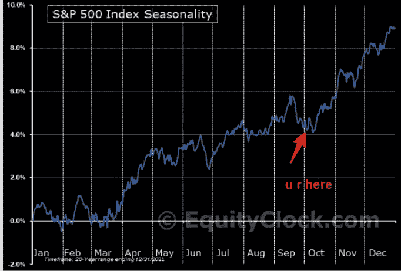
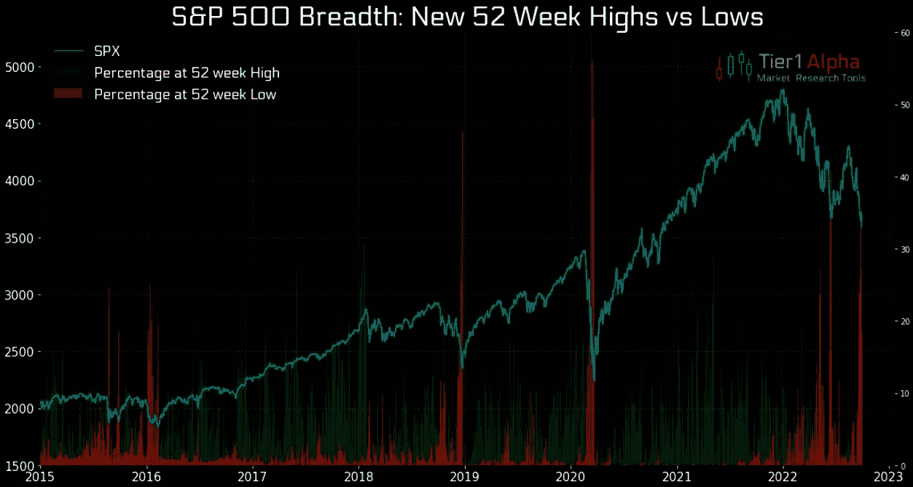
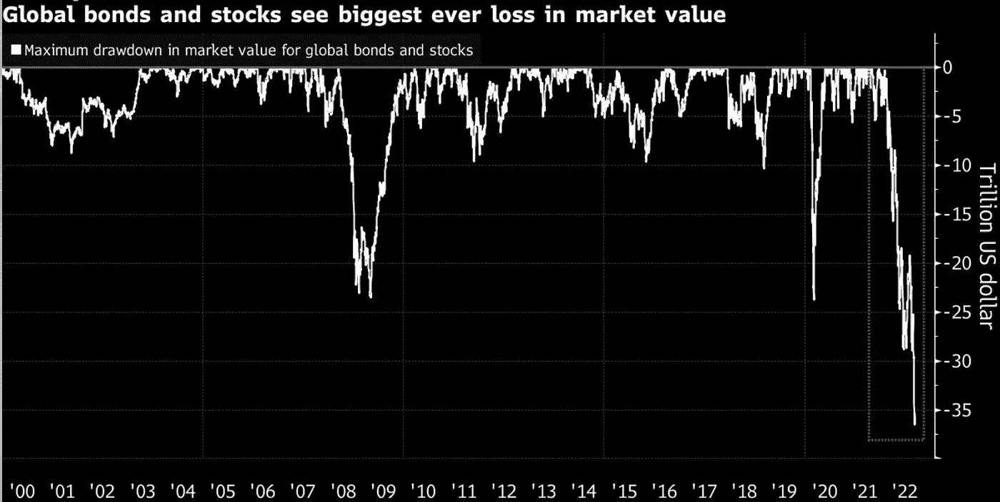
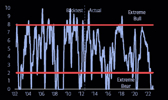
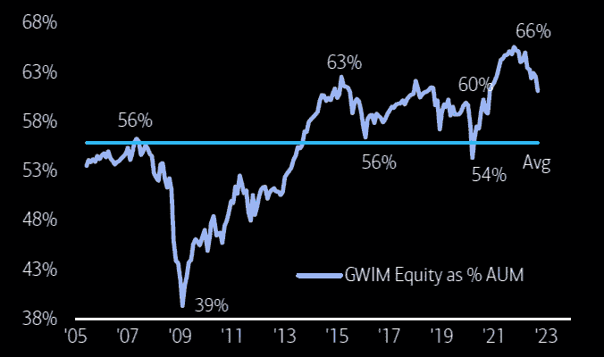
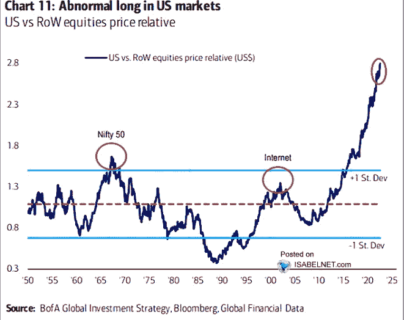
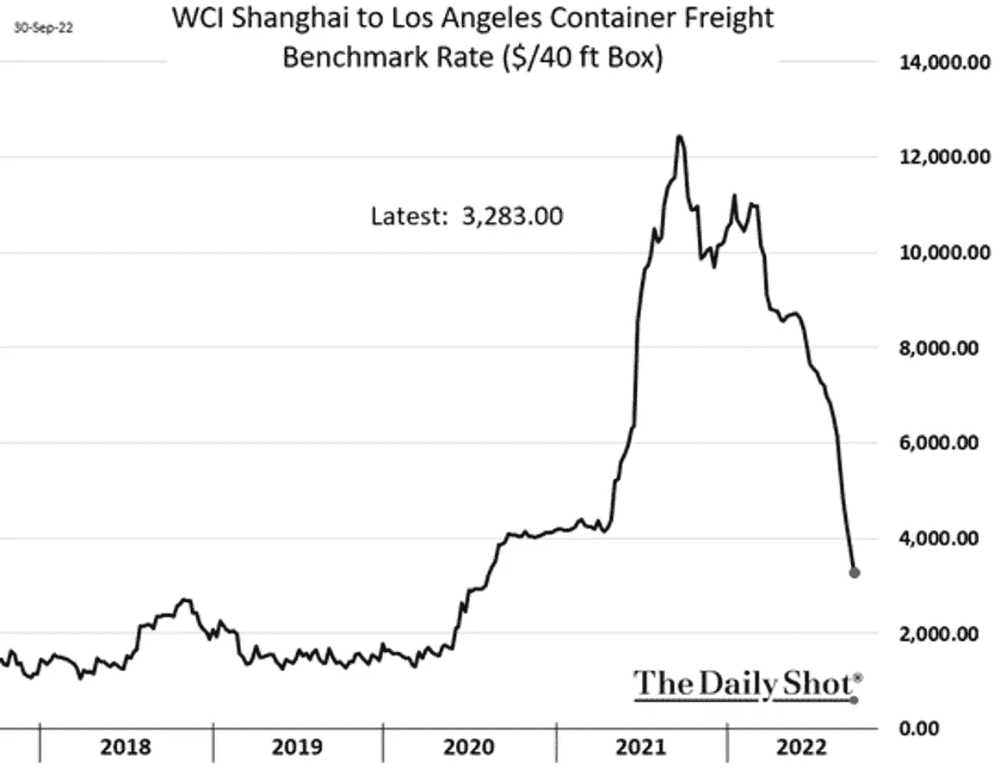

# 10 月季节性，超级富豪没有出售，通货膨胀逆转

> 原文：<https://medium.com/coinmonks/october-seasonality-the-super-rich-havent-sold-inflation-reversal-eaba39a0b2c8?source=collection_archive---------30----------------------->

嘿，我是基兰！市场又将迎来新的一周，以下是需要注意的关键事件，以及来自投资银行的最有趣的宏观研究。我希望能在本周的[贸易挑战](http://www.traderseed.io/)中与你交谈，并且一如既往，如果你有任何问题，请在下面给我留言。

# 每周观察列表

本周日历上的关键事件是周五的美国就业报告，该报告将显示美联储积极的一系列加息是否对美国劳动力市场产生影响。最近的就业数据表明，尽管一系列加息，劳动力市场仍保持强劲。

在其他地方，周三，石油输出国组织将开会同意，据报道，一个主要的石油产量削减，以支持价格。石油输出国组织和包括俄国在内的盟国将在石油输出国组织总部开会，以最终确定该组织 11 月份的产量配额。

# 宏观视角

**十月季节性。**历史上年末反弹的开始。这一次听起来有点好得难以置信，但在主要反弹开始时，市场情绪几乎总是明显看跌。图表显示了过去 20 年标准普尔 500 指数的季节性。

**S & P 500 宽度。52 周高点与低点的对比水平略差，但这一次越来越极端。**

**前所未有:一切都在熊市。36 万亿美元的市值蒸发了。我们从来没有股票和债券连续三个季度下跌。**

**感情扎根于零。**不出所料，美银牛&熊保持在 0.0。极度看跌。

超级富豪仍未出手。等待私人客户弃械投降。美国银行私人客户持股占 AUM 的百分比。

**美国对世界其他股市。**这是超量程扩展。想象一下，如果这个回归均值。

一些好消息。集装箱运输成本正在大幅下降。来自中国的运输成本正在正常化。通货膨胀终于有了一些好消息。

我希望你觉得这很有趣，很有用。我每周一写这份时事通讯，所以**一定要关注我**！像往常一样，把风险管理放在第一位，安全交易，保持敏捷。

祝你一周愉快！基兰

想交易本周的市场吗？ 100k 程序从 **$75** 开始！！点击这里查看新节目 [**！**](http://www.traderseed.io/)

[**查看节目**](http://www.traderseed.io/)

> 交易新手？试试[密码交易机器人](/coinmonks/crypto-trading-bot-c2ffce8acb2a)或[复制交易](/coinmonks/top-10-crypto-copy-trading-platforms-for-beginners-d0c37c7d698c)