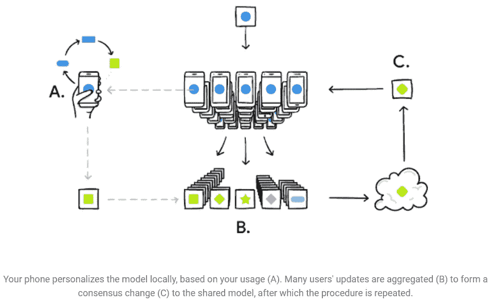

# 合作、流言蜚语和伪装技巧

> 原文：<https://medium.com/coinmonks/of-collaborations-gossips-and-a-masking-trick-e7af3d9730ea?source=collection_archive---------13----------------------->

## 高级人工智能

## 联邦学习对 ML 的作用会像区块链对 DeFi 的作用一样吗？


Image by [Ismail Salad Osman Hajji dirir](https://unsplash.com/@hajjidirir?utm_source=unsplash&utm_medium=referral&utm_content=creditCopyText) on [Unsplash](https://unsplash.com/s/photos/federated-learning?utm_source=unsplash&utm_medium=referral&utm_content=creditCopyText)

对数据隐私的日益关注，加上对分散众包平台的日益关注，引发了对设备上机器学习的需求。在本文中，我们将讨论联合学习，这是一种 ***协作机器学习方法，它在不交换用户原始数据*** 的情况下运行。

# 什么是联合学习？

联邦学习(FL)是一种机器学习方法，能够在*分散的局部数据集上训练*。**

**FL 旨在利用多个参与者的优势，这些参与者可以单独为一项全球任务做出贡献。参与者可以是连接到互联网、生成用户交互数据并具有足够处理能力的任何计算设备。**

# **为什么现在逃跑？**

**在移动计算中，用户要求快速响应，而用户设备和中央服务器之间的通信时间对于良好的用户体验来说可能太慢。为了克服这一点，可以将模型放置在终端用户设备中。但是，由于终端用户设备无法访问完整的数据，因此持续学习成为一项挑战。**

**FL 通过在边缘设备上实现持续学习，同时确保最终用户数据不会离开最终用户设备，从而克服了这一挑战。这允许个人数据保留在本地站点，降低了个人数据泄露的可能性。**

**即使在数据源不共享数据的情况下，FL 也有助于访问更丰富和多样化的数据，这可以改进模型。此外，由于 FL 模型不需要一个复杂的中央服务器来分析数据，因此提高了硬件效率。**

## **少数使用案例**

**像谷歌这样的公司在其智能手机键盘上使用 FL 技术来预测下一个单词。苹果的 FL 技术利用了用户交互历史，与现场 A/B 实验相比，大大减少了周转时间。医疗保健和健康保险行业可以利用 FL，因为它允许保护原始源中的敏感数据。在自动驾驶汽车中，FL 可以更好地实现实时决策和持续学习，并允许模型随着时间的推移根据不同车辆的输入进行改进。**

# **它是如何工作的？**

**在 FL 中，数据永远不会离开用户的设备。使用设备的计算能力和数据，在本地进行 ML 模型的训练。只有来自本地训练模型的训练元信息(权重和偏差)被传送到中央服务器。**

****

**Image Source: [Google AI](https://ai.googleblog.com/2017/04/federated-learning-collaborative.html)**

**该算法基于特定的试探法从候选人池中选择合格参与者的子集，以便最小化本地培训可能对用户体验产生的负面影响。合格设备组中的每个参与者都会收到一份全局或训练模型。然后，每个设备使用本地数据开始训练模型的本地微调过程。在训练之后，来自每个本地模型的更新参数被发送到中央服务器用于全局更新。当从客户端移动到服务器时，该训练元数据被加密，并且服务器仅解密聚集的训练结果，因此在该步骤中，没有逆向工程可以泄露关于单个客户端的数据的信息。最后，服务器汇总所有客户端的更新，并开始新一轮更新。**

## **零和掩蔽**

**这种函数加密被称为零和掩蔽协议。零和掩码在一个方向上的总和为 1，在另一个方向上的总和为 0。其中一个组合并保护加密的或安全的用户数据，而下一个将训练结果解密给服务器。这个过程一直持续到完成，然后掩模彼此抵消。以下是关于 FL 的几点注意事项:**

*   **大多数最大似然算法假设数据是 IID(独立同分布)。然而，在 FL 的情况下，由于每个参与者仅持有来自其自身使用的数据，我们不能假设每个数据部分(来自每个客户端设备)代表整个群体。**
*   **FL 最适用于设备上的数据比服务器上的数据更相关的情况。在今天这个高度个性化的世界里，这种情况经常发生。**
*   **FL 的分布式测试带来了在最重要的地方测试新版本模型的好处，也就是在用户的设备上。因为服务器不能访问训练数据，所以在使用客户端的贡献更新组合模型之后，它不能测试组合模型。因此，培训和测试在用户的设备上进行。**

## **履行**

> **FL 已经可以在 tensorflow-federated-nightly 下使用。**

**下面是为涉及 3 个类的分类任务构建超简单 FL 模型的说明性代码片段。**

```
**!pip install --quiet --upgrade tensorflow-federated-nightlyimport numpy as np
np.random.seed(0)import tensorflow as tf
import tensorflow_federated as tffdef create_model(num_classes:int):
    model = tf.keras.models.Sequential([
        tf.keras.layers.InputLayer(input_shape=(784,)),
        tf.keras.layers.Dense(num_classes),
        tf.keras.layers.Softmax()]) return tff.learning.from_keras_model(
        model,
        loss=tf.keras.losses.SparseCategoricalCrossentropy(),
        metrics=[tf.keras.metrics.SparseCategoricalAccuracy()])fl_model = create_model(3)evaluation = tff.learning.build_federated_evaluation(fl_model)**
```

# **挑战**

**尽管外语有巨大的潜力，但它也不是没有挑战。FL 型号要求节点之间频繁通信，导致网络吞吐量要求很高。然而，随着 5G 技术的最新进展及其更稳定、更快速的互联网连接，FL 将变得更容易部署。**

**此外，特定于设备的特性可能会限制来自某些设备的模型的一般化，并且可能会降低模型的下一版本的准确性。**

## **替代方案:八卦学习**

**在 FL 中，一个中央模型使用其他设备的输出来建立一个新的模型，这并不是真正完全分散的。研究人员提议使用**区块链联邦学习** (BlockFL)和其他方法来建立 FL 的零信任模型。**

****八卦学习** (GL)已经被许多研究者提出来解决外语学习中的一些问题。GL 是完全分散的，并且没有用于合并来自不同位置的输出的服务器。本地节点直接交换和聚合模型。GL 的优势是显而易见的:因为不需要基础设施，也没有单点故障，GL 享有显著更低的可伸缩性和更好的健壮性。**

# **结论**

**区块链技术为加密货币和去中心化应用提供了基础。这些工具共同创造了一个快速增长的 DeFi(去中心化金融)行业。正如 DeFi 可以随着这个行业的发展为企业开辟新的途径一样，联合学习可以彻底改变机器学习的世界。像任何新技术一样，FL 项目最初会获得不同程度的成功。商业领袖将需要选择这些项目中的哪一个将为他们的商业增加最大的价值。**

> **加入 Coinmonks [电报频道](https://t.me/coincodecap)和 [Youtube 频道](https://www.youtube.com/c/coinmonks/videos)了解加密交易和投资**

# **另外，阅读**

*   **[如何在 FTX 交易所交易期货](https://coincodecap.com/ftx-futures-trading) | [OKEx vs 币安](https://coincodecap.com/okex-vs-binance)**
*   **[CoinLoan 审查](https://coincodecap.com/coinloan-review) | [YouHodler 审查](/coinmonks/youhodler-4-easy-ways-to-make-money-98969b9689f2) | [BlockFi 审查](https://coincodecap.com/blockfi-review)**
*   **XT.COM 评论[币安评论](https://coincodecap.com/profittradingapp-for-binance) |**
*   **[SmithBot 评论](https://coincodecap.com/smithbot-review) | [4 款最佳免费开源交易机器人](https://coincodecap.com/free-open-source-trading-bots)**
*   **[比特币基地僵尸程序](/coinmonks/coinbase-bots-ac6359e897f3) | [AscendEX 审查](/coinmonks/ascendex-review-53e829cf75fa) | [OKEx 交易僵尸程序](/coinmonks/okex-trading-bots-234920f61e60)**