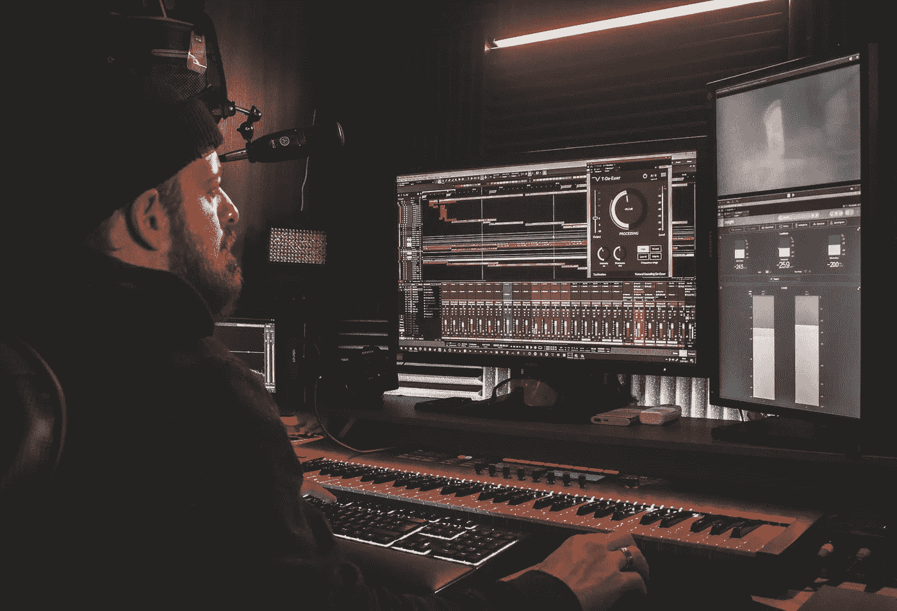

# 不走寻常路:Web3 创意

> 原文：<https://medium.com/coinmonks/off-the-beaten-path-web3-creatives-5d0416ba4689?source=collection_archive---------51----------------------->

虽然出版商仍然致力于不断发展的 NFT 音乐界，但很难不注意到游戏和艺术领域酝酿的过多令人兴奋的 web3 项目。我们正在看看区块链更广阔的创意世界中最令人期待的一些发展。

大量具有区块链功能的视频游戏令人震惊。这里只是我们大肆宣传的一小部分——一些新的到来以及一些计划在不久的将来发布的项目:

《被解放的神》是一款免费的交易卡游戏，与暴雪的炉石游戏有一个巨大的不同:可收集的卡可以作为有价值的交易卡。《T2》游戏《T3》建立在“玩到赚”的模式上，这与大多数免费游戏中臭名昭著的“支付到赢”系统完全相反。事实上，通过《被解放的上帝》的战斗系统赢得的卡片可以出售获利，这是该游戏用户至上设计的一个强有力的标志。此外，界面和游戏机制看起来都很有光泽！《被解放的神》现在可以玩了，并且已经发展到足以产生一些令人敬畏的、改变游戏规则的资料片。

对于那些还记得《贪吃蛇》(那种老式的砖块移动游戏)简单日子的怀旧人士来说， **Moshnake** 的目标是通过另一个“玩赚”的游戏来恢复原版的可靠游戏性。玩家可以用在游戏“竞技场”中找到的各种战利品装备他们的 NFT 莫什纳克，支撑他们瘦小的爬行动物，以便它可以在“皇家战役”模式中与其他玩家较量。Moshnake 已经从第一阶段的开发中筹集了超过 120 万美元。很高兴看到经典游戏蓬勃发展，尤其是在游戏的新时代。

虽然还处于早期开发阶段，但《月球之地》看起来将会是一个很快进入网络 3 游戏领域的时尚而有深度的 IP。它承诺了一个巨大的多人游戏体验，从土地所有权和化身定制到巨大的多面战斗。创造一个角色让玩家有机会拼凑自己的游戏资产。你甚至可以把你独特的作品铸造成 NFT。

在 AAA 级游戏开发方面，世嘉公司宣布计划与总部位于日本的区块链公司[双跳东京](https://www.doublejump.tokyo/en)合作，开发其首款元宇宙游戏。这款尚未命名的实时战略游戏基于世嘉广受欢迎的《三国志泰森》系列，并将整合可以改变游戏元素的实体卡片。这将标志着物理和数字代币之间的互动令人兴奋的新冒险！

从 web3 工作室 [Memeland](https://www.memeland.com/) 来了一个独特的数字艺术 x NFT 混搭:**Potatoz**。这 10，000 多张[NFTs 合集](https://opensea.io/collection/thepotatoz)提供了受迷因和网络文化影响的奇怪和古怪的土豆描述，其中一些更受欢迎的代币在 OpenSea 市场上售价高达 25000 美元。很高兴看到 web3 产品不把自己看得太重！

像素艺术看起来比以往任何时候都新鲜，一个突出的例子是由[亡灵部署者](https://opensea.io/Undead-deployer?tab=created)创作的 NFT 收藏**真正的亡灵**。为了与万圣节的精神保持一致，很难让人觉得已经过了僵尸艺术收藏品的行列。我们期待看到更多像《亡灵部署者》这样的独立数字艺术家在 NFT 空间蓬勃发展。

NFT 艺术品是通向更多独家艺术品的大门吗？听起来像是一个正反馈循环。这就是艺术家 DirtyRobot + RENGA Factory 通过他们的名为**季节的艺术**的动态插图[系列设法炮制出来的东西。至少可以说，插图本身给人印象深刻，其独特的风格让人想起一些最好的动画电影(见吉卜力工作室](https://opensea.io/collection/the-art-of-seasons))。正如他们的名字一样，这幅作品生动、生动地描绘了享受季节变化的原始人物。我们迫不及待地想知道 DirtyRobot + RENGA Factory 未来还会拼凑出什么样的产品。

最后，我们非常期待的一个项目是**everybody ' s**。艺术家 Sean Solomon 创造了 10，000 个原创的[角色](https://opensea.io/collection/everybodys/drop)，这些角色将从简单的个人资料图片开始，但很快会演变成全面的动画甚至实体收藏品。不言而喻，每个角色都是其独特的 NFT，从事物的外观来看，吸引人的和可访问的设计可能会获得大量的流行。当它在 10 月 28 日推出时，抓住这个独特的可收藏的下降。

虽然熙熙攘攘的 web3 空间继续增长，出版商将继续强调和讨论这个不断变化的数字世界。对于各种天赋水平的后起之秀来说，自信地驾驭 NFT 空间可能会很棘手，尤其是如果你想让自己出名的话。令人欣慰的是，出版商致力于为艺术家、粉丝和 NFT 爱好者创建一个平台，完全拥抱音乐产业的去中心化未来。关注我们未来的文章，关注我们即将在 https://the-publicator.com[举行的发布会。](https://the-publicator.com/)

> 交易新手？尝试[加密交易机器人](/coinmonks/crypto-trading-bot-c2ffce8acb2a)或[复制交易](/coinmonks/top-10-crypto-copy-trading-platforms-for-beginners-d0c37c7d698c)