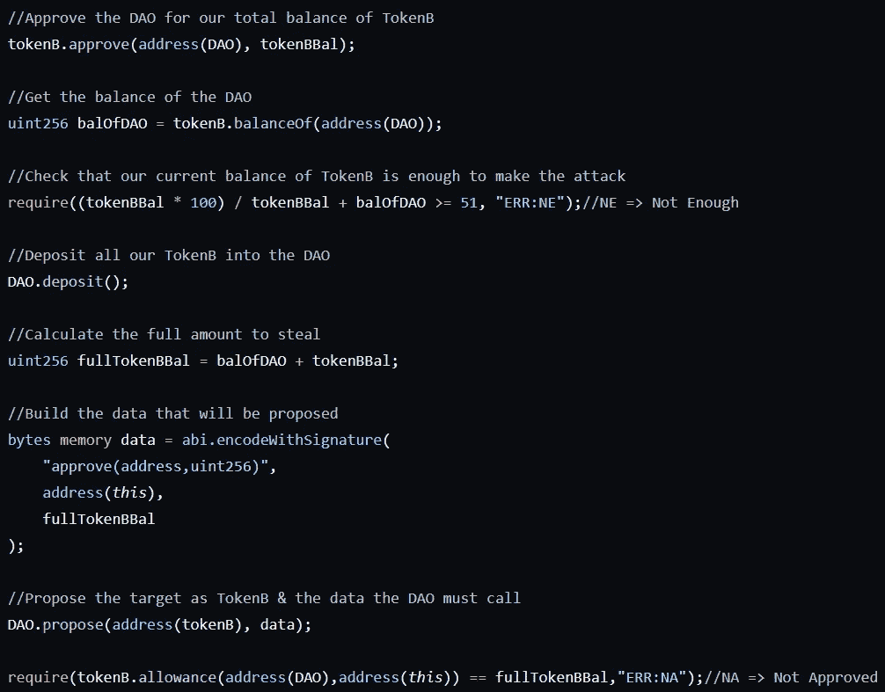
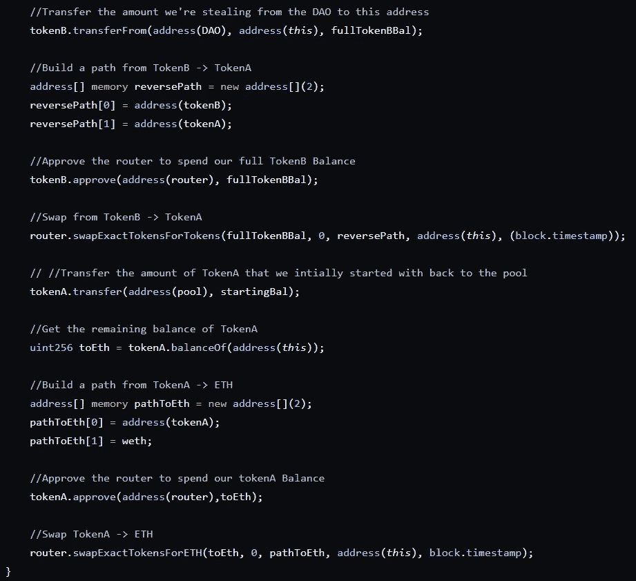

# 进攻性智能合同黑客—第 2 部分

> 原文：<https://medium.com/coinmonks/offensive-smart-contract-hacking-part-2-dd6fcafc8a13?source=collection_archive---------7----------------------->

repo—[https://github . com/JEflyer/Offensive-Smart-Contract-Hacking-Course](https://github.com/JEflyer/Offensive-Smart-Contract-Hacking-Course)

最终，2/3 和 4 中的漏洞几乎是相同的，因此我们将直接跳到挑战 4，这是最复杂的，需要学习的内容也最多。

玩得开心 xD

挑战 4

目标—从令牌 A-ETH LP 池中窃取所有 ETH。

如果你对 xD 足够有信心，就自己去试试吧

.

.

.

.

.

.

.

.

所以我们在这里要走的总路线是:
1。从 Flashloan 提供者处借用令牌 A
2。将令牌 A 换成令牌 B
3。用令牌 B 晃刀
4。偷刀令牌 B
5。将令牌 B 转换为令牌 A
6。偿还闪贷
7。将剩余的令牌 A 转换成 ETH &发送给攻击者

首先，我们在攻击契约中有攻击功能。#

很简单，我们的攻击者将调用来初始化攻击，我们将借用所有的 flashloan 池令牌，这些令牌将启动它自己的功能&一旦 flashloan(&我们的漏洞)完成，我们就将合同中剩余的 ETH 转移给攻击者。

让我们快速看一下 flashloan 提供商。

因此，我们向 mint 请求一笔金额，契约检查它是否拥有足够的令牌来实际借出，检查调用者是否是契约，将令牌传输给调用者，初始化攻击契约上的 flashloan 逻辑。一旦闪贷完成，预计本合同的余额将大于或等于之前的余额。

好吧，回到攻击合同。

如果您没有任何与 Uniswap v2 交互的经验，那么这可能看起来很难消化，但不要担心，我会分解它。

首先，我们检查这个函数的调用者是池契约，然后我们构建一个从令牌 A 到令牌 B 的路径，检索令牌 A 的契约余额。

在 Uniswap 上交换令牌时，您必须首先批准路由器先使用您的令牌。

在这里，我们将令牌 A 交换为令牌 B，声明我们希望出售起始数量的令牌 A，并检索任何可能检索到的内容(因此是 0)，即我们希望此事务立即完成的令牌 B &的接收方(因此是 block.timestamp)。

好了，现在我们有了很多令牌 B，让我们来看看这把刀。

我们在这里没有使用 ETH，所以我们不能使用重入，让我们看一下提议系统。

好的，如果我们有超过 51%的令牌，我们就可以强制 DAO 使用我们想要的任何参数调用任何契约上的任何函数。

让我们检查一下攻击契约，看看我们如何攻击这个。

我们批准 DAO 使用我们的令牌 B，检索 DAO 持有的金额。要求我们的存款金额足以以 51%的多数票发起攻击。

存放代币。构建 DAO 将随其函数调用一起发送的数据。我们将强制 DAO 调用的函数是 Token B 上的 approve 函数，因为它的整个余额都是我们的契约。

我们向 DAO 提出这个数据和地址，然后检查 DAO 是否已经批准了这个合同，以使用它的全部余额。

好的&闪贷漏洞的最后一部分？

从 DAO 中窃取所有令牌 B 然后批准 Uniswap 路由器花费您的令牌 B .耗尽令牌 A —令牌 B 令牌 A 的 LP 池.偿还 flashloan。批准路由器使用我们的令牌 A。清空令牌 A-ETH LP 池。

然后，正如攻击函数中计划的那样，剩余的 ETH 被转移给攻击者。

如果你觉得这很有趣，看看这个！
[https://medium.com/p/28a8bb064e86](/p/28a8bb064e86)

坚实发展研究小组—[https://discord.gg/KzbcGmrnfN](https://discord.gg/KzbcGmrnfN)

-多边形联盟—[https://www.polygonalliance.com/](https://www.polygonalliance.com/)

——多边形联盟不和—[https://discord.gg/kJKPCGQu66](https://discord.gg/kJKPCGQu66)

你喜欢这篇文章吗？想请我喝杯咖啡吗？
Polygon/Eth/Bsc—0x4a 581 E0 EAF 6b 71d 05905 e8e 6014 DC 0277 a1 b 10 ad

> *交易新手？试试* [*加密交易机器人*](/coinmonks/crypto-trading-bot-c2ffce8acb2a) *或* [*复制交易*](/coinmonks/top-10-crypto-copy-trading-platforms-for-beginners-d0c37c7d698c) *上* [*最好的加密交易*](/coinmonks/crypto-exchange-dd2f9d6f3769)

> 加入 Coinmonks [电报频道](https://t.me/coincodecap)和 [Youtube 频道](https://www.youtube.com/c/coinmonks/videos)获取每日[加密新闻](http://coincodecap.com/)

# 另外，阅读

*   [免费加密信号](/coinmonks/free-crypto-signals-48b25e61a8da) | [加密交易机器人](/coinmonks/crypto-trading-bot-c2ffce8acb2a)
*   [杠杆代币](/coinmonks/leveraged-token-3f5257808b22)终极指南
*   [16 款最佳折叠电动自行车](/coinmonks/top-17-folding-electric-bikes-5e296f0918cb)
*   [28 款最佳电动自行车点评](/coinmonks/the-28-best-electric-bikes-review-and-buying-guide-in-2023-7bb3146cb403)
*   前三名[币安期货交易机器人](/coinmonks/top-3-binance-futures-trading-bots-e6031f84b3f9)