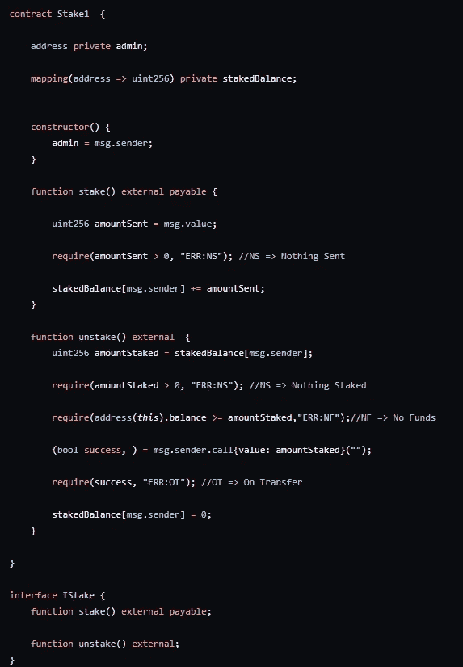
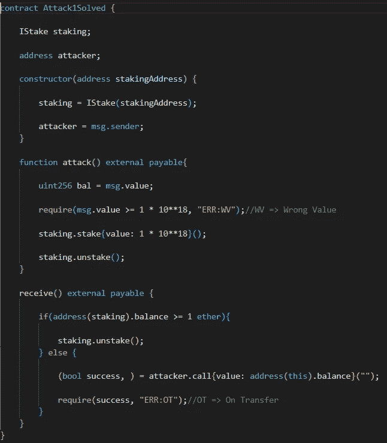
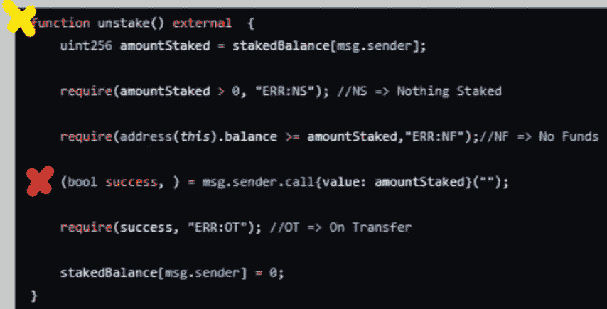

# 进攻性智能合同黑客第一部分

> 原文：<https://medium.com/coinmonks/offensive-smart-contract-hacking-part1-ce8da6e3c097?source=collection_archive---------1----------------------->

我建议复制本课程的报告，以便您能够跟上。
[https://github . com/JEflyer/Offensive-Smart-Contract-Hacking-Course](https://github.com/JEflyer/Offensive-Smart-Contract-Hacking-Course)

挑战 1 —立桩

场景——有一个赌注合同，允许你下注和撤回你的赌注。目前在这个合同中有 100 个 ETH。

目标——偷走所有的 ETH！

好的，让我们看看合同。

首先，任何地方都不会用到 admin，所以我们可以忽略它。我们有一个很好的存款映射。我们有 stake & unstake 功能，这也是下面界面的一部分。

木桩()
1。检索用户发送的值。
2。请检查它是否大于零。
3。将金额添加到呼叫者的存款中。

Unstake()
1。取回呼叫者下注的金额。
2。请检查该金额是否大于零。
3。检查该合同是否有足够的时间供呼叫者提取。
4。把资金发给打电话的人。
5。检查呼叫是否成功。
6。将呼叫者余额设置为零。

你看到漏洞了吗？

这不是最明显的漏洞&它需要一些关于契约如何工作的知识，以及我们自己可以使用哪些功能。

该漏洞存在于 unstake 函数中&我将解释这是如何在攻击契约中被利用的。

首先，我们有一个 IStake 接口的实例&攻击者的地址。

在构造函数中，我们设置攻击者的地址&构建 IStake 接口的实例。

攻击()
1。查找调用者发送的值。
2。检查它是否大于或等于 1 ETH。
3。桩 1 ETH。
4。解散。

Receive() —每次将 ETH 发送给我们的合同时都会运行该函数。
1。检查是否赌注合同仍然有足够的 ETH 去偷。
2。如果有足够的资金，请再次调用拆分函数。
3。否则发送资金的攻击者&检查转账是否成功。

好吧。

让我们再仔细看看分解函数。

当我们点击这个函数中的红色 x 时，代码执行的流程会因为我们的代码而改变。当 ETH 发送给我们时，我们重新进入黄色 x 处的函数。

这意味着我们在重新进入时已经跳过了 unstake 函数的最后两行。

现在，当我们用完了要窃取的资金时，资金将被发送给攻击者&我们跳过了 unstake 函数的最后两行的所有实例现在都将运行，结束初始的 unstake 函数调用。

嗯，我希望你学到了一些东西！

如果你觉得这很有趣，为什么不看看这个呢！
[https://medium.com/p/e8454dfe8189](/p/e8454dfe8189)

坚实发展研究小组—[https://discord.gg/KzbcGmrnfN](https://discord.gg/KzbcGmrnfN)

-多边形联盟—[https://www.polygonalliance.com/](https://www.polygonalliance.com/)

-多边形联盟不和——【https://discord.gg/kJKPCGQu66 

你喜欢这篇文章吗？
想给我买杯咖啡吗？
Polygon/Eth/Bsc—0x4a 581 E0 EAF 6b 71d 05905 e8e 6014 DC 0277 a1 b 10 ad

> *交易新手？试试* [*加密交易机器人*](/coinmonks/crypto-trading-bot-c2ffce8acb2a) *或* [*复制交易*](/coinmonks/top-10-crypto-copy-trading-platforms-for-beginners-d0c37c7d698c) *上* [*最好的加密交易*](/coinmonks/crypto-exchange-dd2f9d6f3769)

> 加入 Coinmonks [电报频道](https://t.me/coincodecap)和 [Youtube 频道](https://www.youtube.com/c/coinmonks/videos)获取每日[加密新闻](http://coincodecap.com/)

# 另外，阅读

*   [免费加密信号](/coinmonks/free-crypto-signals-48b25e61a8da) | [加密交易机器人](/coinmonks/crypto-trading-bot-c2ffce8acb2a)
*   [杠杆代币的终极指南](/coinmonks/leveraged-token-3f5257808b22)
*   [16 款最佳折叠电动自行车](/coinmonks/top-17-folding-electric-bikes-5e296f0918cb)
*   [28 款最佳电动自行车点评](/coinmonks/the-28-best-electric-bikes-review-and-buying-guide-in-2023-7bb3146cb403)
*   前三名[币安期货交易机器人](/coinmonks/top-3-binance-futures-trading-bots-e6031f84b3f9)