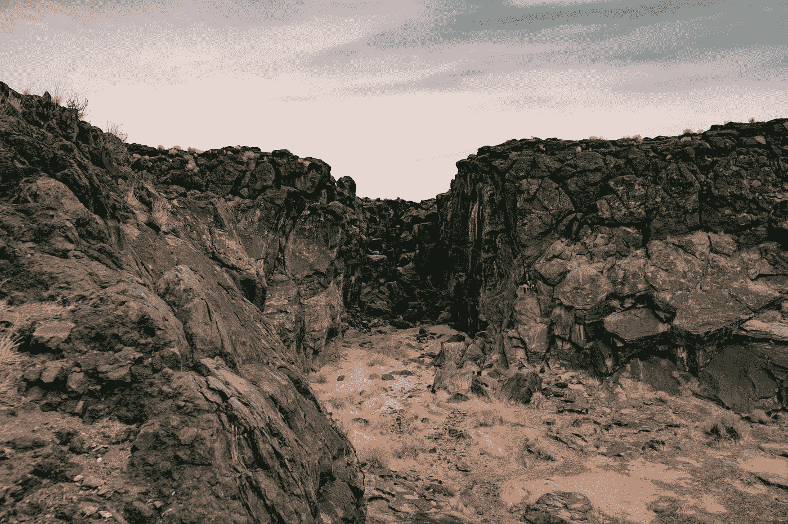

# 石油和煤炭在国际上卷土重来？

> 原文：<https://medium.com/coinmonks/oil-coal-making-an-international-comeback-e478ba44544e?source=collection_archive---------22----------------------->

Photo by [Joshua Gresham](https://unsplash.com/@hammy?utm_source=medium&utm_medium=referral) on [Unsplash](https://unsplash.com?utm_source=medium&utm_medium=referral)

这里有一个让我们开始的事实: [**化石燃料**](https://www.offshore-technology.com/comment/exploration-trends-fossil-fuels-leads-twitter-mentions-in-q1-2022/) 被指定为 2022 年 Q1 探索趋势推特上最热门的术语——被提及 446 次。

让我为你画一幅画。

首先，七国集团宣布对俄罗斯石油设置石油价格上限，该上限于 12 月 5 日生效。随后，欧佩克+宣布 10 月份将石油日产量削减 200 万桶。这一消息是在美国总统拜登访问沙特阿拉伯试图修正美国和沙特阿拉伯之间的战略关系分歧之后发布的。

这只是一个介绍。要继续阅读关于 [**石油和煤炭生产在国际市场**](http://Oil and Coal Production Making a Comeback on International Markets) 上卷土重来的完整故事，请访问并关注出版物 [**地区&生产者**](https://medium.com/areas-producers) 以获取更多关于全球经济核心地区和关键生产者的内容。

 [## 地区和生产商

### 这份出版物通过分析商业新闻、法律案件和与…有关的国际事务，探索了一种范式的转变

medium.com](https://medium.com/areas-producers) 

> 交易新手？尝试[加密交易机器人](/coinmonks/crypto-trading-bot-c2ffce8acb2a)或[复制交易](/coinmonks/top-10-crypto-copy-trading-platforms-for-beginners-d0c37c7d698c)