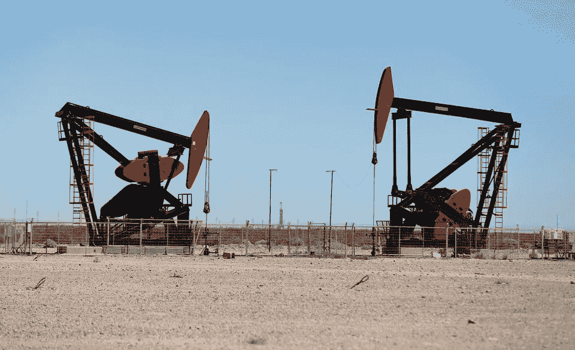

# 石油复苏，黄金承压

> 原文：<https://medium.com/coinmonks/oil-recovers-gold-under-pressure-2c0929ec68d2?source=collection_archive---------23----------------------->

油价在过去一个月下跌了 20%左右后又开始回升，这是对经济衰退担忧加剧的回应。周三的通胀数据无助于问题的解决，因为市场预计美联储很有可能在本月加快步伐，加息 1%。

原油价格进一步下滑，但布拉德和沃勒安慰的话让每个人放心，75 个基点仍然是基础…