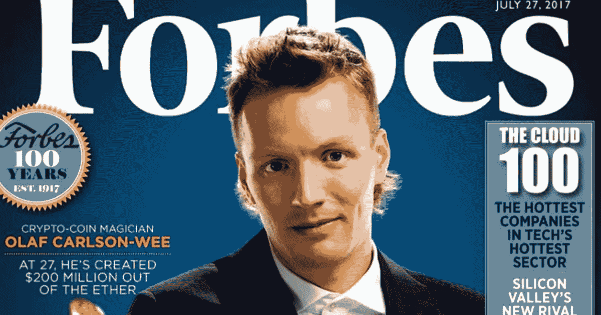

# 奥拉夫·卡尔森·威，《加密金并|比特币的成功故事》

> 原文：<https://medium.com/coinmonks/olaf-carlson-wee-the-crypto-kingpin-bitcoin-success-stories-9e67766ab980?source=collection_archive---------17----------------------->

许多投资者和加密货币交易员都很乐意分享他们如何赚钱并成为百万富翁的成功故事。

数字黄金已经将金融业定位在一个新的维度。其他众所周知的加密货币，如比特币、以太坊、Ripple 和其他货币越来越受欢迎，但尚未充分发挥其潜力和价值。

每次讨论加密货币的时候，比特币从来没有被冷落过。无需使用银行或中介，用户可以使用该支付系统发送和接收资金。最吸引人的功能是能够在数字区块链上注册交易，而无需提供姓名。

在这篇文章中，我将告诉你一个关于加密货币投资者的最激动人心的百万富翁故事，所以让我们开始吧:

# 奥拉夫·卡尔森·威——金并的秘密

明尼苏达大学的大四学生 Olaf Carlson-Wee 为他的论文研究了加密货币的各个方面。他认为在比特币价值 20 至 30 美元的时候，购买比特币是一项明智的投资。

2013 年 2 月，他受雇于比特币公司比特币基地。要求他的公司用加密货币支付他的工资，因为他对加密货币的前景充满信心。凭借直觉，他成为了百万富翁和最成功的加密货币交易商之一。

奥拉夫在离开比特币基地后，于 2016 年创立了加密投资公司 Polychain Capital。Polychain Capital 目前位于旧金山最引人注目的摩天大楼之一。2017 年，该公司声称拥有 10 亿美元的资产和来自红杉资本(Sequoia Capital)、联合广场风险投资(Union Square Ventures)和创始人基金(Founders Fund)等风险投资公司的担保资产。《福布斯》估计奥拉夫·卡尔森的净资产超过 40 亿美元。

现年 33 岁的奥拉夫以其独特的着装风格和对加密货币的热爱而闻名。这位年轻的首席执行官现在经济上有了保障，他在诺卡尔湾有自己的办公室，并自豪地拥有几栋漂亮的房子。

> 我认为比特币是货币和价值转移的更民主版本，因为没有人控制它……我预计互联网的存在时间将比任何民族国家都长，因此在我看来，民族国家支持的货币实际上不如互联网货币安全。

如果你在网上工作，并为你的客户提供专业服务，我建议你要求支付加密费，或者你可以在 [**【币安】**](https://www.binance.com/en/activity/referral/offers/claim?ref=CPA_00M6XWFUN3) 购买一些成功的加密项目来兑换你的钱，记得使用币安奖励(100 USDT)购买更多的加密。感觉以后行情会更高，为什么不从现在开始让自己做好准备呢？

## 结论:

这都是关于奥拉夫·卡尔森·威——加密金并，最好的比特币成功故事之一。如果你喜欢这篇文章，你可以在推特或脸书上分享它。谢谢！

# 🌟[创建一个币安帐户，在 USDT 赢取 100 美元奖金](https://www.binance.com/en/activity/referral/offers/claim?ref=CPA_00M6XWFUN3)🌟

[**Click Her To Access**](https://accounts.binance.com/en/register?ref=26723737)

一旦您在 www.Binance.com**的 [**开立账户，存入 50 多 USDT，然后在 100 USDT 优惠券到期前兑换。(只需按照他们的简单指南激活奖金)**](https://www.binance.com/en/activity/referral/offers/claim?ref=CPA_00M6XWFUN3)**

**你加入我的 [**私人脸书群**](https://web.facebook.com/groups/589559372560620) 了吗？在那里，你会找到合法的方式在网上赚到你的第一美元。**

**请 [**关注并订阅**](/@s.hanz) ，务必分享我的作品作为激励姿态。点击这里查看我所有的文章:[**https://medium.com/@s.hanz**](/@s.hanz)**

# **更多文章:**

**[**埃里克·芬曼，少年百万富翁|比特币成功故事**](/coinmonks/erik-finman-the-teenage-millionaire-bitcoin-success-stories-fe569fa5a477)**

**[**买 Shitcoin 有什么好处吗？**](/coinmonks/is-there-any-benefit-from-buying-shitcoin-412bf88006aa)**

**[**币安赚取:利用低风险产品赚取利息**](/coinmonks/binance-earn-earn-interest-using-less-risk-products-408f6736cea)**

**[**熊市买比特币以外的 5 大加密货币**](/coinmonks/5-great-cryptocurrencies-other-than-bitcoin-to-buy-in-a-bear-market-be3e9945d621)**

**[**2022 年最佳 5 个元宇宙加密币好项目—清单 1**](/@s.hanz/best-5-metaverse-crypto-coins-with-good-projects-in-2022-list-1-687fedbe668e)**

**[***2022 年最好的 5 个元宇宙加密币好项目—清单 2***](/@s.hanz/best-5-metaverse-crypto-coins-with-good-projects-in-2022-list-2-15af2f8f01d9)**

**[**2022 年最值得投资的 7 种元宇宙加密币—榜单三**](/coinmonks/7-best-metaverse-crypto-coins-to-invest-in-2022-list-3-9e077f5c87ab)**

**[**最后的机会—2022 年投资的 6 个最佳元宇宙加密硬币—榜单 4**](/coinmonks/last-chance-6-best-metaverse-crypto-coins-to-invest-in-2022-list-4-2ce3d6c1c922)**

**[**需要钱的时候要做的事情快——新招**](/@s.hanz/things-to-do-when-i-need-money-fast-new-tricks-2b68ad24406b)**

**[**2022 年推广 NFT 项目的 7 种免费方式**](/coinmonks/7-free-ways-to-promote-nft-projects-in-2022-ccefc7f249e7)**

**[**2022 年 7 款最佳赌注硬币**](/@s.hanz/7-best-staking-coins-in-2022-70dbc31adcae)**

> **交易新手？试试[加密交易机器人](/coinmonks/crypto-trading-bot-c2ffce8acb2a)或者[复制交易](/coinmonks/top-10-crypto-copy-trading-platforms-for-beginners-d0c37c7d698c)**