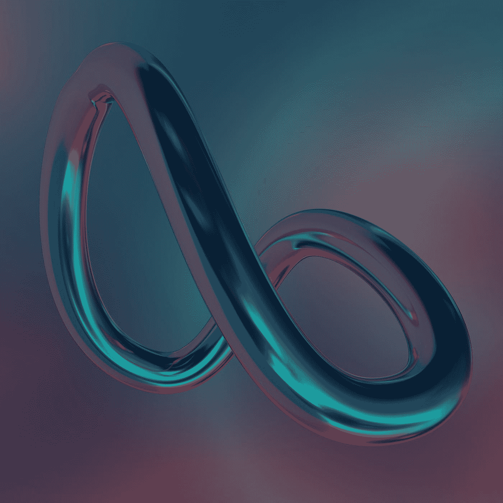
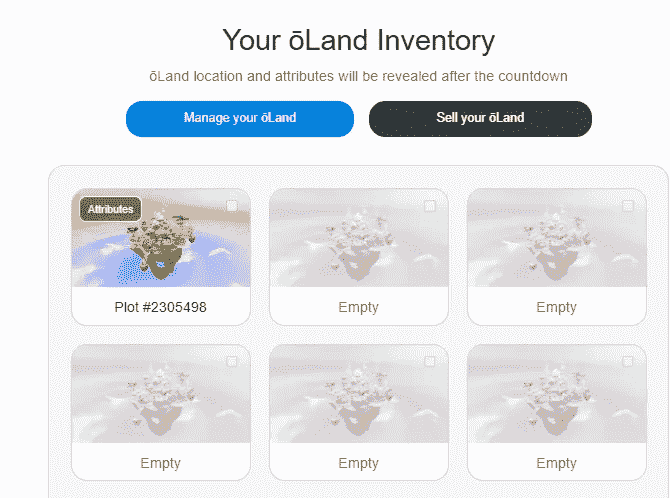

# 奥兰元宇宙:跨线网络

> 原文：<https://medium.com/coinmonks/oland-metaverse-overline-network-4070d65151a5?source=collection_archive---------0----------------------->

自由索赔，赚取加密和贸易

## 什么是[土地](https://overline.network?a=OAimTXJaTEkA)？

一个名为“[土地](https://overline.network?a=OAimTXJaTEkA)的 NFT 代表了 Overline 无线元宇宙内的数字房地产和 1.67 英亩的实际土地。

Photo by [Steve Johnson](https://unsplash.com/@steve_j?utm_source=medium&utm_medium=referral) on [Unsplash](https://unsplash.com?utm_source=medium&utm_medium=referral)

## 如何免费认领[奥兰](https://overline.network?a=OAimTXJaTEkA)？

直到铸造日期，奥兰是免费赠送[奥兰和](https://overline.network?a=OAimTXJaTEkA)情节 NFT。他们正在为人们建设无线网络。只需输入您的电子邮件地址，就大功告成了！

## 我的房产在哪里？

当你的土地帐户入口的显示倒计时结束时，土地位置将被随机分配。密切关注它，因为你可能会走运！

## 什么是[上划线](https://overline.network?a=OAimTXJaTEkA)？

Overline 是一个由人民拥有的分散式无线网络，它将为电信业做比特币为银行业做的事情。

## 我的地块会产生多少加密货币？

这是由你的土地位置决定的。你的地块上的无线活动越多，它将获得越多的采矿奖励。地块奖励，就像跨线生态系统中的其他东西一样，可以通过徽章来提升(EMB)。

## 我有可能拥有多块土地吗？

是啊！你可以拥有几块土地。登录你的[土地账户门户](https://overline.network?a=OAimTXJaTEkA)，复制你的推荐链接，分享给你的朋友，获取更多。每个报名的人都会得到另一片土地。Overline Network 将增加获得土地的新方法，因此请随时查看您的帐户门户更新。

## 我还能拿土地做什么？

将[和](https://overline.network?a=OAimTXJaTEkA)视为一种新型账户。取代单调的用户门户，Land 将提供一个有趣的图形界面，用户可以四处走动，探索他们的帐户。用户还可以向他们土地上的人发送消息，在区块链网络之间传送他们的 NFT，存储物品，跟踪他们的加密奖励，等等。

> 交易新手？尝试[加密交易机器人](/coinmonks/crypto-trading-bot-c2ffce8acb2a)或[复制交易](/coinmonks/top-10-crypto-copy-trading-platforms-for-beginners-d0c37c7d698c)