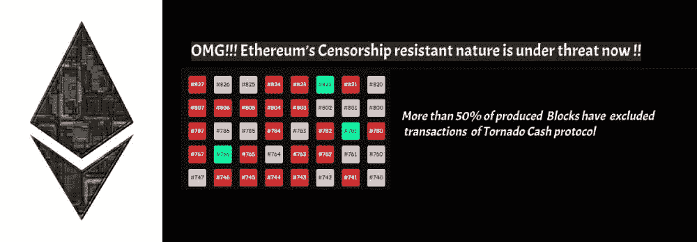
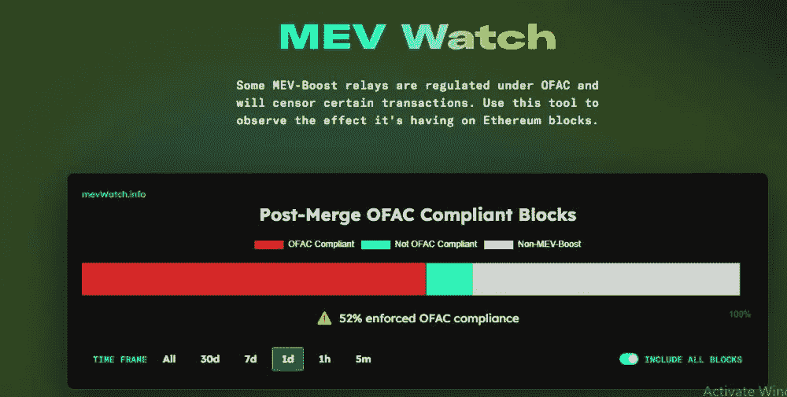
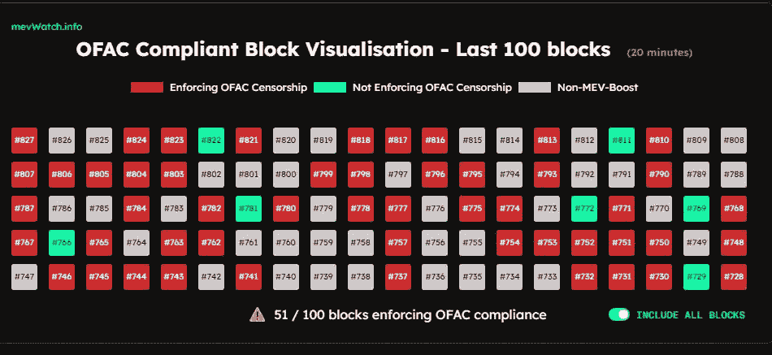
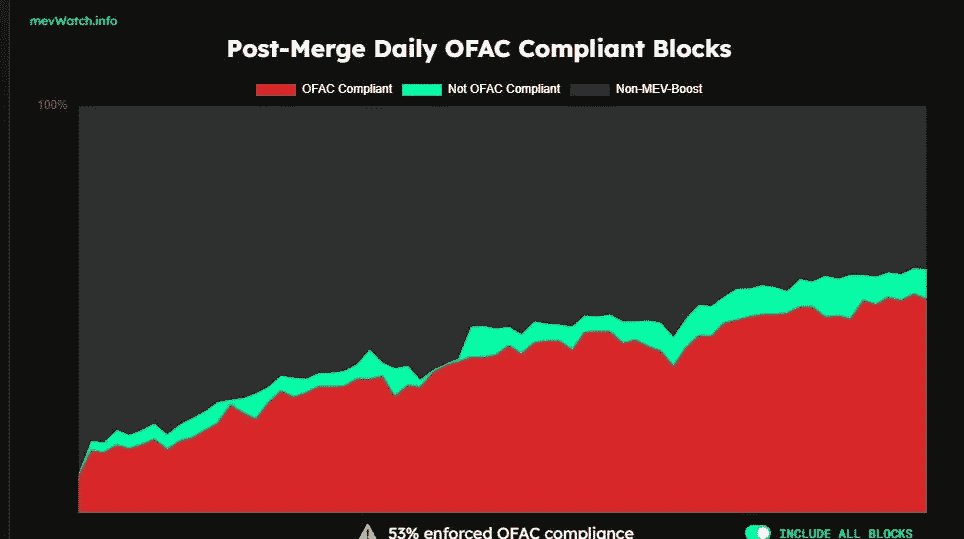

# OMG！！！以太坊抵制审查的本性现在受到了威胁！！

> 原文：<https://medium.com/coinmonks/omg-ethereums-censorship-resistant-nature-is-under-threat-now-577184d334a8?source=collection_archive---------24----------------------->

# 以太坊区块链的审查阻力现在受到某些 MEV-boost 继电器(尤其是 Flashbots)的威胁

***以太坊的基础层是*** [***早已审查俯***](https://cryptobriefing.com/is-ethereum-under-attack-unpacking-the-mev-boost-censorship-controversy/) ***这并不是因为大验证者持有 ETH 多数股权，而是因为*** [***OFAC 投诉 MEV-boost 继电器***](https://cryptobriefing.com/51-of-ethereum-blocks-can-now-be-censored-its-time-for-flashbots-to-shut-down) ***拒绝龙卷风现金关联交易被纳入以太坊区块。***

许多以太坊验证器使用 MEV-boost 中继服务，其中一个块内的交易被重新安排，以挤出最大利润。

MEV-boost 中继提供了[链外积木搭建市场](https://cryptobriefing.com/51-of-ethereum-blocks-can-now-be-censored-its-time-for-flashbots-to-shut-down)，以太坊积木是通过以最有利可图的顺序重新安排积木内的交易来创建的，这样验证器就可以从积木中提取最大价值。

# 超过 50%的以太坊产品已经审查了龙卷风现金交易

现在，根据来自 MEV watch 的数据，至少 59%的以太坊块是使用 MEV-boost 中继服务创建的，而仍然有 40%的块是在没有使用 MEV-boost 中继服务的情况下创建的。

***这里的问题是，在使用 MEV-boost 中继服务创建的这 59%的以太坊块中，大多数块(52%)是 OFAC 兼容的，由 OFAC 兼容的 MEV-Boost 中继(如 Flashbots)生产。***

[*MEV Watch*](https://www.mevwatch.info/) *More than 50% of Blocks have enforced OFAC compliance*

***这意味着由符合 OFAC 标准的 MEV-boost 继电器生产的符合 OFAC 标准的数据块中，有 52%故意不包括任何与 Tornado Cash 协议相关的交易。***

# 以太坊验证者在他们不知情的情况下审查了龙卷风现金交易

自从以太坊股权证明区块链开始运作以来，越来越多的验证者开始转向使用 MEV-boost 继电器的服务，因为他们发现这更有利可图。

[Flashbots](https://cryptobriefing.com/51-of-ethereum-blocks-can-now-be-censored-its-time-for-flashbots-to-shut-down/) 是使用最广泛的 MEV-boost 中继，它拒绝 Tornado 现金交易，并且不将它们包括在块中，因为它是符合 [OFAC 的 MEV-Boost 中继](https://cryptobriefing.com/51-of-ethereum-blocks-can-now-be-censored-its-time-for-flashbots-to-shut-down/)。

[MEW Watch](https://www.mevwatch.info/) More than half of the Blocks produced in the Ethereum Network have provably had transactions of Tornado Cash censored

***这令人担忧，如此多的以太坊验证者在他们不知情的情况下，通过使用符合 OFAC 标准的 MEV-Boost 继电器(如 Flashbots)的服务，审查与 Tornado 现金交易相关的以太坊交易……哎哟！！***

# 任何政府都没有指示大宗商品生产商审查交易…

问题是，外国资产控制办公室(OFAC)可能已经将 Tornado Cash 列入其制裁名单，但它没有指示大宗商品生产商制裁 Tornado Cash 交易。

***事实上，币安和比特币基地的验证器都是*** [***验证 Tornado 现金交易***](https://cryptobriefing.com/51-of-ethereum-blocks-can-now-be-censored-its-time-for-flashbots-to-shut-down/) ***，那么为什么 Flashbots 抵制 Tornado 现金交易，不把它们包含在它们为验证器创建的块中呢？..***

嗯嗯…

# 以太坊区块链整体上并没有完全审查龙卷风现金交易

***现在，让我们高兴的是，那些 Tornado 现金交易虽然被 Flashbots 和其他所谓的 OFAC 兼容 MEV-Boost 继电器抵制，但仍然被使用非 OFAC 投诉人 MEV Boost 继电器服务的验证器和不使用 MEV Boost 继电器服务的构建模块的验证器选中。***

然而，如果验证器开始使用像 Flashbots 这样的 MEV-Boost 中继服务，这种情况可能会改变。

此外，52%的区块已使用 OFAC 投诉中继服务进行处理，该服务将拒绝任何与 Tornado 现金相关的交易。百分比很大。这是以太坊区块链免疫审查阻力的威胁！！

[MEW Watch](https://www.mevwatch.info/)

# 削减机制可以阻止 MEV-boost 中继谴责事务

嗯，以太坊社区正在研究如何解决 OFAC MEV-boost 继电器的问题。已经讨论过的一个可能的解决方案是为试图谴责任何以太坊交易的 MEV 升压继电器建立一个[削减机制，就像它在那里用于验证器一样。](https://cryptobriefing.com/is-ethereum-under-attack-unpacking-the-mev-boost-censorship-controversy/)

然而，看起来 Flashbots 目前没有公开实现这样的机制，因为他们可能不共享以太坊和加密社区的价值，以满足以太坊区块链抵抗审查的需要。

事实上，Flashbots 的联合创始人夏羽·戈塞林似乎公开讨论[对 Flashbots 实施削减机制](https://cryptobriefing.com/is-ethereum-under-attack-unpacking-the-mev-boost-censorship-controversy/)，[由于与团队](https://cryptobriefing.com/51-of-ethereum-blocks-can-now-be-censored-its-time-for-flashbots-to-shut-down/)的分歧而离开公司，尽管他尚未透露是什么分歧使他离开 Flashbots。

耸耸肩…

# 以太坊社区被 Flashbots 吓呆了，因为它使得以太坊区块链容易受到审查

希望以太坊区块链有足够比例的验证者关心以太坊区块链的审查抵抗性质，并且不使用符合 OFAC 标准的 MEV boost 继电器的服务，尽管不幸的是，似乎验证者使用 Flashbots 的服务非常有利可图。

因此，以太坊社区有望找到解决方案来克服这个符合 OFAC 标准的 MEV boost 中继问题，但许多来自加密社区的人对 Flashbots 非常愤怒，他们希望 flash bots 停止运营，因为他们的服务威胁到了以太坊区块链的完整性

像 Flashbots 这样的 MEV boost 继电器通过取消 MEV 投标链而减少了以太坊区块链上的燃气费[,但他们的服务对于以太坊区块链的维持并不重要。](https://cryptobriefing.com/51-of-ethereum-blocks-can-now-be-censored-its-time-for-flashbots-to-shut-down/)

让我们希望以太坊社区能够解决这个紧迫的问题！！

***感谢阅读！！***

> 交易新手？试试[加密交易机器人](/coinmonks/crypto-trading-bot-c2ffce8acb2a)或者[复制交易](/coinmonks/top-10-crypto-copy-trading-platforms-for-beginners-d0c37c7d698c)