# OMNI 攻击分析

> 原文：<https://medium.com/coinmonks/omni-attack-analysis-ddff7078df72?source=collection_archive---------12----------------------->

## 0x01 背景预览

Omni 是一个创建和交易定制数字资产和货币的平台。它是一个软件层，建立在最流行、最受审核、最安全的区块链——比特币之上。Omni transactions 是在比特币区块链上启用下一代功能的比特币交易。我们的参考实现 Omni Core 是一个增强的比特币核心，提供比特币的所有功能以及高级 Omni 层功能。

## 0x02 攻击信息

**攻击钱包地址**:

0x 00000000 c 251 faf 2de 8217 ab 64 accd 0070 b 97e 47

0x 627 a 22 ff 70 CB 84 e 74 c 9 c 70 e 2d 5b 0 b 75 af 5a 1 dcb 9

## 攻击合同地址

0 x3c 10 e 78343 c 475 b 99d 20 fa 544 DD 30 b 43 c 0 CBA 26 f

0x1c 244 c 94090390 f 885d 472 b 83 df 267 f 083 c 72 faf

## 攻击交易

0x 264 e 16 f 4862d 182 a 6a 0b 74977 df 28 a 85747 b 6 f 237 b5 e 229 c 9 a5 bbacdf 499 cc b 4

## 受到攻击的合同。

0x 50 c7a 557d 408 a5 F5 a 7 fdbe 1091831728 AE 7 EBA 45

## 0x03 攻击步骤

1.  攻击者 flashloan 1000 WETH 从平衡器到

0 x3c 10 e 78343 c 475 b 99d 20 fa 544 DD 30 b 43 c 0 CBA 26

2.攻击者使用 flashloan 功能借了 20 个涂鸦，并使用 13 个涂鸦通过 sushiswap 交换 1 个涂鸦

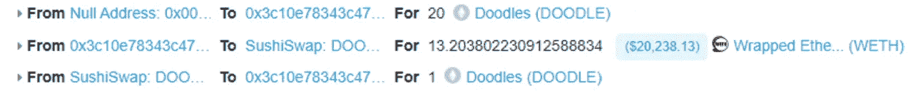

3.调用 supplyERC721 方法来下注三个 NFT 并借出 12.15 WETH

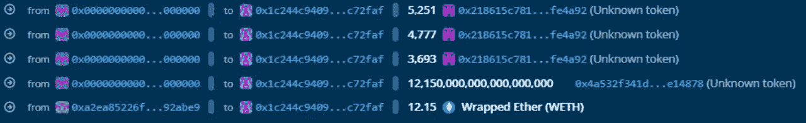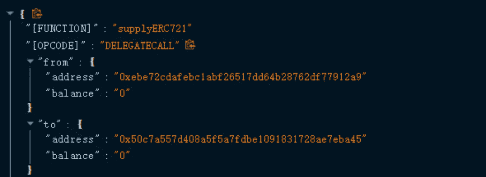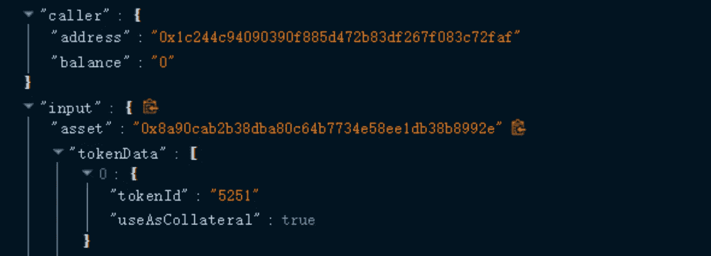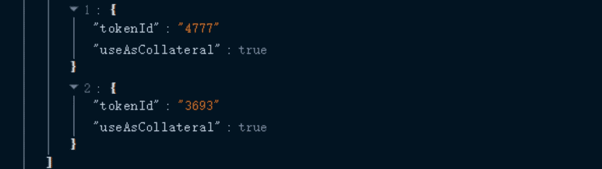

4.干掉两个 NFT

5.归还借出的 12.15 WTH 和**调用**剩余一个 NFT 的清算方法

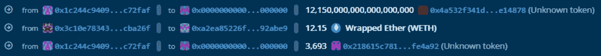

6.继续重入攻击，在清算过程中调用 ERC721_checkOnERC721Received 函数来下注 20 张涂鸦并借出 81 张 wet

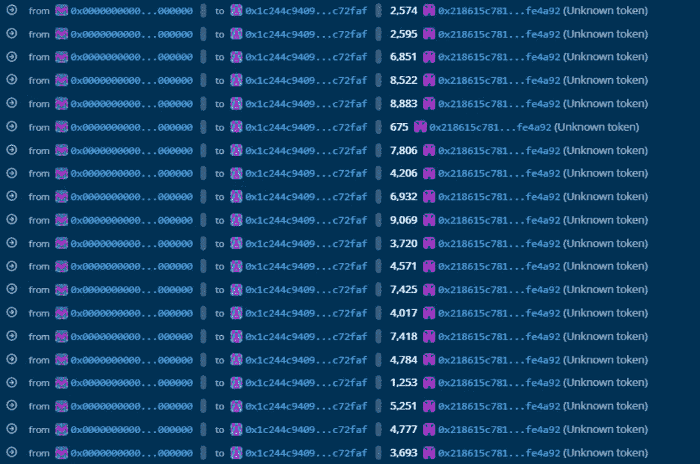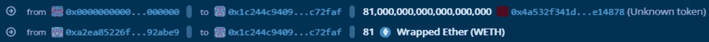

7 .取出 20 个 NFT，由于清算函数的返回值将被设置为 false 状态，所以在取出函数中由于借贷状态错误，20 个 NFT 可以被成功取出

8.由于在执行清算时首先移除 NFT，然后扣除归还的钱，攻击者通过移除 NFT 进行重新进入，并在重新进入后继续进行判断，此时状态已经改变，先前借出的 12.15 WETH 不需要归还，因此攻击者最终将得到 93.15 WETH

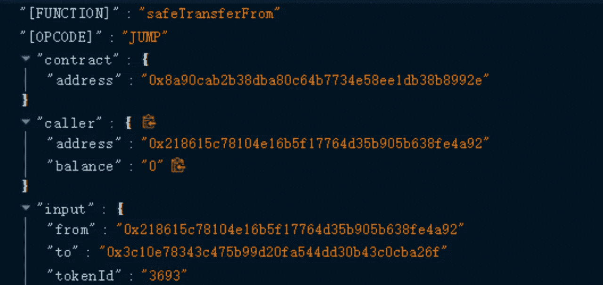

9.返还调用闪贷获得的 20 个涂鸦，返还闪贷获得的 1000 个 wet

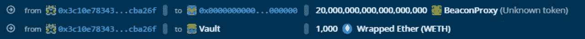

## 0x04 漏洞核心

攻击者通过调用 LiquidationLogic.sol 中的清算方法 executeERC721LiquidationCall 来实现这一点

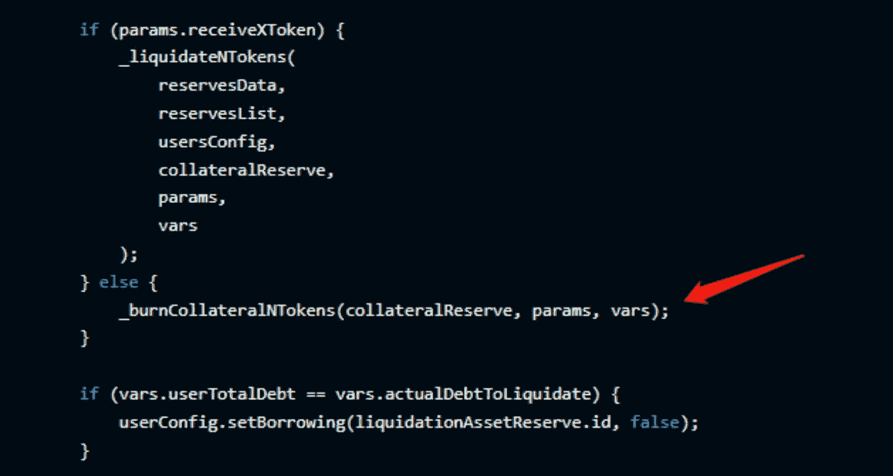

当调用**_ burncolateraltokens**方法时，burn 函数调用 ERC721 中的 **_checkOnERC721** Received 方法

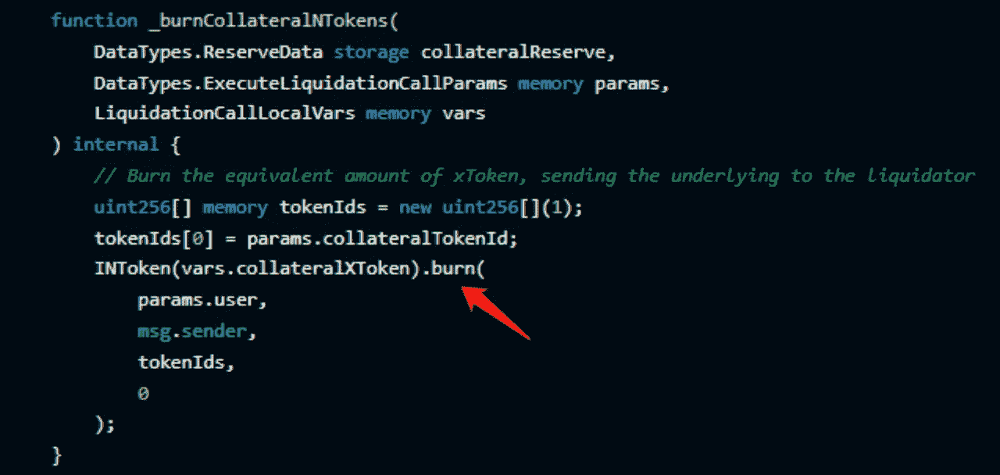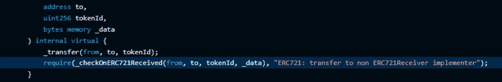

此时， ***到*** 地址就是攻击契约的地址，攻击者在这里实施重入攻击。继续押 20 涂鸦求借。

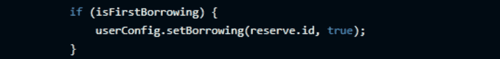

ID 状态被标记为真，并且清算功能在继续执行清算功能时将真覆盖为假。isBorrowAny()然后确定 ID 状态，这是假的，并成功地删除了 staked 涂鸦。

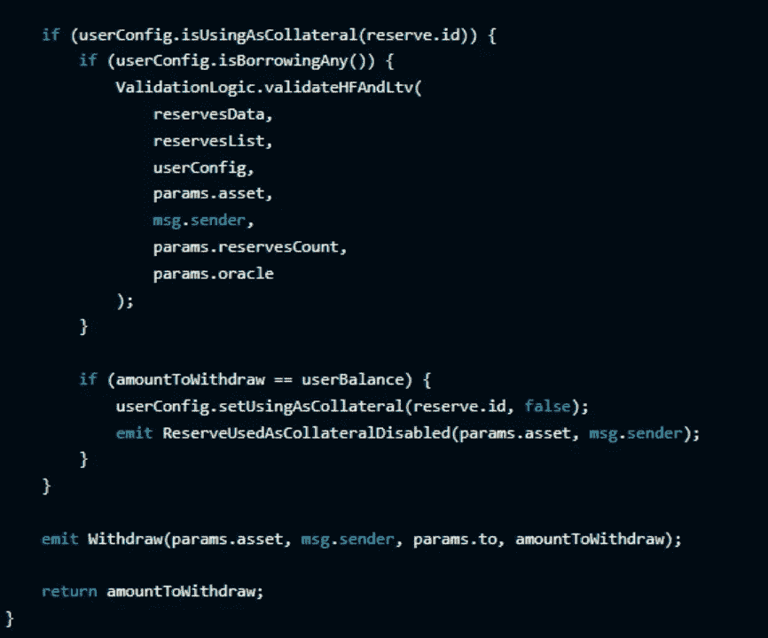

## 0x05 资金流

这两个攻击钱包地址已经向 Tornado 转移了 800 ETH 和 426.5 ETH 的捕获资金。现金

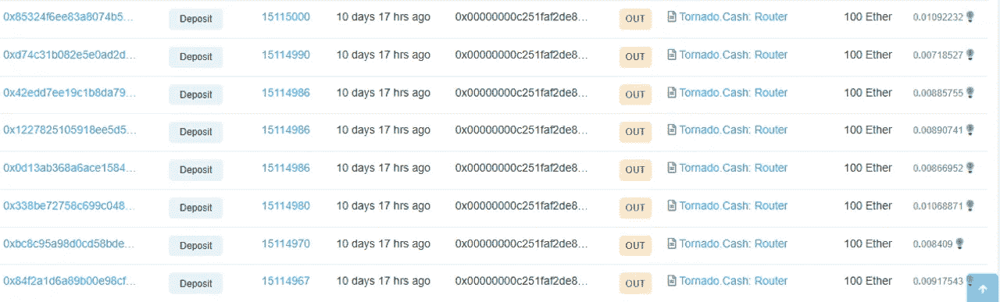

## 0x06 摘要和建议

攻击的核心是项目契约的访问控制存在缺陷，没有限制池契约中质押物的重入，允许攻击者恶意调用 ERC721 中的 _checkOnERC721Received 函数进行重入攻击，以及在 setBorrowing()方法之前没有设置状态判断操作。

> 交易新手？试试[加密交易机器人](/coinmonks/crypto-trading-bot-c2ffce8acb2a)或者[复制交易](/coinmonks/top-10-crypto-copy-trading-platforms-for-beginners-d0c37c7d698c)