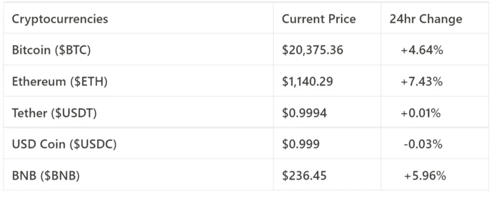
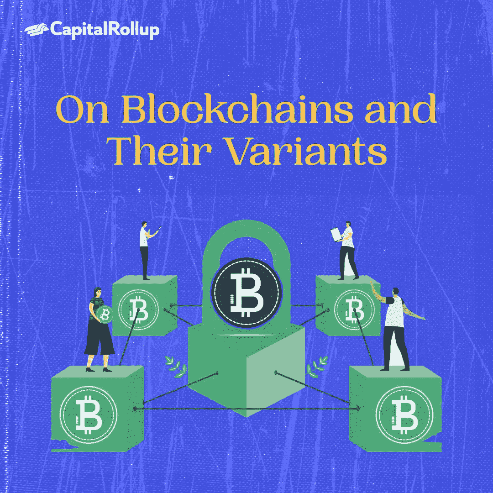
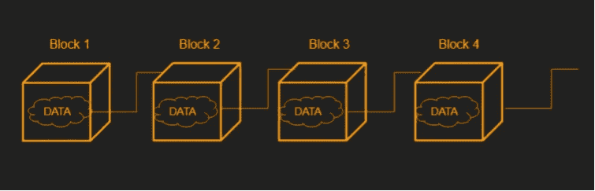
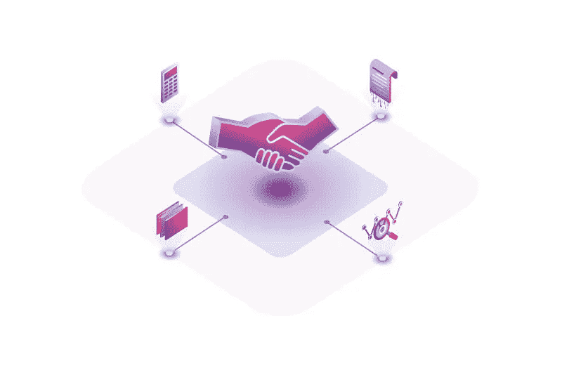

# 论区块链及其变体。

> 原文：<https://medium.com/coinmonks/on-blockchains-and-their-variants-aba452dc0851?source=collection_archive---------53----------------------->

欢迎来到最新一期的 CapitalRollup Digest！今天的文摘是 7 月 14 日的，大约需要 5 分钟。我们马上开始。

*   今天的市场看起来怎么样？(前 5/10 大流行加密货币)

Price Market Update

# 论区块链及其变体。

如果你曾经参与过任何加密活动，或者刚刚开始你的加密之旅，你可能听说过区块链这个术语，它通常被简单地描述为加密货币的数据库。

如果我们更进一步，你可能知道或听说过以太坊区块链，索拉纳区块链，多边形区块链，宇宙区块链等等，但是你知道它们是如何存在的吗？

由于其独特的特点，上述这些区块链是建立在四个主要的区块链类别之上的。在今天的话题中，我们将试图解释这四种不同的区块链以及它们存在的原因。

## **什么是区块链？**

根据维基百科，一个**区块链**是一个不断增长的记录列表，称为*块*，它们使用加密技术安全地链接在一起。每个块包含前一个块的算法、时间戳和事务数据。时间戳证明事务数据在块被发布以进入它的散列时存在。

区块链是在计算机网络中共享的分布式数据库或分类帐。区块链的目标是允许数字信息被记录和分发，但不能被编辑。这样，区块链就是不可变分类账的基础，也就是不能被修改、删除或销毁的交易记录的基础。

这仅仅意味着区块链的所有权很容易被追踪，任何人都不能以非法的方式更改。

*   这是文章的第二部分，我们在这里介绍主要话题。

我们有多少种区块链？

有 4 个主要的区块链构成了区块链加密货币的主干。

今天，我们有:

*   公共
*   私人的
*   混合物
*   财团

# 1.公共区块链

有时被称为开放或“无许可”区块链，它允许任何人加入网络并建立连接而不受限制。这些区块链需要使用加密和工作证明(PoW)等共识机制来保护，因为它们非常开放。公共区块链的例子是以太坊和比特币区块链。

**有什么优点？**

*   透明度
*   独立性ˌ自立性
*   信任

**有什么坏处？**

*   安全
*   表演
*   可量测性

# 2.二等兵区块链

另一方面，一个私人的或“许可的”区块链需要每个节点在加入前接受审查。安全层不需要那么厚，因为节点被认为是可信的。

私有和公共区块链都有缺点-公共区块链通常比私有区块链需要更长的时间来验证新数据，而私有区块链更容易受到欺诈和不道德行为者的影响。为了解决这些缺点，开发了联合体和混合区块链。

**有什么优势？**

*   表演
*   访问控制

**有什么缺点？**

*   可审计性
*   信任

# 3.区块链财团

区块链财团被允许由一组组织管理区块链，而不是像私人区块链那样由一个实体管理。因此，财团区块链比私人区块链享有更多的权力下放，从而导致更高的安全水平。

**有什么优势？**

*   安全性
*   访问控制
*   可量测性

**有哪些缺点？**

*   透明度

# 4.混合区块链

混合区块链是由单个组织控制的区块链，但是具有由公共区块链执行的监督级别，这是执行某些交易验证所必需的

**有什么优点？**

*   表演
*   访问控制
*   可量测性

**有什么坏处？**

*   升级
*   透明度

我知道你们中的一些人可能想知道为什么像透明度这样积极的属性会是一个缺点，原因如下:

我知道你们中的一些人可能想知道为什么像透明、信任和安全这样的属性对使用这些区块链是不利的，原因如下:公共区块链比所有其他 3 个都不安全，因为它们同时由多个来源控制，这意味着任何人都可以加入网络并造成破坏。就私营区块链而言，它的一个缺点是人们大多不信任它们，因为它看起来很集中，因为它们由私营公司控制。

对于财团和混合区块链，人们使用它的一个主要问题是透明度，因为私人公司/个人有更大的控制权。

正如我们所看到的，所有四个区块链都有其不同的优势和劣势，这是由它们的结构造成的。

除了加密货币，区块链还有许多其他的使用案例，这些案例现在已经存在，并且在未来将会继续增长。区块链平台是一个允许开发者和用户为现有的区块链基础设施创造创新用途的平台。

Corda 的区块链平台非常适合用于医疗保健、数字资产、政府、数字身份、保险和资本市场。MultiChain 被视为市场上对开发者最友好的平台之一。它允许简单的区块链定制，是流数据的理想选择。

Tron 是基于操作系统技术的区块链平台。这是增长最快的区块链平台之一。对于创作内容的人来说尤其理想。

> 交易新手？试试[加密交易机器人](/coinmonks/crypto-trading-bot-c2ffce8acb2a)或者[复制交易](/coinmonks/top-10-crypto-copy-trading-platforms-for-beginners-d0c37c7d698c)

# 琐事🤔

**区块链的区块由什么组成？**

A.事务数据

B.散列点

C.时间戳

D.以上都有。

在下一期的 CapitalRollup Digest 中找到答案。😉

# 每日一词！

💡**加密**

这是一种允许用户保护数据交换的技术，并且在使用数据的过程中更加安全。

**句子中使用的术语:**
*—预防措施包括使用各种加密方法对数据进行* ***加密*** *。*

# **社区更新📢**

我们与 3 位行业领袖组织了一次 Twitter 空间会议，我们在会上讨论了“分享您的熊市经验& CeDeFi 内爆”，您可以在这里[收听](https://twitter.com/i/spaces/1YpKkZzakbNxj?s=20)

# 我们今天在读什么📰

**区块链技术的优缺点。** [***阅读更多***](https://data-flair.training/blogs/advantages-and-disadvantages-of-blockchain/)

**什么是区块链？。** [***阅读更多***](https://www.investopedia.com/terms/b/blockchain.asp)

# **与朋友一起学习和投资加密💰**

当您邀请您的朋友开始使用 CapitalRollup 进行有利可图的投资时，您将获得独特的奖励。

💬对 CapitalRollup Digest 有什么反馈吗？ [**告诉我们！**](mailto:hi@capitalrollup.com)

> 加入 Coinmonks [电报频道](https://t.me/coincodecap)和 [Youtube 频道](https://www.youtube.com/c/coinmonks/videos)了解加密交易和投资

# 另外，阅读

*   [麻雀交换评论](https://coincodecap.com/sparrow-exchange-review) | [纳什交换评论](https://coincodecap.com/nash-exchange-review)
*   [美国最佳加密交易机器人](https://coincodecap.com/crypto-trading-bots-in-the-us) | [经常性回顾](https://coincodecap.com/changelly-review)
*   [在印度利用加密套利赚取被动收入](https://coincodecap.com/crypto-arbitrage-in-india)
*   [Godex.io 审核](/coinmonks/godex-io-review-7366086519fb) | [邀请审核](/coinmonks/invity-review-70f3030c0502) | [BitForex 审核](https://coincodecap.com/bitforex-review)
*   [5 款最佳免费加密货币制图工具](https://coincodecap.com/crypto-charting-tools)