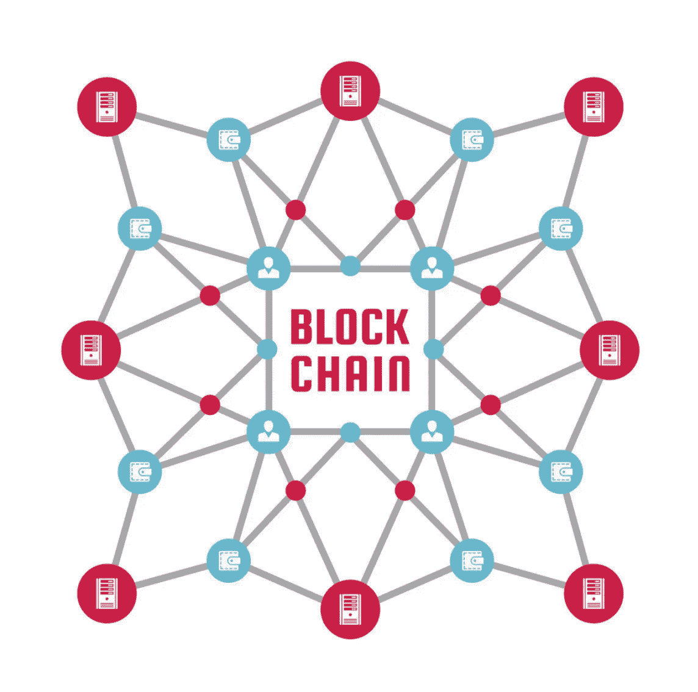

# 简单解释了链上区块链存储

> 原文：<https://medium.com/coinmonks/on-chain-blockchain-storage-explained-simply-d3c577f7ae01?source=collection_archive---------1----------------------->

在我之前写的一篇关于链上区块链存储的文章中，我被要求用更简单的术语解释它。回过头来看，我同意这是一篇技术文章，所以在这篇文章中，我打算把它分解开来，用不那么技术化的语言解释一些不同的存储技术，以帮助概念化正在发生的事情！

## 我们存储了哪些数据？

有许多不同类型的数据存储在区块链上，但在本文中，我们将重点关注 NFTs 的 tokenURI。tokenURI 保存特定于每个 NFT 的数据，例如图像、它所属的集合、描述以及可能描述 NFT 的任何其他属性。tokenURI 被格式化为 json ，这是一种广泛使用的组织数据的方法。

```
{
  "name": "Alex",
  "occupation": "student",
  "age": 22,
  "hobbies": ["music", "writing", "running", "photography"]
}
```

这个例子展示了如何在 JSON 结构中组织数据。如果你以前用 Python 编程过，它本质上和[字典](https://www.w3schools.com/python/python_dictionaries.asp)的结构是一样的。我们可以看到有不同的字段，每个字段都可以填充一个字符串(文本)、整数(数字)或列表(多个字符串)。例如，如果我们问 JSON】字段存储了什么，它会告诉我们`"student"`。

## TokenURI

现在我们已经了解了 JSON 结构的基础，我们可以看看一个来自基于文本的 NFT 项目的示例 tokenURI，该项目名为[编写为](http://inwriting.io)。

```
{
 "name": "In Writing #0",
 "string": "SGVsbG8sIFdvcmxkIQ==",
 "external_url": "https://inwriting.io/text/?tokenID=0",
 "description": "In Writing is the first text NFT collection that allows for 100% on-chain storage of any unique string of characters! Mint your own strings at inwriting.io",
 "tokenId": "0",
 "image_data": "https://inwritingapi.com/inwriting_polygon/get_svg.php?tokenID=0"
}
```

从 JSON 中，我们可以快速收集它的名称(写为#0)、tokenId (0)和 NFT 的描述。`"external_url"`带你到项目的[网站，向你展示 NFT，`"image_data"`是 NFT](https://inwriting.io/text/?tokenID=0) 图片[的链接。什么是`"string"`领域？](https://inwritingapi.com/inwriting_polygon/get_svg.php?tokenID=0)

In Writing 是一个基于文本的 NFT 项目，所以他们将 NFT 的文本(这些 NFT 的所有值都来自这里)存储在字符串字段中。虽然这没什么意义，但为什么有人会把这根弦变成 NFT 呢？实际上，它是使用 base64 加密的文本`"Hello, World!"`。在这里查看！对文本进行 base64 编码有很多原因，但最大的原因是为了不让字符串中的`"`搞乱 JSON 结构！

## 链上存储

回到本文的主题，让我们检查每个字段并决定 tokenURI 的哪些字段在链上，哪些在链外。

## 在链条上

*   `"name": "In Writing #0"`
*   `"string": "SGVsbG8sIFdvcmxkIQ=="`
*   `"description": "In Writing is the first text NFT collection that allows for 100% on-chain storage of any unique string of characters! Mint your own strings at inwriting.io"`
*   `"tokenId": "0"`

所有这些字段都在链上，因为它们是直接从 tokenURI 中的区块链给你的。你不必去任何其他网站获取你想要的信息，它们都在那里。

## 离链

*   `"external_url": "https://inwriting.io/text/?tokenID=0"`
*   `"image_data”: "https://inwritingapi.com/inwriting_polygon/get_svg.php?tokenID=0"`

这些领域是外链，因为你必须导航到一个网站(不是由区块链主办)才能得到你想要的数据。

## 链上存储和链下存储的优缺点

作为一个 NFT 项目的投资者，你希望你的 NFT 的价值储存在链条上。当一些东西被存储在 chain 上，这意味着它将永远存在，而不必指望有人的网站被维护！这意味着你的 NFT 不会因为一个网站关闭或完全离线而失去所有价值。

如果链上存储更好，那么为什么不把所有东西都存储在链上呢？在一个理想的世界里，所有的东西都存储在链上，但是不幸的是，链上存储非常昂贵。例如，图像非常大，存储在链上要花费数百甚至数千美元。另一方面，文本不是很大，可以廉价地存储在链上。

回头看看 In Writing 的 tokenURI 的例子，他们为什么要存储 NFT off 链的图像呢？形象不是有价值的部分吗？？在大多数情况下，图片*是*NFT 有价值的部分；然而，In Writing 是一个基于 NFT 市场的 ***文本*** ，这意味着他们的 NFTs 有价值的部分是文本本身，而不是文本的图像。因此，In Writing 的 NFT 中有价值的部分存储在链上的`"string"`字段中。

## 结论

既然您已经理解了链上存储的含义，那么您现在在加密货币领域就更加博学了！了解链上存储的价值有助于您进行投资、创建自己的项目，甚至在餐桌上深入谈论区块链技术。我希望这篇文章是对链上存储主题的一个很好的介绍，如果您有任何问题，欢迎评论！



On-Chain Blockchain Storage Explained Simply