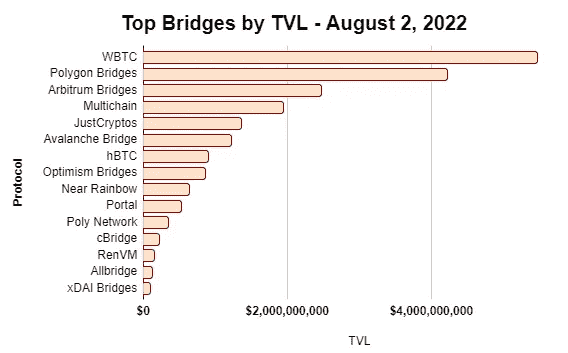
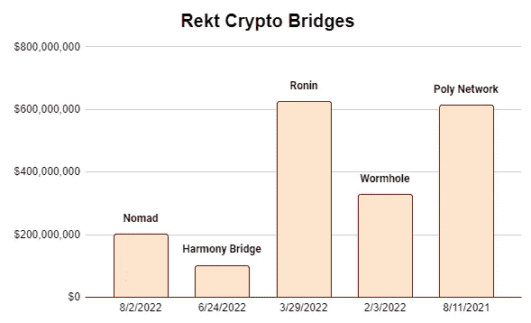
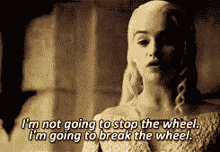

# 在加密桥上

> 原文：<https://medium.com/coinmonks/on-crypto-bridges-c57d7a33d194?source=collection_archive---------31----------------------->

链上中间商的困境。

免责声明，NFA，所有这些法律的东西:本出版物及其附属机构上呈现的所有信息严格地仅用于教育目的。它不应被解释或视为财务、法律、投资或任何其他形式的建议。

嗨，伙计们，

这是又一个糟糕的一天，感觉就像一天比一天糟糕的熊市。Nomad bridge 被利用，Solana 生态系统中正在发生未知的漏洞利用。如果你在索拉纳生态系统中有资金，请尽快将它们转移到冷库或声誉良好的交易所。希望你们中没有人会因此受到实质性的影响。这里有一个很好的思路来跟上形势。

很抱歉迟发，今天真是疯狂的一天。

 [## 马可·马诺波沉思的实用主义

### 秘密，商业和生活的思考--实质胜于炒作。点击阅读马可·马诺波的《沉思的实用主义》

pensivepragmatism.substack.com](https://pensivepragmatism.substack.com/) 

# 在加密桥上

在区块链网络间转移加密资产非常困难。随着加密资产和区块链产业的成熟，世界无疑将**变成多链**，各种区块链网络将针对特定需求和用例进行优化。然而，这也增加了资产所有者在跨不同网络移动资产时所承担的风险。仅在过去的一年里，超过 10 亿美元的被各种各样的加密桥利用——昨天，我们见证了另一个 2 亿美元的被利用在一个叫做 Nomad 的桥上。

最初的黑客能够识别出 Nomad 团队将零哈希(0x00)标记为有效根，从而使攻击者能够伪造消息。现在，我不会假装是 Giga Chad 安全专家，所以这里有一个来自真实 Giga Chad 的关于黑客的线索:

特别是，这种黑客的独特之处在于，它不需要深入的技术知识，这导致了这一事件成为第一次分散的群体抢劫，几乎任何对区块链交易如何运作有所了解的人都可以参与利用。只需复制粘贴原始攻击者的事务调用数据，瞧！

在这一点上，似乎几乎所有现有的加密桥都被以这样或那样的方式利用了。一些人由于救助而幸存下来，而另一些人再也没有真正回到他们以前的辉煌。我不会假装是一个神秘的超级程序员或网络安全专家，有比我更聪明的人可以解释加密桥的技术复杂性——我只是在这里武断地阐述桥如何工作，它们的重要性和缺点，并随着加密资产的成熟，提出我对它们未来动态的想法。我只是一个卑微的研究员和战略家。

**以下是快速外卖:**

*   TVL 跨越加密桥梁的金额超过 200 亿美元。
*   在过去的一年中，超过 18 亿美元的资金通过 5 个加密桥被利用。
*   维塔利克对多链未来而非跨链未来的愿景很可能是正确的。
*   对加密桥的救助为该行业树立了一个坏的先例。
*   机构投资者最有可能青睐可信而非不可信的加密桥。

## 桥梁是如何工作的？

从字面上看，就像这个词本身的意思一样，桥在多个区块链网络之间“桥接”加密资产。这一趋势可以说始于 2020 年初，当时多个 L1 生态系统正在发展并争夺市场份额，邀请人们来到他们的地盘，尝试他们提供的东西；虽然有些如 WBTC 早就存在了。

这些桥通常通过将令牌包装在智能合约中以在另一个链上发行它们来工作，同时确保用户其包装的令牌始终可以一对一地兑换到本机资产。我们来看一个具体的例子。

在包装比特币(WBTC)的情况下，这是最受欢迎的桥接资产之一，桥接的性质是**集中和保管**。用户从比特币区块链中存入 BTC，并在区块链以太坊获得 ERC-20 代币 WBTC。BitGo 是 WBTC 的托管人，与 BitGo 一起经历一个 KYC 过程对于管理和赎回 WBTC 是必要的。此外，还有一组合伙人持有所有存放和铸造的 BTC 的多重签名钥匙。在这种情况下，用户可以在链上[验证 1:1 支持](https://wbtc.network/dashboard/audit)。

**分类桥梁**

一般来说，网桥可以[分为](https://ethereum.org/en/bridges/)可信网桥和不可信网桥。

前者意味着网桥依赖于一个集中的实体来运行，如上面 WBTC 的例子所示。用户需要信任这些集中保管人的安全性和良好信誉，以确保他们的桥资产对于想要赎回本机令牌的用户具有足够的流动性。在这种情况下，风险是中央集权的实体变得流氓和无能的安全管理。

后者意味着桥梁依赖于智能合约。用户需要信任底层区块链和写在上面的智能契约的安全性，以启用桥的功能。在这种情况下，风险是编写糟糕的代码、社会工程或以前被忽略的新的攻击媒介。

此外，还有一种无信任桥，它结合了一个 AMM，从本质上创建了一个更加无缝的跨链交换体验。与传统网桥模型相比，这种模型通常效率更高。然而，这仍然是一个不可信的模型，并带有上述相同的固有智能合同风险。

摘自 Synapse 的[文档](https://docs.synapseprotocol.com/protocol/synapse-bridge/synapse-xassets)。

> *其工作方式是在所有期望的目的地链上创建新的 ERC20 令牌契约，该契约将用作被跟踪的令牌。* ***当用户将其令牌从源链桥接到任意目的链时，原始令牌被锁定在 Synapse 的桥智能契约中。然后，Synapse 协议发送跨链消息，指示目标链铸造目的链令牌。这种新制造的令牌会随气体空投一起分发到目标链上的用户钱包地址。***

## 重生的历史

对于糟糕的演员来说，密码桥就像蜜蜂的花朵。随着世界变得越来越多链和总加密资产市值(以及 DeFi TVL 增加)，这些桥梁将变得越来越有利可图的攻击。截至 2022 年 8 月 2 日，有超过 200 亿美元被锁定在多个桥梁上。

Source: [Defillama](https://defillama.com/protocols/bridge), [Dune[1]](https://dune.com/queries/145067/285735), [Dune[2]](https://dune.com/nadimchamoun/Avalanche-Bridge)

你会相信你的 20-30 名 y.o .创始人和一个由 Axie-Ronin 组成的团队吗

Source: [Rekt](https://rekt.news/)

## 思想流派

维塔利克曾认为，未来将是多链的，但不会是跨链的。你可以阅读下面的完整内容，但他基本上认为，跨不同链的分散化应用程序会在多个链之间产生复杂的相互依赖关系，因此，对一个链的 51%攻击可能会产生严重的传染效应，威胁整个生态系统的经济。

不仅是安全风险，令牌组学还需要决定如何处理不同链中令牌的存在。将会有需求-供应方面的考虑，以确保原始的代币组学框架得到尊重，确保代币的通货膨胀率不会受到跨链实现的重大影响。对于 stablecoins，这是以完全不同的方式处理的，但那是另一个时间的帖子。

## 大老爹紧急救助

具有讽刺意味的是，救助这个词可能是主流媒体对陷入困境并需要政府(或沃伦·巴菲特)某种救助的华尔街公司最负面的描述之一。这是华尔街堕落和糟糕管理的代名词。crypto 又一次以闪电般的速度重复了 TradFi 的错误。

*   虫洞 3.2 亿美元黑客——跳跃交易(大老爹)
*   ronin(Axie)6.24 亿美元——币安、Animoca、a16z、Accel、Paradigm、diadicial(Big Daddies)
*   和谐桥 1 亿美元黑客— [膨胀](https://cointelegraph.com/news/backlash-as-harmony-proposes-minting-4-97b-tokens-to-reimburse-victims)狗屎出一个代币补偿受害者(大老爹=社区)
*   保利网络 6.11 亿美元黑客入侵——黑客返还资金

在上述四种情况中，最积极的结果是 Poly Network，因为黑客最终归还了几乎所有最初被利用的资金。然而，如果我们要么需要救助，依赖黑客的诚信，要么通过走[执法路线](https://slowmist.medium.com/slowmist-tracking-possible-identification-clues-related-to-poly-network-attackers-b330d4d710f)、**求助于当局，那么我们在这里做什么？**

那么，我们通过 cex 或可信桥来“桥接”资产不是更好吗？

这些实体最终将受到更多监管，拥有可审计的储备、不诚实的创始人，以及(但愿)更好的服务。

**but muh decentralization!**

当然，你可以争辩说，CEXs 和 trusted bridges 可以在任何时候阻止你访问他们的服务，特别是当他们从监管机构那里获得更多压力的时候。虽然这是百分之百有效的，但不可信网桥*也可能*被迫做类似的事情，尽管规模要小得多，例如阻止 IP 地址或标记黑名单钱包中的交易。最终，当加密规模达到 10 亿用户时，这些 dApps 的 99%的消费者并不真正关心。他们只想以最快、最安全、最值得信赖的方式转移资产。

当 USDC/USDT 找到一种方法来进行跨链互换，并整合菲亚特在 G-20 国家的坡道时，游戏就基本结束了。*马厩万岁！*

## 重复发明

当前形式的密码设计是在重新发明轮子，而不是打破它。

我们的目标是建立一个分散的金融生态系统，但当漏洞发生时，我们很可能需要依靠当局来取回资金。如果是这样的话，那么我们为什么不仅仅相信有信誉的交易所呢？是的，他们可能会在采用新的连锁店方面行动缓慢，但如果最终结果是一样的，而且随着交易所受到监管，它很可能会更安全，那么这难道不是一开始就违背了初衷吗？

我预测，拥有数万亿资金的“真正”机构将青睐 cex 和可信桥梁，而非不可信桥梁。因此，虽然不可信桥梁有市场，但活动将主要由愿意在新的 alt L1 链上种植最新食品硬币的投机者驱动。

这些动态，结合 Vitalik 关于多链未来的观点，也许表明我们需要**强烈反思这些桥梁的设计、理念和用例。**

## 老一套

我曾经和一位非常聪明的工程师一起工作，他有几十年为金融基础设施开发软件的经验。他是一个聪明的家伙，对加密有一种健康的尖刻的怀疑，这个行业真的可以更多地使用它；他曾经说过，crypto 实际上只是以指数方式重复 TradFi 所做的一切。看来他又说对了(是的，我说的就是你，大卫)。

直到下一次，

马尔科·m。

 [## 马可·马诺波沉思的实用主义

### 秘密，商业和生活的思考--实质胜于炒作。点击阅读马可·马诺波的《沉思的实用主义》

pensivepragmatism.substack.com](https://pensivepragmatism.substack.com/) 

> 交易新手？试试[密码交易机器人](/coinmonks/crypto-trading-bot-c2ffce8acb2a)或者[复制交易](/coinmonks/top-10-crypto-copy-trading-platforms-for-beginners-d0c37c7d698c)