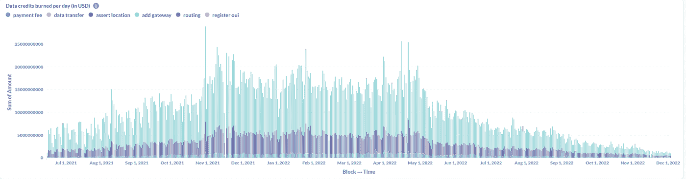

# 分散式无线网络(DeWi)

> 原文：<https://medium.com/coinmonks/on-decentralized-wireless-dewi-59f71bf3915b?source=collection_archive---------5----------------------->

> 这篇文章概述了整个 DeWi 网络领域，重点关注 5G 领域，并将多次提及氦(HNT)，因为它在该领域处于相对成熟的阶段。 *是氦，还是仅仅是氦元素？抱歉，我不得不这么做。*

# 什么是 DeWi

分散无线(DeWi 从现在开始)是一个新兴的行业，旨在使无线网络基础设施大众化。与网状网络相关，其中多个分散的路由器/中继器位于一个区域周围，以提供无线网络覆盖(无论是 WiFi、LoRaWAN/IoT 还是 5G 蜂窝)，而不是单个中央路由器/塔。将密码经济学应用于 DeWi 模型，以引导和激励网络增长和覆盖(即，使用令牌解决“冷启动”问题)。简而言之，DeWi 融合了网状网络和加密经济学，提供了一种构建无线网络的新方法。

氦，太空的先驱，从提供洛拉万开始。他们的 LoRa 网络是专门为物联网供电而设计的。作为背景，如果目标是单独为物联网供电的设备供电，与 LoRa 相比，传统 WiFi 网络过于昂贵且资源密集(昂贵的硬件、较小的覆盖半径以及为大数据传输而构建)。他们证明了使用 cryptoeconomics 建立一个 LoRa 网络是可行的，在 2021 年 1 月拥有 15，000 个热点，在撰写本文时超过 980，000 个[1]。然而，用户对 LoRa 网络的需求还没有显示出来，这反映在他们的收入和他们的$HNT 令牌的价格上。用户对 5G 网络的需求已经得到证实，这是一个迫在眉睫的机会，不像在 LoRa，他们进入了一个潜在的蓝海。意识到这一点后，他们转向建设 5G 蜂窝网络，更广泛的 DeWi 部门也向同一方向倾斜。

作为背景，全球电信行业一直是高度集中和资本密集型的。在全球范围内，由 2-5 家网络提供商为一个国家的大部分人口供电是很常见的。就本文的范围而言，让我们更多地关注美国的电信行业。

网络提供商(例如，威瑞森)建设新蜂窝网络的流程如下:1)通过债务筹集资金(数百亿美元), 2)从政府购买频谱许可证，3)联系制造商(例如，中兴、华为)建设所需的硬件，4)与铁塔提供商(例如，Crown Castle)合作，共同管理硬件，以及 5)定期维护部署的设备。与 2/3/4G 网络不同，5G 网络使用小蜂窝，每个蜂窝的覆盖半径更小，因此需要更多的蜂窝/路由器来提供与传统网络类似的覆盖。

这五个流程的资本支出和运营支出都很高，DeWi 计划通过将这些成本转移到供应商(即矿商)的分布式网络并使用现成的设备来改变这种情况。5G 网络的设计需要大量的分布式蜂窝，这是网状网络的一个完美案例。使用网状网络的一个明显优势是其扩展能力，无论是加强密集区域的覆盖，还是扩展到以前使用中心塔覆盖在经济上不可行的区域。总而言之，DeWi 比传统系统具有更好的单位经济性。

Figure 1: Legacy vs DeWi way of building networks [2]

# 它是如何工作的(氦，但可以广泛应用于整个 DeWi 网络)

氦物联网网络矿工赚取 IoT 美元，5G 网络矿工赚取移动美元。这两个都可以兑换成 100 美元的 HNT .这将在下面的部分中进行抽象。

矿工购买现成的设备，为设备提供互联网和电源，并在覆盖较少的地区将设备连接到氦网络[3]。矿工们通过为网络供电(传输数据)和保护氦区块链获得 100 美元的 HNT 代币。在设备初始接入网络期间，即将成为矿工的人必须支付两笔费用，“添加网关”和“定位”，这两笔费用都以 HNT 元计价。

它们利用一种被称为覆盖证明的工作(有效性)机制，来加强路由器位置和正常运行时间的真实性。每个路由器/执行者可以挑战另一个路由器的真实性，并将根据结果被削减/奖励。所有的活动都被记录在氦区块链上，它运行在一个利益一致机制的证明上。

用户要使用氦网络，他们必须购买$HNT 代币，这些代币将被烧成数据信用(DC)，他们支付“网络费”或者更确切地说是以 DC 计价的数据使用费。氦网络的利用率越高，消耗的 HNT 币就越多。

DeWi 通过利用未经许可的频谱(即公民宽带无线电服务(CBRS))为网络供电，从而消除了购买频谱许可证的需要。由于美国对未授权频谱的监管清晰，以及已证实的 5G 需求，5G DeWi 的主要工作由美国独家负责。

展望未来，电信网络在 2021 年产生了 1250 亿美元的 EBITDA，950 亿美元以频谱许可证和税收的形式支付给美国政府[4]。

由于 1)无需支付频谱成本，2)无需为协同定位支付信号发射塔费用，以及 3)资本支出和运营支出的众包，DeWi 可以以传统电信公司 50%的成本提供 5G 服务[5]。

Figure 2: Helium flywheel and cost [5]

# 可能的商业模式

对于 5G DeWi 网络，已经确定了三种主要的商业模式，中性主机、加密运营商和专用网络[2]。

## 中性宿主

中立主机为多个移动网络运营商(例如，威瑞森)提供基础设施(类似于铁塔提供商，例如，皇冠城堡)来运行。

## 密码载体

加密本地移动网络提供商(类似于威瑞森等。)通过利用自己的网络为最终用户服务。eSIM 的发展使这种商业模式比以前更具优势，因为它大大降低了转换成本。

## 专用网

私有网络通过将现有的 DeWi 网络出租给机构(例如，物联网初创公司、机场等)来构建。)来提供定制的网络覆盖(私有的、更强的和可靠的)。

## 我的选择

我相信在 Dewi 的当前阶段，中立的主机比其他两个主机显示出显著的优势。

作为一家加密运营商，意味着将有最少的中介，我们可以将最终用户的费用降至最低。然而，作为一个新行业的起点，直接跳到消费者端是很棘手的——1)价格不敏感，用户是否愿意转向新的运营商以节省成本，2) crypto 本身没有最好的公众情绪，我们如何让最终用户相信这是可持续的。

私有网络是理想的。匿名性、强度和覆盖面都可以根据客户的要求进行调整。然而，专用网络市场本身(14 亿美元)不足以维持一个成熟的 DeWi 网络[6]。或许不久之后，这种模式会更受欢迎。

另一方面，中性主机是市场需求和时机的完美平衡。消费者可能对价格不够敏感，不会更换他们的网络提供商，但这些移动网络运营商是如此。正如 Escape Velocity 的 Sal 所强调的，传统移动网络运营商的单位经济性并不是最好的，作为 DeWi 网络，我们在交易中占据上风[4]。通过将他们的网络活动卸载到 DeWi 网络中，他们将能够以灵活的成本更好地服务更多的客户，而 DeWi 矿工可以持续地获得回报。当然，这一模式的最大障碍是监管不确定性。鉴于移动网络运营商与政府关系密切(频谱许可证、房地产、发射塔等)。)，政府对此举会有什么反应？

要真正赋予矿工权力，最好的解决方案是成为一个中立的主机，同时提供专用网络服务。

# 市场格局

如前所述，DeWi 空间正在蓬勃发展。DeWi 网络越来越多地转向 5G。硬件制造商生产参与 DeWi 网络所需的设备/路由器。企业部署者是大规模部署设备的机构。第三方分销商是硬件制造商的零售商，他们可能会提供额外的及时优惠。服务提供商/工具/市场是社区构建的工具，帮助矿工/用户导航和最大化氦生态系统。

Figure 3: DeWi ecosystem [2]

# 问题和想法

氦的 LoRaWAN focus 被证明在建立网络方面是成功的，但在商业案例中却不是。图 4 显示对氦(数据信用)的需求一直很大，但深入观察图表，来自实际数据使用(数据传输)的量微不足道。大部分收入来自热点设置(添加网关/维护位置)和维护。这反映了一个事实，即大多数矿工的收入来自$HNT 通货膨胀和新矿工的设置，没有实际价值的积累。这种模式是否可行值得商榷。

Figure 4: Helium’s total revenue (data credits used) [7]

然而，我认为这是不可持续的。相对于用户需求，他们的网络覆盖增长过快。这与 Filecoin 是一个巨大的相似之处，Filecoin 是一个分布式存储网络，其中供应端相对于用户端增长极快，因此减少了供应端的回报。在用户方面没有清晰的轨迹，这种模式是行不通的。当然，社区和团队都承认这一点，因此转向 5G 供应。需要注意的是，在 Filecoin 的案例中，存储提供商可以简单地使用他们的电脑来“挖掘”网络。而在氦中，矿工必须购买专用设备，从而“迫使”矿工在他们微薄的可持续收入可以支付互联网和电力成本的情况下保持他们的设备，希望有助于他们预先购买设备。然而，这也意味着，绝大多数矿商希望卖出股票来实现未来的利润，就像比特币的情况一样，矿商的卖出并不是一个好的指标，他们是这个网络的支柱。

无论如何不要相互指责，但双方都从这种模式中受益匪浅。设备提供商获得了大量的销售额，早期的矿工从新矿工的进入中获得了巨大的回报(高收入和 HNT 价格)。

拥有物联网专用网络本身肯定不是用户友好的，而且从用户的角度来看，他们还不够根深蒂固，因此也没有足够的成本来从他们的传统 WiFi 网络中寻求替代方案。也许在未来，当智能家居被认为是家，智能设备被认为是设备的时候，LoRa 的好处就可以凸显出来了。从机构方面(如电动汽车制造商等。)，尽管与传统的蜂窝网络相比，LoRa 网络显示出显著的成本削减，但是这种成本总是被转嫁到最终用户身上。最终用户对价格不够敏感，不会要求这种改变，而且蜂窝网络目前的覆盖范围仍然比 LoRa 网络好。目前，为了至少维持矿工网络，氦/LoRa 应该从确保制造商转向双连接(蜂窝和 LoRa 支持)开始。

回头来看，他们的 LoRa 网络的主要问题是供应端扩展过快。如果物联网/LoRa 网络确实是一片蓝海(图 5)，那么现有的矿工还能等多久？

Figure 5: Number of IoT devices [8]

根据 FutureMoney 的 X2Earn 范式，更广泛的 DeWi 部门属于第 7 类——低频、高资本、低工作——而 Helium 尤其处于整合阶段(用户发现)。氦正处于一个决定其未来的阶段，5G 是其最后的推动力[9]。

我从 Helium 的成功和失败中获得的关键经验是，这种模式可以而且应该在刚刚开始发展 5G 基础设施的国家/地区复制，并且应该只在证明有需求时才扩大规模。网状网络(公共访问)显示出超越传统流程的显著优势，应该成为我们发展过程中的默认构建方式。虽然我怀疑如果 DeWi 的强大方面被剥离，特别是在加密经济方面(调整用户行为)和无许可性质，它会有很大的好处。电信公司可以在工作流程中忽略、采纳或利用 DeWi。通过采用 DeWi，他们可以利用氦或花粉移动等网络来为他们的网络提供动力，将他们作为一个中立的宿主。他们甚至可以开始他们的版本(对监管更友好)，其中目标挖掘受众是一组机构(即企业部署者)。

希望你喜欢这篇文章，我对 DMs 持开放态度！

https://www.linkedin.com/in/domica/

【https://twitter.com/mimiLFG 

# 参考

[1][https://explorer.helium.com](https://explorer.helium.com/)

[2][https://messari . io/report/the-telecom-cowboys-of-the-decentralized-wireless-movement](https://messari.io/report/the-telecom-cowboys-of-the-decentralized-wireless-movement)

[https://www.helium.com/mine#hotspots](https://www.helium.com/mine#hotspots)

[4][https://7z 6 S6 va 27 wdjx 7 gebacdeawu vv5 luddfgzjtrqxuazsokh 6 bof6a . ar weave . net/_ n 0 vvbr 9 HP V8 xagemglurxq 6 dgu uzjc 9 azk 5 r _ BcXw](https://7z6s6va27wdjx7gebacdeawuvv5luddfgzjtrqxuazsokh6bof6a.arweave.net/_n0vVBr9hpv8xAgEMgLUrXq6DGU2UzjC9AZk5R_BcXw)

【5】[https://mone romr . substack . com/p/helium-hnt-can-be-a-generative？utm_source=url](https://moneromr.substack.com/p/helium-hnt-could-be-a-generational?utm_source=url)

[6][https://www . grandview research . com/industry-analysis/private-5g-network-market](https://www.grandviewresearch.com/industry-analysis/private-5g-network-market)

[7][https://www.helium.foundation/stats](https://www.helium.foundation/stats)

[8]https://blues.io/blog/network-connectivity/

[9][https://medium . com/@ 0x fu/x2 earns-产品-方法-频率-资金-工作-298b20693531](/@0xfu/x2earns-product-methodology-frequency-capital-and-work-298b20693531)

> 交易新手？尝试[加密交易机器人](/coinmonks/crypto-trading-bot-c2ffce8acb2a)或[复制交易](/coinmonks/top-10-crypto-copy-trading-platforms-for-beginners-d0c37c7d698c)