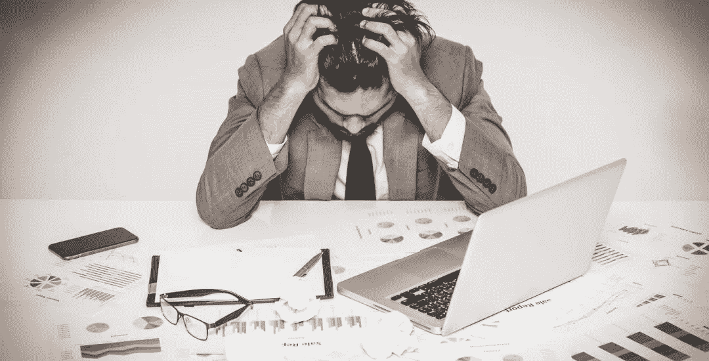

# 论密码与贸易中的心理健康

> 原文：<https://medium.com/coinmonks/on-mental-health-in-cryptos-and-trade-8555ff1d1146?source=collection_archive---------37----------------------->

交易会造成压力，这反过来会在大脑中产生化学变化。这些化学变化会慢慢创造出一种*“新常态”*的状态，如果你试图改变它，这种状态就会转化为不适。
放松和不接受任何刺激一旦被长期忍受，这就成了*“你的新常态”*然后我们做什么，我们用“化学”电击来修复它，以帮助带回更熟悉的感觉。例如:

*➖* 查看价格
*➖* 做一些交易
*➖* 阅读新的加密消息

一旦这成为我们日常生活的一部分，在我们无法控制它的情况下，它就变成了*“附加品”。*

> **关于上瘾**

此时你就进入了一个恶性循环，很难从中走出来。

这件事的好处是？它很容易被识别。

如果你感到有一种不可阻挡的需要，那就是每十分钟打开 Coinmarketcap 查看价格，你不停地查看你的投资组合，你整天在 Youtube 或其他社交网络上听有影响的人试图追逐下一件“大事”，或者你甚至可以取消与朋友和/或家人的计划，花一整天时间阅读加密货币，你可能已经上瘾了。要成为成瘾，它必须至少满足以下六个标准:

1.  活动是人一生中最重要的事情。
2.  这个人用它来调整自己的情绪。
3.  **需要做更多才能获得相同的初始高点**
4.  如果他/她总是做不到，他/她会变得很生气。
5.  这项活动如此重要，以至于它会给你的生活带来冲突，影响你的工作和人际关系
6.  **可能会影响你的睡眠**

> **如果你上瘾了，你能做什么？**

第一步是意识到有一个问题开始，然后有愿望做些什么。

如果你想改变这一点，一个简单的方法可能是建立一套规则，当然，承诺遵守它们，例如:

➖制定一个时间表，这样你就可以只交易/查看价格/查看 Twitter、Discord 等。在某些时候，➖接受你不可能抓住每一笔交易，你不可能在每一件事上都做到最好。相反，专注于你想擅长的几个关键领域。➖ 寻找其他健康的途径，如冥想、阅读、写作、运动等。
*➖* 对此事开诚布公。告诉你的家人/朋友你可能有瘾，有支持是非常重要的。向值得信赖的支持人员或心理健康专家倾诉您遇到的任何问题。➖与朋友和爱人共度时光。从整天看屏幕中休息一下。
*➖* 问问自己，是不是只有$ BTC 和$ ETH 的钱包比较好。花这么多时间研究最新的机会值得吗？记住，你的时间是宝贵的。

> 如果你已经走了这么远，谢谢你的阅读，我希望你喜欢这篇文章！

> 交易新手？尝试[加密交易机器人](/coinmonks/crypto-trading-bot-c2ffce8acb2a)或[复制交易](/coinmonks/top-10-crypto-copy-trading-platforms-for-beginners-d0c37c7d698c)