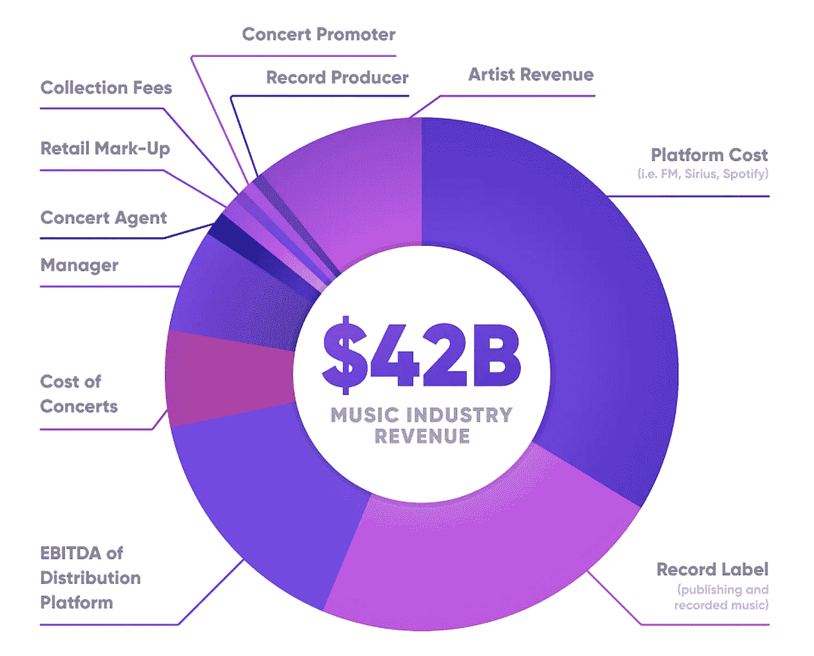
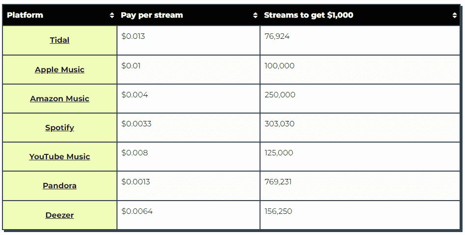
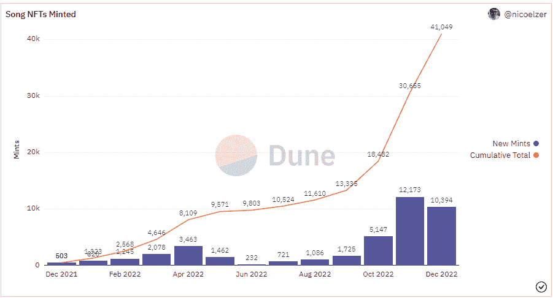
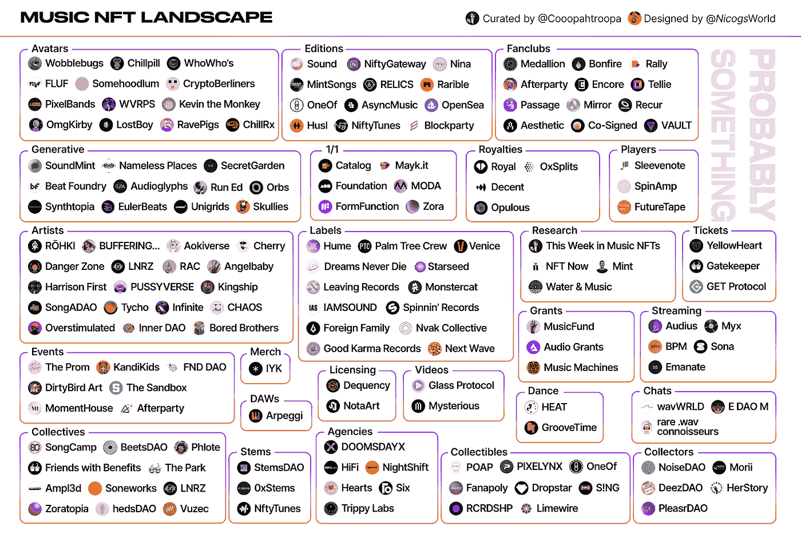

# 音乐 NFTs——创作者经济

> 原文：<https://medium.com/coinmonks/on-music-nfts-the-creator-economy-e0c03e342743?source=collection_archive---------26----------------------->

> 这篇文章提供了整个 NFT 音乐界的概况，假设读者对更广阔的 NFT 空间有一个中等的理解。

# 什么是音乐 NFTs

NFT 音乐是 NFTs 的一个分支。它们继承了几乎所有(我们将在这里得到)NFTs 的属性，是由艺术家为粉丝/收藏家/投资者创造的。音乐 NFT 是其源文件(. mp3/)的标记化版本。wav)，类似于 NFT 是它们各自源文件的标记化版本。jpeg 等。).当然，不仅仅如此，对吗？

一些背景。唱片公司通过提供 1)资本(以预付款的形式)，2)分销和 3) A&R(即联系和发展)来帮助艺术家扩大规模。预付款从艺术家赚取的版税中扣除，一旦预付款付清，版税通常会更平均地分配(80/20 有利于标签预付款的扣除是常见的)。唱片公司与多位艺人签约，作为一家企业，唱片公司将把大部分资源分配给最有潜力的艺人。如果你不被认为是“潜在有利可图的”，那么你将背负巨额债务(预付款)、标签锁定(无法签署标签)，以及“我的生活怎么会变成这样？”。

图 1 突出了音乐行业的收入分布。艺术家的收入约为 12%，尽管他们是这个行业本身的焦点。

Figure 1: Music industry revenue distribution [2]

图 2 显示了顶级流媒体平台的平均每流付费。为了赚到 1000 美元，艺术家们至少需要 75000 个视频流，对于相对少得可怜的一笔钱来说，这是很大的努力。这本身并不是数字流媒体平台的错，为了让经济运行(找到用户愿意支付的价格，以保持公司的可持续发展)，必须举行一场派对，不幸的是，这是艺术家的错。这句话由此而来，“Spotify 是艺术家被发现的地方，而不是付费的地方”。

甚至有人说，实际音乐收入的 80%来自巡回演出。因此，新艺术家如何成长，他们不能确切地去巡回演出，并期望 30 个朋友还清所有的费用。这是一个负反馈循环，他们不能发布多种质量的音乐来获得认可，但也不能离开他们的全职工作来尽最大努力——不是每个人都可以大胆尝试。

Figure 2: Artist revenue per stream on top streaming platforms [3]

所以回到主要问题，是的，音乐 NFT 不仅仅是一个符号化。wav/.mp3\. Music NFTs 旨在帮助新艺术家实现信仰的飞跃(通过消除障碍),并帮助现有艺术家激活新的收入流。对于进一步的上下文，音乐 NFT 包括被令牌化的与音乐相关的一切(例如，令牌化的音乐会门票等)。).这里出现了 web3 标签和音乐 NFT。

Web3 标签是加密的原生标签，为艺术家和他们自己提供了互利的交易[1]。他们的主要任务不是帮助你的音乐面向大众，而是帮助你找到超级粉丝(即，对你的作品充满热情并愿意付费的粉丝)——质量胜于数量[4]。换个角度来看，以 0.1 ETH 的价格出售 25 个音乐 NFT 和 Spotify 上的 100 万个流媒体一样赚钱[3，5]。除此之外，他们通常不提供预付款，只提供未来利润分成的协议。如果你足够自信，你甚至可以推出 solo，没有任何(trad/web3)唱片公司。只要你能建立你的超级粉丝社区来维持你的成本。

回到音乐 NFT，人们为什么会购买它们，它们有什么好处？

人们购买音乐 NFT 有两个主要原因。第一个原因与为什么有人会购买艺术家的实物商品，以支持他们喜欢的艺术家并展示他们的支持是一样的。第二个问题与为什么有人会购买 NFT 一样，无论是投资还是社区包容性。音乐 NFT 的价格会随着艺术家的成长或歌曲的流行而上涨(这两者都意味着更大的消费者基础)，需求增加而供应保持不变。

与实物商品相比，它们的明显优势在于，它们拥有一个安全的二级市场。上述两个原因并不相互排斥。

音乐 NFT(还)不与流媒体平台竞争，它是一种创收的手段。在目前阶段，它们更像是 Patreon、商品商店和棒球卡等平台。考虑到空间的肮脏，早期采用音乐 NFTs 的艺术家受益于获得更愿意为这些收藏品花费的人口统计。除此之外，新艺术家可以进入一个竞争更少、互动更直接的平台，这让他们在曝光率方面拥有优势。

# 它是如何工作的

对于艺术家/制片人来说，这并不比创建一个典型的 NFT 更难，只是比将源文件拖放到你的 Dropbox 存储中稍微复杂一点。音乐 NFT 可以分为三种类型——1)1/1，2)限量版和 3)开放版。在更广阔的 NFT 空间中，1)和 3)类型是普遍的。

1/1 指的是单个 NFT 版本，限量版指的是具有预定数量的作品的集合。开放版指的是无限数量的造币厂，尽管它通常受到时间框架的限制。版本往往更受青睐，尤其是如果目标是社区建设。

音乐与你的典型音乐略有不同。jpeg NFTs。大多数。jpeg NFTs 即使在一个集合中也是 1/1 的，具有它们自己独特的属性集。这在音乐 NFT 中还不常见。

对于用户来说，这与连接到市场并购买/铸造 NFT 没有什么不同。通过购买音乐 NFTs，您并不拥有音乐的潜在权利(例如，商业化的权利等。)，它只是你在旧 iTunes 上购买专辑/歌曲时获得的令牌化版本，只不过现在你有能力转售[7]。

# 用例

根据超级粉丝和质量重于数量的理论，NFT 供电的门控社区是一个明显的例子。通过在粉丝和艺人之间提供一个专属的、直接的渠道，增加超级粉丝的付费意愿。

版税分成，用户可以从艺术家(特别是一首歌)的收入中获得“权益”。这一点已经被[皇家](https://royal.io/)等平台实现了。

象征性的音乐会门票。顶级艺术家的巡演门票很快就卖光了。这些门票有一个巨大的囤积和转售市场，不仅收取高额溢价，其真实性/安全性也没有保证。通过利用现有的解决方案，如 NFT 市场和现场 NFT 认证，艺术家可以从二次销售量中获得一份份额，用户可以获得一种可验证的交易方法。

Metastars 是一类新的音乐家，他们是只存在于元宇宙的艺术家[8]。由于只存在于元宇宙，他们能够在没有沉重的后勤/骑手的情况下进行旅行。初音未来，但是由 NFTs 和 DAOs 驱动。

更大的图景，类似于更广阔的 NFT 空间，是当音乐 NFT 达到大规模可组合性的时候。能够扎根于 GameFi 生态系统甚至 NFT 金融平台(例如，租赁、用作抵押品、短/长集合等。)凸显了 crypto 的本来面目。

# 市场格局

虽然不是更广泛的音乐 NFT 市场的最大代表，图 3 突出了音乐 NFTs 的吸引力。

NFT 音乐领域增长相对较快，这要归功于它与非音乐电视的密切联系，后者奠定了必要的基础设施和牵引力。目前的音乐 NFT 堆栈已经看到了所有垂直行业的玩家——从艺术家，收藏家，市场，标签，集体和基金。一个完整的套件，如图 4 所示。

Figure 3: Sound.xyz, the number of music NFTs minted [9]

Figure 4: Music NFT landscape [10]

# 我的想法

版税分成一直是音乐 NFTs 的一个有争议的话题。这似乎是一个双赢的解决方案，艺术家为未来的收入赚取非掠夺性的前期资本，用户可以“投资”他们认为可以盈利的艺术家。除了法律问题，还有其他问题。从流媒体平台的收入可以明显看出，除非你是一个大明星，否则这些收入微乎其微。但与他们的厂牌相比，大艺术家已经占了上风，他们是那些被厂牌优先考虑的人，因为他们已经有利可图。除此之外，大艺术家更有可能拥有愿意在没有经济激励的情况下花钱的人(即超级粉丝)。

更广泛的 NFT 空间约 80%的交易量来自二级销售(即造币后销售)[11]。而 NFT 音乐只有大约 45%的交易量来自二级销售[12]。音乐 NFT 的较低成交量意味着两种可能性，1)更多的音乐 NFT 购买者是收藏家，或者 2)音乐 NFT 缺乏流动性。在前一种情况下，可以很快得出结论，该产品已经找到了合适的。

从一个艺术家的角度来看，参与音乐 NFTs 没有什么大的负面影响，尤其是在当前的萌芽阶段，正如前面所强调的。值得注意的是，一些 NFT 音乐平台选择性地在其平台上列出艺术家，这违反了加密的本质，但对于提供最佳用户体验的质量控制措施来说是合理的。

## 希望你喜欢这篇文章，我对 DMs 开放！

[https://www.linkedin.com/in/domica/](https://www.linkedin.com/in/domica/)

【https://twitter.com/mimiLFG 号

> *交易新手？试试* [*密码交易机器人*](/coinmonks/crypto-trading-bot-c2ffce8acb2a) *或* [*复制交易*](/coinmonks/top-10-crypto-copy-trading-platforms-for-beginners-d0c37c7d698c)
> 
> *分散加密持股，了解* [*币安的替代方案*](https://coincodecap.com/binance-alternatives)
> 
> *加入 Coinmonks* [*电报频道*](https://t.me/coincodecap) *和* [*Youtube 频道*](https://www.youtube.com/c/coinmonks/videos) *获取每日* [*加密新闻*](http://coincodecap.com/)

# 另外，阅读

*   [复制交易](/coinmonks/top-10-crypto-copy-trading-platforms-for-beginners-d0c37c7d698c) | [加密税务软件](/coinmonks/crypto-tax-software-ed4b4810e338)
*   [网格交易](https://coincodecap.com/grid-trading) | [加密硬件钱包](/coinmonks/the-best-cryptocurrency-hardware-wallets-of-2020-e28b1c124069)
*   [密码电报信号](/coinmonks/top-3-telegram-channels-for-crypto-traders-in-2021-8385f4411ff4) | [密码交易机器人](/coinmonks/crypto-trading-bot-c2ffce8acb2a)
*   [最佳加密交易所](/coinmonks/crypto-exchange-dd2f9d6f3769) | [印度最佳加密交易所](/coinmonks/bitcoin-exchange-in-india-7f1fe79715c9)
*   [开发者最佳加密 API](/coinmonks/best-crypto-apis-for-developers-5efe3a597a9f)
*   最佳[密码借贷平台](/coinmonks/top-5-crypto-lending-platforms-in-2020-that-you-need-to-know-a1b675cec3fa)
*   [免费加密信号](/coinmonks/free-crypto-signals-48b25e61a8da) | [加密交易机器人](/coinmonks/crypto-trading-bot-c2ffce8acb2a)
*   杠杆代币的终极指南

# 参考

[1][https://coopahrooma . mirror . XYZ/kUgI _ SlSOyeUFMJ _ ure 0 GW-cyn M6 pn 0 Rb 46 hmz-RUOg](https://coopahtroopa.mirror.xyz/kUgI_SlSOyeUFMJ_uRE0gw-CynM6PN0rB46HmZ-RUOg)

[2][https://newsletter . banklesshq . com/p/crypto-will-fix-the-music-industry](https://newsletter.banklesshq.com/p/crypto-will-fix-the-music-industry)

[3][https://www . head phonesty . com/2021/11/how-mud-doe-Spotify-pay-per-stream/](https://www.headphonesty.com/2021/11/how-much-does-spotify-pay-per-stream/)

[https://a16z.com/2020/02/06/1000-true-fans-try-100/](https://a16z.com/2020/02/06/1000-true-fans-try-100/)

[5][https://Twitter . com/Cooopahtroopa/status/1533203100210630656](https://twitter.com/Cooopahtroopa/status/1533203100210630656)

[6][https://NFT now . com/guides/complete-guide-to-the-NFT-music-ecosystem/](https://nftnow.com/guides/complete-guide-to-the-nft-music-ecosystem/)

[7][https://coopahroproma . mirror . XYZ/8 orpdmu 5 wbogx 36-vxit 3 gbmqmoihy0k _ kv 4 owlmmo](https://coopahtroopa.mirror.xyz/8OrpDmu5wboGX36-vXIt3gBMQMoihY0k_kV4XowlMMo)

[8][https://coopahrooma . mirror . XYZ/jacoblqso 0s 7 o 7 ub 5 RR 9 bjkxswrro 2 eex _ odh 3 caqa 0](https://coopahtroopa.mirror.xyz/jaCObLqSO0S7O7UB5RR9BJkXSWrro2EeX_ODH3CAqA0)

[https://dune.com/nicoelzer/sound-xyz](https://dune.com/nicoelzer/sound-xyz)

[10][https://Twitter . com/Cooopahtroopa/status/1519370392363753477/photo/1](https://twitter.com/Cooopahtroopa/status/1519370392363753477/photo/1)

[11][https://www.nansen.ai/guides/nft-statistics-2022](https://www.nansen.ai/guides/nft-statistics-2022)

[12]https://dune.com/pandajackson42/music-nft