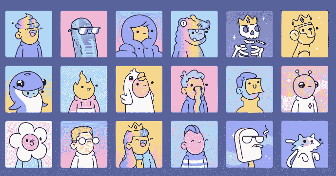
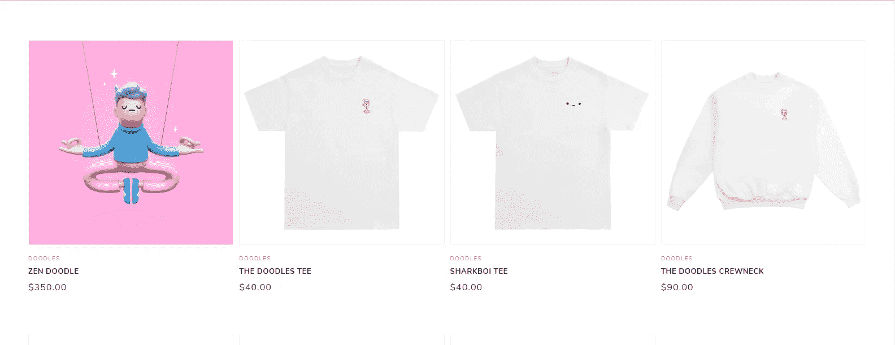
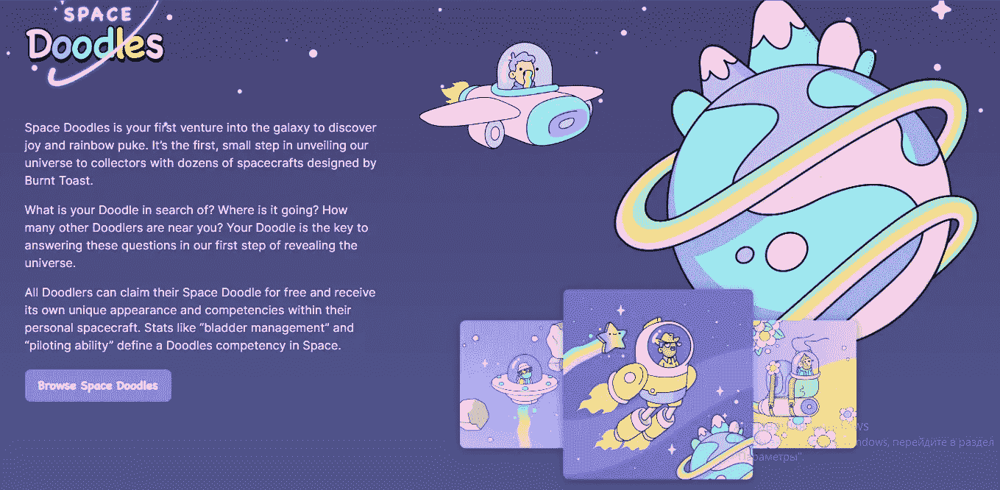
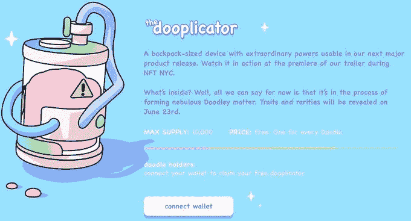
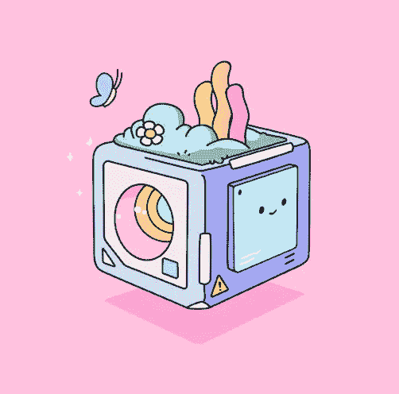
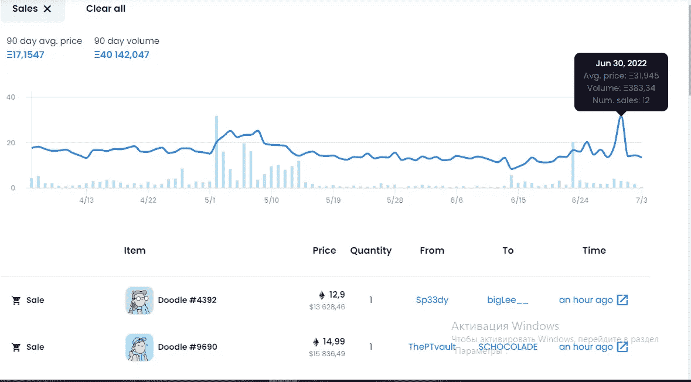
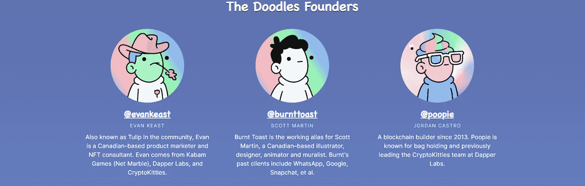
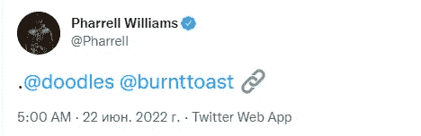
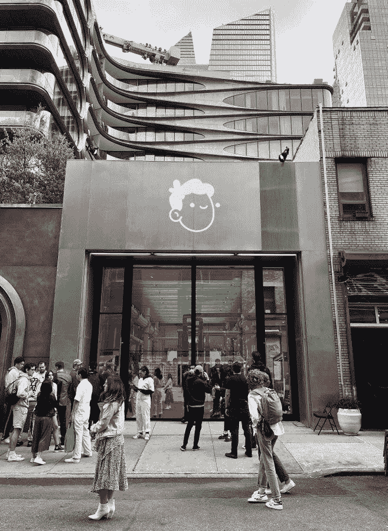
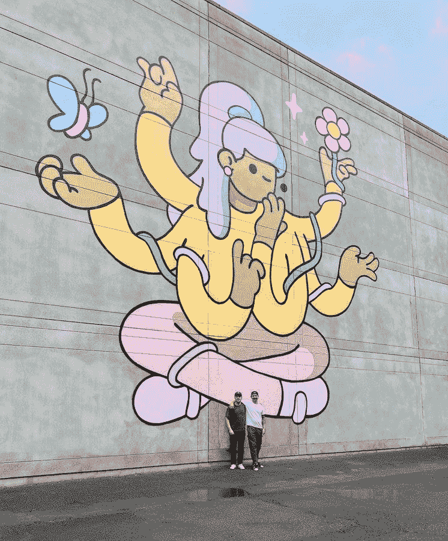

# 一个涂鸦不错，但是 2.0 -更好！

> 原文：<https://medium.com/coinmonks/one-doodles-is-good-but-2-0-is-better-f4cc986c78d3?source=collection_archive---------41----------------------->

***大家好*** [***无现金无封顶***](https://twitter.com/NoCashNoCap) ***特别是，您卑微的仆人***[***deeps yg***](https://twitter.com/BradWoofy)***，我会马上预约文章是用两种语言写的，英语和俄语。今天我们来谈谈涂鸦 2。***

不久前，知名蓝筹集合 [**Doodles**](https://twitter.com/doodles)
宣布将进行第二次集合 **Doodles2.0** ，第一次是在写文章的时候用一个 [**FP 13 ETH**](https://opensea.io/collection/doodles-official) 进行交易。

# 先说一点第一集涂鸦吧。

涂鸦——是 10 000 张手绘涂鸦。
项目有很大的 [**网站**](https://doodles.app/) 。这个项目的酷之处在于没有路线图，创始人不承诺任何事情，他们与社区协商，只是定性地做他们的工作，一般来说，他们不是通过语言，而是通过行动。
他们有一个公共金库用于项目的开发，这已经引起了关注！**500 万$$** ，还不错吧？

该项目有自己的 [**商店**](https://shop.doodles.app/) ，从中得到的钱进入国库，在那里你可以购买带有该项目标志和 NFT 人物的商品。

持有人不断获得各种各样的сool 东西，空投，独家 merch，nft 人物，并获得独家收藏，如 [**Doodles Space**](https://doodles.app/space) ，每个涂鸦所有者可以免费将他的涂鸦送入太空，并组装一艘独特的宇宙飞船(涂鸦可以返回地球)太空涂鸦(船)，他们的统计数据将用于未来的涂鸦 2。

> 交易新手？尝试[加密交易机器人](/coinmonks/crypto-trading-bot-c2ffce8acb2a)或[复制交易](/coinmonks/top-10-crypto-copy-trading-platforms-for-beginners-d0c37c7d698c)

值得注意的是，创始人曾暗示在另一个区块链推出涂鸦 2，但同样的统计数据是通过 Chainlink VRF 在网络上生成的，有 8 个等级，这也将给予不同的奖励，所以结果是涂鸦 2 将出现在 Chainlink？尚不清楚，但这一理论有其存在的理由。

此外，所有空投涂鸦的持有者都获得了一个 [**涂鸦者**](https://opensea.io/collection/the-dooplicator) (免费，哇！)FP 在撰写本文时 **2.3 eth** 1 嘟嘟= 1 复印机

同样在最近， [**创世纪盒子**](https://opensea.io/collection/genesis-box) 拍卖结束，拍卖价格是 24k(多少)，最低拍卖出价是 **0.123 eth** ，您可以随时提高出价，如果您的出价高于平均水平，那么您肯定会得到一个盒子，如果少了，那么您会得到退款，现在盒子的出价是 **0.5 eth** ， 在这些盒子里会有为你的新涂鸦定制的衣服，在这些衣服里，他们可以打扮成村里最时髦的人。

顺便说一下，在拍卖之前，主要收藏品非常抢手，达到了 30 eth 的 **AVG 价格，所以那些在拍卖之前买断的人几乎赚了 **x3** ，我们打电话给涂鸦是为了不和谐地购买。**

# 新团队

**我想指出的是，团队已经发生了变化，他们本已强大的团队变得更加强大。(WOW)** *首先我给大家介绍一下老队员:*
[**@ evankast**](http://twitter.com/evankeast)**EVAN KEAST**
在社区里也被称为郁金香，EVAN 是一名加拿大籍的产品营销人员和 NFT 顾问。Evan 来自 Kabam Games(净弹球)、Dapper Labs 和 CryptoKitties。
[**@ burn ttoast**](http://twitter.com/burnttoast)**SCOTT MARTIN**
burn Toast 是加拿大插画家、设计师、动画师和壁画家斯科特·马丁的工作别名。burden 过去的客户包括 WhatsApp、Google、Snapchat 等
[**@ poppee**](http://twitter.com/poopie)**JORDAN CASTRO**
A 区块链建筑商，自 2013 年起。Poopie 以包包闻名，之前曾领导过 Dapper Labs 的 CryptoKitties 团队。

现在谈谈新的。
在 [**NFT NYC**](http://NFT.NYC) 发布会上，正是[**宣布**](https://twitter.com/pharrell/status/1539427990668382210?s=21&t=89n3OcjgG8BF5fRIztx2Jw) 新的品牌发展总监 [**法瑞尔·威廉姆斯**](https://twitter.com/pharrell?s=21&t=89n3OcjgG8BF5fRIztx2Jw) ，如果你没瞎琢磨的话，是蠢朋克集团的一员，他手下有一帮美国名人和说唱歌手。

在他的新职位上，他将塑造音乐、艺术作品、消费品、动画和事件的收集方式，他已经宣布了专辑《涂鸦记录:第 1 卷》在 [**哥伦比亚唱片**](https://www.columbiarecords.com/artists/) 的支持下，专辑将收录唱片公司顶级艺术家的曲目。
这个项目的董事会还有另外一名成员——凯特琳·霍洛韦。她是 [**七七六**](https://sevensevensix.com/) 的联合创始人，为该项目融资(交易金额未透露。涂鸦增强了团队的力量，很明显第一次收集的成功对他们来说还不够，所以他们自信地继续前进。

# 关于新涂鸦 2 的一切

据创作者称，Doodles 2 将由超过 100 万个头像组成，它将有更多不同的功能，以及可穿戴物品。也许这些头像会按照主人的形象“创造”出来。细节承诺“很快”，但根据预告片判断，Dooplicator 和 Space Doodles 将与它相关联，海班克斯的公民们，我建议你们仔细看看购买(DYOR·NFA)。

# 结果

总而言之，关于涂鸦 2，我们几乎没有任何信息，但密码破译者已经发出警报，将会有一个巨大的漏洞，这可怕吗？我不这么认为，涂鸦团队已经连续第二年取悦他们的持有者，一分钟都没有停下来，他们有巨大的背景，每个自尊的地穴人都想从涂鸦中得到一些东西，他们可能会转向 chainlink，这很可怕吗？我无法给出确切的答案。你认为这些涂鸦会因此变得人人都可以看到吗？然后大 saplay 将不会是一个问题(想想看)，chainlink 是一个高科技的区块链，因为创始人从事 crypto kitty(这给了他们第一个百万美元的收入和炒作 NFT 开始用它)，他们开发了区块链，然后我不认为他们会做出愚蠢的决定，也许这将是一个新的突破，在世界 NFT，将打开新的大门，或者也许他们将只是在以太上发射(哈)。我建议每个人都追随涂鸦，并已经表现出一些行动，因为我们知道将来我们会得到回报，考虑到乙醚的折扣，我建议海班克斯买下整包涂鸦(涂鸦、复印机和创世纪拳击)((DYOR·NFA))。
我已经告诉你我所知道的关于**涂鸦 2** 的一切

# 感谢大家的关注，全是涂鸦！

**涂鸦链接:
推特:**[**https://twitter.com/doodles**](https://twitter.com/doodles) **网站:** [**涂鸦. app**](https://t.co/5x8MIpzbUx) **涂鸦店铺:**[**https://shop . Doodles . app**](https://shop.doodles.app/) **我的链接:**[**https://twitter.com/BradWoofy**](https://twitter.com/BradWoofy)

# **один涂鸦хорошо，а 2.0 лучше！**

***[***【No Cash No Cap】***](https://twitter.com/NoCashNoCap)*[***【DeepsyG】***](https://twitter.com/BradWoofy) ******】******[*DeepsyG】* **********【T 今天我们来谈谈 Doodles2。**********](https://twitter.com/BradWoofy)****

不久前,著名的芯片集合**Doodles**
宣布了第二个集合**Doodles2.0**将要做的事情,在撰写本文时,第一个集合交易花卉[**13 ETH**](https://opensea.io/collection/doodles-official)。

# **我们来谈谈第一集(T35)**

**DOODLES**是用手绘制的 10k 杜德尔。
该项目有一个优秀的、信息丰富的[**网站。**](https://doodles.app/)
这个项目的酷之处在于,没有 roadmap,球迷不承诺任何事情,他们与 Community 咨询,只是在质量上做他们的工作,通常不是用言语而是用行动。该项目正在推动公社,这是他们被告知的球迷,对于项目的发展,他们有一个公共财政,其中已经,注意!**500 万块(T45),不错吧?**

该项目有自己的 [**购物**](https://shop.doodles.app/) ,其中出售刀具和 NFT 图形,并从那里钱补充公共金库。

宇宙飞船和他们的统计数据将在未来的**doodles2 中使用,并获得独家收藏,如[**Doodles Space**](https://doodles.app/space),每个飞船所有者都可以免费将他们的飞船送入太空并点燃独特的飞船(飞船可以返回地球)。**
值得注意的是,粉丝们暗示在另一个区块链上运行 Dudles2,而统计数据是通过 Shainlink VRF 在网络上生成的,并且有 8 个等级,这也给出了不同的点击率,所以得到它**Dudles2 将在 Chainlink 上?**目前还不知道,但这个理论确实存在。

在撰写本文时,所有 aiddrop 的硬盘都被 [**Dooplicator**](https://opensea.io/collection/the-dooplicator) FP 写作时 **2.3 eth** 1 ddr = 1 复制器

同样在最近,拍卖结束了[**Genesis Box**](https://opensea.io/collection/genesis-box)军刀是 24K(什么?,最低拍卖率是**0.123 ETH**,你可以提高利率在任何时候和吃你的利率高于平均水平,那么你保证得到拳击,如果它是低的,那么你得到一个马尼贝克,现在在拳击上的花卉**0.5 ETH**,在这些拳击中将有你的新人,在他们将被涂上,是最时尚的乡村男孩。

顺便说一句,在拍卖会之前,梅因收藏品大幅下跌,并在 30 ETH 达到 AVG 价格,所以那些在拍卖前购买的人几乎做了 X3,我们在我们的迪斯科舞厅购买了 Dudlov。

# НОВАЯ КОМАНДА

“我希望看到球队发生了变化,他们已经强大的球队变得更加强大。
**首先,我将介绍一些老团队成员:**
[**@evankeast**](http://twitter.com/evankeast) **Evan,在社区中也被称为 Tulpan,是加拿大的营销人员和 NFT 顾问。Evan 在 Kabam Games(Net Marble),Dapper Labs 和 CryptoKitties 工作。
[**@burnttoast**](http://twitter.com/burnttoast)
Burnt Toast 是加拿大插画家、设计师、动画师和纪念画家斯科特·马丁的笔名。Burnt 过去的客户包括 WhatsApp,Google,Snapchat 等。
[**@poopie**](http://twitter.com/poopie)2013 年以来的区块链创造者。Poppy 以持有 NFT 包而闻名,并曾领导 Dapper Labs 的 CryptoKitties 团队。**

****

****现在谈谈新**
在会议[**NFT NYC**](http://NFT.NYC)[**宣布**](https://twitter.com/pharrell/status/1539427990668382210?s=21&t=89n3OcjgG8BF5fRIztx2Jw)新任品牌发展总监[**法瑞尔·威廉姆斯**](https://twitter.com/pharrell?s=21&t=89n3OcjgG8BF5fRIztx2Jw),如果你不跳舞的话,那是标志性胸围**Daft Punk**中的一个,在他的食堂里有一堆美国的稻草和说唱歌手。**

****

**在他的新职位上,他将塑造音乐,艺术品,消费品,动画和活动的收藏方法,他已经宣布了专辑**Doodles Resords: Volume 1**与[**哥伦比亚唱片**](https://www.columbiarecords.com/artists/)的支持,专辑中的曲目将由唱片艺术家表演。**

**此外,该项目还有另一名董事的补充 - **凯特琳·霍洛威**。她是 [**Seven Seven Six**](https://sevensevensix.com/) 的联合创始人,他们资助了该项目(交易金额尚未披露)。
Dudla 加强了团队,可以看出他们的第一个系列的成功很小,所以他们自信地继续前进。**

****

# **DOODLES2 马耳他资讯**

**根据 Doodles 2 的创作者,它将包括超过一百万的化身,它将有更多的不同特征,以及可穿戴物品。也许这些化身将根据所有者的形象“创建”。
细节承诺“很快”,但从预告片来看,它将与 Dooplicator 和 Space Doodles 有关,海湾银行的公民,我建议您考虑购买*(DYOR NFA)* 。**

# **ИТОГ**

**让我们总结一下 Doodles2,我们几乎没有任何信息,但加密货币已经引起了人们的警觉,即它将是一个巨大的拼凑,它是可怕的吗?我不认为,杜德莱斯团队已经是第二年高兴他们的老板,并没有停下来一分钟,他们有一个巨大的后台和每一个自尊的密码希望从杜德得到一些东西,害怕他们可能会转向链接?我不能给出确切的答案。难道你不认为这些杜尔多夫将提供给大家通过这个吗?然后,大骗局不会成为问题(think about it),高科技区块链,并且由于粉丝们一直在处理 CryptoKitti(它产生了第一个数百万,并开始了 NFT 的炒作),开发区块链,我不认为他们会做出愚蠢的决定,也许这将是 NFT 世界的新突破,并打开新的大门,也许他们只是在以太坊(H)。
我建议每个人都关注 Dudles2,并已经表现出一些活动,因为我们知道,在未来,我们可能会获得奖励,而 hibanks 建议,考虑到广播的折扣,买下整个公爵杜德尔斯(杜德尔,复制和起源拳击)((DYOR NFA))。**

****

# **这就是我的朋友们!谢谢您的关注, **所有食肉动物**!**

**网址: WEB WEB WEB WEB WEB WEB WEB WEB WEB WEB WEB WEB WEB WEB WEB WEB WEB WEB WEB WEB WEB WEB WEB WEB WEB WEB WEB WEB WEB WEB WEB WEB WEB WEB WEB WEB WEB WEB WEB WEB WEB WEB WEB WEB WEB WEB WEB WEB WEB WEB WEB WEB WEB WEB WEB WEB WEB WEB WEB WEB WEB WEB WEB WEB WEB WEB**