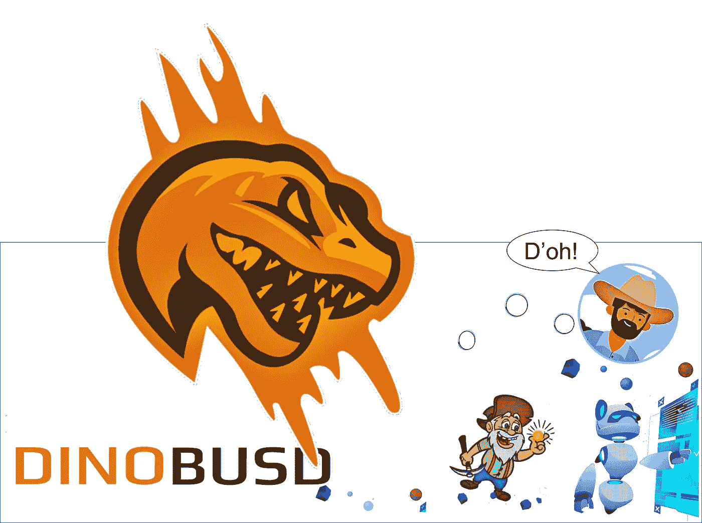
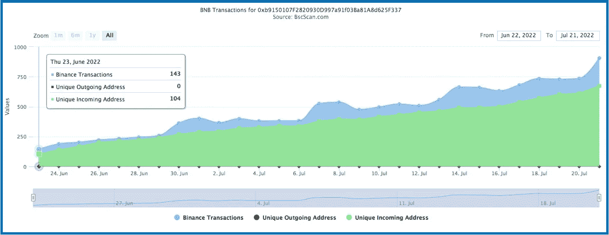
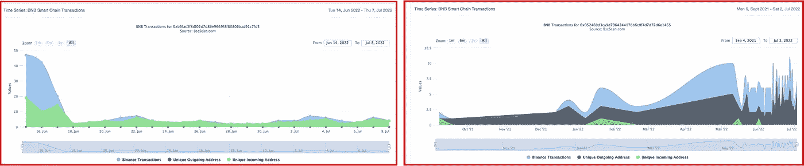
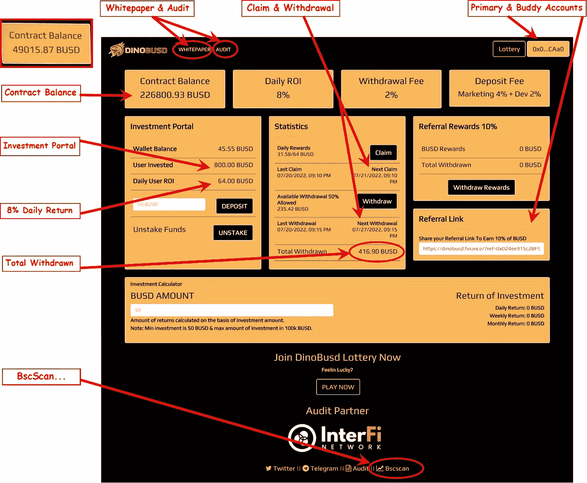
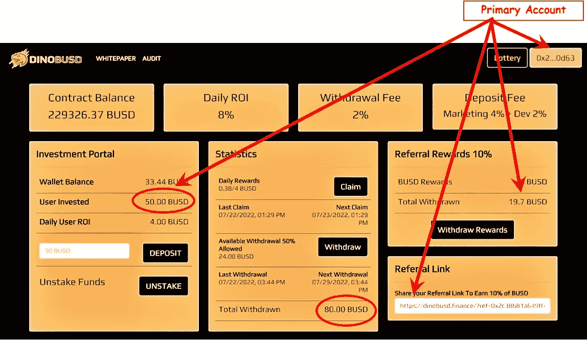
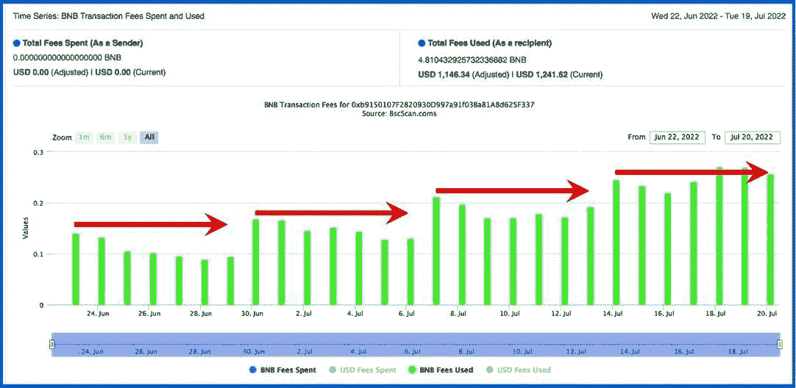
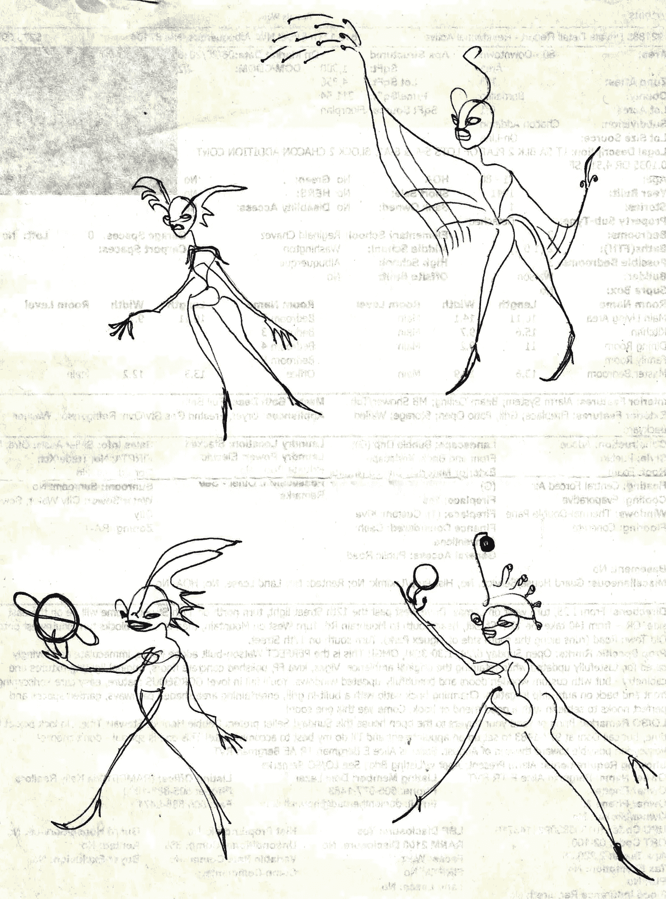

# 在 DinoBusd 投资回报率口袋改变加密赌注项目一个月

> 原文：<https://medium.com/coinmonks/one-month-in-with-the-dinobusd-roi-pocket-change-crypto-miner-f54d20ee630f?source=collection_archive---------3----------------------->

我令人惊讶的被动收入之旅:持续 8%的每日回报池，不断增加的 TVL，3 周内的投资回报率——来看看…

Don’t be intimidated by this T-Rex — DinoBusd.finance is a newer passive-income crypto miner that checks all the boxes. It is a pocket-change return-on-investment protocol with potential longevity…

[DinoBusd.finance](https://dinobusd.finance/?ref=0x66ab1C0978Df3AC4c9cfa0b9e8bd6EcE4B57Ee9d) 是一个可爱、诚实、更新的零钱加密赌注投资项目。和它相处一周&看看感觉如何…

没有 DinoBusd 的花里胡哨，没有[像素仙尘](/@jebalucas/pixelfairy-deep-dive-concerning-roi-pocket-change-crypto-miner-run-away-83c06f3775c8)或被围困的农民，或[飞行机器人](/@jebalucas/a-shallow-dive-into-roi-pocket-change-crypto-platforms-e86147653635)来分散注意力。这是一个简单明了的投资平台，以一个恐龙头作为标志，赚取被动收入。而且好像要起飞了…

> *我探索&剖析新的口袋变化加密赌注协议。我要么把他们分开，要么决定投资这个项目，鼓励他们的可持续性发展。*
> 
> 关于 DinoBusd 有许多积极的方面可以讨论，也有一些缺点——如果*继续深入研究……*

我寻找一个不可持续的口袋改变矿工项目的直接迹象&锁定的总价值通常是第一个危险信号。当一个项目开始的时候，TVL 应该以一个不错的价值开始，然后稳步上升。我们希望任何新业务都有稳定持续的顾客流入，以保证其生存和发展。如果生意好，顾客会回来&口口相传会鼓励更多的新顾客；这就是成功...

## TVL

DinoBusd.finance 正在庆祝它的一个月生日&好消息是它的 TVL 已经攀升了整整 30 天。请注意下图，该图没有测量 TVL，而是绘制了该协议的合同唯一传入地址。唯一的传入地址是向矿工介绍的新人，存放在项目中。这增加了锁定的总价值，从而延长了项目的寿命。

A month young…The green Unique Incoming Address line on the graph shows a slow & steady climb, as more investors discover the [**DinoBusd.finance**](https://dinobusd.finance/?ref=0x024ee915c2BF9d12F98b750119051A752e18CAa0) crypto miner project.

> 一个强大的 TVL 正是我们所寻求的。对比上面和下面的图表。
> 
> 下面的并排图表显示了两个最近失败的 crypto miner“新客户”图表。第一个没有什么兴趣/广告，第二个，一个明显不稳定的图表，是一个邪恶的，精心策划的骗局。

This is not what we want to see…These failed crypto pocket-change miners have wildly fluctuating TVL as the one on the right; or almost no total value locked, like the one on the left, in their contracts. They never stood a chance.

## 仪表板

我最喜欢这个矿工的方面是诚实和易于理解的仪表板。它提供了我想知道的关于我的投资的一切&因为回报率是每天 8%，所以很容易计算出我未来的收入。拿起计算器，跟着我一起操作[dinobsd . finance 仪表盘](https://dinobusd.finance/?ref=0x66ab1C0978Df3AC4c9cfa0b9e8bd6EcE4B57Ee9d)，链接如下&。

Stop with all the red lines already! Seriously, this pocket-change crypto miner dashboard walks me along nicely so I know exactly what I have & what I’m accruing & what’s being deposited in my wallet.

## 白皮书和审计

这些是理解项目个性和后勤的第一批文件。对于这个协议，两个[白皮书&审计](/coinmonks/dipping-a-toe-into-defis-pocket-change-miner-protocols-e5fece2fcc77)给我的感觉是他们有一个很好的未来路线图——熟悉这两个都很好。

## 索赔和撤回

实时计时器提醒您将资金转移到您的奖励池(每日)，或转移到您的口袋(每周)。

## 主要和好友帐户

主账户，在正下方，是初始账户。我从至少 50 美元开始。经过一周的研究和观察仪表盘，如果这个项目看起来不错，我就用第二个钱包开了第二个好友账户，见上图。好友账户将推荐收入注入主账户。这让我能够很快获得第一个客户的投资回报。

## 合同余额

知道这个号码。为了准确记录，我一周会抓拍几次 TVL 协议的截图。一个月前偶然发现 DinoBusd，合同价格为 49，000 美元。今天是什么日子？几乎是…的 5 倍

## 投资门户

这个数字就是你投资的确切金额。这是你的 TVL，但它不像许多其他矿工一样波动(我看着你，所有的矿工！).DinoBusd 仪表盘显示了我每天的奖励是多少&我每天可以申请多少。许多受欢迎的加密矿工允许 TVL 根据众多因素波动，这大大降低了每日回报。迪诺巴德不会这么做。只要智能合约还在运行，我每天就能从投资金额中获得 8%的收益。

> 我在上面的第二个 Buddy 帐户中投入了 100 美元。7 天后，每天 8%的回报率，我的索赔池中有 56 美元，我可以取出其中的一半。
> 
> 斯威特:投资 100 美元，第一周我获得了 28 美元的回报。我将在三周内获得投资回报。
> 
> 我喜欢这个矿工&开始每周从我的其他零花钱矿工那里收集回报，最终在过去的 4 周里每周向 DinoBusd 投入 200 美元，在矿工协议上投资 800 美元。
> 
> 到目前为止，看看上面和下面我的主账户和好友账户的仪表盘，我已经在 4 周内赚了将近 500 美元。下周将是伙伴客户的投资回报率和主要客户的两倍投资回报率…

My Primary account started with $50\. A month later, after daily compounding & almost $20 in referrals from my 2nd, Buddy account, the total brings me to $80\. Next week the ROI will be double…

## 合成

该协议收取我 8%的每日回报利息，并保留一周。表面上这是我的钱；但是，我有一段时间不能碰它。这有助于项目继续可持续发展。

> 这就好像平台借了我 7 天的钱，然后在接下来的几周内还给我。我并不贪婪——只要合同持续支付，我很高兴每周都能收到越来越多的钱。

我喜欢用这个协议一天只复利一次…但是，每次复利时间都把下一个 24 小时复利时间向前推。例如，我在 5p 复合&第二天我只能在那个时间之后复合。如果我没记错的话，可能是 5 点 15 分。第二天可能是 6 便士。当我每天晚几分钟或几小时复合时，有一段时间我不能复合，因为晚上太晚了。所以我跳过它，直到第二天早上&失去了潜在的复利。我知道这可能看起来很小，但是，如果我必须改变一个项目，那就是它…

## BscScan…

点击这里&大门向区块链数据库信息敞开，这些信息包含许多重要的细节，比如每天/每小时/每分钟的步行交通报告，关于谁在访问该协议，他们投资了多少，等等。

## 健康矿工的另一个衡量标准:

每次投资者入股/复合/退出该协议，BNB 本地货币都会收到一笔极小的——几便士——交易费。因此，不管使用的是什么令牌——本例中是 BUSD——我们都可以从下面的 DinoBusd 交易费用图表中获得很多信息。看一看:

DinoBusd Transaction Fees for the last 30 days. The red arrows are my addition…

这是一个绝对漂亮的例子:注意 BNB 交易费用的健康逐步增长。每隔 7 天，它就会达到稳定状态，原因如下:

> 该矿上市当天，数百名投资者立即跳入池中。这可能是最大的单个投资日时间段。从那时起，每隔 7 天，第一批人就提取他们的回报；从图中可以看出，那天是星期四。
> 
> 不过，这个图表最酷的地方在于，本周还有其他强劲的日子——请注意，7 月 18 日和 19 日超过了平均每日收取的费用。正如我提到的，我喜欢这个矿工…

## 彩票功能

我对他们的二次发行彩票项目不太感兴趣——这个领域已经有足够的风险，我也可以在堆叠式随机数字抽奖中投入资金。然而，如果它有助于保持钱包更满的口袋改变矿工功能，我完全赞成。

## 口碑

我喜欢 DinoBusd.finance 的消息开始传播的方式。最近在讨论这个协议时， [Defi Logic](/@whoreticulturist) 写了一句有趣的话:“我能得到我的投资回报吗？你打赌 Jurassican。”(我不会用的，我保证……)

口碑和积极的投资者参与这个口袋里的变化加密矿工是什么将保持强劲，希望未来几年。我会一直看着它。跟我来…thx 阅读。

## 不要脸的塞。

> DinoBusd.finance 是我最喜欢的&财务效率最高的零花钱挖掘者。我只投资那些我研究过的、写起来感觉舒服的项目。整篇文章点击 DinoBusd，直接带你到那个投资平台；使用该平台将为我提供一点金钱上的好处…谢谢。

 [## 迪诺布斯矿工

### DinoBusd——可持续发展是我们让您获得更高利润的关键

dinobusd.finance](https://dinobusd.finance/?ref=0x66ab1C0978Df3AC4c9cfa0b9e8bd6EcE4B57Ee9d) 

只玩不需要的。在放弃你辛苦挣来的零花钱之前，请把这次谈话当作你整体研究的一小部分。

谢谢你走到这一步。我希望你能在这篇关于我们生活的疯狂的密码世界的文章中找到一些有价值的东西。很高兴有你**跟着我** …

我哥们什么都画！我称之为他的账本系列。我喜欢下面的场景…

Four beings, being fabulous!

> 交易新手？试试[密码交易机器人](/coinmonks/crypto-trading-bot-c2ffce8acb2a)或[复制交易](/coinmonks/top-10-crypto-copy-trading-platforms-for-beginners-d0c37c7d698c)