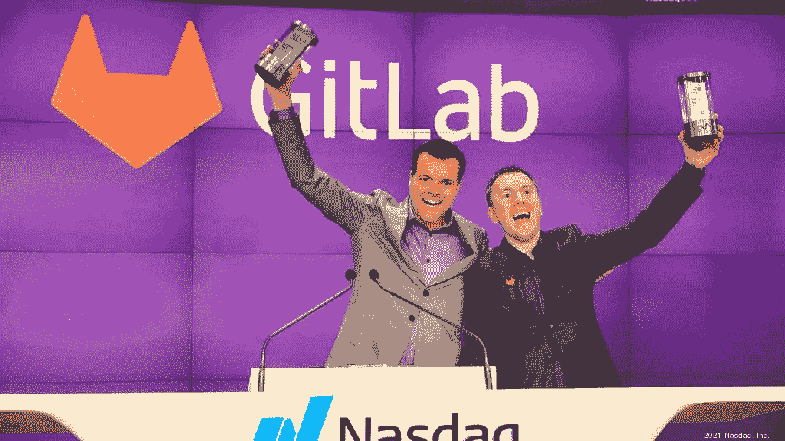
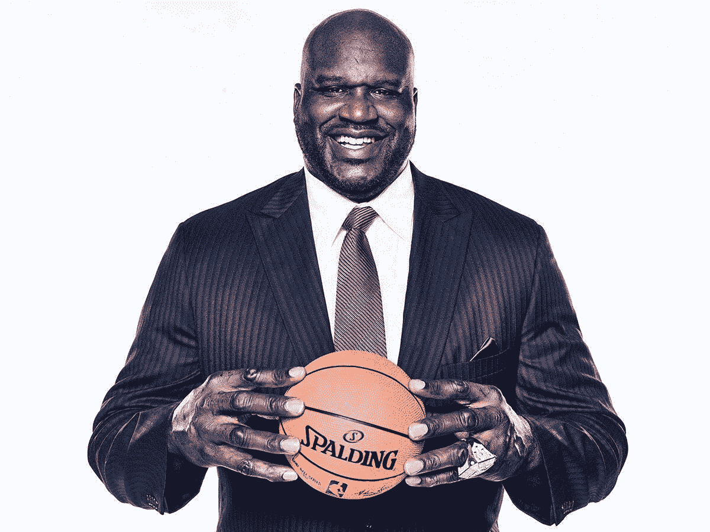

# 历史上最伟大的四分卫之一刚刚从 Gitlab 的 10 万美元赌注中赚了 6300 万美元。

> 原文：<https://medium.com/coinmonks/one-of-the-greatest-quarterback-in-history-just-made-63m-from-a-100k-bet-in-gitlab-da95e7258cc3?source=collection_archive---------34----------------------->

Joe Montana, some say the greatest Quarterback of all time, is also a GOAT at the VC game.

乔·蒙塔纳，东山再起的小子，金乔，乔酷，美国足球史上的传奇名人堂成员。

他在 NFL 打了 16 年，被广泛认为是有史以来最伟大的四分卫之一。

你知道他有一个非常成功的风险投资基金吗？

“Liquid 2 Ventures LLC 今天宣布，他们的第三只核心基金 Liquid 2 Ventures Fund III，L.P .将筹集 8000 万美元，超过 7500 万美元的目标，该基金于 2021 年 12 月结束。”

嘣。

谁说你不能同时做两件事？

足球界的一个传奇现在又在 VC 碾压？

哦拉拉。

他投资了 Gitlab，该公司 IPO 筹资 150 亿美元。

在这个水平上，Liquid2 的 10 万美元投资现在价值惊人的 6300 万美元。

Gitlab, a YC company, struck gold when it IPO-ed and made all its shareholders solid returns.

“GitLab 是 Liquid 2 在 2015 年的首批投资之一。这家提供开源代码协作平台的公司是 Y Combinator 加速器项目的一部分。蒙大拿州的公司与包括阿什顿·库彻和科斯拉风险投资公司在内的其他投资者一起，帮助这家初创公司筹集了 150 万美元的种子资金，使其估值达到约 1200 万美元。"

我们都可以从复出的孩子身上学到一些东西。

1)智能多元化。

你可能是 NFL 历史上最伟大的四分卫之一，但你仍然要为退役后的生活做打算。

乔很聪明，敢于冒险进入风险投资领域，将他的资产分散到各种投资中，有些投资收益颇丰。

他投资了葡萄酒、股票、马匹和科技公司。

明智地选择你的兴趣并投资其中。

NFTs are also a form of alternative investments, but is it a prudent choice?

2)不要害怕走出你的舒适区。

他在旧金山 49 人队的第一年总共赚了 5 万美元。

现在，加上他的各种科技企业和投资，他的身价接近 1.5 亿美元。

他本可以坚持自己热爱的事情，继续教足球，从事教练工作，建立自己的学院，或者进行一次飞跃，探索自己热爱的事情。

Unlike Tom Brady, Joe made a wiser choice in sticking to more traditional investments.

3)与最优秀的人合作。

乔一生都在足球场上练习投球和阅读比赛。

他没有时间研究风险投资和科技创业公司。

因此，他与了解自己业务、信任自己的人合作。

Liquid 2 Ventures 的投资组合中有大约 25 家公司和 12-13 家独角兽公司。

真是令人印象深刻。

**Shaquille O’Neal, a world-famous, larger than life Basketball Star, is also a prolific investor, especially in early-stage startups!**

坦率地说，我只是惊讶于乔·蒙塔纳有一只风险投资基金，而且做得非常出色。

大多数职业运动员在结束运动生涯后都没有什么职业生涯。

乔从未停下脚步，努力拼搏，值得称赞。

-

你知道乔·蒙塔纳有风险投资基金吗？

-

#创业#商业# startupx #成长#成功#社交媒体#文化#创业#战略# joemontana # comebackkid #足球#liquid2ventures #VC #NFL

> *交易新手？试试* [*密码交易机器人*](/coinmonks/crypto-trading-bot-c2ffce8acb2a) *或* [*复制交易*](/coinmonks/top-10-crypto-copy-trading-platforms-for-beginners-d0c37c7d698c)
> 
> *分散密码持有量，了解一下* [*币安的替代品*](https://coincodecap.com/binance-alternatives)
> 
> *加入 Coinmonks* [*电报频道*](https://t.me/coincodecap) *和* [*Youtube 频道*](https://www.youtube.com/c/coinmonks/videos) *获取每日* [*加密新闻*](http://coincodecap.com/)

# 另外，阅读

*   [复制交易](/coinmonks/top-10-crypto-copy-trading-platforms-for-beginners-d0c37c7d698c) | [加密税务软件](/coinmonks/crypto-tax-software-ed4b4810e338)
*   [网格交易](https://coincodecap.com/grid-trading) | [加密硬件钱包](/coinmonks/the-best-cryptocurrency-hardware-wallets-of-2020-e28b1c124069)
*   [密码电报信号](/coinmonks/top-3-telegram-channels-for-crypto-traders-in-2021-8385f4411ff4) | [密码交易机器人](/coinmonks/crypto-trading-bot-c2ffce8acb2a)
*   [最佳加密交易所](/coinmonks/crypto-exchange-dd2f9d6f3769) | [印度最佳加密交易所](/coinmonks/bitcoin-exchange-in-india-7f1fe79715c9)
*   [开发人员的最佳加密 API](/coinmonks/best-crypto-apis-for-developers-5efe3a597a9f)
*   最佳[密码借贷平台](/coinmonks/top-5-crypto-lending-platforms-in-2020-that-you-need-to-know-a1b675cec3fa)
*   [免费加密信号](/coinmonks/free-crypto-signals-48b25e61a8da) | [加密交易机器人](/coinmonks/crypto-trading-bot-c2ffce8acb2a)
*   [杠杆代币的终极指南](/coinmonks/leveraged-token-3f5257808b22)