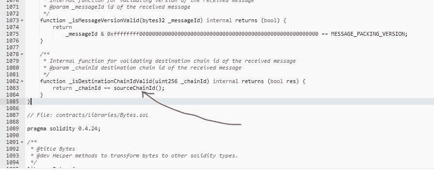

# ETHW 的连锁是其暴跌背后的主要原因之一

> 原文：<https://medium.com/coinmonks/one-of-the-main-reasons-for-the-ethw-nosedive-is-its-chain-id-9519623b5dc?source=collection_archive---------6----------------------->

## 在合并和随后的分叉中，重放攻击是一种现实的可能性。

利用 ChainID 将是区分以太坊主网和以太网的最简单的方法之一。ChainID 是一个数字，它让分散式应用程序(dApps)和智能契约知道它们正在与哪个链进行通信。

在 ChainID 的帮助下，网络用户可以决定一个广播的消息——像一个签名的交易——是应该由他们处理还是丢弃和忽略。

在以太网上，我们生成交易，用我们的私钥对它们进行签名以确保它们的真实性，然后将它们广播到网络，这样它们就可以包含在一个块中。

**什么是重放攻击？**

在更传统的市场中，重放攻击可以为黑客提供对网络上特定数据的访问，以达到复制交易或传输验证信息的目的。重放攻击带来了额外的风险，因为黑客可以在从网络上获取通信后轻松解密，而无需特殊知识。通过简单地再次传输整个内容，攻击就可能成功。

区块链容易受到重放攻击，尽管从历史上看，信用卡是更常见的目标。重播攻击更有可能在区块链最脆弱的时候成功。世界第二大加密货币的技术经历了一场实质性的革命，将使区块链的碳排放量减少 99.9%以上。

被称为“以太坊合并”的过渡已经完成。这意味着将有两个完全相同的以太坊区块链副本，所有 DeFi 头寸、ERC20 代币和交易都有工作证明和股份证明版本。随着 ETHW 作为其本地加密货币，以太坊网络的这一新分支被命名为 ETHPOW。由于大量的技术问题，该网络并没有一个良好的开端。此后，ETHW 的价值也一落千丈。

很快就发现，ETHPoW 选择了一个已经使用过的链 ID，这是导致问题的一个因素。ChainIDs 不属于任何中央注册机构或权威机构，是随机选择的。比特币现金测试网已经在使用 ETHPOW 的开发者选择的链 ID 10001。因此，在网络开通后，一些用户开始报告访问问题。

据 2022 年 9 月 16 日报道，某些攻击者通过在 EthereumPoW 上重放 PoS 链的消息(即 calldata)收获了大量的 ETHW。(又名战俘链)。PoW chain 的 Omni bridge 使用过期的 chainId，并且不正确地验证跨链消息的真实 chainId，这是导致该漏洞的主要原因。

不幸的是，在这个契约中使用的验证的 CHAINID 是从保存在 unitStorage 存储器中的值中导出的，并且它不是由 EIP-1344 推荐的 chainId 操作码真正获得的 chainId。

黑客首先发送 200 个 wet 通过 Omni 桥。他们通过在 PoW 链上重复相同的呼叫数据获得了额外的 200 ETHW。

ETHPoW 的开发者对此事做出了回应，声称这次攻击利用了该桥使用的合同中的一个弱点，而不是他们自己的区块链中的一个漏洞。

**我们如何防止未经授权的重播？**

我们必须确保在一个链上签名的任何事务(PoW 或 PoS)在另一个链上重放时会意外失败。

最好的策略是将两条链上的所有资产转移到那些链的全新账户上。因为这些资产在 PoS 链上的帐户 B 中不可用，所以由 PoS 帐户上的 B 签名的交易的重放将失败，例如，如果帐户 A 将钱分别转移到 PoW 和 PoS 链上的帐户 B 和 C。

根据以太坊协议，帐户发送到网络的每笔交易都必须有一个唯一的编号。nonce 是序列中的第一个整数，也是需要签名的事务有效负载的元素。不能有任何间隙，因为协议规定账户发送的每笔交易都有一个随机数 0，随后每笔交易增加 1。

nonce 差异的情况是基于这样的想法，即如果一个链提前了帐户的 nonce，另一个链将在交易序列中落后，从而由于 nonce 间隙而不可能重放交易。这是真的，但只是在当前存在分歧的情况下。重放将再次成为可能，即如果攻击者成功地在对方链上执行交易并匹配帐户的随机数。如果账户所有者忘记了需要随机数的分歧，并且无意中在另一个链上进行交易，重放可能再次成为可能。

**闭幕词**

作为从以太坊网络现有的工作证明(PoW)挖掘范式向利益证明(PoS)共识过程过渡的一部分，合并将逐步淘汰挖掘器，代之以验证器。此次合并是历史上对区块链基本功能的最大修改，标志着区块链以太坊运营方式的根本性改变。合并可能会有几个意想不到的影响，我们将在后面的帖子中讨论。

> 交易新手？尝试[加密交易机器人](/coinmonks/crypto-trading-bot-c2ffce8acb2a)或[复制交易](/coinmonks/top-10-crypto-copy-trading-platforms-for-beginners-d0c37c7d698c)