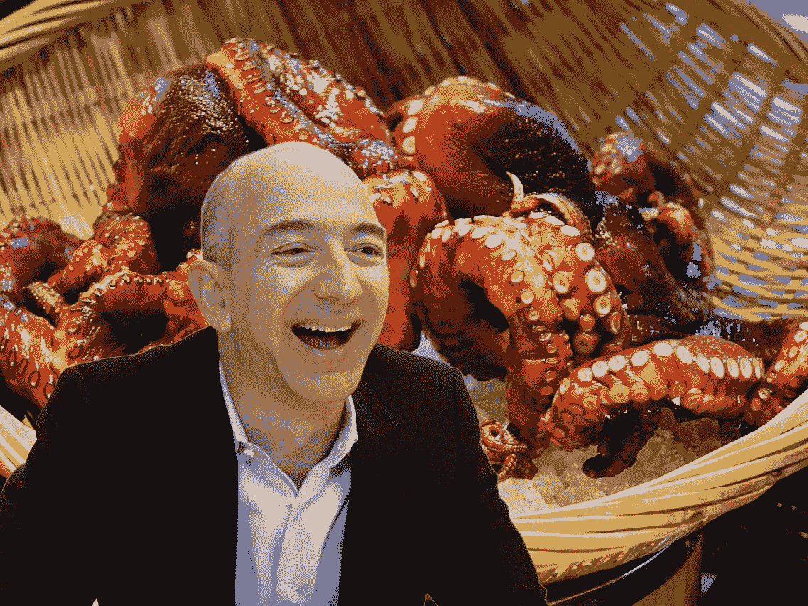

# 有史以来最迷人的故事之一是杰夫·贝索斯吃早餐章鱼。

> 原文：<https://medium.com/coinmonks/one-of-the-most-fascinating-stories-ever-is-jeff-bezos-having-breakfast-octopus-20ebaf54b12?source=collection_archive---------16----------------------->

Everyone on planet earth has their eccentricities and Billionaires are no exceptions.

所以你一定在想:早餐章鱼到底是什么？

它是一份配有海鲜的英式早餐吗？

早餐时陪伴你的是活章鱼吗？

不完全是。

它的“地中海章鱼配土豆、培根、青蒜酸奶和一个荷包蛋”。

我不得不承认，早餐吃那个不是一件正常的事。

但是作为一个亚洲人，章鱼、鱿鱼或普通海鲜对我们的肚子来说并不陌生。

但是对于杰夫·贝索斯，这位在世的(以前的)首富来说，这是他平常健康早餐的一个例外。

Matt Rutledge is an American Internet entrepreneur, best known as the founder and former CEO of the daily deal site Woot. Woot was acquired by Amazon in 2010, and Rutledge resigned his position at Amazon in 2012.

早在 2010 年，马特·拉特利奇(Matt Rutledge)以 1.1 亿美元的价格将他的每日交易电子商务公司 Woot 卖给了亚马逊(Amazon)。

此后，他于 2014 年从达拉斯飞往西雅图，在交易签署后与杰夫会面。

显然，杰夫不擅长开玩笑，根本没有会议议程。

尴尬。

到了点菜的时候，杰夫选择了早餐章鱼(令人震惊)，当马特问为什么时，他说:“你是我早餐要吃的章鱼，”贝佐斯说。“当我看菜单的时候，你是我无法理解的东西，是我从未吃过的东西。我必须吃早餐章鱼。”

令人震惊。

这是我听过的最奇怪的回答。

让我笑了。

Amazon had some incredible acquisitions like Whole Foods, Twitch and Ring, which are industry leaders in their own categories.

我不知道这是杰夫屈曲还是他真的这样想。

他真的把马特比作他早餐吃的章鱼。

他是不是在说马特/伍特是他为了更好地理解而必须获得的未知？

他是在展示他是那种敢于面对未知的冒险类型吗？

也许他只是在讽刺？

无论如何，马特很快离开了亚马逊。“在亚马逊手下工作并向其汇报的压力已经开始改变 Woot 的基本风格，拉特利奇想要退出。亚马逊收购 Woot 是因为贝佐斯不理解它，认为它令人兴奋，但亚马逊没有拥抱 Woot 的风格并向它学习，而是改变了它。”

You get to walk away coolly from explosions like a Hollywood superhero the moment your networth hits the $100B+ club.

你这个故事最吸引人的地方是什么？

这不是一个“从此幸福快乐”或“积极向上的故事”

杰夫是个杀手。

无论是生意还是生活。

他一意孤行，得到了他想要的。

他买 Woot 不是因为他想整合它或者向它学习。

他买只是因为不了解。

为此，他需要拥有它。

就像早餐章鱼一样。

哦，记住:

"一般来说，早餐章鱼必须被杀死才能食用."

嗯。

也许我们都应该找出我们的“早餐章鱼”是什么，然后吃掉它。

战胜我们的恐惧，迎接挑战，发现阻碍我们前进的未知。

-

你会尝试早餐章鱼吗？

-

# startups # business # startupx # growth # success # social media # culture # entrepreneurs # strategy # jeffbezos # octopus # mattrutledge # Amazon # unknown # breakfast octopus # founders

> *交易新手？试试* [*密码交易机器人*](/coinmonks/crypto-trading-bot-c2ffce8acb2a) *或* [*复制交易*](/coinmonks/top-10-crypto-copy-trading-platforms-for-beginners-d0c37c7d698c)
> 
> *分散密码持有量，了解* [*币安替代品*](https://coincodecap.com/binance-alternatives)
> 
> *加入 Coinmonks* [*电报频道*](https://t.me/coincodecap) *和* [*Youtube 频道*](https://www.youtube.com/c/coinmonks/videos) *获取每日* [*加密新闻*](http://coincodecap.com/)

# 另外，阅读

*   [复制交易](/coinmonks/top-10-crypto-copy-trading-platforms-for-beginners-d0c37c7d698c) | [加密税务软件](/coinmonks/crypto-tax-software-ed4b4810e338)
*   [网格交易](https://coincodecap.com/grid-trading) | [加密硬件钱包](/coinmonks/the-best-cryptocurrency-hardware-wallets-of-2020-e28b1c124069)
*   [密码电报信号](/coinmonks/top-3-telegram-channels-for-crypto-traders-in-2021-8385f4411ff4) | [密码交易机器人](/coinmonks/crypto-trading-bot-c2ffce8acb2a)
*   [最佳加密交易所](/coinmonks/crypto-exchange-dd2f9d6f3769) | [印度最佳加密交易所](/coinmonks/bitcoin-exchange-in-india-7f1fe79715c9)
*   [面向开发者的最佳加密 API](/coinmonks/best-crypto-apis-for-developers-5efe3a597a9f)
*   最佳[密码借贷平台](/coinmonks/top-5-crypto-lending-platforms-in-2020-that-you-need-to-know-a1b675cec3fa)
*   [免费加密信号](/coinmonks/free-crypto-signals-48b25e61a8da) | [加密交易机器人](/coinmonks/crypto-trading-bot-c2ffce8acb2a)
*   杠杆代币的终极指南