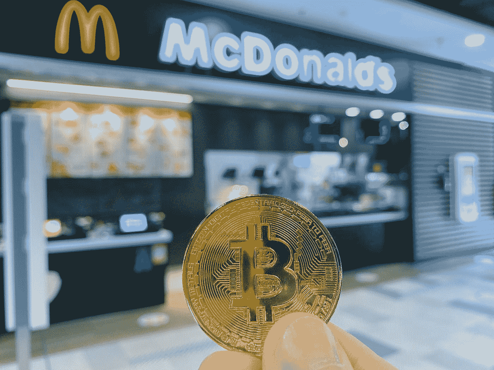

# 使用比特币支付的在线商店(2023 年)

> 原文：<https://medium.com/coinmonks/online-store-with-payment-in-bitcoin-2023-3c3b267b5357?source=collection_archive---------10----------------------->

你很可能听说过比特币(BTC)，这是一种数字货币，它省去了中间人**(即政府和金融机构)**，允许各方直接相互交易。

Photo by [regularguy.eth](https://unsplash.com/@moneyphotos?utm_source=medium&utm_medium=referral) on [Unsplash](https://unsplash.com?utm_source=medium&utm_medium=referral)

这一点，加上你可以使用比特币匿名购买商品和服务，使得 BTC 成为许多人的一个有吸引力的支付选择。