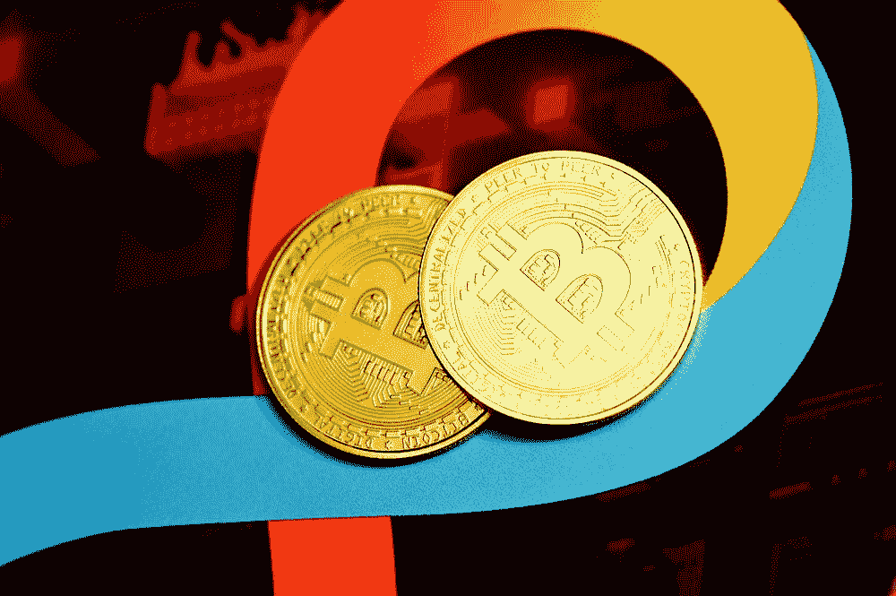

# 只有傻瓜才会被秘密骗局迷惑——直到我被一个骗局迷惑

> 原文：<https://medium.com/coinmonks/only-stupid-people-fall-for-crypto-scams-until-i-fell-for-one-19042dd092e8?source=collection_archive---------26----------------------->

Photo by [Kanchanara](https://unsplash.com/@kanchanara?utm_source=unsplash&utm_medium=referral&utm_content=creditCopyText) on [Unsplash](https://unsplash.com/s/photos/scam?utm_source=unsplash&utm_medium=referral&utm_content=creditCopyText)

> 每个人都有一个计划，直到他们被打了一拳——迈克·泰森

我要坦白一件事。就像所有“聪明”的人一样，我认为我太聪明了，不会上当受骗，尤其是在加密领域。

我以为我会成为下一个一夜暴富的百万富翁，我的策略万无一失——直到砰！！我刚被拉了地毯；我的钱几分钟内就不见了。

我写这篇博客是为了警示大家要格外警惕，没有人会因为太聪明而上当。毕竟，我，一个智商堪比阿尔伯特·爱因斯坦(lol)的超级聪明的家伙，被骗了。

> 交易新手？试试[加密交易机器人](/coinmonks/crypto-trading-bot-c2ffce8acb2a)或者[复制交易](/coinmonks/top-10-crypto-copy-trading-platforms-for-beginners-d0c37c7d698c)

尽管已经很晚了，我还是对我亲身经历过的加密骗局做了一些研究，这样你，也就是阅读这篇文章的人，将会从我的错误中受益，并避免将钱输给一些加密骗子。

# 地毯拉骗局

开始这个列表的最好方式是介绍让我上当的骗局，[拉地毯骗局](https://economictimes.indiatimes.com/industry/banking/finance/rug-pulls-avoiding-the-cryptocurrency-scam/what-is-rug-pull/slideshow/91563115.cms)。这是一个典型的利用现代人害怕错过的秘密骗局(FOMO)。

如果你对加密很有经验，你可能会听到有人告诉你要避免“参与”一个项目。

倾听他们；我就是这样被骗的。

在加密货币价格跟踪网站 Coinmarketcap 上新上市的硬币中，这枚硬币表现最佳。作为一个勤奋的投资者，我做了必要的研究，我检查了他们的网站——看起来是合法的，我检查了他们的社交媒体存在——人们对此感到兴奋，我检查了他们的电报账户——里面全是兴奋的投资者。

不用说，我害怕错过它，买了一些(出于隐私，我不会透露多少)。几分钟后，我最初投资的价值下跌了 80%，几分钟后，下跌了 90%。

我一直希望这只是一次下跌，价格会回升，但从来没有。

他们的社交媒体陷入沉默，每个人都在他们的电报群聊中保持沉默。那时，我知道它已经是官方的了；我刚被拖下水了。

# 浪漫骗局

“尼日利亚王子”骗局的另一个变种，除了[这个](https://www.fbi.gov/scams-and-safety/common-scams-and-crimes/romance-scams)的目标是 simps。

这也是我曾经近距离接触过的。

在我创建 twitter 账户并开始关注 crypto influencer 的第一天，这个可爱的女孩开始给我发消息。谢天谢地，我知道我没有那么吸引女性进入我的 dms (lol ),所以我立刻提高了警惕。

长话短说，她开始谈论一项加密投资，以及她如何需要我的加密钱包的种子短语。不用说，在她要求的那一刻，我很快就离开了那里，并立即阻止了她。

无论如何，秘密浪漫骗局的工作原理是获得受害者的信任和喜爱，然后利用这一点来劝诫有价值的信息拉一个骗局。

所以，如果你的吸引力水平与约翰尼·德普或克里斯·海姆斯沃斯不在一个水平上，当一个可爱的女孩试图溜进你的 dms 时，你要提高警惕。

顺便说一下，浪漫骗局不仅仅发生在男人身上，它也可能发生在每个性别身上。所以，要时刻保持警惕。

那么，这里的关键要点是什么？

好吧，首先，如果你，就像我一样被一个骗局骗了，不要难过，因为它发生在我们最好的人身上(特别是我，jk)。只要知道这不是世界末日，把它当作一个非常非常昂贵的教训。以这种方式表达会让你感觉好一点，也更容易接受(我就是这么做的，而且有点效果)。

> “聪明的人会从错误中学习。但真正聪明的人会从别人的错误中吸取教训”——布兰登·穆尔

如果你足够幸运，没有被骗，请以此为戒，保持你的记录清白。成为真正犀利的一个。