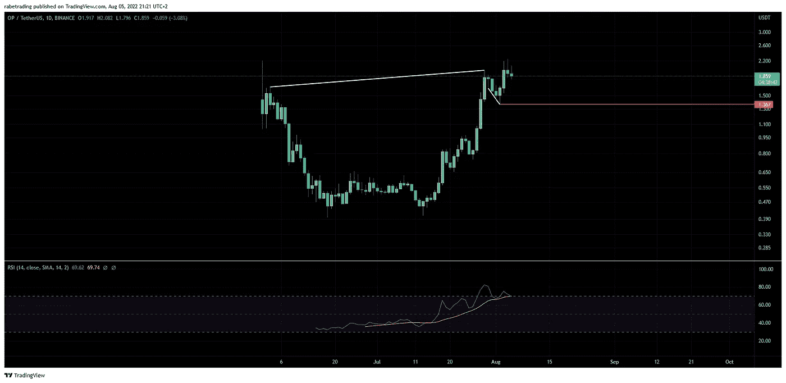

# OP 令牌价格上涨超过 200%，现在怎么办？

> 原文：<https://medium.com/coinmonks/op-token-price-rises-by-more-than-200-now-what-d037a0ca4655?source=collection_archive---------20----------------------->

这是 L2 解决方案乐观主义者的象征性价格上涨后的转折

在市场整体看跌的情况下， **OP 的价格**在 7 月份到现在成功地将**的价格推高了 200%** 。

所以现在价格预计会下降，这是最有可能发生的，但这里有一个转折，在轻微的价格下降后，预计在不太长的时间内会出现一个很好的上涨。

# 价格图表的技术分析

OP/USDT daily price chart showing a cup and handle formation, Source: TradingView

看看**OP**a**杯柄图案**的每日价格图，不禁让人注意到价格还有上涨空间。

然而，**相对强度指数(RSI)指标**显示，该令牌处于**超买**区域，预测即将发生反转，但这不会影响杯子和手柄形成的可能性，只要价格不跌破**手柄低点**，因此即使**价格下跌**超过 25% 也不会影响这种情况，因为事实上一个小的降温可以

# 支持这一理论的基础

目前**密码世界**最值得期待的事件是**以太坊**的**“合并”**事件**9 月 19 日**，点击 [*此处*](https://ethereum.org/en/upgrades/merge/) 了解详情。

在**合并**之后，**以太坊**的下一步是**分片升级**，这将使**升级**，以太坊目前首选的**第 2 层解决方案**的**可伸缩性**比现在**更便宜**，并最终扩展**吞吐量**(每秒更高的事务数)，同时充分利用**的安全性**

并且 **OP** 是**乐观主义** ( **第二个领先的以太坊第二层解决方案**，也是**一个汇总**)的治理令牌，预计**会推动**，因为**合并**的发生就像是一个确认，直到**分片升级**只是一个时间问题。

# 结论

这种情况对 **OP token 期货价格**如此**看涨**，也有一些**看跌**的迹象需要考虑。

首先，目前市场的整体情绪是看跌的，这降低了这种形成的成功率。

第二，我们的杯和手柄模式是右唇较高的杯类型，其性能比左唇较高的杯类型低。

最后，以太坊开发者可以在任何时候宣布推迟合并，这并不奇怪，但市场会以悲观的方式做出反应。

*   ****** 这篇博文只是一种观点，这不是一个财务建议或任何类型的建议，所有使用的信息都是在互联网上公开找到的！

> 加入 Coinmonks [电报频道](https://t.me/coincodecap)和 [Youtube 频道](https://www.youtube.com/c/coinmonks/videos)了解加密交易和投资

# 另外，阅读

*   [Bookmap 评论](https://coincodecap.com/bookmap-review-2021-best-trading-software) | [美国 5 大最佳加密交易所](https://coincodecap.com/crypto-exchange-usa)
*   [如何在 FTX 交易所交易期货](https://coincodecap.com/ftx-futures-trading) | [OKEx vs 币安](https://coincodecap.com/okex-vs-binance)
*   [CoinLoan 评论](https://coincodecap.com/coinloan-review) | [YouHodler 评论](/coinmonks/youhodler-4-easy-ways-to-make-money-98969b9689f2) | [BlockFi 评论](https://coincodecap.com/blockfi-review)
*   [XT.COM 评论](https://coincodecap.com/profittradingapp-for-binance)币安评论 |