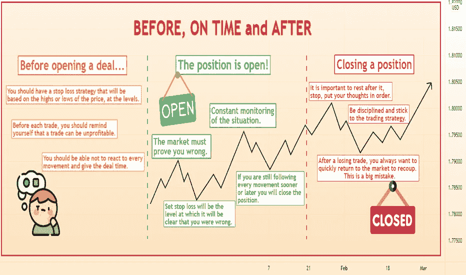

# 打开、保持和关闭 POSITIONS❗❗

> 原文：<https://medium.com/coinmonks/opening-holding-and-closing-positions-c0b94d118208?source=collection_archive---------63----------------------->

# **大家好**
今天我们将试着找出在交易的开始、持有和结束时什么样的思维是正确的。任何交易者都面临这三个阶段，但不是每个人都知道如何正确行事，因此会犯错。
走！

# **交易开始前…**

# 每当你找到一个符合你的交易策略规则的进场点时，你应该考虑以下重要的几点:

# *确定设置止损的水平。*
没有必要因为贪婪而设置更小的止损。你应该有一个止损策略，基于价格的高点或低点，因为这些值真的很重要，价格超过这个水平会更困难，这将保护你的头寸和止损，防止过早平仓。

# 你必须能够接受损失。每次交易前，你应该提醒自己，交易可能是无利可图的，因为市场上没有百分之百的东西。每天都要记住这个。请记住，设置并不总是有效的，然后你不会因为重新安排止损或根本不设置止损而损失更多。

> 交易新手？尝试[加密交易机器人](/coinmonks/crypto-trading-bot-c2ffce8acb2a)或[复制交易](/coinmonks/top-10-crypto-copy-trading-platforms-for-beginners-d0c37c7d698c)

# 这需要时间。
这笔交易一分钟不达目的。市场会朝着不同的方向移动，你应该能够不对每一个运动做出反应，给交易时间。许多人忘记了这一点，但由于对市场的不断监控和对每个动作的反应，交易者会犯错和亏损。你需要能够等待，理解这一点。让交易进行，不要干涉。

# **职位空缺！**

# 最有趣的事情就从这里开始！正是在这里，人们犯了大量不必要的错误。

# 市场必须证明你是错的。
开仓后，设定的止损将会是明确你错了的水平。你应该离开未平仓头寸，让价格证明你是对的，或者给你一个错误的观点。触及止盈价格意味着你是对的，没有止损。

# 持续监控局势。
如果你还在跟踪每一个动作，很可能你会对错误的价格波动做出反应，迟早你会平仓。你可能只是厌倦了观察价格变动，最终犯了一个错误。
你可以每天查看一两次交易，但不能超过一次。
你必须根据你的策略行动，这就给出了开仓的信号。让策略发挥作用，不要干涉。

# **平仓**

# 交易是否有利可图并不重要，重要的是交易后休息一下，停下来，整理一下你的思绪。在平仓后，很难回到市场进行新的交易，尤其是在交易有利可图的情况下。毕竟，它们会导致过度自信，从而导致你大量开出糟糕的交易。

# 在亏损的交易后，你总是想尽快回到市场上收回。这是一个很大的错误。基于赢回失去的东西的愿望而开启的交易，是一个坠入深渊的深渊。在感情上，你跑去开始一笔交易，在不好的信号下开始，甚至失去更多，如此反复。你必须明白，在市场上赔钱是正常的，你不必跑去把它们赢回来。学会接受损失。

# 平仓后你唯一应该做的就是遵守纪律，坚持交易策略。最简单的方法是离开市场，离开图表一段时间。

# 记住你需要能够省钱是非常重要的。如果你已经赚了，在月底提取一部分，让它成为你的奖励，这会给你自信，长期来看你会成为一个更冷静的交易者。

# **请鼓掌跟随，谢谢。**

# **好运！**