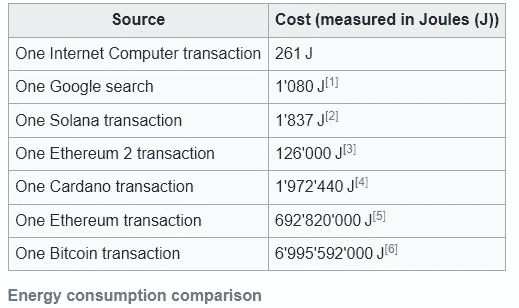

# OpenSea 替代方案:互联网计算机协议(ICP)的 NFT 市场展示

> 原文：<https://medium.com/coinmonks/opensea-alternatives-nft-marketplace-showcase-in-the-internet-computer-protocol-icp-4b0c47bea44f?source=collection_archive---------8----------------------->

## 发现最好的 Opensea NFTs 市场的替代品，在互联网计算机协议中放下你的 NFT 收集

你是否厌倦了无法推广你的 NFTs 的 Opensea？

找到不同的渠道来铸造你的 NFTs 可能是促进你的 NFTs 创造者职业生涯的一个新起点。

***在本文中，我将带您了解互联网计算机协议(ICP)中的 Opensea 替代方案。***

***我们将为 NFT 市场制作灯光，帮助你提升你的网络 3 事业。***

> 但是首先，为什么选择 ICP 进行 NFTs？

# NFTs 在互联网计算机协议(ICP)中的优势

*   IC 是一个更快、更便宜、更安全的 Web3 平台。
*   **用户零气费/铸币费:**稳定的逆向气模式，开发者提供运行应用所需的资金**。**这种被称为“周期”的气体稳定在 1×1012 周期= 1 SDR(1.41 美元)
*   **链上存储的低成本**($ 5/GB/年)IC 已经成为许多项目的存储平台选择。
*   **超高速** IC 节点由全球最强大的独立数据中心运行，拥有 250 毫秒的查询和 2 秒的写入/更新。
*   **无限可扩展性 IC** 可以通过无缝生成新子网进行无限扩展，而不会中断网络。
*   **基于 Web3 和 100%去中心化的 dApp 开发全栈解决方案**。
*   **绿色和可持续的区块链**互联网计算机的能耗大大低于区块链的竞争项目，也低于现有的(高度优化的)web2 技术。

> 交易新手？尝试[加密交易机器人](/coinmonks/crypto-trading-bot-c2ffce8acb2a)或[复制交易](/coinmonks/top-10-crypto-copy-trading-platforms-for-beginners-d0c37c7d698c)

[https://coincodex.com/article/14198/layer-1-performance-comparing-6-leading-blockchains/](https://coincodex.com/article/14198/layer-1-performance-comparing-6-leading-blockchains/)

[https://wiki.internetcomputer.org/wiki/Internet_Computer_performance_%26_power_consumption](https://wiki.internetcomputer.org/wiki/Internet_Computer_performance_%26_power_consumption)

# 互联网计算机协议(ICP)中的 NFTs 市场

# 高容量:

# 1.仓库

“转口港是一个交易站，用户可以在这里以分散、非托管的方式在互联网计算机上存储和交易数字资产。”

[entrepot.app](http://entrepot.app)

Entrepot 是由 ToniqLabs 开发的，它是互联网计算机上比较发达的应用程序之一，拥有大量的 NFT 收藏，在 NFT 的交易量超过 300 万美元。

该平台的费用非常低(1.0%)，它是非托管的，有定制收藏，它是第一个 NFT 市场和集成电路上的 DeFi 解决方案。

[entrepot.app](http://entrepot.app)

# 2.白纬玲

yumi.io

## 技术描述

白纬玲是一个完全去中心化的平台(包括前端和后端)，所有 NFT 数据(包括艺术品本身)都完全托管在链上，而不是由一个指向链外存储文件的超链接组成。这意味着没有中央权力机构可以阻止访问您的数字收藏品。

白纬玲是真正的隐私、安全和抵制审查的。它致力于链间可操作性和元宇宙集成。

## 其他区块链 NFT 市场的买方和卖方的优势

白纬玲的特点是没有气费(稳定反向气模式)。由于互联网计算机的可扩展性，白纬玲可以在毫秒内查询，在秒内更新，为用户提供无缝体验。

白纬玲的特色是神秘盒子销售、造币发行、拍卖和许多其他有趣的功能。只要你在白纬玲交易 NFT，你就可以获得白纬玲信用作为交易奖励。

## 创作者的优势

1.  免费铸造:白纬玲提供交易所需的资金，并为创作者提供免费铸造！

2.高达 10%的版税:在白纬玲创作 NFT 的艺术家将获得高达 10%的版税。

# 3.CCC —大众创造的收藏品

[c3-protocol.cc](https://t.co/rvhhX1VtbA)

CCC 代表 Crowd Created Collectables，这是第一个完全去中心化的协作平台，其独特目标是连接并允许 5000 万创作者参与到 Web3 世界中。

CCC 于 2022 年 6 月推出了新的共同创作功能，主要目标是让创作者与他们的社区和粉丝合作，在双赢的情况下创作出更好的艺术品。

[c3-protocol.cc](https://t.co/rvhhX1VtbA)

# 有趣的阿尔法

# 1.果冻

[https://jelly.xyz/](https://jelly.xyz/)

甜蜜的 NFT 工具和市场基础设施从一个开放的市场协议到馆长用户界面和各种风格的工具。它希望成为一个整合 ICP、以太坊和 Solana 的跨链 NFT 市场。

由迷幻道建立，它是互联网计算机协议中最大的组织之一，已经建立了其他成功的 dapps。

# 2.不可能的事情——奥利金基金会

不可能的事情是一个跨越艺术、奢侈品、媒体和流行文化创造的最令人向往的物品和体验的市场——所有这些都由奥利金基金会的 NFT 技术提供支持。

[https://impossiblethings.com/](https://impossiblethings.com/)

本质上，Origyn 是一家 NFT 技术服务公司，为奢侈品和其他有价值的现实生活物品提供真正可靠的数字证书产品。Origyn 已经从 Paris Hilton 和 Polychain Capital 等投资者那里筹集了 2000 万美元。

用户将在“不可能的事情”中看到来自稀有和独家策划收藏的 NFT，既有来自*的，也有来自*的标志性运动员、动画师、艺术家、收藏家、摄影师、制片人、慈善组织等。

# 3.Gigaverse 实验室

[https://gigaversemarket.com/](https://gigaversemarket.com/)

Gigaverse lab DAO 想:

1.  将其他区块链连接到互联网计算机，并推出桥接 NFT 系列。
2.  为收藏家提供一套工具，建立一个跨链分散的 NFT 市场。

# 如何使用它们:互联网身份和钱包

为了使用这些 NFT 市场，你需要一个互联网身份和一个互联网计算机协议的钱包。

这里有两个指南可以帮你轻松搞定: [如何在 59 秒内设置互联网身份](/@pinoweb3/starting-with-web3-setup-the-internet-identity-replace-email-and-password-24b0285a946e)
[如何设置插件钱包扩展](/plugwallet/how-to-setup-a-wallet-in-plug-quick-guide-6504daaa37e9)

我正在与艺术家和 NFT 的创作者交流！深入了解更多信息。