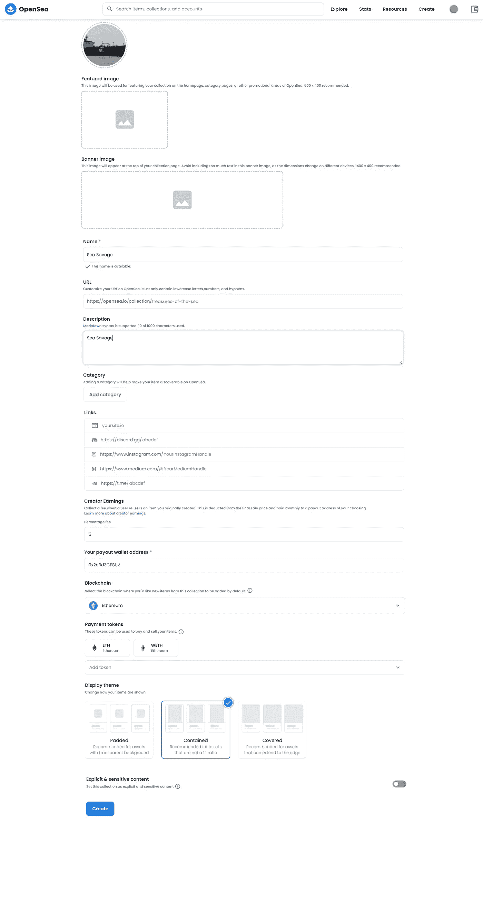

# OPENSTORE 令牌— OpenSea 集合

> 原文：<https://medium.com/coinmonks/openstore-token-opensea-collection-46ae5762477e?source=collection_archive---------4----------------------->

## NFT 系列

## OpenSea 共享店面功能

本文讨论了名为 OPENSTORE token 的 OpenSea 共享店面特性。

OpenSea 为艺术家们提供了一种简单而廉价的方式来制作他们的 NFT，而不用担心以太坊区块链高昂的煤气费。这种造币被称为懒惰造币，在这种情况下，创作者既不需要部署任何智能合同，也不需要为造币支付煤气费。

OPENSTORE 基本上是所有直接在 OpenSea Marketplace 上创建的 NFT。它们是使用 ERC-1155 标准的 OpenSea 共享契约创建的。有了 OPENSTORE 令牌，买家将支付造币费，而不是 NFT 的创造者。

有了这个 OpenSea storefront 特性，创建者可以立即交易他们的商品，而不用支付油费。简而言之，OpenSea 店面功能是完全免费的。

此外，NFT 的创造者可以从市场上每卖出一件商品获得一定比例的版税。在 OpenSea 上创建收藏时，可以设置二次销售费用。

Create collection on OpenSea

*我们可以指定版税百分比，以及它应该记入的钱包地址。*

我们应该考虑一个事实，OpenSea 总是从每笔销售中扣除 2.5%的费用作为他们的佣金。此外，如果创作者已经设置了 5%的版税，那么它也将从每第二次销售的销售价格中扣除。

在某种程度上，OPENSTORE token 允许创作者向用户出售他们的商品，并从中赚钱，而无需任何成本。另一方面，它也为创作者提供了从该项目的二次销售中赚取收入的机会。

谢谢:)

> 交易新手？试试[密码交易机器人](/coinmonks/crypto-trading-bot-c2ffce8acb2a)或[复制交易](/coinmonks/top-10-crypto-copy-trading-platforms-for-beginners-d0c37c7d698c)