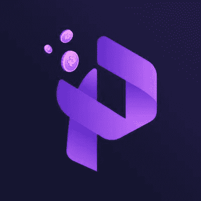

# 通过参与 Paychanger 的 CREW3 空投，有机会获得 Pay Changer 奖金

> 原文：<https://medium.com/coinmonks/opportunity-to-earn-paychanger-bonus-dollars-through-participation-in-pay-changers-crew3-airdrop-17c05459fd2f?source=collection_archive---------8----------------------->

[Pay Changer](https://paychanger.crew3.xyz/invite/oriaWQy6upxfxsyYyJYeW) 是一个分散平台，允许用户进行加密货币支付，并通过数字收购和授权访问 PACH 数字资产。为了鼓励参与，Pay Changer 向在 CREW3 airdrop 页面上完成任务的用户提供总额为 5 万美元的 [Paychanger](https://paychanger.crew3.xyz/invite/oriaWQy6upxfxsyYyJYeW) 奖金。要参与，用户必须访问该页面，连接他们的钱包，并连接他们的 Twitter 和 Discord 帐户。然后，他们必须完成列出的任务，并定期添加新任务。25，000 名最活跃的用户将分享 50，000 美元 Paychanger 奖金池，并有机会每人赢得高达 500 美元的奖金。这些奖金可用于支付佣金，并将服务连接到薪酬转换器应用程序。

# 参与支付兑换商 CREW3 空投的说明

1.  前往[工资兑换商](https://paychanger.crew3.xyz/invite/oriaWQy6upxfxsyYyJYeW) CREW3 [airdrop 页面。](https://paychanger.crew3.xyz/invite/oriaWQy6upxfxsyYyJYeW)
2.  将您的钱包连接到页面。
    将您的 Twitter 和 Discord 帐户链接到页面上的个人资料。
3.  完成当前可用的任何任务。
4.  以后可能会添加其他任务，因此请继续查看该页面的更新。
5.  25，000 名最活跃的用户将有资格分享 50，000 美元的 [Paychanger](https://paychanger.crew3.xyz/invite/oriaWQy6upxfxsyYyJYeW) 奖金池，每人最高奖金为 500 美元 [Paychanger](https://paychanger.crew3.xyz/invite/oriaWQy6upxfxsyYyJYeW) 奖金。
6.  [Paychanger](https://paychanger.crew3.xyz/invite/oriaWQy6upxfxsyYyJYeW) 奖金可用于支付应用程序中的佣金，或将您的服务连接到 Paychanger 应用程序。

> 交易新手？在[最佳加密交易](/coinmonks/crypto-exchange-dd2f9d6f3769)上尝试[加密交易机器人](/coinmonks/crypto-trading-bot-c2ffce8acb2a)或[复制交易](/coinmonks/top-10-crypto-copy-trading-platforms-for-beginners-d0c37c7d698c)

了解有关 Paychanger 的更多信息:

> 加入 Coinmonks [电报频道](https://t.me/coincodecap)和 [Youtube 频道](https://www.youtube.com/c/coinmonks/videos)了解加密交易和投资

# 另外，阅读

*   [密码交易机器人](/coinmonks/crypto-trading-bot-c2ffce8acb2a) | [OKEx vs 币安](https://coincodecap.com/okex-vs-binance)
*   [币安 vs FTX](https://coincodecap.com/binance-vs-ftx) | [最佳(SOL)索拉纳钱包](https://coincodecap.com/solana-wallets)
*   [如何在 Uniswap 上交换加密？](https://coincodecap.com/swap-crypto-on-uniswap) | [A-Ads 审查](https://coincodecap.com/a-ads-review)
*   [加密货币储蓄账户](/coinmonks/cryptocurrency-savings-accounts-be3bc0feffbf) | [YoBit 审核](/coinmonks/yobit-review-175464162c62)
*   [Botsfolio vs nap bots vs Mudrex](/coinmonks/botsfolio-vs-napbots-vs-mudrex-c81344970c02)|[gate . io 交流回顾](/coinmonks/gate-io-exchange-review-61bf87b7078f)