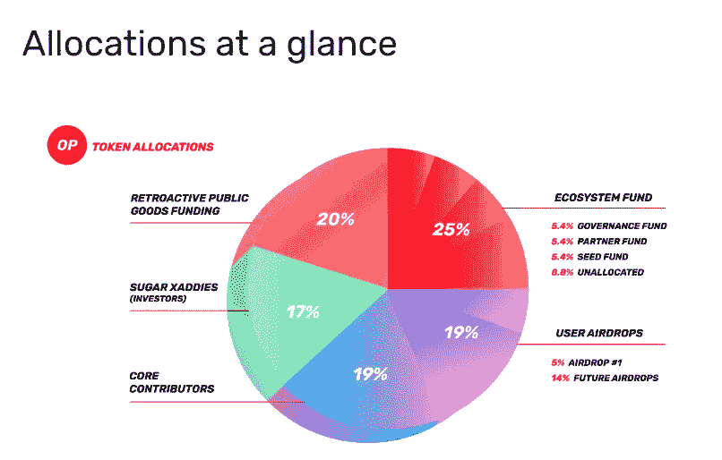
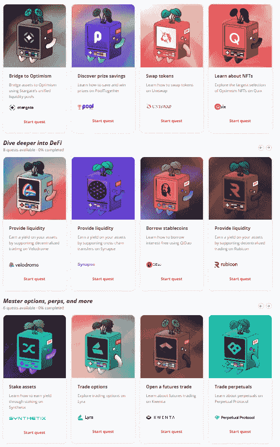
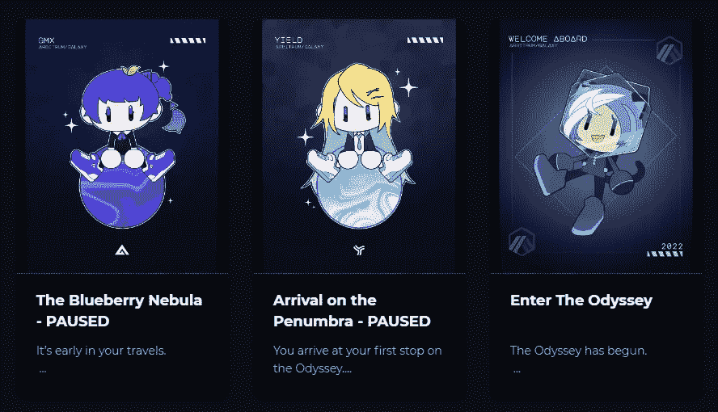
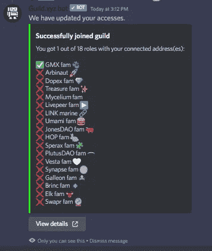
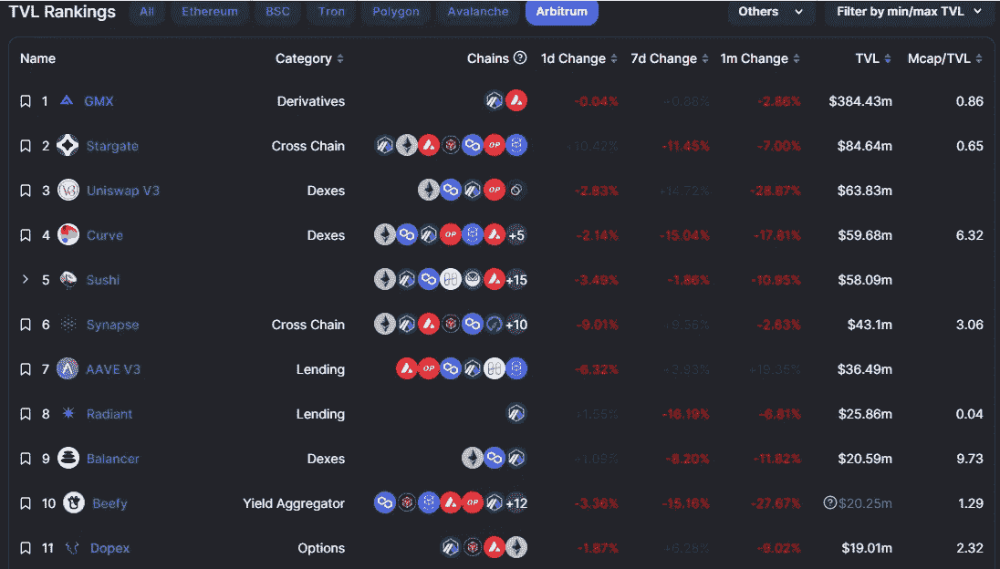

# 乐观主义/Arbitrum 空投指南

> 原文：<https://medium.com/coinmonks/optimism-arbitrum-airdrop-guide-a69f8f6b6ac6?source=collection_archive---------0----------------------->

瞧，我知道你在想什么——真的吗？又一个空投指南？我明白了，我发誓我在 twitter 上一半的消息都是关于不同的空投，传言或证实的推测。但是听我说，有很多人从乐观空投中获得了巨大的利润，而这仅仅是总供应量的 5%。在[还有 14%的剩余](https://community.optimism.io/docs/governance/allocations/)分配给未来空投的情况下，对我来说至少考虑一下是否值得追求是有意义的:

以 Arbitrum 为例——它们确实是唯一没有自己的原生令牌的主要第 2 层，所以我想说，我们很快就会听到一些关于潜在的$ARB 或$ARBI 令牌的具体消息，这只是时间问题。

考虑到两者都有以太坊的安全性和可靠性，考虑到运行 Arbitrum 和乐观主义的成本和效率，在我看来这是一个相对低风险的游戏。事实上，因为我绝对讨厌 mainnnet 的可怕的天然气费，我现在做的大多数行动都是在第二层。

让我们开始具体细节，好吗？

# 乐观

我从乐观主义开始，因为他们可能有最清晰的任务路线图来证明你已经探索并使用了乐观主义生态系统。如果你看一下乐观上的[任务，](https://galxe.com/Optimism/campaign/GC6xiUtedg)总共有 18 个不同的任务你可以完成，以便能够铸造，从而产生 18 个不同的 NFT:

关于这些 NFT 的酷的部分(通常是乐观的)是，它们实际上只需要几分钟就可以完成，并且许多任务可以在不到一天的时间内完成。

你还会注意到，这些 NFT 的大部分可申请期限是 2023 年 1 月 17 日，这意味着你至少有几个月的时间来完成这些任务。据我所知，下一次空投日期尚未宣布，但对我来说，让他们在那个日期前后开始拍摄快照是有意义的。

除了 NFTs 之外，你可以从空投#1 的[分解中解析出几个主题，这可能为他们在未来的空投中寻找什么其他标准提供线索。其中包括:](https://community.optimism.io/docs/governance/airdrop-1/#airdrop-1-allocations)

1.  **重复乐观用户—** 直接取自文档，这是 Airdrop #1 的一个标准:

> *Address 是一名“乐观主义用户”,在四周或更长时间内至少与乐观主义应用程序进行了一次交易。这是为前 20%的“乐观主义用户”选择的。*

2.**投票/授权** —很明显，从 Airdrop #1 开始，乐观主义团队希望培养和奖励社区中的积极成员，因此他们向 on Maker 和 Aave 等 DAO 投票人求助是有道理的。因此，他们奖励他们*自己的*社区的积极成员是有意义的，这意味着如果你在乐观主义方面授权(或授权给自己)，我希望这可能会增加你证明自己确实是乐观主义社区的一员的机会。

# 仲裁

与乐观主义不同，还没有宣布空投，但看到它是最后一个没有自己的本机令牌的主要第 2 层，许多人猜测，这只是一个时间问题，直到$ARBI 令牌变得可用。你可能听说过“[Arbitrum Odyssey](https://galxe.com/arbitrum)”——galxe.com 上的一项活动，允许用户在完成各种任务时获得 NFTS:

如果你正在感受 FOMO，因为你已经错过了“进入奥德赛”NFT，那么在 opensea 上有一大堆非常便宜的东西出售。但是请记住，购买(而不是赚取)NFT 是否会使某人有资格空投，这完全是猜测。

正如你在上面的图片中看到的，奥德赛暂停了，自从去年 6 月以来，该团队希望首先完成硝基升级:

Nitro 升级在八月下旬完成，但不幸的是没有 Arbitrum Odyssey 恢复的相关消息:

Arbitrium Odyssey 被推测为最有可能的资格赛之一，如果他们要进行空投的话，但看到它仍然暂停，许多人推测[Arbitrium 的公会任务](https://guild.xyz/arbitrum)也将作为资格赛。发布于八月，通过完成他们的 18 个公会任务中的每一个，你可以通过他们的不和谐服务器获得角色:

再一次，任何导致空投的任务的完成都是纯粹的猜测，就像空投$ARBI 代币本身一样。然而，看看到目前为止已经发布的公会和奥德赛任务的主题，很明显他们试图鼓励人们参与 Arbitrum 生态系统，所以不管你是否完成了这些任务，我想更重要的是你的链上地址是否定期与其最流行的协议交互。

如果我们将流行与 TVL 联系起来，那么我会浏览并开始查看 [defi llama 的](https://defillama.com/chain/Arbitrum)不同 Arbitrum 原生平台列表:

由于其相对便宜的汽油费，我不认为它会伤害到周围，做一些互换，加入一些有限合伙人，也许在你检查 Arbitrum 的同时获利。

# 结论:

有了便宜得多的汽油费和相同的 Eth-security 标准，我可能 90%左右的活动是在第 2 层进行的，而不是在以太坊主网上。我越来越多地看到，以太坊主网只有在交易量至少达到 4-5 位数时才真正有意义，否则，你可能要支付 100 多美元来移动价值 100 美元的代币(尤其是在油价高得离谱的时候！).

因此，除了空投，我强烈建议人们检查第二层的成本效益以及他们在那里建造的所有非凡的东西。

最后，我想随着时间的推移，可能会有更多/不断变化的信息和下一次空投发生的细节，所以请务必在 Twitter([https://twitter.com/CryptosWith](https://twitter.com/CryptosWith))上关注我，获取我所有的最新更新。

免责声明:最后提醒一下，这不是财务建议，仅用于教育和娱乐目的。请一如既往地做自己的研究，找到最适合你的投资。大家注意安全！

> 交易新手？试试[密码交易机器人](/coinmonks/crypto-trading-bot-c2ffce8acb2a)或者[复制交易](/coinmonks/top-10-crypto-copy-trading-platforms-for-beginners-d0c37c7d698c)