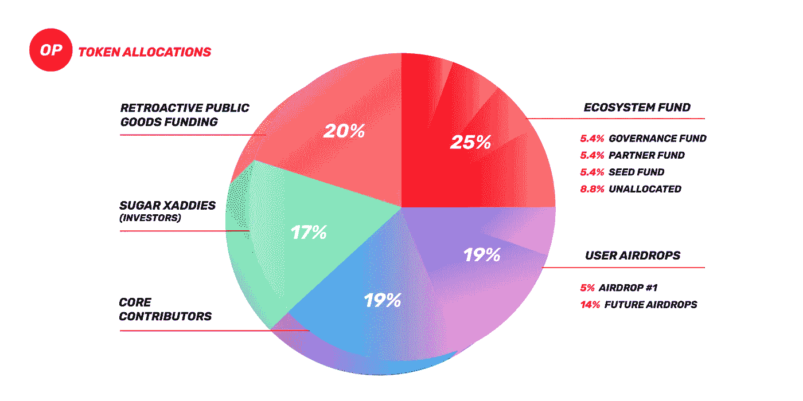
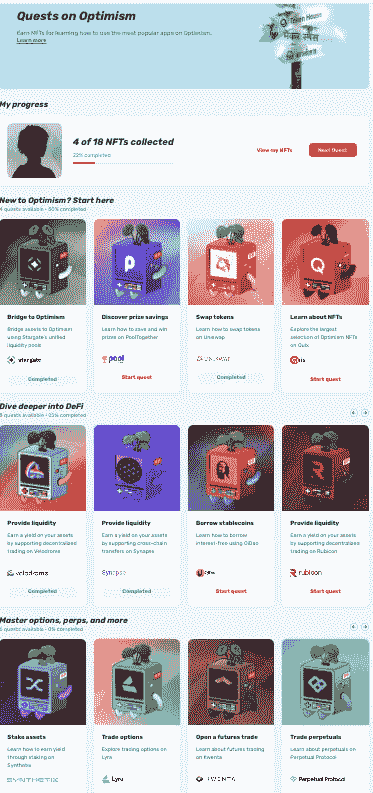
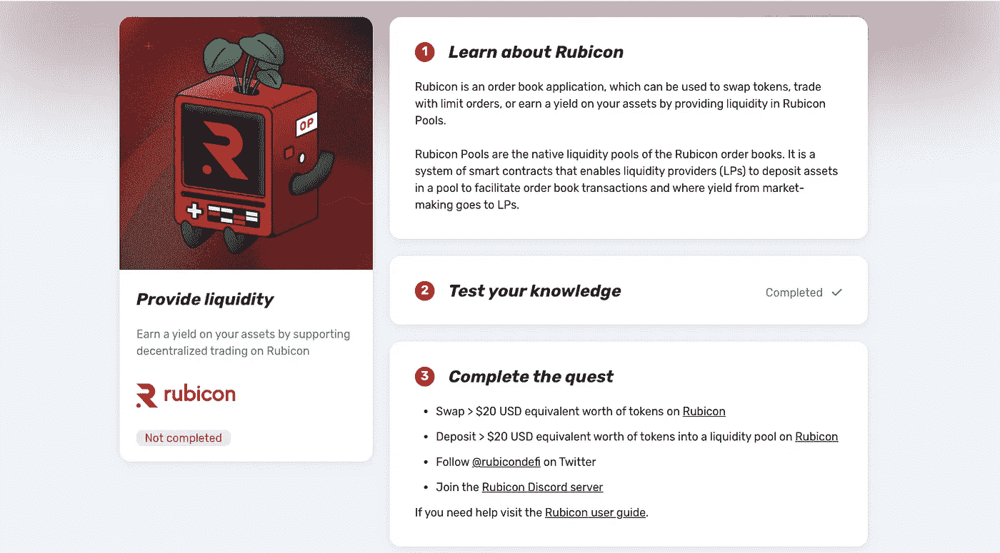
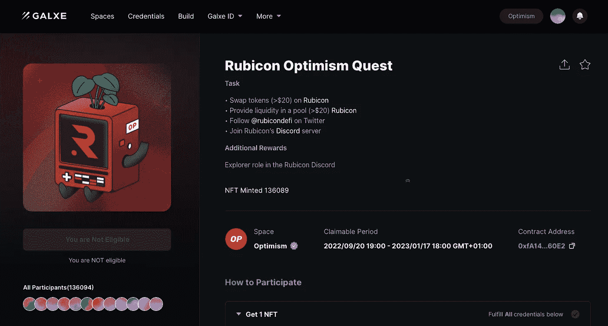

# 对 2023 年的乐观

> 原文：<https://medium.com/coinmonks/optimism-for-2023-2c51be4081b?source=collection_archive---------4----------------------->

如果你是那些错过了第一次乐观空投的人之一，那就是你的机会:如果你深入研究[乐观文件](https://community.optimism.io/docs/governance/allocations/)，你会发现 22%的令牌发射被分配给空投，只有 8%已经被释放。所以，受益的机会还是有的。

像往常一样，很少有人知道如何获得空投资格。

> 不知道什么时候买卖 cryp，试试[复制交易](http://coincodecap.com/go/bityard)。

但是如果你仔细想想，新的协议只是想让人们参与进来，发现它们，并使用它们。因此，最简单的验证方法是尝试在协议最初几天发布的 Dapps。

乐观主义者(最终)解决了这个问题:事实上他们发布了[任务](https://app.optimism.io/quests)和协议的 18 个主要 Dapps。

此外，他们指定了建议的测试/使用类型，如果你满足他们的测试规格，你将为每个 Dapp 赢得 1 NFT。你也应该回答一些问题，但没有麻烦:如果你给出了错误的答案，你可以提交正确的答案。截止日期是 1 月 18 日，因此**你有时间，但没有足够的时间**，因为一些 Dapps 认为资金会在合约中停留几天。

您可以找到详细的分步指南来完成每项任务:

[乐观任务](https://app.optimism.io/quests):每个任务都有项目和所需任务的描述([图标示例](https://app.optimism.io/quests/rubicon-provide-liquidity))

[加尔西](https://galxe.com/Optimism/campaign/GC6xiUtedg):一旦你回答了测试并完成了任务，你就可以领取你的 NFT 了:你会被引导到加尔西，在那里你会找到一个更详细的任务列表([卢比孔图标示例](https://galxe.com/Optimism/campaign/GCYaiUtX17))。

在网上，你可以找到乐观空投的视频解释(见[托尔·哈特维森](https://www.youtube.com/watch?v=qmsWrzu_Fuk&t=1s)一个)以及完成任务的逐步指南([密码帝国](https://www.youtube.com/watch?v=RxBalCSQfTU)是其中之一，请注意我没有看)。

技巧

> 在奎克斯任务中，你可以购买一个任务 NFT，你会看到它自动完成。尽管如此，**截图会发生在 Galxie** 上，你是否完成任务清晰可见。
> 
> **乐观费极低**，每人几分钱。也就是说，你可以用 10 美分完成存取所需资金的任务，并完成任务。
> 
> 在任务进展中排序:这将最小化你需要的马厩数量，因为你不需要在大多数契约中留钱。**大部分任务可以用不到 20 美元完成**，相当实时 100%可赎回。其他一些有真实的成本:例如，如果你在 Lyra finance 上开仓并立即平仓，由于交易的性质，你将损失大约 15 美元，但你没有暴露于所需的投资(100 美元)。
> 
> 有**几个昂贵的任务**:[synth IX](https://app.optimism.io/quests/synthetix-stake-assets)需要超过 10kSNX (11.4k usd)锁定 2 周时间。[多项式](https://app.optimism.io/quests/polynomial-use-options-vaults)需要一个 24 小时的 1kUSD 锁； [Hop](https://app.optimism.io/quests/hop-provide-liquidity) 需要一个 2kUSD 和 9 天 lok，或者一个 12 天的第一个锁。

最后，**也许你不需要完成所有的任务就可以获得资格。老规矩，多多益善。**

> 加入 Coinmonks [电报频道](https://t.me/coincodecap)和 [Youtube 频道](https://www.youtube.com/c/coinmonks/videos)了解加密交易和投资

# 另外，阅读

*   [BlockFi vs 摄氏](/coinmonks/blockfi-vs-celsius-vs-hodlnaut-8a1cc8c26630) | [Hodlnaut 点评](/coinmonks/hodlnaut-review-best-way-to-hodl-is-to-earn-interest-on-your-bitcoin-6658a8c19edf) | [KuCoin 点评](https://coincodecap.com/kucoin-review)
*   [Bitsgap 审查](/coinmonks/bitsgap-review-a-crypto-trading-bot-that-makes-easy-money-a5d88a336df2) | [Quadency 审查](/coinmonks/quadency-review-a-crypto-trading-automation-platform-3068eaa374e1) | [Bitbns 审查](/coinmonks/bitbns-review-38256a07e161)
*   [密码本交易平台](/coinmonks/top-10-crypto-copy-trading-platforms-for-beginners-d0c37c7d698c) | [Coinmama 审核](/coinmonks/coinmama-review-ace5641bde6e)
*   [印度加密交易所](/coinmonks/bitcoin-exchange-in-india-7f1fe79715c9) | [比特币储蓄账户](/coinmonks/bitcoin-savings-account-e65b13f92451)
*   [OKEx vs KuCoin](https://coincodecap.com/okex-kucoin) | [摄氏替代品](https://coincodecap.com/celsius-alternatives) | [如何购买 VeChain](https://coincodecap.com/buy-vechain)