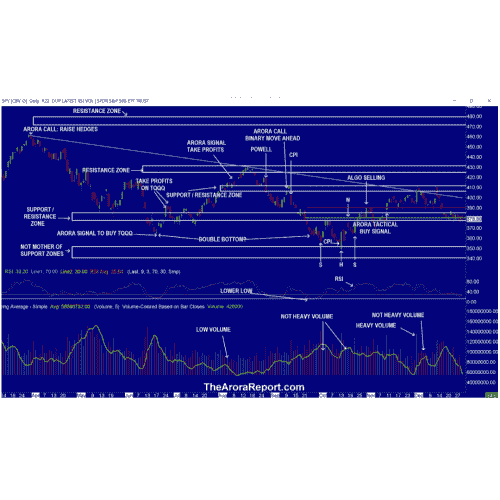

# 看好日本央行捍卫收益率曲线，2023 年定位“阿罗拉报告股市新闻”

> 原文：<https://medium.com/coinmonks/optimism-on-boj-defending-yield-curve-2023-positioning-the-arora-report-stock-market-news-d7d08c4fab83?source=collection_archive---------56----------------------->

娜塔莎·阿罗拉博士

*要获得优势，这是你今天需要知道的。*

## 日本央行捍卫收益率曲线

请[点击此处](https://thearorareport.com/chart-analysis-stock-market-2023-stock-market-positioning-spy-mc-12292022)查看代表基准股票市场指数 S & P 500 (SPX)的 S & P 500 ETF (SPY)图表。

> 交易新手？在[最佳加密交易](/coinmonks/crypto-exchange-dd2f9d6f3769)上尝试[加密交易机器人](/coinmonks/crypto-trading-bot-c2ffce8acb2a)或[复制交易](/coinmonks/top-10-crypto-copy-trading-platforms-for-beginners-d0c37c7d698c)

请注意以下几点:

*   图表显示，股市在支撑/阻力区盘整。
*   图表上的 RSI 显示，股市可以走任何一条路，但更倾向于上涨。
*   股票市场对日本银行捍卫收益率曲线持乐观态度。
*   人们普遍认为，日本央行正在放松对收益率曲线的控制。
*   日本央行的最新举措违背了这一共识。
*   日本央行愿意购买无限量的两年期和五年期债券。
*   日本央行的举措出人意料。
*   在昨天的早间报道中，我们写道:

> ***对于很多机构来说，今天是税损抛售的最后一天。***

*   今天上午，大部分税收损失抛售已经结束，这让人松了一口气。受税收损失抛售影响的股票，如特斯拉(TSLA)正在反弹。
*   股票市场一直担心 COVID 在中国的快速传播可能导致新的变种。今天早上，市场乐观地认为，意大利没有在来自中国的航班乘客身上发现新的变异。一半的乘客被感染了。
*   圣诞老人会来吗？迄今为止，在传统的圣诞老人集会期间，股市非但没有上涨，反而下跌了。
*   人们期待圣诞老人终于来了，所以今天早上摩摩人群积极购买。
*   莫莫大师预测，由于积极的季节性，股市将从这里上涨。关注 momo 大师的言论很重要，因为他们有大量的追随者，但你也需要知道，他们的工作不是提供准确的客观分析，而是尽一切努力推动股市上涨。
*   接下来会发生什么，将取决于对冲基金如何为新一年的快速短线交易做准备。

## 失业索赔

首次申请失业救济人数为 22.5 万，而普遍预期为 22 万。

## 股票中的 Momo 人群和精明资金

陌陌人群是🔒([查看锁定内容，请免费试用 30 天](https://thearorareport.com/sub))早盘股票。明智的投资是🔒在早期贸易中。

## 金色的

陌陌人群是🔒早期贸易中的黄金。明智的投资是🔒在早期贸易中。

长期来看，请看黄金和白银评级。

## 油

陌陌人群是🔒早期贸易中的石油。明智的投资是🔒在早期贸易中。

长期而言，请参见机油评级。

## 比特币

比特币有范围限制。

## 推销

我们非常非常短期的早期股市指标是🔒。这个指标有很好的跟踪记录，在长期投资者中很受欢迎，以保持与市场一致，在短期交易者中也很受欢迎，以独立进行快速交易。

利率在下降，债券在上涨。

美元走弱。

不建议大部分投资者交易期货。提供这些信息的目的是给出上市前活动的指示，通常在市场开放时指导活动。

黄金期货在 1817 美元，白银期货在 24.19 美元，石油期货在 78.17 美元。

标准普尔 500 期货的阻力位是 3860，3950 和 4000:支撑位是 3770，3630 和 3600。

DJIA 期货上涨 182 点。

## 保护带和现在该做什么

对投资者来说，重要的是向前看，而不是看后视镜。

考虑继续持有好的、非常长期的现有头寸。基于个人风险偏好，考虑持有🔒现金或国库券或分配给短期战术交易；和中短期对冲🔒和短期对冲🔒。这是一个很好的保护自己的方法，同时也能参与到上涨中。

你可以通过在对冲中增加现金来确定你的保护范围。高保护级别适用于那些年龄较大或保守的人。低保护带适合那些年轻或好斗的人。如果不对冲，总现金水平应高于上述水平，但明显低于现金加对冲。

**值得提醒的是，如果你没有足够的现金，你就不能利用即将到来的新机会。**调整对冲水平时，考虑调整股票持仓的部分止损量(非 ETF)；考虑在剩余数量上使用更宽的止损点，并为高贝塔股票留出更多空间。贝塔系数高的股票比市场波动更大。

要免费试用付费服务 30 天以获得更多机会，请[点击此处](https://thearorareport.com/sub)。

这篇文章刚刚发表在 [ZYX 购买变化警报](http://thearorareport.com/sub)上。

市场可以为知识渊博的投资者创造大量财富。现在，在 ARORA 报告的帮助下，你也可以非常成功地实现你的目标。您从我们的付费服务中收到的内容不到 2%。…要获得剩余的 98%，包括许多有吸引力的投资机会，请免费试用付费服务。

[请点击此处享受 30 天免费试用。](http://thearorareport.com/sub)

*原载于 2022 年 12 月 29 日 https://blog.thearorareport.com**[*。*](https://blog.thearorareport.com/2023-positioning-122922/)*

> *加入 Coinmonks [电报频道](https://t.me/coincodecap)和 [Youtube 频道](https://www.youtube.com/c/coinmonks/videos)了解加密交易和投资*

# *另外，阅读*

*   *[Bookmap 评论](https://coincodecap.com/bookmap-review-2021-best-trading-software) | [美国 5 大最佳加密交易所](https://coincodecap.com/crypto-exchange-usa)*
*   *[密码交易机器人](/coinmonks/crypto-trading-bot-c2ffce8acb2a) | [硬币门评论](https://coincodecap.com/coingate-review)*
*   *最佳加密[硬件钱包](/coinmonks/hardware-wallets-dfa1211730c6) | [Bitbns 评论](/coinmonks/bitbns-review-38256a07e161)*
*   *[新加坡十大最佳加密交易所](https://coincodecap.com/crypto-exchange-in-singapore) | [购买 AXS](https://coincodecap.com/buy-axs-token)*
*   *[红狗赌场评论](https://coincodecap.com/red-dog-casino-review) | [Swyftx 评论](https://coincodecap.com/swyftx-review)*