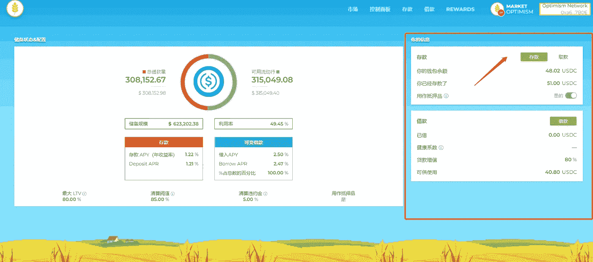

# 乐观即将展开第二轮空投，这是惊喜吗？

> 原文：<https://medium.com/coinmonks/optimism-will-launch-the-second-round-of-airdrops-soon-is-this-a-surprise-23deda62b65f?source=collection_archive---------0----------------------->

在此期间，乐观主义项目非常受欢迎。上半年发了第一波空投。有些人接受了数百次手术。功课做得好的收到了几万。

比如截图中的朋友，收到了 3 万多的 OP 空投。按照 OP 的高价来算，收入 6 万多美金，确实很惊人。

> 从顶级交易者那里复制交易机器人。免费试用。

还有人批量创建了一批账户，也很赚钱。

The first airdrop income of a certain player OP

12 月 7 日，OP 项目在推特上宣布将开始第二轮空投。预计明年 2 月向早期互动用户空投 1000 万 OPs。

第一期空投比例仅为 5%，第二期空投比例将提升至 14%。

第二次空投的消息出来后，刷乐观的互动教程又热闹起来。

The second round of OP airdrops will be launched soon

**乐观是如何相互作用的？**

有玩家整理了一份详细的 OP 互动教程，一步步指导如何完成乐观互动操作。

通过银河任务平台做任务，主要是和乐观生态中的各种项目进行互动。

包括跨链、互换、添加流动性、铸造 NFT、质押、合约等不同操作。完成任务后，可以领取相应的 NFT。

这个交互任务大概需要十几块钱的手续费，并且需要将近 200 块钱的 ETH 进行兑换等操作，质押的部分可以以后提现。

Deposit and borrow tasks in OP tasks

操作难度不大，链上交易会产生气费，需要提前投入。

有可能得到良好的空投；也可能是雷声大雨点小，毕竟这是第二次。

本轮互动官网有 18 个任务，完成后可以获得 18 个 NFT。很多玩家只做其中的 10 个。互动截止日期为明年 1 月 18 日。

如果找不到教程，可以在后台私信“OP airdrop”获取 airdrop 教程。

Tasks for the second round of OP interaction

**乐观的优点是什么？**

乐观是一个低成本，快速以太坊 L2 网络，它最大的优点是快速，稳定，可扩展。

L2 优化了以太坊链条上的拥堵和高昂的燃气费等问题，让开发商更方便、低成本地在乐观中建设项目，提高效率。

此外，公开资料显示，乐观已获得包括 A16Z、Paradigm 在内的机构投资。B 轮融资，累计融资 1.78 亿美元，市场异常火爆。

NFT obtained by completing tasks

从官网上的介绍来看，乐观生态中的应用包括 Web3、Defi、NFT、Bridge、Wallet、Tool、Dao 等常规应用。

哪个项目能在后期走出圈子，成为 TOP1 赛道，还是要等待市场的检验。

比如其生态 NFT 交易市场 QUIX 能否利用更优惠的气费和镜像写 NFTs 的突破，另辟蹊径留住用户，从而在激烈的 NFT 市场竞争对手中占据一席之地，甚至超越 Opensea，都取决于整体生态的发展。

QUIX, the NFT platform of OP ecology

**哪个 L2 生态能脱颖而出？**

在这段时间里，有很多以 L2 为中心的项目。除了看好，还有 Arbitrum、StarkWare、ZK-Rollup、Zksync 等，都是着眼于收费低，速度快。

除了已经发空投的 OP，其他几个还没发空投，互动特别高。

以太坊链条上的拥堵和高昂的燃气费一直为人诟病，但优化需要时间和技术支持。

最终哪个生态能脱颖而出，取决于它是解决了用户的某个特定需求，还是把某个细节优化的非常好，还是特别擅长营销，最终占据了更大的市场份额。

Various L2 interactive projects with high popularity

对于用户来说，无论哪个项目变大，都有利于行业的整体发展，是好事；

对于早期用户来说，提前互动，获得空投，是一个很好的目标。

以上只是我个人观点，没有投资建议。

我是楚小莲，我正在关注元宇宙和 web3。

> 加入 Coinmonks [电报频道](https://t.me/coincodecap)和 [Youtube 频道](https://www.youtube.com/c/coinmonks/videos)了解加密交易和投资

# 另外，阅读

*   [西班牙 5 大最佳文案交易平台](https://coincodecap.com/copy-trading-spain)
*   [Pionex 双重投资](https://coincodecap.com/pionex-dual-investment) | [AdvCash 审查](https://coincodecap.com/advcash-review) | [支持审查](https://coincodecap.com/uphold-review)
*   [面向开发者的 8 个最佳加密货币 API](https://coincodecap.com/best-cryptocurrency-apis)
*   [7 个最佳零费用加密交换平台](https://coincodecap.com/zero-fee-crypto-exchanges)
*   [最佳网上赌场](https://coincodecap.com/best-online-casinos) | [期货交易机器人](/coinmonks/futures-trading-bots-5a282ccee3f5)