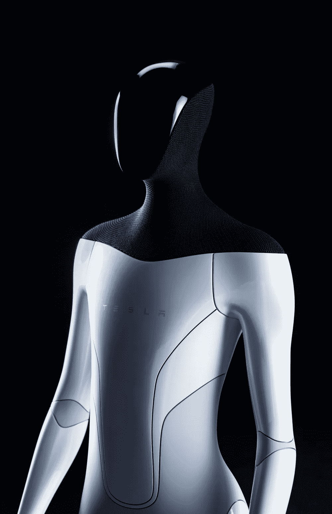

# 擎天柱，特斯拉的类人机器人

> 原文：<https://medium.com/coinmonks/optimus-teslas-human-like-robot-61b0306c2d8e?source=collection_archive---------27----------------------->

马斯克的机器人可能能够在活动中展示基本能力，但它们很难打动公众对机器人像人类一样能干的期望。

Source *Courtesy Tesla, Inc.*

首席执行官埃隆·马斯克(Elon Musk)去年表示，特斯拉准备推出一款人形机器人。这几天他还在推特上说，特斯拉向世界介绍擎天柱的最后期限是 9 月 30 日。

根据马斯克的说法，擎天柱将执行无聊或危险的工作，包括在其工厂周围移动零件。

特斯拉可以利用其在人工智能和关键部件方面的专业知识，大规模开发和生产智能但更便宜的人形机器人。

目前，特斯拉网站上的“ [Autopilot & Robotics](https://www.tesla.com/careers/search/?department=14&site=US) ”类别中有超过 60 个职位列表，标题为“移动机器人/特斯拉机器人——自主实习”。

*“你将编写的代码将在世界各地数百万人形机器人上运行，因此将保持高质量标准，”*其中一则招聘启事称。

原型大约 1.73 米高，预计明年开始生产。

马斯克预测，机器人业务的价值最终可能会超过特斯拉电动汽车的收入。

# “特斯拉机器人

*开发下一代自动化，包括一个通用的、双踏板的人形机器人，能够执行不安全、重复或无聊的任务。我们正在寻找机械、电气、控制和软件工程师，以帮助我们在车队之外利用我们的人工智能专业知识”。*来自[特斯拉](https://www.tesla.com/)网站的描述

> 交易新手？尝试[加密交易机器人](/coinmonks/crypto-trading-bot-c2ffce8acb2a)或[复制交易](/coinmonks/top-10-crypto-copy-trading-platforms-for-beginners-d0c37c7d698c)