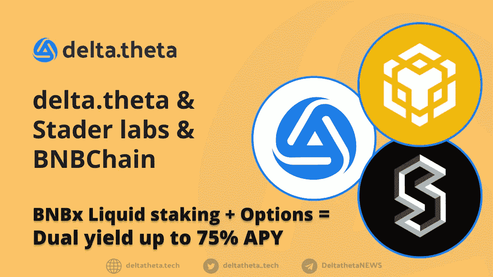
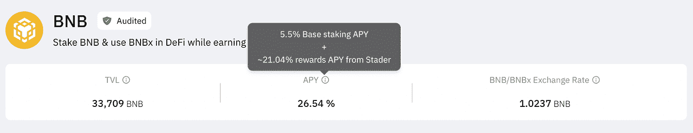
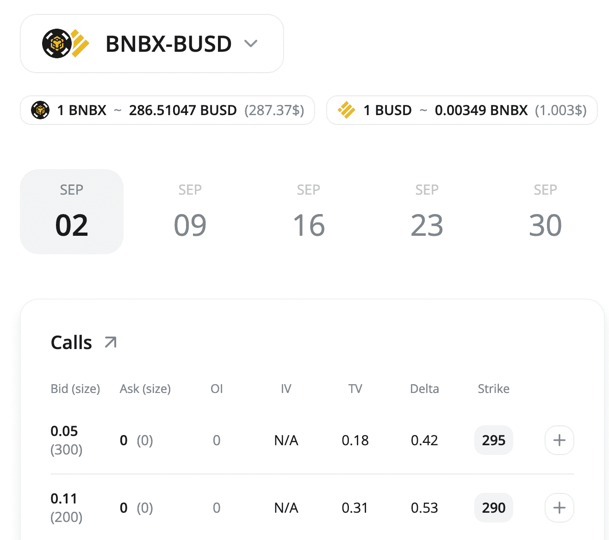
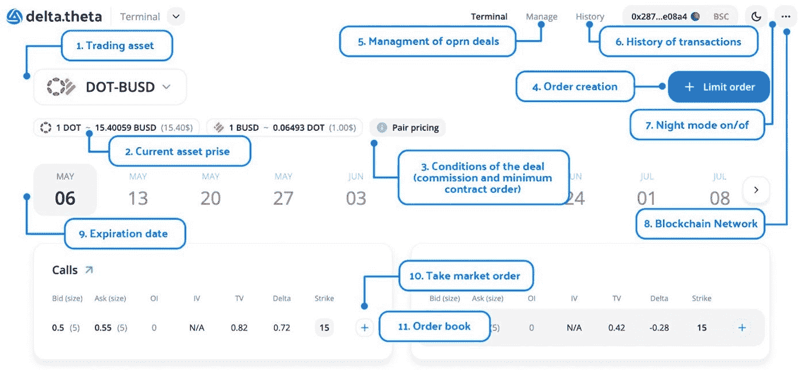

# BNB 连锁店的流动赌注代币的选择:它是什么，它如何工作，以及如何从赌注 BNB 代币(高达 75%的 APY)中获得最大利润？

> 原文：<https://medium.com/coinmonks/options-for-liquid-staking-tokens-at-bnb-chain-what-is-it-how-does-it-work-and-how-to-maximize-740607ad34f8?source=collection_archive---------10----------------------->

# 这是什么？

流动性代币是加密货币世界的新趋势。这些代币的概念出现是为了回答如何处理参与股份证明区块链的代币的价值的问题，例如 BNB 链、波尔卡多特、多边形等。对这种情况的反应是由特殊的“流动堆叠”服务发行代币对应物，以证明原始代币的所有权，这是强制的，也是流动性冻结发挥作用所必需的。原始协议的新“准”令牌可以在 DeFi 生态系统中使用，并为用户产生额外的回报。

为了激励用户了解更多关于流动性代币的信息，BNB 连锁公司与 CoinMarketCap 和 StaderLabs 共同发起了一个教育项目，总奖金为 25 万美元。关于该计划的更多细节可以通过链接找到[。](https://coinmarketcap.com/earn/videos/introduction-to-stader-labs-its-bnb-staking-solution)

# BNB 斯塔德实验室是如何工作的？

StaderLabs 在各种区块链上提供服务，几周前，BNB 链的液体堆垛服务就在这些地方推出。与 Stader 协议交互的一般公式如下:

*   用户通过一个智能契约将一个本地 BNB 令牌存入一个公共池，然后将这个池分发给几个验证器。
*   验证者使用令牌参与 BNB 链上的块验证，并将为此收到的奖励发送回 Stader labs 的总池。
*   用户收到的不是送往 Stader Labs 的代币，而是 BNBx 代币，可用于提供 DEX 流动性、贷款服务或交易期权。

你可以通过链接在官方手册[中阅读更多关于如何使用 StaderLab_BNB 协议的信息。](https://staderlabs.notion.site/BNB-Staking-Step-by-Step-Guide-8ad4eb9bf693441088a25bf429fe44ba)

# 期权交易有什么用途？

如你所知，期权是一份有买方和卖方的合同。期权的买方总是向卖方支付溢价，并有权行使期权。买方希望能够在未来的某一时刻以固定的价格买卖某物。另一方面，卖方押注该事件不会发生，并因此获得溢价。

现在我们处于熊市趋势中，期权交易正成为赌注的一种独特替代方式。使用 delta.theta 平台，可以将 StaderLabs 的 BNBx 堆叠和选项的优势结合起来。

目前，BNBx 的液体堆积收益率达到 26%

通过使用简单的看涨期权交易，以 295 美元(以 BNB 280 美元的当前价格)出售一个执行价格为 1 天的备兑看涨期权，您每年可以获得 49.35% ((2.8*52)/295)*100)的额外回报。更多关于 delta.theta 的信息可以在官方博客中找到[。](https://optiondeltatheta.medium.com/delta-theta-p2p-options-dex-review-update-may-2022-2585a9621f11)

**而这能给你带来 75%以上的 APY。**

# 如何在 BNBX 交易期权

1.  首先，买 BNB，
2.  接下来去[斯塔德实验室 dAPP](https://bnbchain.staderlabs.com/liquid-staking/bnbx) ，入股 BNB，接收 BNBx，
3.  转到[delta theta 终端](https://app.deltatheta.tech/terminal/BNBx-BUSD)打开买入期权卖出的限价单或接受现有订单。

新手的推荐策略

基本想法是卖出不在货币中的看涨期权。即 BNBx 的价格不会超过参考价或罢工。期权的期限是一周。delta.theta 上的 MM 不断引用必要的打击。你可以在 delta.theta OTC 聊天里问任何问题→[https://t.me/deltatheta_TradingGroup](https://t.me/deltatheta_TradingGroup)

## 期权和 FOMO

需要注意的是，作为看涨期权的卖方，你可能会面临 FOMO 的情况。如果你是看涨期权卖方，这相当于为卖出一项资产下限价市价单。如果您的订单被接受且价格超过执行价，您的期权将被执行。例如，你在 BNBx 上卖出看涨期权，执行价为 295 BUSD，现价为 280 BUSD。在接下来的几天里，价格达到了 320 美元，你的期权得到了行使。所以你只能得到 15 个 BUSD，而不是 30 个 BUSD。这就是 FOMO。

**一步一步手动唧唧使用 deltatheta 选项台:**

1.  选择区块链网络(8)
2.  选择交易资产 BNBx (1)
3.  创建订单(4)或接受市价订单(10)

## 社交媒体链接:

delta thet Eng TG Chat—[https://t.me/deltatheta](https://t.me/deltatheta)
delta theta Twitter—[https://twitter.com/deltatheta_tech](https://twitter.com/deltatheta_tech)

体育场实验室—[https://staderlabs.com](https://staderlabs.com)

https://twitter.com/stader_bnb BNB 体育场推特

StaderLabs BNB TG Chat—【https://t.me/staderlabs_bnb_official 

https://twitter.com/BNBCHAIN BNB 连锁推特—

> 交易新手？试试[密码交易机器人](/coinmonks/crypto-trading-bot-c2ffce8acb2a)或者[复制交易](/coinmonks/top-10-crypto-copy-trading-platforms-for-beginners-d0c37c7d698c)