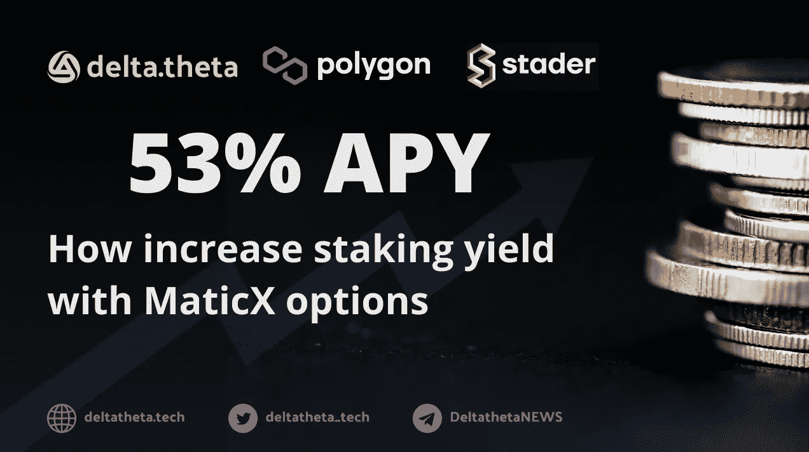
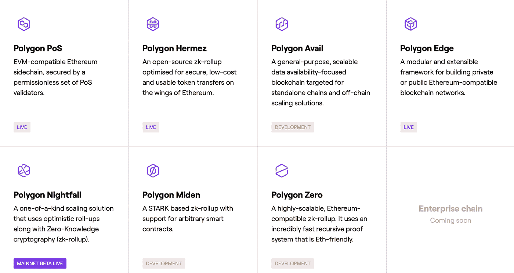
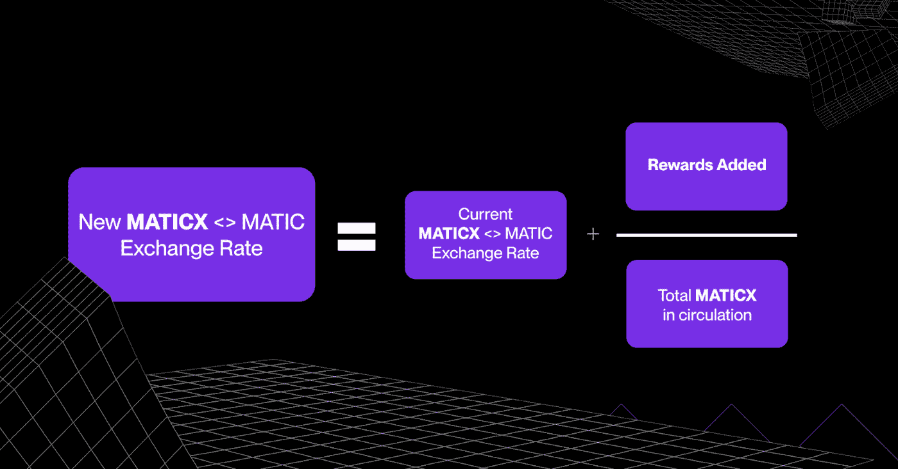
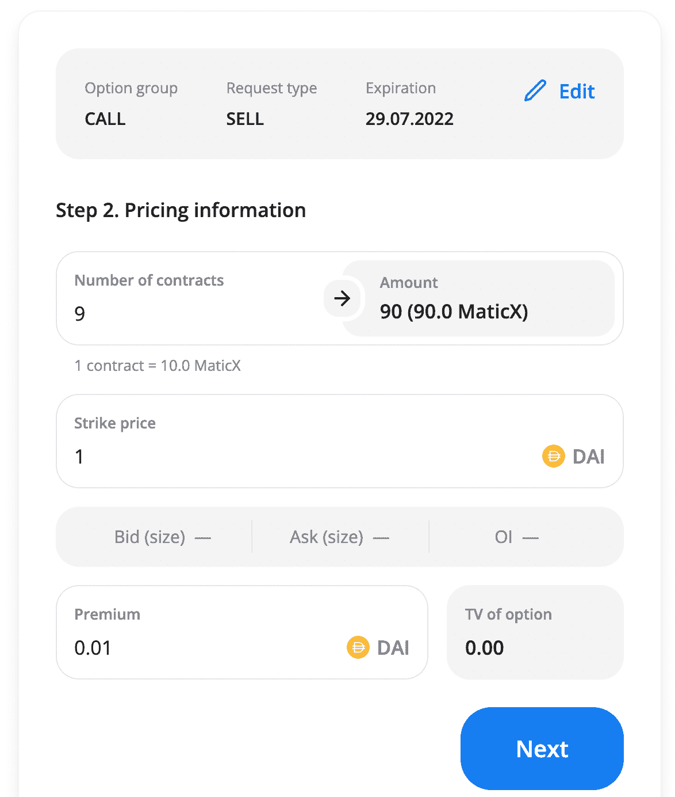
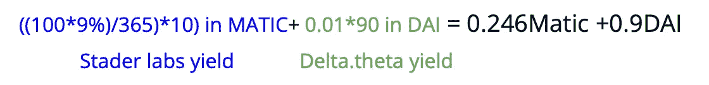

# Polygon 的流动赌注代币选项:它是什么，如何工作，以及如何从赌注 MATIC 中获得最大利润

> 原文：<https://medium.com/coinmonks/options-for-liquid-staking-tokens-at-polygon-what-is-it-how-does-it-work-and-how-to-maximize-6288c2a81c3?source=collection_archive---------6----------------------->

# 这是什么？

在 DeFi 一层一层、一砖一瓦地产生“有机”产量的创新机制。Polygon+Stader labs 的 liquid staking token+delta theta options = DeFi Lego，效率最高。但是让我们一步一步更详细地探索这个结构。

根据他们的网站，Polygon 是一个分散的以太坊扩展平台，使开发人员能够以低交易费用构建可扩展的用户友好的 dApps，而不会牺牲安全性。该平台通常包括几个模块，允许用户从各个角度探索去中心化的区块链魔法。

polygon Proof-of-stage 是一种通过利用侧链进行交易处理来实现前所未有的交易速度和成本节约的解决方案。与此同时，PoS 使用强大的等离子桥接框架和分散的利益证明(POS)验证器网络来确保资产安全。

验证者锁定自动令牌以验证网络内交易的真实性和有效性，并获得回报。更多详情可登陆[官方博客](https://blog.polygon.technology/how-3-9-billion-of-staked-matic-keeps-polygon-secure/)。

当验证者和他们的客户持有 MATIC 股份时，他们的流动性就被冻结了。Stader labs 的解决方案允许用户铸造一个代表 staked Matic 的新令牌— MaticX，并在各种 DeFi 协议中使用它。在此期间，赌注的利润(+9% APY)会累积到 MaticX，并准备好在拆赌注时或通过指数互换接收。

关于如何使用 Stader dApp 和 MaticX 的手册可以在[这里](/staderlabs/introducing-maticx-staders-liquid-staking-solution-coming-to-polygon-7f5cd646f46c)获得。

关于在 Polygon stake MaticX 的更多细节放在 [Stader Labs 博客](https://blog.staderlabs.com/your-guide-to-staking-matic-with-stader-e64fcb5c1e62)上。

# 期权的力量

如你所知，期权是一份有买方和卖方的合同。期权的买方总是向卖方支付溢价，并有权行使期权。买方希望能够在未来的某一时刻以固定的价格买卖某物。另一方面，卖方押注该事件不会发生，并因此获得溢价。

现在我们处于熊市趋势中，期权交易正成为赌注的一种独特替代方式。因为通过出售期权，你可以立即获得稳定币的溢价。大多数交易者喜欢在 MATIC 上以高于市场 20-30%的价格卖出看涨期权，并从中赚取 20-30%的 APY。

Stader Labs 和 deltatheta 解决方案的独特之处在于，您可以获得双倍收益:

*   用 MaticX 下注奖励
*   在 MaticX 上出售看涨期权的溢价

**而这能给你带来 50%以上的 APY。**

# 如何在 MaticX 上交易期权

1.  首先在 Polygon 买 Matic，
2.  接下来去 [Stader labs dAPP](https://polygon.staderlabs.com/liquid-staking/maticx) ，stake Matic，领取 MaticX，
3.  前往[delta theta 终端](https://app.deltatheta.tech/terminal/MaticX-DAI)开立买入期权卖出限价单或接受现有订单。

# 新手的推荐策略

基本想法是卖出不在货币中的看涨期权。即 MaticX 的价格不会超过参考价或罢工。期权的期限是一周。deltatheta 上的 MM 不断引用必要的打击。你可以在 deltatheta OTC 聊天中提出任何问题→[https://t.me/deltatheta_TradingGroup](https://t.me/deltatheta_TradingGroup)

**例子**

1.  100 Matic 花了 74 美元
2.  在 Stader APP 下注 100 Matic，收到 97.7MaticX
3.  打开 delta.theta 终端并创建限价单(在我们的博客中找到如何操作)
4.  选择日期—例如，05 Aug，strike 1USD，premia 0.01 per 1 MaticX

最终利润将包括:

**=(0.246 Matic+0.9 Dai)*(365/10)= 9 Matic+32.85 Dai**

**如果 1 英镑的成本为 0.74 美元(今天的入场价)，最终 APY 将约为 39.51 美元/74 美元= **53%****

# **期权和 FOMO**

**需要注意的是，作为看涨期权的卖方，你可以满足 FOMO 的情况。因为如果你叫期权卖方，就等于下了一个卖出资产的限价市价单。如果您的订单被接受且价格超过成交价格，您的期权将被执行。比如你在 MaticX 上卖出看涨期权，执行价 1.0 DAI。接下来的几天，价格达到了 1.2DAI，你的期权就行权了。所以你得到的只是 1.0 戴，而不是 1.2 戴。这就是 FOMO。**

> **交易新手？尝试[加密交易机器人](/coinmonks/crypto-trading-bot-c2ffce8acb2a)或[复制交易](/coinmonks/top-10-crypto-copy-trading-platforms-for-beginners-d0c37c7d698c)**