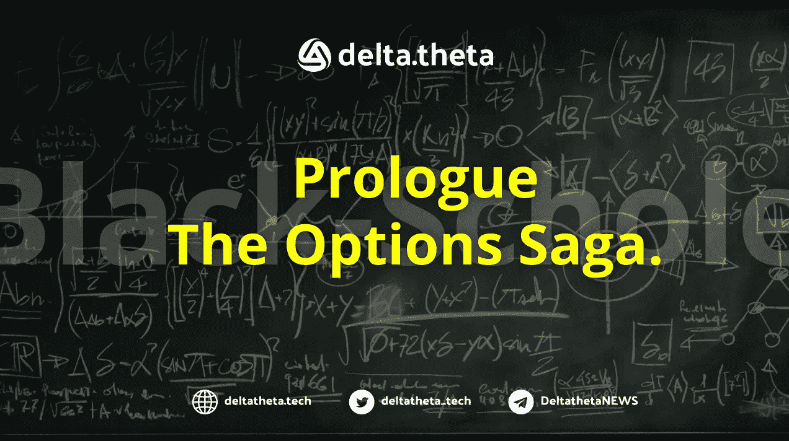
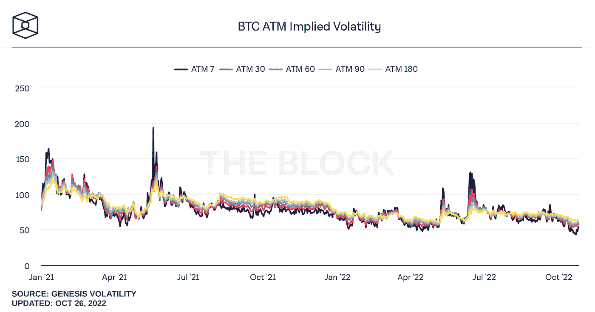
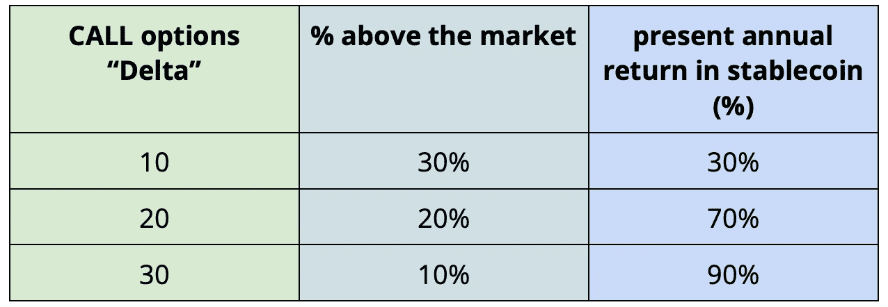
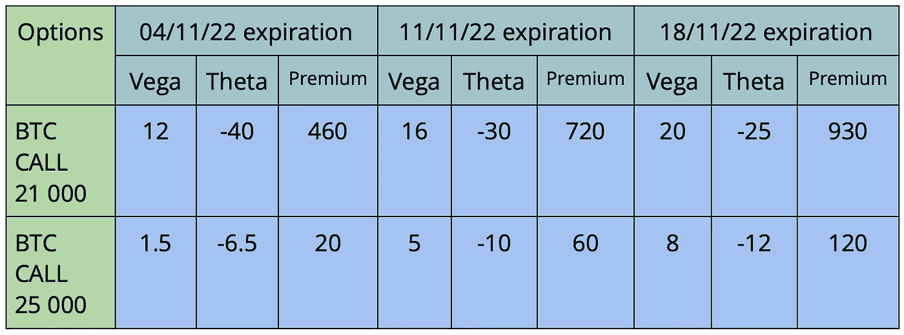

# 低波动环境下的期权交易策略。

> 原文：<https://medium.com/coinmonks/options-trading-strategies-in-a-low-volatility-environment-5abd15608aca?source=collection_archive---------9----------------------->

在加密货币市场波动性下降的背景下，由于溢价较低，出售看涨或看跌期权开始失去相关性。相反，市场参与者可以更仔细地看看期权结构，如跨式期权或扼制期权，但它们有细微差别。正如我们常说的，如果你理解了基础资产，期权就是一个值得使用的工具。

我们会提醒你过去有多少市场参与者赚了钱。期权的价值或溢价取决于到期时间和波动性。波动性越高，期权就越昂贵。卖方的任务是以这样一个价格卖出期权(执行)，这样期权在到期日之前就不存在了。用交易员的话来说:“用一个遥远的 delta 卖出波动性”。

让我们再次提醒你,“delta”是表示期权溢价变化和标的资产价格变化之间关系的系数。也就是说，货币期权的 delta = 1(看涨期权+1，看跌期权-1)。因此，“卖出波动性远差”归结为卖出高于市场 30%或更高的看涨期权和低于市场 30%或更低的看跌期权。这种策略在每周期权上赚了很多钱。

市场的特点是波动性小，可以关注买多空或者多空之类的期权策略。当一个人不知道市场将走向何方，并预计在某个特定的时间范围内波动性会激增时，就会使用这种方法。损失仅限于购买期权所花费的资金。

跨售和扼杀的概念是购买具有相同(或不同于扼杀)到期日的看跌期权和看涨期权，以及相同的执行(跨售)或不同的执行(扼杀)。

对于这个策略，重要的是要记住希腊人:theta 和 vega。θ是时间衰减的原因，它显示了相同波动水平下期权价格每天下降的程度。随着越来越接近到期日，时间衰减加快。典型地，时间分解在期满之前的时间的⅔之后进入加速阶段。

Vega 展示了波动率 1%的变化和期权价值之间的关系。假设 vega 等于 3，这意味着波动率 1%的变化会使期权的价格/溢价改变 3 美元。

因此，在交易这类策略时，要考虑 theta 加速度和 vega。理想情况下，你应该计划你的期权范围，使影响波动峰值的主要事件在到期时间框架的⅔内。在波动性飙升后，你平仓买入的头寸。请记住，另一条“腿”实际上没有工作，它已经开始了一个完全不同的故事(市场上涨，看跌期权被烧毁/转让，等等)。).

**11 月将影响加密货币市场的事件:**

*   美国利率会议(FOMC)→11 月 2 日
*   美国国会选举→11 月 8 日
*   美国消费者通货膨胀→11 月 10 日

注意“希腊人”对“在钱里”和“在钱外”选项的比率。

例子(这个例子纯粹是为了教育目的，就像物理课上常说的:“假设一个物体在真空中运动，没有力作用在它上面”)。

假设我们有 2000 美元，一个比特币值 20 500 美元，我们买了 930 的看跌期权和 930 的看涨期权，11 月 18 日到期，所以我们花了 1860 美元。

11 月 3 日(6 天过去了)，一些非常积极的消息出来了，比特币涨到了 22 000，波动性上升了 40%。因此:

1 500 美元的期权“物有所值”

*   时间值= 800(计算方法为 20%乘以 20 密耳)— 6*25 = 650 美元。

总数是 2150 美元。事实上，我们在 6 天内有 245 美元的盈余(这里我们考虑了看跌期权= 0 的命运)

假设我们有 2000 美元，一个比特币值 20 500 美元，我们买了 8 个 120 美元的看跌期权和 8 个 120 美元的看涨期权，到期日是 11 月 18 日，所以我们花了 1920 美元。

11 月 3 日(6 天过去了)，一些非常积极的消息出来了，比特币涨到 22 000 美元，波动性(比如说)40%。我们所拥有的:

现在我们只剩下时间值了。Vega 和 theta 计算:8 个选项* 8 * 40 = 2496–6 * 8 * 12 = 1920。事实上，我们现在处于 0。

如我们所见，买入波动性并不那么明显。知道这个工具是有用的。但是要非常小心的使用。

在当前环境下，还可以在一个很长的三角洲上以更高的价格出售建筑。或者，如果你了解标的资产，卖出一份看跌期权(сALL)和买入一份不同到期日的看涨期权(PUT)。卖出看跌期权让你有机会以你想要的价格获得标的资产，并利用溢价买入参与增长的机会。如果你押注市场下跌，反之亦然。

卖出 19 000 份看跌期权，买入 22 000 份看涨期权——我愿意以 19 000 美元的价格买入比特币，但预计标的资产的价格会升至 22 000 美元以上

卖出 24 000 看涨期权，买入 20 000 看跌期权——我愿意以 24 000 美元的价格卖出比特币，但预计标的资产的价格会跌至 20 000 美元以下

我们的下一个报告将被称为:传奇 4。我们会谈到希腊人。德尔塔 2 号。织女星和伏尔加 3。θ4。微克

站点— [增量技术](https://deltatheta.tech/)

推特——https://twitter.com/deltatheta_tech

场外电报组-【https://t.me/deltatheta_TradingGroup 

> 交易新手？试试[加密交易机器人](/coinmonks/crypto-trading-bot-c2ffce8acb2a)或者[复制交易](/coinmonks/top-10-crypto-copy-trading-platforms-for-beginners-d0c37c7d698c)