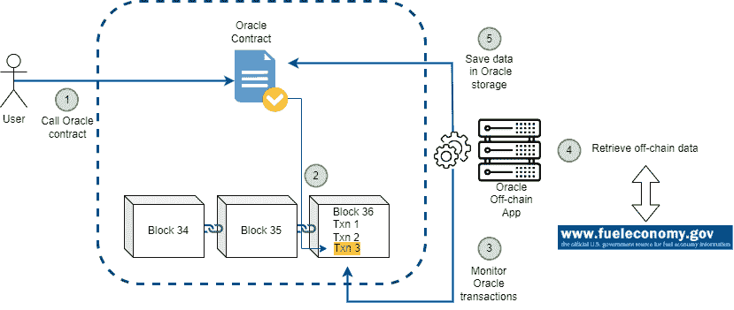

# 区块链神谕:你为什么需要它们

> 原文：<https://medium.com/coinmonks/oracles-bring-the-external-world-to-the-blockchain-59c3bf9a6daf?source=collection_archive---------7----------------------->

## 理解为什么智能合约不能管理现实世界的信息，以及 Oracles 如何试图解决这个问题。

# 为什么是神谕

“神谕”一词来自希腊神话，指的是一个通过与神交流可以预见未来事件的人。

区块链环境中的 oracle 是一个可以为以太坊智能合约提供外部数据源的系统。

> 但是为什么智能合约不能管理链外/现实世界的信息呢？

以太坊虚拟机是以太坊平台的关键组件，能够在遵守共识规则的同时，在分散网络中的任何节点上执行程序并更新以太坊的状态。

为了保持一致，EVM 的执行必须是完全确定的，并且完全基于以太坊状态和已签名的交易。这是因为当执行事务时，网络上的每个节点必须能够产生相同的结果。如果在不同的节点执行给出不同的输出，就永远达不到共识。

> 非决定论导致共识的失败

这有两个重要的含义:

*   没有随机性的内在来源，
*   外部数据只能作为事务的数据负载引入。

外部信息，如随机来源、价格信息、天气预报等，只能作为数据包含在发送到网络的交易中。但是，这样的信息是不可信的，因为它来自不可信的来源。结果，我们只是推迟了这个问题。一位先知试图解决这个问题。

# Oracles 设计模式

首先要不断重复的是，Oracle 不是一种产品或特定的智能合约实施，而是:

> Oracle 是一种设计模式！

oracles 的主要功能是:

*   从外链来源收集信息
*   使用签名消息在链上发送数据
*   将数据放入智能合约的存储中，使其可用

一旦数据存储在智能合约中，其他智能合约就可以使用消息调用来访问它。

设计 Oracle 的三个主要选项是:

*   即时阅读
*   发布-订阅
*   请求-响应

## 即时阅读神谕

这种 Oracle 仅在其合同存储中存储一次数据，并且数据很少更新。那些希望查询这类数据的人通常是在“即时”的基础上这样做的；当需要信息时执行查找，并且可能永远不会重复。

这些 Oracless 的例子包括那些存储由组织发布的信息的 Oracle，如学术证书、机构文档、自治 id 等。

出于效率以及最重要的隐私原因，建议不要将 oracle 提供的原始数据存储在智能合约的存储中。

设计这种服务的一种有效方法是对数据进行散列，并且只将散列存储在智能契约的存储中。

## 发布-订阅 Oracles

当预计数据会定期频繁地发生变化时，发布-订阅 Oracle 可能是解决方案。它遵循与 RSS 提要相似的模式，oracle 使用新信息进行更新，一个“标志”表明新数据对那些认为自己“已订阅”的人可用。

要确定最新信息是否已更改，相关方必须轮询或监听 oracle contracts 的更新。

虽然在 web 服务器的世界中轮询效率非常低，但是在区块链生态系统的环境中，对数据更改的轮询只是对同步客户端的简单本地调用。然后，以太坊事件日志使应用程序特别容易寻找 Oracle 更新。

这些 Oracless 的例子包括那些管理诸如价格馈送、天气信息、经济或社会统计、交通数据等信息的 Oracle。

## 请求-响应神谕

当数据空间太大而无法保存在智能合同中，并且用户一次只想使用整个数据集的一小部分时，这种 oracle 非常适合。

它通常由两部分组成，包括:

*   链上智能合约
*   链外基础设施

数据请求通常是一个包含几个步骤的异步过程。

首先，一个 EOA 与一个分散的应用程序 **(1)** 进行交互，这是一个对 Oracle smart contract 中定义的函数的调用，带有一些相关的参数，如回调函数和调度参数。该功能实现了一个区块链交易 **(2)** 。一旦这个交易被确认，离线基础设施就开始发挥作用。它用于监控 Oracle 请求 **(3)** (这可以被观察为 Oracle 契约发出的 EVM 事件，或者状态变化)。参数用于执行链外数据源 **(4)** 的实际查询。最后，结果数据在一个事务中被交付给发出请求的分散式应用程序 **(5)** 。

oracle 还可能要求支付处理请求的费用、回调的汽油费用以及访问所请求数据的权限。

# Oracle 示例

下面是一个由[Provable](https://provable.xyz/)实现的请求-响应 Oracle 的基本示例。原代码可以在 GitHub 上的这里[找到。](https://github.com/provable-things/ethereum-examples/blob/master/solidity/DieselPrice.sol)

要与 Provable 集成，合同 **DieselPrice** 必须是使用 Provable 的**的子
。usingProvable contract 在 [**provableAPI.sol**](https://github.com/provable-things/ethereum-api/blob/master/provableAPI.sol) 文件中定义。**

EOA 通过调用 **update()** 契约函数来请求数据。

数据实际上是由 **provable_query** 函数请求的。这是一个重载函数，至少需要两个参数:

*   要使用的受支持的数据源(在这种情况下是 URL，但也可以使用 WolframAlpha、IPFS 或其他数据源)
*   给定数据源的参数，可能包括使用
    JSON 或 XML 解析帮助器

一旦从所需的外部源中检索到数据，由被允许调用回调函数的 Provable 控制的帐户调用 **__callback()** 函数；它传入响应值和一个唯一的 **_myId** 参数，例如，它可以用于处理和跟踪 Provable 的多个挂起的回调。

# 结论

Oracles 通过将外部事实带入等式中，在智能契约执行中发挥了重要作用。另一方面，它们也带来了潜在的巨大风险。采用这种方法，不仅要信任提供这种服务的甲骨文公司，还要信任服务提供商(例如 fueleconomy.gov)。Oracle 服务公司可能是恶意的，或者数据可能已损坏。这样，他们提供的契约就暴露给了潜在的错误输入，从而影响了它的执行。

> 交易新手？试试[加密交易机器人](/coinmonks/crypto-trading-bot-c2ffce8acb2a)或者[复制交易](/coinmonks/top-10-crypto-copy-trading-platforms-for-beginners-d0c37c7d698c)