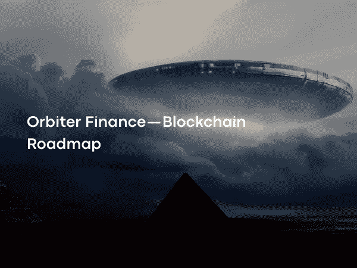

# Orbiter Finance —区块链路线图

> 原文：<https://medium.com/coinmonks/orbiter-finance-blockchain-roadmap-aa2f3acfa737?source=collection_archive---------12----------------------->

Photo on [Shutterstock](https://www.shutterstock.com/)

以太坊 L2 扩展解决方案引入了桥接问题。Orbiter Finance 是一个分散的乐观桥应用程序，它使资产能够在累计之间移动。Orbiter Finance 与一个包括制造商和发送者角色的系统一起工作，该过程的安全性由一系列智能合同来确保。

 [## 轨道飞行器-金融

### 轨道飞行器金融是一个分散的跨卷桥梁，用于转移以太坊本地资产，这是…

www.orbiter.finance](https://www.orbiter.finance/) 

以太坊正试图通过分片和各种 L2 解决方案来克服缩放问题。在解决这个问题的过程中，发展出了等离子体、态通道等多种 L2 解决方案，最终出现了被认为是最理想的 L2 解决方案——roll ups。

尽管在 L2 解决方案中，汇总占主导地位，但不管使用哪种类型的 L2 解决方案，它们都必须通过网桥连接到以太坊主网。这种情况带来了许多问题，如流动性碎片化和桥接问题。桥牌问题可能是桥牌合同的重要错误，也可能是等离子和乐观易拉宝里的镜头有 7 天的等待时间。

Vitalik Buterin 在以太坊研究团队 AMA 7 活动中谈到了多链和跨链区块链、桥接问题以及 51%攻击对它们的影响。维塔利克的评论中有一点值得注意。与跨链桥实现不同，51%的攻击中的跨卷实现仅依赖于以太坊主网的安全假设。也就是说，在以太坊可能的 51%攻击中链反转时，卷链也反转。然而，保持汇总状态的交叉汇总应用程序可以保证保持一致，即使以太坊受到 51%的攻击。这为开发交叉汇总应用程序(如轨道飞行器财务)提供了机会和灵活性。

Orbiter Finance 是一个分散的乐观桥梁应用程序。Orbiter 为用户提供了比传统桥和本地桥更低的交易费用和更高的速度。轨道飞行器融资是一个乐观的桥梁，不是因为它使用了防欺诈。整个系统不包括智能合约，并在高频累计交易中提供最高的效率。

用户可以在 13 个支持的网络之间移动 ETH、、和 DAI 的资产。这些网络包括乐观和 L1 网络，如 zkRollups、以太坊 mainnet、Validium networks 和 BSC。每个网络都标有预定的识别码。Orbiter Finance 的一个最大优势是，它作为一种替代方案出现，在拍摄时间很长的网络中缩短了这个时间，比如乐观的上卷。

 [## 以太坊日报——加密新闻:Orbiter 在苹果播客上发布 L2 数据分析跟踪器

### Orbiter Finance 发布了 L2 数据分析跟踪器，Circle 和 Tether 宣布支持 ETH PoS，Socket 发布了一个…

podcasts.apple.com](https://podcasts.apple.com/us/podcast/orbiter-releases-l2-data-analytics-tracker/id1502339625?i=1000575716920) 

除了 Bridge 应用程序，Orbiter Finance 还提供早期免费的 L2 数据分析服务。通过使用这项服务，用户可以找到在 L2 和 L1 发生的交易总数。它还包括 L2 网络应用的统计数据。

Orbiter Finance 与一个包括制造商、发送者和一系列智能合同的系统一起工作。这些智能合约分别位于目标链上。做市商提供必要的流动性，以便在每个受支持的链上执行交易。另一方面，发送者是希望执行资产转移请求的用户。

在传统的桥接应用中，当希望将资产移动到不同的网络时，资产被发送到智能合同。Orbiter Finance，资产被发送到外部拥有的帐户(EOA ),而不是智能合同。这是轨道飞行器融资区别于传统桥梁应用的最重要的区别。EOA 是一个拥有公钥和私钥对的账户，用于保存个人资金。经常使用的以太坊钱包也是 EOA。

 [## 以太坊账户| ethereum.org

### 以太坊账户是一个拥有以太(ETH)余额的实体，可以在以太坊上发送交易。帐户可以是…

ethereum.org](https://ethereum.org/en/developers/docs/accounts/)  [## 概观

### Orbiter Finance 被设计成一个分散的交叉桥梁，用于转移以太坊本地资产。系统…

文件.轨道器.金融](https://docs.orbiter.finance/overview) 

当用户想将若干资产从 X 链移动到 Y 链时，流程如下；

使用 Orbiter Finance 接口，用户将 X 链中的若干资产和交易费用发送到创客的钱包地址。

这个运费还包括固定交易费和 0.04%-0.3%不等的可变交易费。同时，发送的资产编号的后四位标有目的链的标识码。

Maker 运行的程序使用获得的信息自动将 Maker 钱包中的大量资产发送到 Y 链中的用户地址。

如何确定制造商会在链 Y 中发送实体 A？许多智能合同和客户端被用于加速该过程并确保其安全性。使用的程序可能是轨道器团队开发的开源软件，也可能是创客自己开发的特殊软件。轨道飞行器融资中的智能合同:

 [## GitHub —轨道飞行器-财务/轨道模块

### 轨道器模块正在快速发展，如果你发现一个问题，请发送一个新的问题使用这个软件的风险…

github.com](https://github.com/Orbiter-Finance/OrbitalModule/tree/eth_pro_new) 

制造商存款合同(MDC):MDC 合同有两个任务。就是保留 Maker 的保证金，并对不发生或不正确的交易，返还用户的存在并支付赔偿。

事件绑定合同(EBC):EBC 合同的任务是在制造商的不同累计中设置存款规则，并在来源补充流程和目标流程之间提供通信。

简单支付验证(SPV):SPV 合同的任务是证明发起交易在发起网络中的存在。

 [## 技术

### 编辑描述

文件.轨道器.金融](https://docs.orbiter.finance/technology)  [## 轨道飞行器-金融

### 轨道飞行器金融是一个分散的跨卷桥梁，用于转移以太坊本地资产，这是…

www.orbiter.finance](https://www.orbiter.finance/data) 

用户提供 SPV 合同来源交易 1 的证明。

用户通过 MDC 契约启动仲裁。MDC 合同从 SPV 合同接收源交易 1 存在的证明。

MDC 合同从 EBC 合同接收源交易 1 的有效性证明。因此，MDC 契约可以检查源事务 1 是否按照轨道器的格式和规则发生。
MDC 为制造商提供 30-180 分钟的等待时间，以提供目标行动 1 的证据。

如果制定者向 MDC 契约提供目标事务 1 的证明，则 MDC 契约从 EBC 契约获取目标事务 1 的有效性证明，并验证目标事务 1 与源事务 1 匹配。MDC 契约关闭仲裁并向用户显示目标事务 1。

如果在等待期结束时，制定者没有向 MDC 合同提供目标交易 1 的证明，则用户申请提取资产。

MDC 契约将与用户的资产相对应的金额和一些补偿(大约 15 美元)从制造商的存款中发送给用户。传输发生在 MDC 合同所在的网络上。

做市商为交易提供流动性，通过收取固定和可变的交易费用赚取回报，没有任何暂时损失的风险。制造者倾向于诚信，因为不诚信就要赔偿。然而，当发送给出票人的交易金额大于出票人的存款金额时，出票人可能倾向于不诚实。由于这个原因，轨道飞行器融资对交易有一个上限。此外，制造商的押金数额由轨道飞行器财务部门通过一套规则来确定；

 [## 制造商系统

### 编辑描述

文件.轨道器.金融](https://docs.orbiter.finance/makersystem) 

在 EVM 链中，块被分成 5-10 等份。制造商必须存入 MDC 合同的金额由公式[(件数)x(交易上限)]得出。目前，在 EVM 连锁店，这个公式变成[(5–10)x(10 ETH)]= 50–100 ETH。

在非 EVM 链中，嵌段被分成 100-200 等份。制造商必须在 MDC 合同中存入的金额目前是通过公式[(100–200)X5 ETH]= 500–1000 ETH 计算的。

 [## 以太坊虚拟机(ethereum.org EVM)|

### EVM 的物理实例化不能用人们可能指向一朵云或一个海浪的方式来描述…

ethereum.org](https://ethereum.org/en/developers/docs/evm/) 

轨道飞行器融资目前的流动性由轨道飞行器团队提供。协议中的制定者其实是团队本身。该团队表示，去中心化和无许可的制造商系统的必要改进已经完成了 80%。

除了 ERC-20 的支持，轨道飞行器金融公司在未来的路线图上还有 ERC-721 的支持。也就是说，当开发完成后，NFTs 将能够通过轨道飞行器融资转移到不同的网络。

 [## 什么是 NFT，NFT 是如何运作的？你需要知道的一切

### 想象一下，以合理的价格在互联网上购买一件数字艺术品，并获得一个独特的数字令牌…

www.simplilearn.com](https://www.simplilearn.com/tutorials/blockchain-tutorial/what-is-nft#:~:text=NFT%20means%20non%2Dfungible%20tokens,Like%20Bitcoin%20or%20Ethereum)  [## ERC-721

### ^0.4.20 实用主义；/// @title ERC-721 不可替换令牌标准/// @dev 参见…

erc721.org](https://erc721.org/#:~:text=What%20is%20ERC%2D721%3F,of%2Da%2Dkind%20collectables)  [## 以太坊网络上的 ERC-20 代币是什么？

### ERC-20 是使用以太坊区块链创建的可替换令牌的技术标准。可替换令牌是一种…

www.investopedia.com](https://www.investopedia.com/news/what-erc20-and-what-does-it-mean-ethereum/#:~:text=our%20editorial%20policies-,What%20Is%20ERC%2D20%3F,%28NFTs%29%20are%20not%20interchangeable.)  [## 轨道飞行器-金融

### 轨道飞行器金融是一个分散的跨卷桥梁，用于转移以太坊本地资产，这是…

www.orbiter.finance](https://www.orbiter.finance/data) 

当我们查看 Orbiter Finance 中执行的交易数量时，可以看到交易数量有所增加。这可以通过应用程序支持的链的数量的增加或 StarkNet 等网络的存在来解释，在 StarkNet 中使用本地网桥需要很长时间。

从使用 Orbiter Finance 从以太坊网络转移到其他连锁店的资产类型来看，ETH 为 42.4%，仅次于 ETH 的桥接资产分别为、、戴。

轨道飞行器金融公司支持的网络:以太坊、zkSync、多边形、Arbitrum、Arbitrum Nova、Loopring、乐观主义、ZKSpace、不可变 X、Metis、Boba、StarkNet、BNB 链

 [## 首页| ethereum.org

### 以太坊是一个全球性的、分散的资金和新型应用平台。在以太坊上，你可以写代码…

ethereum.org](https://ethereum.org/en/)  [## zkSync——加速个人主权加密的大规模采用。

### 加速个人主权成分加密的大规模采用我们已经等待了很长时间…

zksync.io](https://zksync.io/)  [## 将世界带入以太坊|多边形

### Polygon 解决了区块链常见的痛点，在不牺牲安全性的情况下提供了低油费和高速度。结束…

多边形技术](https://polygon.technology/)  [## 阿尔比特姆桥

### L1/L2 令牌桥

bridge . arbitum . io](https://bridge.arbitrum.io/)  [## arbitrum Nova——超低交易成本，高安全性。

### 超低交易成本，高安全性。Nova 为 dapps 提供高交易量，以推动…

新星号](https://nova.arbitrum.io/)  [## Loopring 用于交易和支付的 zkRollup 第 2 层

### Loopring 是用于交易和支付的 zkRollup Layer2。安全性由 100%卷到以太坊上的数据来保证…

loopring.org](https://loopring.org/#/)  [## 乐观

### 乐观是一个第 2 层乐观汇总网络，旨在利用以太坊强大的安全保证，同时…

www .乐观主义](https://www.optimism.io/)  [## ZKSpace

### 使用 ZK 卷的全功能第 2 层协议

zks.org](https://zks.org/)  [## ImmutableX |驱动下一代 Web3 游戏

### 由以太坊完全保护的领先的 NFTs 第 2 层。在数小时内扩展您的游戏。

www.immutable.com](https://www.immutable.com/)  [## 梅蒂斯桥

### 编辑描述

bridge.metis.io](https://bridge.metis.io/home)  [## Boba |第 2 层扩展解决方案

### Boba 是一个 L2 以太坊扩展和扩充解决方案，由恩雅团队作为 Boba 基金会的核心贡献者构建

博巴网](https://boba.network/)  [## StarkNet

### 编辑描述

starknet.io](https://starknet.io/) 

轨道飞行器融资仍然是一个非常新的早期应用。这是缩短滚动网络中长拍摄时间的理想解决方案。但是，在应用程序的文档和系统中有一些点不清楚；

Orbiter Finance 声称可以抵御 51%的攻击。对于汇总来说确实如此，但是考虑到像梅蒂斯链或 BNB 链这样的链，这种攻击载体会有什么结果呢？

 [## 51%攻击:定义、谁面临风险、示例和成本

### 51%攻击是一群矿工对加密货币区块链的攻击，他们控制了 50%以上的…

www.investopedia.com](https://www.investopedia.com/terms/1/51-attack.asp)  [## DefiLlama

### DefiLlama 是一个 DeFi TVL 聚合器。它致力于提供没有广告或赞助内容的准确数据，因为…

defillama.com](https://defillama.com/chain/Metis)  [## DefiLlama

### DefiLlama 是一个 DeFi TVL 聚合器。它致力于提供没有广告或赞助内容的准确数据，因为…

defillama.com](https://defillama.com/chain/BSC) 

Orbiter 的 SPV 合同不是开源的。当检查文件时，可以看到特殊目的公司的合同仍在制定中。如果 Maker 没有在目标链上发送用户的资产，如果没有有效的 SPV 合同，则不能申请退款和补偿。也没有用户可以发起退款和补偿交易的界面。

 [## 概观

### Orbiter Finance 被设计成一个分散的交叉桥梁，用于转移以太坊本地资产。系统…

文件.轨道器.金融](https://docs.orbiter.finance/overview) 

另外很重要的一点是创客使用的程序和钱包。因为程序是离线运行的，所以可能需要额外的安全假设，即使它是开源软件。程序中可能存在严重漏洞，无法确定 Maker 是否已更新其程序。软件运行的环境可能受制于其自身的安全假设，或者制造商的钱包可能受到损害。轨道飞行器财务智能合同未经审计。轨道飞行器财务团队解释说，这是因为实施仍处于早期阶段。

 [## Orbiter-Finance/OrbiterFE-V2 的撰稿人

### 此时您不能执行该操作。您已使用另一个标签页或窗口登录。您已在另一个选项卡中注销，或者…

github.com](https://github.com/Orbiter-Finance/OrbiterFE-V2/graphs/contributors) 

Orbiter Finance 可用于令人信服的原因或无法控制的黑客攻击、通信线路中断等。它在其文档中声明，作为该应用程序的制造商，它对导致用户无法正常使用该应用程序的服务中断或其他故障不负任何责任。在没有特殊目的公司合同的系统中，因此没有有效的补偿和赔偿程序，唯一的反应将是制造商，即目前情况下的轨道飞行器金融公司。轨道飞行器金融公司可能选择在可能发生的事件中不承担责任。

 [## GitHub —轨道飞行器-财务/轨道模块

### 轨道器模块正在快速发展，如果你发现一个问题，请发送一个新的问题使用这个软件的风险…

github.com](https://github.com/Orbiter-Finance/OrbitalModule/tree/eth_pro_new) 

考虑到以太坊面向汇总的路线图和每天不同汇总解决方案的出现，Orbiter Finance 获得了重要性。然而，与列出的和未列出的风险一致，轨道器界面上的信息是不充分的，用户应该在使用应用程序之前很好地理解这些风险，并接受风险属于他们。

 [## 常见问题解答

### 编辑描述

文件.轨道器.金融](https://docs.orbiter.finance/orbiterfaq-1) 

下一篇文章再见…

> 交易新手？试试[加密交易机器人](/coinmonks/crypto-trading-bot-c2ffce8acb2a)或者[复制交易](/coinmonks/top-10-crypto-copy-trading-platforms-for-beginners-d0c37c7d698c)