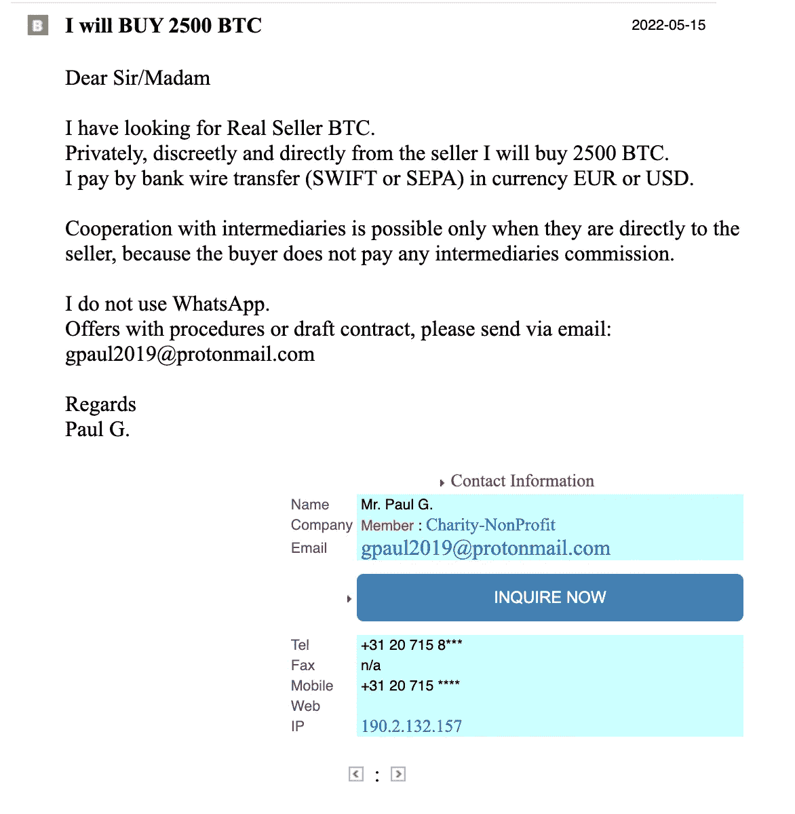
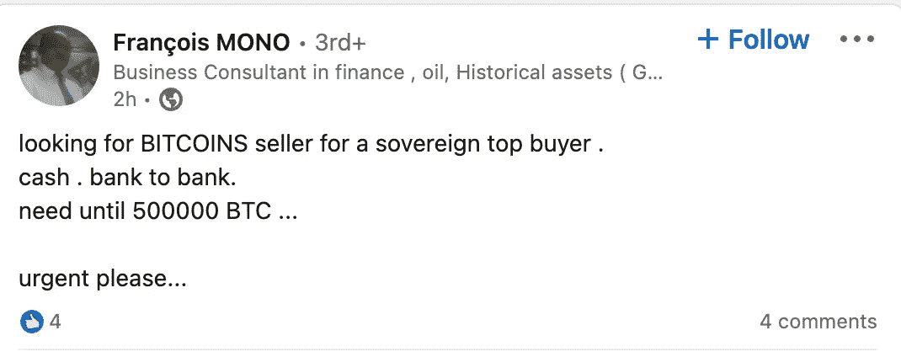
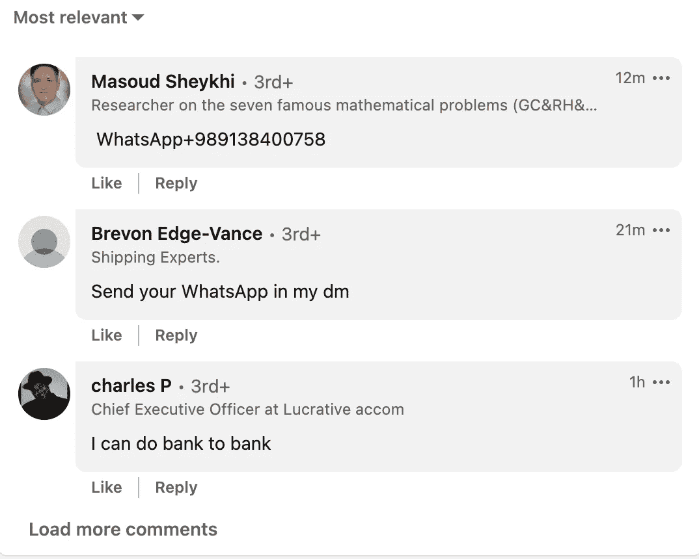

# 2022 年，场外欺诈仍然猖獗——用常识来避免它

> 原文：<https://medium.com/coinmonks/otc-fraud-is-still-rampant-in-2022-use-common-sense-to-avoid-it-72f78a04caba?source=collection_archive---------7----------------------->

比特币的全球采用率仍低于 5%。

因此，这个行业仍然充满了欺诈行为者，他们利用不了解场外交易市场如何运作的不知情的人。

在这篇博客中，我们将通过一些例子来讲述一些最猖獗、坦率地说也是最愚蠢的比特币骗局:**场外交易骗局**。

Example of A typical post by an OTC Scammer: [gpaul2019@protonmail.com](mailto:gpaul2019@protonmail.com)

OTC 代表场外交易，指的是双方直接进行的交易，而不是通过交易所进行的交易。

这意味着你不能追溯到一个交易所或另一方，所以它可以被骗子用来欺骗你给他们汇钱。

> 交易新手？试试[密码交易机器人](/coinmonks/crypto-trading-bot-c2ffce8acb2a)或者[复制交易](/coinmonks/top-10-crypto-copy-trading-platforms-for-beginners-d0c37c7d698c)

# 假卖家

最常见的场外骗子是那些声称拥有大量比特币，但由于高昂的费用或他们选择的任何原因而无法在交易所出售的人。

# 假买家

第二种场外交易骗局涉及声称购买大量比特币的人，例如 5000 BTC，折扣为-7%，经纪人收取 2%的佣金。

# 无知/贪婪的经纪人(骗局的受害者)

经纪人实际上是这类交易中最重要的参与者，因为他们设法诱使同行向欺诈者支付预付款，因为一开始就没有买方和卖方。

如果你有一个由 5 名经纪人组成的团队，他们对比特币几乎一无所知，他们很可能会被最基本的技巧所迷惑。

经纪人经常相信“卖方或买方”告诉他们无法通过可信的场外交易平台如 [Genesis](https://genesistrading.com/) 或[比特币基地](https://www.coinbase.com/prime)进行交易的任何原因。这种贪婪让经纪人焦头烂额。

他们假设，如果比特币价格为 20，000 美元，交易量为 5000 BTC，总计 100，000，000 美元，那么他们只需打几个电话联系“买方”和“卖方”，就能赚 2，000，000 美元。

这正是骗局开始的地方——现在经纪人所能想到的就是他未来的佣金。

# 骗局是如何运作的

**1。最初的方法:**通常“买方&卖方”是同一个人或网络，自愿用虚拟交易充斥市场。这是一种叫做网络钓鱼的做法。

**2。费用保护协议:**一旦经纪人收到他们认为有吸引力的报价，如下所示，

他们会要求“买家”为他们提供某种费用保护。协议担保他们参与交易的 5000 比特币的 2%。

请注意，“卖家”也是假的。

**3。潜在客户:**经纪人现在会积极寻找交易对手，购买或出售比特币。因为市场上充斥着欺诈者自愿提供的买方卖方报价，在不到一天的时间内——通常通过一系列电子邮件/WhatsApp Skype 电话——经纪人会找到对手。‘**万岁！离 2%的佣金越来越近了！’，经纪人想。**

The poor victims hardly know that bitcoin has a LIMITED SUPPLY.

Unsuspecting victims, participating in the fraud scheme.

**4。分阶段谈判:**在此阶段，经纪人将在“买方”&“卖方”之间就交易条款进行谈判。请注意，交易已经被欺诈者操纵，因为“买方”&“卖方”程序从不匹配。

你能相信吗？一个没有标准操作程序的数十亿美元的产业？

通常买方会要求某种“Satoshi 测试”，“卖方”会要求一个小的测试购买。之后，当我们交易 5000 BTC 时，0.5 BTC 算什么？

**5。经纪人上钩了:**这个表面上的瓶颈让经纪人处于 FOMO 状态。他现在认为，他和那 2%的佣金之间的障碍是 0.5 BTC 的小额付款，或者是代表买方向卖方的小额“测试转账”。**所以经纪人就是付钱的人。正如诈骗者的意图一样。**

**6。买方/卖方未能履约:**显然，交易从未实现，经纪人只是损失了他的血汗钱。通常在这个阶段，经纪人可能仍然觉得他们因为不履行义务的“买方”或“卖方”而错过了交易。

因此，他们重复着这个循环，直到他们的资金耗尽，这很可悲。因为害怕尴尬，他们从来没有机会和亲密的家庭成员或朋友谈论这些损失。

# 恶毒的兔子洞

同一个经纪人现在将与不履约方对抗，并继续在市场上寻找潜在客户，寻找能够实际执行场外交易的“认真的”对应方。

不幸的是，这种循环不断重复。即使这个经纪人不愿意预付，其他经纪人可能会。

在这种交易中，唯一的赢家是那些创建“买方”和“卖方”档案，从受害者的血汗钱中勒索钱财的人。

# 这个循环不断重复

在这篇文章中，我们只涵盖 BTC 骗局，以及如何再次，经纪人是犯罪者和受害者。但这并不是发生这种情况的唯一行业。

自 COVID19 爆发以来，石油和天然气、贵金属、房地产、金融工具，甚至个人防护设备(PPE)都出现了这种情况。

无论你对这些经纪人说什么，他们都不会听你的。

毕竟，对于那些认为自己离获得 200 万美元奖金只有几天时间的人来说，什么都不重要。这就是人们上当受骗的原因，不是因为他们愚蠢，而是因为他们贪婪。

## 在信息时代，无知是一种选择。