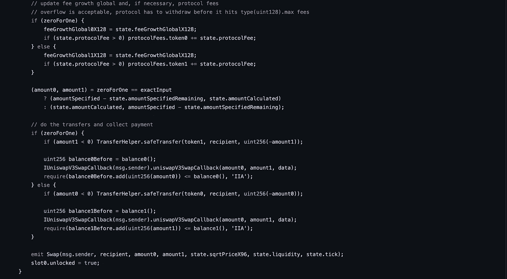

# 潜入 UniSwap

> 原文：<https://medium.com/coinmonks/otemadiving-into-uniswap-3354e26469ee?source=collection_archive---------4----------------------->

在你阅读之前，你应该看完这个视频并完全理解他们所说的一切— [**链接**](https://youtu.be/Ehm-OYBmlPM)
我们将与这个资源库— [**链接**](https://github.com/Uniswap/v3-core/tree/main/contracts)
并且你需要尽可能多地按下**[**unis WAP**](https://app.uniswap.org/#/swap?chain=mainnet)本身的按钮。
这里是 UniSwap 的奖金文档— [**链接**](https://uniswap.org/whitepaper-v3.pdf)**

****

**This mini-scheme may be needed throughout the article to understand what we are doing in general**

> **P.S.
> 本文仅作为对 uniswap v3 githab 代码的回顾而撰写，所有内容都是与对该技术本身的研究并行编写的，因此可能会有一些不准确和粗鲁之处**

# **工厂**

**池是在这里创建的**

****

**在这里，我们得到了两个硬币的合同，这两个硬币之间将形成一对，以及将在这一对中设置的佣金。该函数返回我们形成的新地址池的地址**

**这个函数做的第一件事是检查我们的令牌是否不同。
然后计算具有较小地址的一个，并将较小的命名为 token0，将较大的命名为 token1
现在它检查 token0 是否不为零(token1 显然不需要检查)
我们将存储在费用地址
的 **feeAmountTickSpacing** 变量中的值分配给 TickSpacing，检查 tickSpacing 是否不为零。
检查没有包含我们的代币和佣金的池(3D array getPool 使用给定的数据返回池地址)。
调用 **deploy** 函数，向其传递工厂地址、令牌、佣金和 tickSpacing，然后将返回的数据(新的池地址)传递给池变量，然后将该变量传递给带有两个令牌位置的 getPool 数组，从而保存该变量，这样其他人就不能创建这样的池**

## **feeAmountTickSpacing**

**它存储分笔成交点之间的距离，对应于佣金的每个特定值(最初在构造函数中设置，但也可以有自定义距离，由合同所有者为佣金的每个值单独设置)。**

## **部署**

****

**我们将工厂地址、令牌、佣金和 tickSpacing 传递给这个函数，输出是新池的地址。在函数本身中，我们创建结构参数，然后我们使用构造函数 UniswapV3Pool 创建一个新的契约，并将该契约的地址传递到变量 Pool(我们返回该变量 pool ),然后我们使用 delete 将参数返回到初始值，从而节省了时间**

****滴答** 为了实现集中的流动性，曾经连续的价格区间被滴答分割**

**分笔成交点是价格空间中区域之间的边界。分笔成交点的排列方式是，在价格空间的任何一点，增加或减少 1 个分笔成交点代表价格增加或减少 0.01% (1 个基点)**

**分笔成交点是流动性头寸的边界。创建仓位时，供应商必须选择代表仓位边界的上下刻度**

**随着现货价格在互换期间发生变化，池合约将不断用流出资产交换流入资产，逐渐使用当前价格点间隔期间的所有可用流动性，直到到达下一个价格点。此时，合约切换到新的分笔成交点，并激活在新的活跃分笔成交点上有边界的头寸内的任何休眠流动性**

**尽管每个池都有相同数量的基础分笔成交点，但实际上只有其中一些可以作为活动分笔成交点。由于 v3 智能合约的性质，分笔成交点之间的距离与互换佣金直接相关。佣金水平越低，潜在活跃分笔成交点越近，佣金水平越高，潜在活跃分笔成交点之间的间隔越大**

**虽然在掉期交易中，非活跃分笔成交点对交易价值没有影响，但穿过活跃分笔成交点会增加交易的价值，因为穿过分笔成交点会激活以该分笔成交点为边界的任何新头寸的流动性**

**在资本效率至关重要的领域，如稳定的硬币对，较窄的分笔成交点距离增加了流动性供应的粒度，并可能减少互换期间对价格的影响，从而为稳定的硬币互换带来更好的价格。**

# **泳池**

**工厂创造了那个东西，但是它本身是由什么组成的呢？**

> **重要提示:Pool 是一个成熟的智能合约，Factory 从输入变量创建一个成熟的智能合约**

**头寸库存储每个特定头寸的所有信息，即在每个情况下将流动性存入池中。**

****造币厂****

****

**该功能负责向池中添加流动性**

****我们给出以下一组变量作为输入:****

**recipient —我们要添加流动性的池的地址
ticker lower—底部 tick
tickUpper —上部 tick
amount —我们要添加的流动性的数量
data —要传递给回调的任何数据**

**在这个函数的输出端，我们得到:**

**amount0 —为增加此数量的
流动性而支付的 token0 的数量。对应于回调
amount1 中的值——为添加此数量的
流动性而支付的 token1 的数量。对应于回调中的值**

****这个功能是做什么的？****

**检查我们是否至少添加了一些流动性并且不是零
之后，我们定义要添加的令牌的比例(这是在***_ modify position***函数中完成的，而***modify position params***需要调整到必要的数据类型)
之后，我们将从***_ modify position***中获得的值赋给那些我们想要的主 **【T22****

## **_modifyPosition。**

**这个函数计算我们需要添加到池中的硬币的比例**

********

**在这个函数的输入端，我们给出了结构 ModifyPositionParams，输出端给出了位置，数量 0 和数量 1**

****该功能的作用:****

**检查滴答是否在允许的范围内
创建一个 Slot0 类型的局部变量 _Slot0 以节省气体
将变量 position 分配给 _updatePosition 函数的输出
检查液体性是否有变化δ:**

> **比较当前分笔成交点和设定分笔成交点的界限，如果当前分笔成交点低于我们的分笔成交点界限，那么我们提供更多的令牌 0，因为它变得更有价值当前分笔成交点在我们的分笔成交点界限内，那么我们提供等量的硬币当前分笔成交点高于我们的分笔成交点界限，那么我们提供更多的令牌 1，因为它变得更有价值**

## **_ 更新位置**

**根据输入数据，它返回以下结构:**

****

## **插槽 0**

****

## **修改位置参数**

****

## **收集**

**此功能允许我们从资金池中提取佣金**

****

****我们给出以下一组变量作为输入:****

**收款人—我们将从中提取酒的池地址
tickLower —底部 tick
tickUpper —上部 tick
amount0Requested —应该从
commissions
amount 1 requested—应该从 commissions 中提取多少 token1**

****在函数的输出中，我们得到了:****

**amount 0—token 0
中收取的佣金金额 amount 1—token 1 中收取的佣金金额**

****功能是做什么的？****

**首先我们得到发件人的初始位置和上下勾号
,然后我们得到可以从每对硬币中提取的酒的数量(基于佣金)
最后我们减去我们从总位置中提取的硬币**

# **互换**

**这个功能允许我们兑换硬币**

************************

****我们给出以下一组变量作为输入:****

**recipient —接收互换资金的地址
zeroForOne —互换的方向，对于 token0 - > token1 为 true，对于 token 1->token 0
Amount specified—互换的金额，它隐式地将互换设置为精确输入(正)或精确输出(负)。
sqrtpricelimitx 96——q 64.96(一个用逗号精确定义的数，其中 64 位负责整数部分，96 位负责小数部分)sqrt 的价格限制。如果零对一，交换后价格不能低于该值。如果 1 代表 0，交换数据后价格不能大于该值——任何应该传递给回调的数据**

****该函数的输出为:****

**amount0 —令牌 0 池的增量余额，负值时精确，正值时最小
amount1 —令牌 1 池余额的增量，负值时精确，正值时最小**

****该功能是做什么的？****

**检查交换是否不为零
创建一个本地变量 slot0Start like slot0，将 slot0 传递给它，并检查池是否处于活动状态
检查交换将发生在哪个方向(token0 - > token1 或 token1 - > token0)
在 slot0 结构中，在“unlocked”字段中写入 false，以在交换期间阻塞池
创建一个 SwapCache 类型的缓存变量，并将该对的流动性传递给它， 块的时间戳，输入硬币的 coms，也将 tickCumulatives(从块的时间戳开始每秒的总滴答数)和 secondsPerLiquidityCumulativeX128s(从块的时间戳开始每秒的范围内每单位流动性的总秒数)清零，最后我们将 false 赋给 computedLatestObservation(如果我们能够计算以上两个值，则为 true， false otherwise)
现在，我们最终将我们想要交换的硬币分配给 exact put
我们创建了一个 SwapState 类型的变量 state，并为其提供我们的交换量、我们已经交换了多少(因此为 0)、货币对的当前价格、分笔成交点价格、输入令牌的 kmsa、我们支付的输入令牌的数量 kmsa(最初设置为 0)、此时分笔成交点中的流动性**

> **现在我们开始进行条件交换，直到我们已经交换了全部数量
> 初始化类型为**的空步长结构步长计算** 将值从 sqrtPriceX96 字段的状态传递到 **sqrtPriceStartX96** 字段的步长变量
> 之后调用 tickBitmap 库的**nextinitializetickwithoneword**函数，并将值 state.tick(当前 tick)、tick spacing(tick 之间的距离)、 **zeroForOne 【T10 它返回两个值——下一个分笔成交点和是否已初始化
> 我们确保不超过最小/最大分笔成交点，因为位图分笔成交点不知道限制，并将结果(下一个分笔成交点)传递到分笔成交点下一个字段
> 中的步骤结构中，然后我们将下一个分笔成交点的价格分配给 sqrtPriceNextX96 字段中的步骤结构
> 计算传递到目标分笔成交点、价格限制或 I/O 量耗尽点的值，所有这些都通过此[完成 在输出中，我们获得 4 个值，并将它们写入 state.sqrtPriceX96(货币对中的当前价格)、step.amountIn(在此步骤中进行的交换量)、step.amountOut(在此步骤中进行的交换量)、step.feeAmount(支付了多少钱)。最后，我们计算应该从哪个互换金额中减去池中的哪个 menta，以及应该添加哪个 menta。
> 如果池中的 comsa 打开，我们计算 comsa 大小，减少 step.feeAmount 并增加 state.protocolFee
> 之后，我们通过调用 **FullMath.mulDiv** 函数
> 来更新池中的佣金。接下来是一个大块，这可以被描述为“如果我们到达下一个价格，则进行 tick shift”](https://github.com/Uniswap/v3-core/blob/main/contracts/libraries/SwapMath.sol)****

**然后，我们简单地更新分笔成交点，并记录来自 oracle 的结果(我认为会有一篇关于它的单独文章)，如果分笔成交点已经改变，否则我们简单地更新价格，使其等于 state.sqrtPriceX96
之后，我们更新流动性，如果它已经改变
现在我们改变硬币池中的佣金，这取决于我们进行互换的方式
，最后，我们通过调用我们都知道的安全转移函数并改变池中的代币余额
来完成转移本身，最后我们解锁池**

## ****肚子疼****

****

## **交换状态**

****

## **分步计算**

****

## **tick bitmap . nextinitializedtickwithinoneword**

****

***感谢阅读！我希望这篇文章是有趣和清晰的！***

> **交易新手？试试[加密交易机器人](/coinmonks/crypto-trading-bot-c2ffce8acb2a)或者[复制交易](/coinmonks/top-10-crypto-copy-trading-platforms-for-beginners-d0c37c7d698c)**