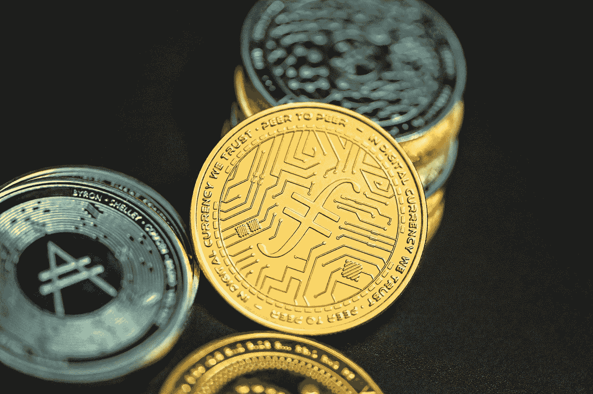

# 在秘密熊市中赚钱的其他方法。

> 原文：<https://medium.com/coinmonks/other-ways-to-make-money-in-a-crypto-bear-market-4832bd276176?source=collection_archive---------52----------------------->

Photo by [Kanchanara](https://unsplash.com/@kanchanara?utm_source=unsplash&utm_medium=referral&utm_content=creditCopyText) on [Unsplash](https://unsplash.com/s/photos/cryptocurrency?utm_source=unsplash&utm_medium=referral&utm_content=creditCopyText)

加密货币投资可以像中央金融市场上的任何其他类型的金融资产一样产生利润。然而，买卖和交换硬币并不是你唯一的选择。

交易密码市场，交换硬币，低买高卖是最流行的从密码市场赚钱的方法。然而，像我们目前所处的熊市总是暴露出只依靠一种方式来挤占加密市场的漏洞。

随着行业的进步，从 NFTs 的出现到 Web3 项目目前引起的巨大关注，有一些新的有趣的方法可以从加密市场赚钱。

我们将在本文中探讨其中的一些。

> **另见:** [**短期买入的前 3 种加密货币**](/web3-surfers/top-3-cryptocurrencies-to-buy-for-the-short-term-68182977f045)

# 7 种利用密码获得被动收入的方法

Photo by [Traxer](https://unsplash.com/@traxer?utm_source=medium&utm_medium=referral) on [Unsplash](https://unsplash.com?utm_source=medium&utm_medium=referral)

您可以通过以下方式在 crypto 中获得被动收入:

1.  **打桩**
2.  **采矿池**
3.  **交易**
4.  **高产养殖**
5.  **流动性提供**
6.  **借贷**
7.  **NFT 烙**

# 1.高产农业

从最简单的意义上来说，让加密资产在不同的流动性池中发挥作用来赚取利润，是一种收益农业。这是一个概念，令牌持有者通过在具有高 apy 的选定交易池中提供流动性或其他增值服务来优化他们的加密收入。要做到这一点，代币持有者必须投资和参与许多 DeFi 平台，同时始终努力实现利润最大化。

# 2.立桩标界

押注加密货币是一种验证区块链交易的奖励证据的方式。这种挖掘的替代方法包括在加密货币钱包中存储令牌，这需要更少的处理能力，并产生更稳定的回报。

押注加密货币不同于“流动性开采”或“产量耕作”，后者包括在分散的交易所存放硬币以提供流动性。流动性挖掘促进了交易社区中货币的使用、交换和借贷。

它没有赌注安全，因为智能合同失败的可能性更大，并可能导致暂时的损失。然而，赌注需要更大的前期资本支出。

> **参见:** [**4 Cryptos 定于 2022 年第四季度收获巨大回报**](/coinmonks/4-cryptos-set-to-reap-massive-return-in-q4-2022-79bf74231706)

# 3.云挖掘

工作证明挖掘需要在计算能力和专业知识方面进行大量的初始投资。云挖掘是作为一种将所有处理资源外包给远程服务器场的方法而开发的。在这种方法中，既不需要安装软件，也不需要安装硬件。

这使得人们有可能从一家声誉好的公司租赁电力。此外，通过购买这些合同，他们将保证在给定的时间范围内获得最低散列率。作为比特币的交换，合约的所有者会收到固定的金额。

这使得远程加密货币开采对世界各地的人们来说更加容易和有利可图。围绕这种被动赚取加密货币的策略，有几种欺诈行为。在租赁或购买合同之前，应确认提供该服务的公司的合法性。

# 4.加密储蓄账户

加密货币储蓄账户(也称为加密货币利息账户)类似于传统的银行或信用社储蓄账户。你可以通过将钱存入账户并获得利息来扩大你的储蓄。

简单来说；加密储蓄账户是一种投资账户，在一段时间内，你持有的加密货币被借给借款人。借款人预计将偿还他们的加密贷款和利息，这些利息将分配给加密储蓄账户持有人。

加密货币利息账户更有吸引力，因为它们比传统储蓄账户提供更高的回报率。

# 5.流动性提供

在加密交易领域，流动性池是由分散交易所的交易员提供的资金池，并通过智能合约进行担保。流动性提供者(LPs)是个人或机构交易者，他们利用自己的加密资产建立流动性池，从而允许基础 DeFi 协议运行。

除了收取资金池交易费用的一部分，有限合伙人还可以通过押注所谓的流动性提供商令牌(LP 令牌)来赚取协议令牌，作为向交易平台贡献流动性的激励。当流动性提供者将资金存入资金池时，他们会收到一个代表其资金池份额的流动性提供者令牌(LPT)。

提供流动性是熊市中人们获得被动收入的主要方式之一。

> **参见:**[**2022 年最佳 NFT 商场**](/geekculture/the-best-nft-marketplaces-in-2022-bc94ae6270c)

# 6.放款

这是加密行业集中和分散领域中最受欢迎的产品之一。它的概念很简单，类似于传统的贷款。这个想法是将加密货币借给另一个人一段时间，以换取一定的费用。加密货币的被动收入的价值取决于三个因素:

1.  借出的加密货币的总价值
2.  贷款期限
3.  利率

# 7.NFT 翻转

2021 年，NFT 的销售额超过 250 亿美元，专家预测，2022 年将大幅超过这一数字。成千上万的 NFT 在互联网上流动，可以在各种市场上买到。因此，第一步是找到一个你认为便宜到可以转手获利的 NFT。

接下来，您需要访问列出这些 NFT 的市场。你可以看看 NFT 流行的平台，如 [Rarible](https://rarible.com/) 和 [OpenSea](https://opensea.io/) 来寻找被低估的稀有非功能性交易。然而，你需要研究 NFT 市场，并获得广泛的知识来实现这一目标。

> **亦见:** [**什么是以太坊合并？**](https://medium.com/coinmonks/what-is-ethereum-the-merge-1b65f4d2c853https://medium.com/coinmonks/what-is-ethereum-the-merge-1b65f4d2c853)

# **总结**

秘密熊市总是让交易者想知道他们能从市场中赚钱的新方法。行业的进步为通过产量种植、赌注、云开采、翻转 NFT 等从加密市场赚钱开辟了新的机会。

从加密货币中赚取被动收入的方式有多种，包括通过采矿、赌注、交易和生息账户。这篇文章研究了在秘密熊市中赚钱的一些最流行的策略。

不可替代代币(NFT)是目前最流行的投资趋势之一。仅在 2021 年，NFT 的销售额就超过 250 亿美元，预计 2022 年将超过这一数字。

> 交易新手？尝试[加密交易机器人](/coinmonks/crypto-trading-bot-c2ffce8acb2a)或[复制交易](/coinmonks/top-10-crypto-copy-trading-platforms-for-beginners-d0c37c7d698c)