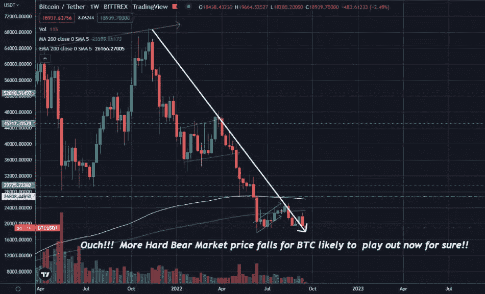
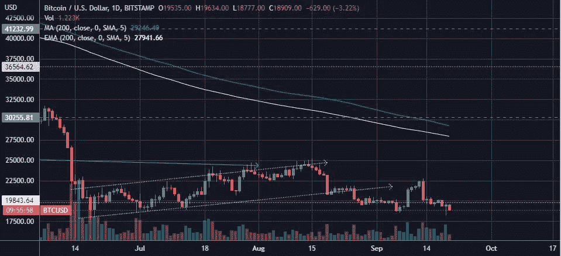
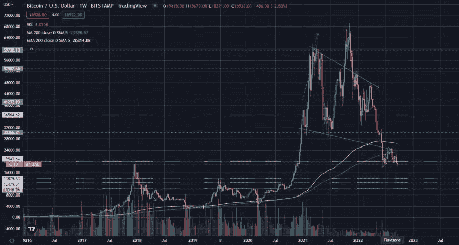
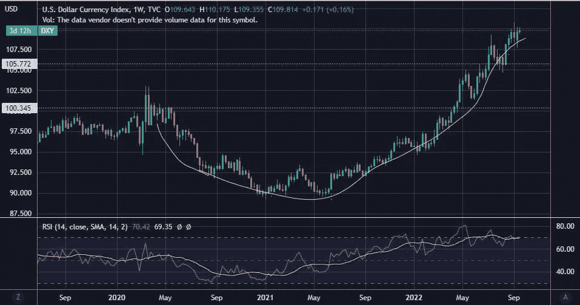
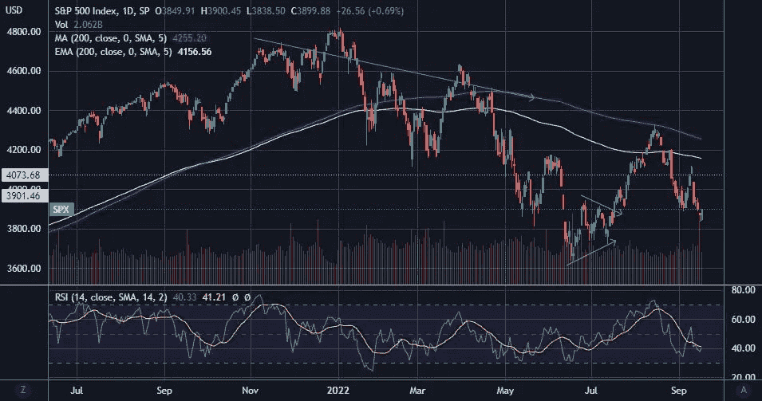
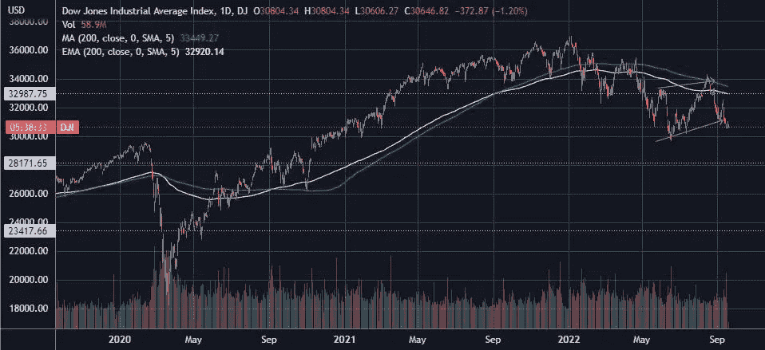
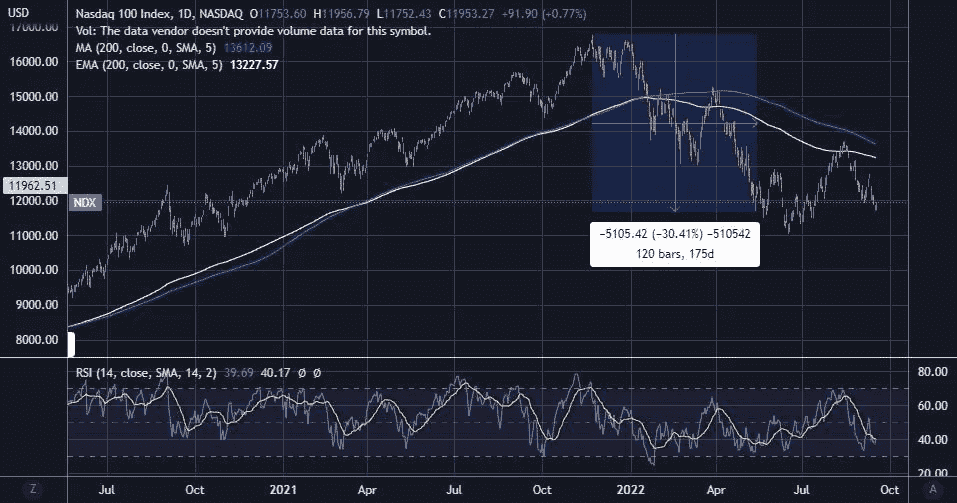
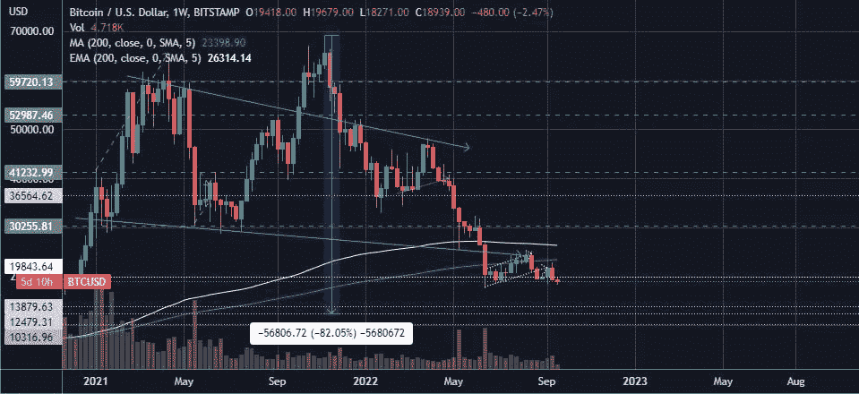

# 哎哟！！！BTC 肯定会遭遇更严重的熊市价格下跌！！

> 原文：<https://medium.com/coinmonks/ouch-more-hard-bear-market-price-falls-likely-to-play-out-for-btc-for-sure-f15ede1d4b99?source=collection_archive---------21----------------------->

# BTC 可能会下跌，价格在 20，000 美元区间找不到支撑

哎哟，所以昨天我有点害怕看到 BTC 已经跌破 19，000 美元到 18，316 美元。然而，在这个范围内，BTC 的买家来了，把 BTC 今天的价格超过 19，000 美元。然而，BTC 显然已经突破了 20，000 美元的心理支持范围，现在这个范围是一个强大的阻力。

[Tradingview](https://www.tradingview.com/x/OTWlj7cW/). BTC breaches support level of 20,000$ which is resistance level for the crypto asset now!!

我知道这对于那些认为 BTC 已经到达底部 20，000 美元的人来说是很难的，但现在 BTC 已经无法维持 20，000 美元的支持范围，很明显 BTC 的价格将会下跌！！

# 几个月来，BTC 的价格一直处于历史低估水平，但却没有被买断

自今年以来，BTC 的价格一直低于 200 均线和 200 均线，这两条重要的均线是 BTC 的阻力。

从历史上看，每当 BTC 的价格低于 200 均线和 200 均线时，它就会出现，因为在这个范围内，BTC 被市场参与者视为超卖。这一次，尽管 BTC 的价格一直低于这两个区间，但市场参与者并未买账。

[Tradingview](https://www.tradingview.com/x/OTWlj7cW/). Historically whenever BTC’s price has dipped below the 200 EMA and 200 SMA, its been brought up, but not this time!!

*想知道为什么这一次 BTC 价格对买家的影响不同于其他 BTC 市场周期。*

# BTC 首次处于更广泛的主要熊市环境中

这是有史以来的第一个熊市周期，BTC 也在其中。是的，没错，BTC 从来没有像现在这样在衰退的市场背景下发挥作用，所以 BTC 价格对买方动力的表现与往常不同。

如果在更大的宏观经济背景下，这不是一个熊市，我相信 BTC 会在目前的价格水平被买断，并在 20，000 美元的价格水平保持支撑。

# 投资者涌向他们认为安全的资产——美元

购买者更愿意持有作为世界储备货币的美元，进行储蓄，而不是投资于有风险的资产。是的，BTC 仍被全球投资者视为一种资产风险。

[Tradingview chart](https://www.tradingview.com/)

***美元对其他世界货币升值，其价值在 DXY 指数中达到 110.375 美元***

# 宏观熊市的回声可见于主要股票指数的价格变动

主要股票指数的价格变动也显示出明显的迹象，表明宏观经济环境是非常悲观的，是的，非常悲观。

***标普指数价格也一直在下跌*** ，价格走势未能维持在 4070 美元的支撑，该价格区间正在充当阻力。

[Tradingview chart](https://www.tradingview.com/)

当价格在 6 月 17 日上涨时，它未能超过 200 SMA，因为这 200 SMA 是阻力。

这意味着价格将暴跌，这是现在的命运，因为价格在一个主要的熊市中流血。

***DJI 指数的情况类似。***

[Tradingview chart](https://www.tradingview.com/)

现在，价格甚至没有试图突破，并在 33，030 的主要支撑区间找到支撑。价格也未能突破 200 均线和 200 均线，因为这些弧线在触及价格下跌的阻力点。再次表明这是一个熊市环境。

***价格走势在主要技术指数中，纳斯达克股价刚刚突破 12，000 美元的主要支撑区间。***

[Tradingview chart](https://www.tradingview.com/)

范围是作为阻力。价格未能在 200 均线弧上方反弹，200 均线弧是阻力，之后价格下跌超过 12，000 美元的支撑价格范围。

因此，总的来说，美国主要股指的价格走势强烈表明我们正处于熊市。

# 由于美联储继续加息的立场，经济衰退和熊市

我们都知道是什么造成了这种局面。是的，当然，美联储已经表明立场，美国的通货膨胀仍未得到控制，他们将积极干预其加息政策。

因此，借贷成本增加了，现在没有容易的资金来购买资产和支撑资产市场。

## 让我们猜猜在这种价格下跌的情况下，BTC 的底价会是多少

***那么，BTC 会跌到什么价位？，它的潜在底部会在哪里？***

[Tradingview](https://www.tradingview.com/x/OTWlj7cW/). An 80% correction of BTC’s price from its top will bring BTC price’s below 14,000$ range!!!*

价格范围在 14，000 美元、12，000 美元或 10，000 美元之间。我们可以肯定地期待 BTC 顶部至少 80%的修正，这将使 BTC 价格达到 13，900 美元的水平。

因此，人们准备迎接更多的价格下跌。

***感谢阅读。***

> 交易新手？尝试[加密交易机器人](/coinmonks/crypto-trading-bot-c2ffce8acb2a)或[复制交易](/coinmonks/top-10-crypto-copy-trading-platforms-for-beginners-d0c37c7d698c)