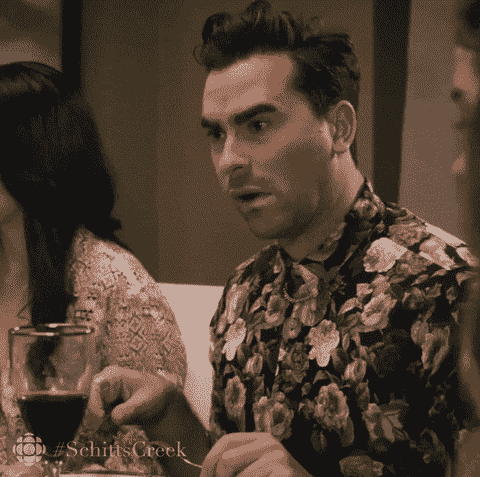

# 哎哟，我的钱包

> 原文：<https://medium.com/coinmonks/ouch-my-wallet-86cfb0e477e?source=collection_archive---------18----------------------->

## 加密货币/比特币市场分析 9/19

昨天，一个完全可以预测的空白被填补了。不能说有人预见到了。甚至不是 [@nap_trader](http://twitter.com/nap_trader) ，不管那是谁。

 [## 扩展宏观——一篇关于我所见的论文

### 宏观市场分析 9/17

medium.com](/coinmonks/expanding-the-macro-a-treatise-on-what-i-see-1a7b84cde4c6) 

后来，BTC 继续横向和巴特之前，上涨和清算了地狱的短裤基本上没有。看起来零售业务有所萎缩，但 OI 也在整合最少量的商品。

[https://imgur.com/nLuiJST](https://imgur.com/nLuiJST)

看到这个泵的流量了吗？

[https://imgur.com/Jvij1dp](https://imgur.com/Jvij1dp)

那不是看涨。

图表总体上还是像以前一样悲观。并没有真正改变。

[https://www.tradingview.com/x/2qi3bpDU/](https://www.tradingview.com/x/2qi3bpDU/)

然而，有一件事发生了。太棒了。正好赶上 JPOW 周三谈论印钞机，我们有非常高的每块交易所的 eth/btc。关于 [@messaricrypto](http://twitter.com/messaricrypto) 的不同结果，但谁知道谁是对的。

[https://imgur.com/4ZB0bbT](https://imgur.com/4ZB0bbT)

总的来说，我们准备进行一次非常激烈的倾倒。我缺$BITO。

it’s not going to be pretty

> 交易新手？试试[密码交易机器人](/coinmonks/crypto-trading-bot-c2ffce8acb2a)或[复制交易](/coinmonks/top-10-crypto-copy-trading-platforms-for-beginners-d0c37c7d698c)