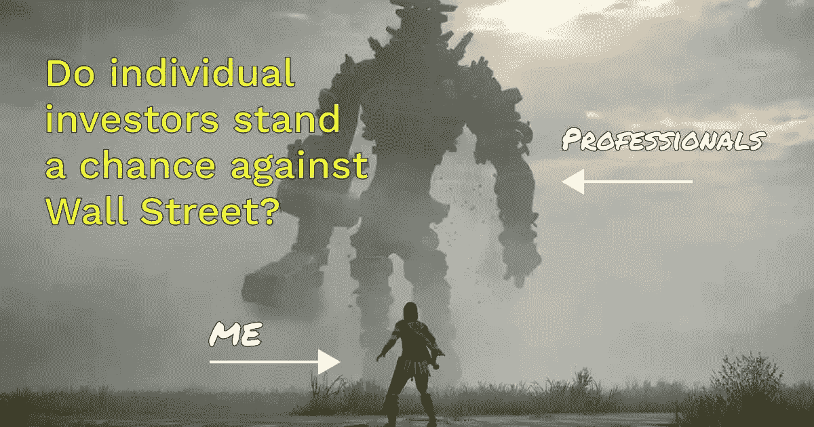

# 一夜之间，这家市值 4700 亿美元的公司突然超过了 Meta 和美国银行。

> 原文：<https://medium.com/coinmonks/overnight-the-470b-company-that-was-suddenly-worth-more-than-meta-and-bank-of-america-744a990f1383?source=collection_archive---------19----------------------->

AMTD Digital just IPO recently and its share price has since went up by 14,000%.

AMTD 数码以每股 7.80 美元的价格在纽约上市。

股价涨到了绝对的顶点，在 8 月 3 日达到了每股 2555 美元，给市场带来了冲击波。

“AMTD 数字公司自在纽约上市以来上涨了 14，000%，本周其市值一度超过 4700 亿美元，可以与 meme 股票的典范 GameStop Corp .相提并论。”

每个人都摸不着头脑。

为什么一只拥有约 50 名员工的鲜为人知的股票会比其他人涨得更快？

这完全没有意义。

因此，很明显，人们一直在幕后聚集力量，推动股票上涨。

AMTD 是做什么的？

**“AMTD 数码通过其数字金融服务业务的费用和佣金，以及通过其名为“蜘蛛网”的数字“元宇宙”平台产生收入”**

但说实话，这有关系吗？

令人着迷的是，去年将 Gamestop 和 AMC 股票推至天价的现象再次发生。

如果一件令人震惊或不可思议的事情发生了一次，我们会停下来思考，称之为现象。

如果那种现象一再发生，那么就引发了更多的疑问和眉毛。

Wallstreet bets was an internet phenomenon that rocked Wall Street.

reddit 大军有没有可能又回来了。

仅仅因为可以，就大量买进迷因股票或看似随机挑选的股票？

也许是为了“把它贴在男人身上”。

也许是为了赚快钱。

有趣的是，这种现象并不完全违法。

如果美国证券交易委员会或当局想要调查，他们在调查谁？

网上一个论坛上几千个 annons？

一个不幸的家伙，碰巧是“罪魁祸首”？

将来可以做些什么来减少或防止这种情况发生？

真的有那么糟糕吗？

等等，对冲基金和投资银行家不是一直在做这样的事情吗？

我开玩笑。

但这就是我们当今世界的现实。

人们越来越觉醒，普通人看似遥不可及的事情不再遥不可及。

Retail investors vs Wall Street: how apt a depiction.

散户投资者也加入了这场游戏。

这就是为什么我总是说罗宾汉永远改变了比赛。

不管你是恨他们还是爱他们，他们开创并允许像你我这样的散户投资者进入以前只有华尔街、银行家和大公司才能参与的游戏。

是的，存在担忧，是的，并非一切都是美好的。

但现在散户投资者也开始奋起反击。

活着的激动人心的时刻，嗯？

有趣的是，AMTD 数码在 2021 年只赚了 2500 万美元。

就连管理团队也不知道为什么股价会上涨，并表示他们的运营或账面没有任何变化。

不要试图用指标和数学来理解这只股票为什么会上涨。

你不会明白的。

-

散户多了是好事吗？

-

# startups # business # startupx # growth # success # social media # culture # web 3 # strategy # hacks # wall street # robin hood # retail investors # investors # trading # stocks # Reddit # wall street bets # eth # BTC # crypto # hackers #**pumpanddump**

> 加入 Coinmonks [电报频道](https://t.me/coincodecap)和 [Youtube 频道](https://www.youtube.com/c/coinmonks/videos)了解加密交易和投资

# 另外，阅读

*   [加密货币储蓄账户](/coinmonks/cryptocurrency-savings-accounts-be3bc0feffbf) | [YoBit 审核](/coinmonks/yobit-review-175464162c62)
*   [Botsfolio vs nap bots vs Mudrex](/coinmonks/botsfolio-vs-napbots-vs-mudrex-c81344970c02)|[gate . io 交流回顾](/coinmonks/gate-io-exchange-review-61bf87b7078f)
*   [CoinFLEX 评论](https://coincodecap.com/coinflex-review) | [AEX 交易所评论](https://coincodecap.com/aex-exchange-review) | [UPbit 评论](https://coincodecap.com/upbit-review)
*   [AscendEx 保证金交易](https://coincodecap.com/ascendex-margin-trading) | [Bitfinex 赌注](https://coincodecap.com/bitfinex-staking) | [bitFlyer 点评](https://coincodecap.com/bitflyer-review)
*   [Bitget 回顾](https://coincodecap.com/bitget-review)|[Gemini vs block fi](https://coincodecap.com/gemini-vs-blockfi)cmd |[OKEx 期货交易](https://coincodecap.com/okex-futures-trading)