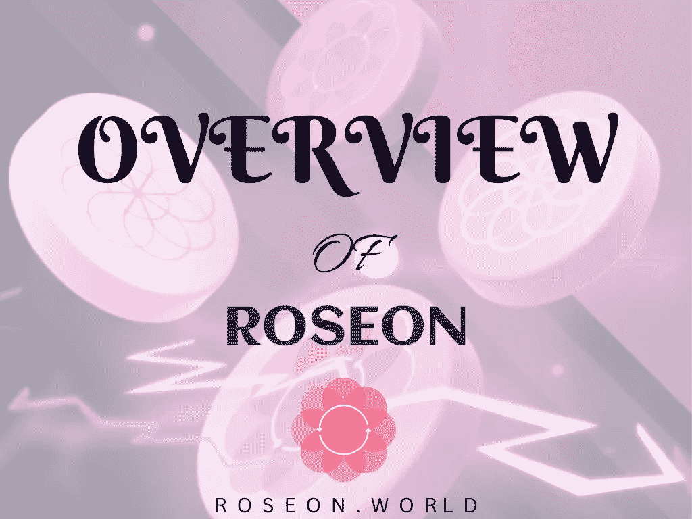

# RoseOn World (WonderApp 和 Wonder Land)概述

> 原文：<https://medium.com/coinmonks/overview-of-roseon-world-wonderapp-wonder-land-dce10c6dd62e?source=collection_archive---------30----------------------->

Roseon 项目旨在使用户的加密之旅变得容易、简单和有趣。

在最初推出时，Roseon Finance 通过推出互换、桥接、收益聚合器和钱包管理等产品，帮助弥合了集中互换服务(CeFi)和分散融资(DeFi)的最佳功能之间的差距。

所有这些功能都可以在 Android、iOS 上的“WonderApp”(之前称为 Roseon App)或 Mac 和 Windows 的 Web 门户上访问。

Roseon 团队还通过推出 RoseonPad，一个移动的第一个发射台，将 Roseon World 的功能扩展到 GameFi。

Roseon 游戏中心提供各种“玩即赚”迷你游戏，例如:

*   Spin2Win
*   妖精攻击
*   摇头球

通过使用 Roseon 的 VIP 系统，WonderApp 用户可以提前接触到加密领域有前途的项目。

> **ROSEON 生态系统的主要特征**

Roseon 生态系统有 5 个主要特征，即:GameFi、CeDeFi、Launchpad、NFT 和元宇宙。

**CeDeFi** —钱包管理、掉期、桥牌、储蓄、养殖池

**GameFi**——游戏中心展示了我们具有玩即赚功能的迷你游戏

发射台 — RoseonPad 是支持各种网络的第一个移动发射台

**NFT** —市场和 INO(NFT 首次发行)支持

**元宇宙**——一个将展示 Roseon 所有特色的虚拟世界和一个充满乐趣的主题公园

> **罗赛恩生态系统**

Roseon 生态系统有两大类，即:

*   Roseon WonderApp(以前称为 Roseon App)
*   玫瑰仙境

**ROSEON wonder app**

Roseon WonderApp 实现了集中式和分散式财务的完美融合，通过其 CeDeFi 功能实现了两种系统的最佳功能。Roseon WonderApp 可在 Android、iOS 以及 Windows 和 Mac 的网络版本上使用。RoseOn WonderApp 的一些功能包括:

**互换**—Roseon 应用上的应用内互换功能在所有 CEX 和 dex 中进行全方位搜索，以寻求最高的流动性和最低的费用，供用户互换代币。

**网桥** —网桥让您快速将令牌从 BSC 转移到 ETH，反之亦然。

**智能储蓄—** 这是一种低风险的赌注服务，用户可以通过在固定期限内提交代币来获得收益(固定储蓄)。

**产量农业** —这是一个赌注选项，有灵活的奖励，用户可以在任何给定的时间自由下注和出赌注。

**投资组合管理** — WonderApp 的内置软件允许用户监控和管理他们的加密投资组合。

**RoseonPad:** 这是一个移动优先的发射台，用户可以通过我们的应用内产品(IAO)在各种网络上提前访问即将到来的加密项目。

**游戏中心:**游戏中心是各种快节奏迷你游戏的展示区，用户可以在这里赚取$ROSN 和玫瑰点数。游戏中心目前有三个游戏(Spin2Win，僵尸战士，妖精攻击，摇头球)，还有更多游戏等待着很快推出。随着时间的推移，游戏中心还将增加农业和塔防游戏。

**游戏商店** —游戏商店允许用户购买装有角色卡的神秘战利品盒，用于我们的迷你游戏。可以使用收集的玫瑰和/或$ROSN 进行购买。游戏店的另一个特色是人物卡和工艺品/物品的交易。

总的来说，Roseon WonderApp 包括

*   桩和特征
*   VIP 系统
*   交换和桥接
*   NFT 画廊和市场
*   发射台
*   抽奖
*   游戏中心—(游戏商店、Spin2Win、僵尸战士、妖精攻击、摇头球)

## 罗森仙境

元宇宙具有改变我们工作、社交、聚会甚至做生意的巨大潜力，这已经不是什么新闻了。有鉴于此，罗森世界推出了名为“罗森仙境”的元宇宙

Roseon Wonderland 是一个玫瑰色的虚拟世界，旨在为用户提供增强的体验(交互式 3D 环境),同时仍然提供一站式解决方案来访问 WonderApp 的所有功能。

在日常生活中，我们在虚拟世界中花费的时间越来越多，我们希望我们的用户能够享受定期访问仙境的乐趣。我们在仙境中添加了一个虚拟主题公园，以过山车等令人兴奋的游乐设施为特色，我们的用户可以在未来通过 VR 集成享受这些游乐设施。我们还计划设立几个游戏摊位，游客可以在那里赢得各种奖品。

罗塞恩仙境拥有；

*   Web3 集成
*   交互式 3D 环境
*   NFT 市场
*   WonderApp 功能(赌注和农场、VIP 系统、交换和桥牌、NFT 画廊、幸运抽奖)
*   WonderLaunch
*   游戏中心(游戏商店、Spin2Win、僵尸战士、妖精攻击、摇头球)

不要忘记使用下面的任何/所有链接加入 Twitter、TG 以及官方网站上的社区更新；

[**网站**](http://roseon.world)

[**电报**](https://t.me/Roseon)

[**不和谐**](https://discord.gg/bzFWpBAfWv)

[**推特**](https://twitter.com/RoseonWorld)

> 交易新手？试试[加密交易机器人](/coinmonks/crypto-trading-bot-c2ffce8acb2a)或者[复制交易](/coinmonks/top-10-crypto-copy-trading-platforms-for-beginners-d0c37c7d698c)